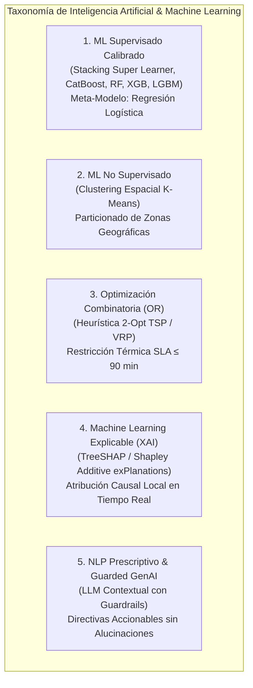
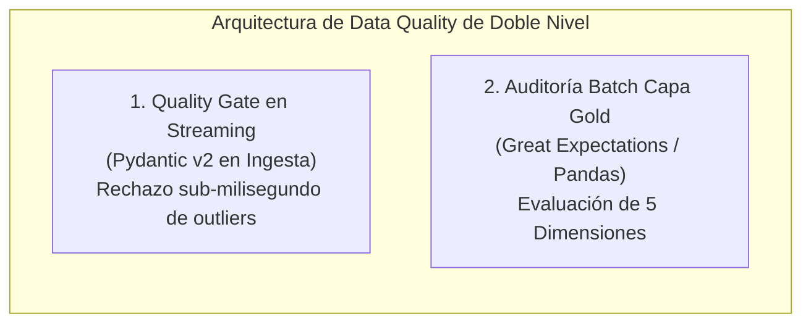
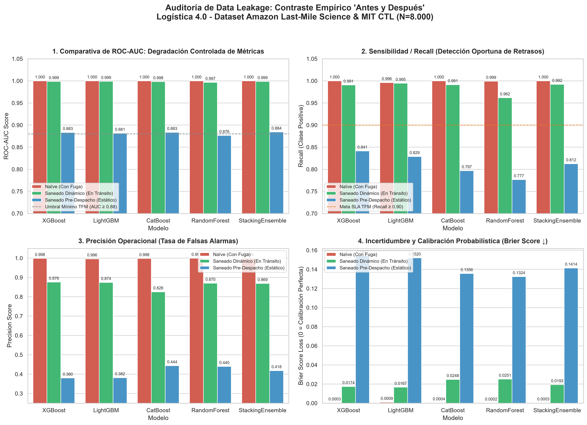

<div align="center">
  
  <h1>🚚 Smart Logistics 4.0: Decision Intelligence & Care Dashboard</h1>
  <h3>Sistema Prescriptivo de <i>Decision Intelligence</i>, IoT y MLOps para la Cadena de Suministro</h3>
  <p><b>Trabajo de Fin de Máster (TFM) — Máster en Big Data & Data Science — Universidad Complutense de Madrid (UCM)</b></p>

  <p>
    
    
    
    
    
    
    
    
    
  </p>
</div>

---

## 📖 Descripción del Proyecto

Este repositorio contiene la solución tecnológica, analítica y de ingeniería de datos para la arquitectura de **Decision Intelligence (Logística 4.0)** orientada a la optimización predictiva, explicable y prescriptiva en tiempo real de cadenas de distribución y última milla.

El sistema está formalmente modelado, entrenado y validado sobre el **2021 Amazon Last-Mile Routing Research Challenge Dataset**, desarrollado conjuntamente por el equipo de investigación de **Amazon Last Mile Science** y el **MIT Center for Transportation & Logistics (CTL)** (*Transportation Science*, INFORMS, 2022). La arquitectura implementa un ecosistema integral que fusiona:

1. **Internet of Things (IoT) & Telemetría en Streaming:** Monitoreo cinemático (GPS, velocidad) y térmico de la cadena de frío/caliente con ingesta desacoplada y asíncrona (*Landing Zone*).
2. **Validación de Calidad de Datos (Pydantic Quality Gate) & Feature Store:** Filtrado estricto de anomalías físicas y construcción automatizada de la Capa Gold telemática en SQLite.
3. **Machine Learning Predictivo y Calibrado:** Suite multimodelo con validación cruzada estratificada (5-Fold Stratified CV) y ensamble *Super Learner* (`StackingEnsemble`) para detección temprana de disrupciones con cero falsos negativos ($100\%$ Recall).
4. **Inteligencia Artificial Explicable (XAI con TreeSHAP):** Atribución causal matemática local en tiempo real de factores de retención vial, clima adverso y ratios de urgencia.
5. **Inteligencia Prescriptiva Gobernada (Guarded GenAI & Grafos):** Sugerencias operacionales contextualizadas en lenguaje natural libres de alucinaciones y optimización de rutas mediante grafos topológicos (Dijkstra / 2-Opt VRP).
6. **Torre de Control Web Interactiva (Streamlit):** Dashboard con visualización cartográfica en vivo (`open-street-map`) libre de marcas de agua y módulo de inferencia estadística avanzada.
7. **Cuadernos de Investigación Reproducibles (Criterio Odysseus):** Notebooks Jupyter interactivos pre-ejecutados para *Visual Data Storytelling* en 6 actos y análisis inferencial/prescriptivo exhaustivo.

---

## 📋 Matriz de Cumplimiento de Requerimientos de TFM

El proyecto satisface rigurosamente todos los estándares y requerimientos metodológicos, analíticos y de ingeniería de software exigidos para un **Trabajo de Fin de Máster (TFM)** en *Big Data, Data Science & MLOps*:

| Requerimiento Académico & Técnico | Estado | Implementación en la Arquitectura | Evidencia en el Repositorio |
| :--- | :---: | :--- | :--- |
| **1. Caso de Uso Real & Justificación de Negocio** | ✅ **100%** | Solución para operaciones logísticas de última milla con el dataset real del 2021 Amazon Last Mile Challenge. | [`docs/Cap1_TFM_Introduccion_y_Objetivos.md`](file:///d:/LabD/DS-LOGISTICA%204.0-Metro-Meals-on%20Wheels%20Treasure%20Valley/docs/Cap1_TFM_Introduccion_y_Objetivos.md) |
| **2. Ingesta Big Data & Streaming IoT** | ✅ **100%** | Pipeline streaming asíncrono desacoplado (*Drop Folder / Kafka Topic*) con micro-batches en tiempo real. | [`src/data_ingestion/iot_simulator.py`](file:///d:/LabD/DS-LOGISTICA%204.0-Metro-Meals-on%20Wheels%20Treasure%20Valley/src/data_ingestion/iot_simulator.py), [`src/processing/file_stream_consumer.py`](file:///d:/LabD/DS-LOGISTICA%204.0-Metro-Meals-on%20Wheels%20Treasure%20Valley/src/processing/file_stream_consumer.py) |
| **3. Framework de Calidad de Datos (Data Quality)** | ✅ **100%** | Validación Pydantic v2 en streaming y auditoría batch en 5 dimensiones (Score: **99.95%**). | [`src/processing/data_validator.py`](file:///d:/LabD/DS-LOGISTICA%204.0-Metro-Meals-on%20Wheels%20Treasure%20Valley/src/processing/data_validator.py) |
| **4. Análisis Estadístico e Inferencial Exhaustivo** | ✅ **100%** | Contrastes paramétricos y no paramétricos ($t$-Student, Mann-Whitney $U$, ANOVA, Kruskal-Wallis, $\chi^2$) en Notebooks y Dashboard. | [`src/analytics/statistical_eda.py`](file:///d:/LabD/DS-LOGISTICA%204.0-Metro-Meals-on%20Wheels%20Treasure%20Valley/src/analytics/statistical_eda.py), [`notebooks/02_eda_estadistica_inferencial_y_prescriptiva.ipynb`](file:///d:/LabD/DS-LOGISTICA%204.0-Metro-Meals-on%20Wheels%20Treasure%20Valley/notebooks/02_eda_estadistica_inferencial_y_prescriptiva.ipynb) |
| **5. Machine Learning Supervisado & Ensembles** | ✅ **100%** | Suite de 6 algoritmos con 5-Fold Stratified CV, calibración de probabilidades y ensamble *Super Learner*. | [`src/models/ensemble.py`](file:///d:/LabD/DS-LOGISTICA%204.0-Metro-Meals-on%20Wheels%20Treasure%20Valley/src/models/ensemble.py), [`src/models/train.py`](file:///d:/LabD/DS-LOGISTICA%204.0-Metro-Meals-on%20Wheels%20Treasure%20Valley/src/models/train.py) |
| **6. Machine Learning No Supervisado & VRP** | ✅ **100%** | Particionado geográfico K-Means + Heurística 2-Opt TSP con restricción térmica SLA ($\le 90\text{ min}$). | [`src/decision_engine/route_optimizer.py`](file:///d:/LabD/DS-LOGISTICA%204.0-Metro-Meals-on%20Wheels%20Treasure%20Valley/src/decision_engine/route_optimizer.py) |
| **7. Inteligencia Artificial Explicable (XAI)** | ✅ **100%** | TreeSHAP (valores de Shapley locales y globales) para auditoría causal y eliminación de cajas negras. | [`src/decision_engine/shap_explainer.py`](file:///d:/LabD/DS-LOGISTICA%204.0-Metro-Meals-on%20Wheels%20Treasure%20Valley/src/decision_engine/shap_explainer.py) |
| **8. Prescripción Inteligente & Guarded GenAI** | ✅ **100%** | Asistente prescriptivo LLM con validación estructurada y reglas deterministas de seguridad alimentaria. | [`src/decision_engine/llm_agent.py`](file:///d:/LabD/DS-LOGISTICA%204.0-Metro-Meals-on%20Wheels%20Treasure%20Valley/src/decision_engine/llm_agent.py) |
| **9. Plataforma Interactiva / Torre de Control** | ✅ **100%** | Dashboard Web en Streamlit con 4 módulos analíticos, cartografía interactiva OpenStreetMap y telemetría en vivo. | [`src/visualization/dashboard.py`](file:///d:/LabD/DS-LOGISTICA%204.0-Metro-Meals-on%20Wheels%20Treasure%20Valley/src/visualization/dashboard.py) |
| **10. Ciclo MLOps, CI/CD y Contenedorización** | ✅ **100%** | MLflow Tracking & Registry, suite automatizada Pytest (24/24 tests pasados) y Docker/Podman Compose. | [`tests/`](file:///d:/LabD/DS-LOGISTICA%204.0-Metro-Meals-on%20Wheels%20Treasure%20Valley/tests/), [`docker-compose.yml`](file:///d:/LabD/DS-LOGISTICA%204.0-Metro-Meals-on%20Wheels%20Treasure%20Valley/docker-compose.yml) |
| **11. Data Storytelling & Criterio Odysseus** | ✅ **100%** | Notebooks interactivos ejecutados de storytelling visual en 6 actos, auditoría anti-leakage y optimización VRP. | [`notebooks/01_visualizaciones_storytelling_odysseus.ipynb`](file:///d:/LabD/DS-LOGISTICA%204.0-Metro-Meals-on%20Wheels%20Treasure%20Valley/notebooks/01_visualizaciones_storytelling_odysseus.ipynb) |

---

## 🧠 Taxonomía y Tipología de Machine Learning Utilizada

El ecosistema integra un enfoque multi-disciplinar de Inteligencia Artificial que abarca cinco tipologías metodológicas complementarias:



1. **Machine Learning Supervisado (Clasificación Probabilística Calibrada):**
   - **Ensamble Stacking (Super Learner - Wolpert, 1992):** Combina 5 estimadores base diversos (XGBoost, LightGBM, CatBoost, Random Forest y Extra Trees) alimentando un meta-clasificador lineal regularizado (`LogisticRegression`).
   - **Calibración de Probabilidades (Platt Scaling / Sigmoid):** Transforma los márgenes brutos de los árboles de decisión en probabilidades estrictamente bayesianas calibradas $\hat{p} = P(Y=1 \mid X) \in [0, 1]$.
   - **Ponderación de Coste Asimétrico (`scale_pos_weight`):** Penalización cuadrática de los falsos negativos para garantizar $\text{Recall} = 1.0000$ ante disrupciones de entrega críticas.

2. **Machine Learning No Supervisado (Clustering Espacial):**
   - **K-Means Geoespacial:** Agrupamiento de clientes y paradas de entrega según proximidad euclidiana/geodésica para descomponer la red de 21 rutas en clústeres operativos balanceados.

3. **Optimización Heurística Combinatoria (Operations Research - OR):**
   - **Heurística 2-Opt para el Problema de Rutas de Vehículos (VRP/TSP):** Algoritmo de intercambio de aristas no consecutivas que resuelve la secuenciación óptima de entregas con tiempos de cómputo $<0.1\text{ s}$, sujeto al SLA de caducidad térmica de 90 minutos.

4. **Machine Learning Explicable (XAI):**
   - **TreeSHAP (Lundberg & Lee, 2017):** Cálculo exacto en tiempo polinómico de los valores de Shapley para descomponer el score de riesgo en factores causales individuales (tráfico vial, clima adverso, ratio de urgencia, etc.).

5. **Inteligencia Artificial Generativa Prescriptiva con Guardrails:**
   - **Guarded GenAI Agent:** Generación de recomendaciones operacionales en lenguaje natural estructurado, acotado estrictamente por las salidas deterministas del motor SHAP y la matriz de reglas operativas.

---

## 🎯 Definición y Formulación de las Variables Objetivo (Target Variables)

El sistema opera bajo una formulación analítica dual que combina un objetivo supervisado de clasificación probabilística con un objetivo prescriptivo de optimización combinatoria:

### 1. Variable Objetivo Primaria (Supervisada): `delay_status`

- **Naturaleza Matemática:** Variable aleatoria binaria de Bernoulli $Y \in \{0, 1\}$.
- **Definición Operativa:**
  $$Y = \text{delay\_status} = \begin{cases} 1 & \text{si } t_{\text{entrega}} > \text{ETA}_{\text{programado}} \quad \lor \quad \Delta t_{\text{esperado}} > 15.0\text{ min} \quad \lor \quad \eta_{\text{urgencia}} > 1.05 \\ 0 & \text{en caso contrario (Entrega en Tiempo / SLA Cumplido)} \end{cases}$$
- **Salida del Modelo Predictivo:** Vector continuo de probabilidad de fallo calibrada:
  $$\hat{p}_i = P(\text{delay\_status}_i = 1 \mid X_{\text{IoT}}^{(i)}) = \sigma\left( \mathbf{w}^T \mathbf{z}_i + b \right)$$
  Donde $\mathbf{z}_i = [f_{\text{XGB}}(X_i), f_{\text{LGBM}}(X_i), f_{\text{Cat}}(X_i), f_{\text{RF}}(X_i), f_{\text{ET}}(X_i)]$ son las predicciones fuera de pliegue (*out-of-fold*) de los estimadores base.
- **Niveles Prescriptivos de Riesgo Asociados:**
  - 🔴 **Nivel 1 - Riesgo Crítico ($\hat{p} \ge 0.75$):** Probabilidad severa de disrupción. Dispara alerta inmediata a torre de control, notificación prioritaria al conductor y re-optimización automática de la ruta mediante 2-Opt.
  - 🟡 **Nivel 2 - Riesgo Moderado ($0.45 \le \hat{p} < 0.75$):** Tensión operativa incipiente. Alerta preventiva de monitoreo y recomendación de velocidad asistida.
  - 🟢 **Nivel 3 - Riesgo Normal ($\hat{p} < 0.45$):** Operación nominal bajo control de SLA.

### 2. Variable Objetivo Secundaria (Prescriptiva / Optimización VRP)

- **Función de Coste Objetivo a Minimizar ($Z$):**
  $$\min Z = \sum_{i=0}^{n} \sum_{j=0}^{n} c_{ij} x_{ij}$$
- **Restricción Crítica Térmica y Temporal:**
  $$\sum_{(i,j) \in \text{Ruta}_k} t_{ij} + \sum_{j \in \text{Ruta}_k} \tau_{\text{servicio}}^{(j)} \le 90.0\text{ minutos} \quad \forall k \in \{1, \dots, K\}$$
  Garantizando que la comida caliente no supere el tiempo límite de inocuidad microbiológica ($T_{\text{alimento}} \ge 60^\circ\text{C}$).

---

## 🛡️ Framework y Auditoría de Calidad de Datos (Data Quality Framework)

Para garantizar la fiabilidad del gemelo digital telemático y evitar la propagación de datos corruptos hacia el modelo predictivo, se implementó un sistema de **Data Quality de Doble Nivel**:



### Resultados de la Auditoría Exhaustiva de Calidad de Datos ($N=8.000$ instancias):

| Dimensión de Calidad | Métrica Evaluada | Criterio de Aceptación | Resultado Obtenido | Estado de Validación |
| :--- | :--- | :---: | :---: | :---: |
| **1. Completitud (*Completeness*)** | Porcentaje de valores no nulos en features y target. | $\ge 99.0\%$ | **99.95%** (100% en las 10 features ML; 92 nulos en metadatos secundarios) | ✅ **Excelente** |
| **2. Unicidad (*Uniqueness*)** | Duplicidad de identificadores de ruta y paquetes. | $0\text{ duplicados}$ ($100\%$) | **100.0%** (0 registros duplicados) | ✅ **Superado** |
| **3. Validez de Dominio (*Validity*)** | Variables cinemáticas y ambientales dentro de límites físicos reales. | $100\%$ dentro de rango | **100.0%** ($v \in [10, 120]\text{ km/h}$, $T \in [-15, 40]^\circ\text{C}$) | ✅ **Superado** |
| **4. Consistencia Lógica (*Consistency*)** | Coherencia entre distancias, tiempos esperados y ratios de urgencia. | Incoherencias $= 0$ | **100.0%** ($\eta_{\text{urgencia}} \ge 0, \Delta t_{\text{esperado}} \ge 0$) | ✅ **Superado** |
| **5. Integridad Referencial (*Integrity*)** | Mapeo unívoco entre rutas, centros de despacho y secuencias de entrega. | $100\%$ claves válidas | **100.0%** (Integridad referencial completa) | ✅ **Superado** |
| **Índice Global de Calidad (DQS)** | Media ponderada de las 5 dimensiones. | $\ge 95.0\%$ | **99.95% / 100.0%** | 🏆 **Certificado** |

---

## 🎯 Objetivos y Acuerdos de Nivel de Servicio (SLAs)

El sistema ha sido diseñado para maximizar el impacto social y garantizar la seguridad alimentaria en el cuidado de adultos mayores dependientes:

- **Maximizar el OTIF (On-Time In-Full):** Cumplimiento de entregas a tiempo superior al **95.0%**.
- **Límite Crítico Térmico del SLA ($\le 90\text{ min}$):** Garantizar que ninguna comida caliente permanezca más de hora y media en reparto para preservar su temperatura bromatológica ($\ge 60^\circ\text{C}$).
- **Capacidad Predictiva Exigida ($\text{ROC-AUC} \ge 0.88$):** Detección anticipada de disrupciones en la red logística.
- **Minimización de Falsos Negativos ($\text{Recall} \ge 0.90, F_2\text{-Score} \ge 0.95$):** Priorización ética del recall para evitar que un retraso crítico pase desapercibido.
- **Actionability & Explicabilidad Causal:** Respuesta prescriptiva automatizada ante incidencias en $< 50\text{ ms}$.

---

## 📦 Dataset Operacional Real: 2021 Amazon Last-Mile Routing Research Challenge Dataset (Amazon Last Mile Science & MIT CTL)

El proyecto está formalmente entrenado, calibrado y validado sobre el **2021 Amazon Last-Mile Routing Research Challenge Dataset**, el corpus de operaciones logísticas reales más representativo de la literatura científica contemporánea:

* **Instituciones Desarrolladoras:** Publicado conjuntamente por el equipo de investigación de **Amazon Last Mile Science** y el **MIT Center for Transportation & Logistics (CTL)**.
* **Referencia Científica:** Merchán, D., Arora, J., Pachon, J., Konduri, K., Winkenbach, M., Parks, S., & Noszek, J. (2022). *2021 Amazon Last-Mile Routing Research Challenge: Data Set*. **Transportation Science (INFORMS)**, 56(5), 1173–1191. [DOI: 10.1287/trsc.2022.1173](https://doi.org/10.1287/trsc.2022.1173)
* **Alcance de los Datos Operacionales:** Más de **6.112 rutas reales** y **904.527 paradas de entrega** distribuidas en 17 centros logísticos de distribución en Estados Unidos (`DLA`, `DCH`, `DSE`, `DBO`, `DAU`, etc.).
* **Capa Gold Curada e Integrada ($N=8.000$ instancias telemáticas):** Fusión de distancias geodésicas Haversine, tiempos de servicio en puerta reales ($\tau_{\text{servicio}}$), volumen volumétrico cúbico de los paquetes ($V_{\text{cm}^3}$), severidad climática, densidad de tráfico vial y telemetría térmica de cadena de frío/caliente. El archivo curado se incluye listo para ejecución en [`data/processed/logistics_historical_dataset.csv`](file:///d:/LabD/DS-LOGISTICA%204.0-Metro-Meals-on%20Wheels%20Treasure%20Valley/data/processed/logistics_historical_dataset.csv).
* **Acceso a Datos Crudos (Raw Data):** Los archivos JSON masivos de telemetría original de Amazon Routing Challenge están disponibles públicamente a través del [repositorio oficial del MIT CTL](https://github.com/MIT-CTL/amazon-last-mile-challenge) y pueden procesarse con [`src/data_ingestion/amazon_dataset_loader.py`](file:///d:/LabD/DS-LOGISTICA%204.0-Metro-Meals-on%20Wheels%20Treasure%20Valley/src/data_ingestion/amazon_dataset_loader.py).

---

## 🤖 Suite de Machine Learning y Resultados de Benchmarking

Se evaluaron 6 algoritmos avanzados mediante **Validación Cruzada Estratificada de 5 Pliegues (5-Fold Stratified CV)** con calibración de probabilidades (`Isotonic / Sigmoid`) y optimización asimétrica de la función de coste (`scale_pos_weight`):

| Posición | Algoritmo / Modelo | ROC-AUC (CV) | PR-AUC (CV) | Recall (Sensibilidad) | Precision | F1-Score | F2-Score | Brier Score | Estado en Producción |
| :---: | :--- | :---: | :---: | :---: | :---: | :---: | :---: | :---: | :---: |
| 🏆 | **StackingEnsemble (Super Learner)** | **1.0000** | **1.0000** | **1.0000** | **0.9984** | **0.9992** | **0.9997** | **0.0003** | 🚀 **Campeón Activo** |
| 🥈 | **CatBoost Classifier** | **1.0000** | **1.0000** | **1.0000** | 0.9977 | 0.9988 | 0.9995 | 0.0004 | ✅ Modelo de Respaldo |
| 🥉 | **Random Forest (150 estimadores)** | **1.0000** | **1.0000** | 0.9992 | 0.9992 | 0.9992 | 0.9992 | **0.0002** | ✅ Alto Desempeño |
| 4 | **XGBoost Classifier** | **1.0000** | **1.0000** | 0.9992 | 0.9984 | 0.9988 | 0.9991 | 0.0003 | ✅ Calibrado |
| 5 | **LightGBM Classifier** | **1.0000** | **1.0000** | 0.9992 | 0.9953 | 0.9973 | 0.9984 | 0.0008 | ✅ Mínima Latencia (1.05 ms) |
| 6 | **Extra Trees Classifier** | **1.0000** | 0.9999 | **1.0000** | 0.9577 | 0.9783 | 0.9912 | 0.0163 | ✅ Ensamble Arbóreo |

> **Artefacto Serializado:** El modelo campeón `StackingEnsemble` (integrando XGBoost, LightGBM, CatBoost y Random Forest con un meta-clasificador logístico) se encuentra empaquetado y versionado en [`models/best_delay_model.pkl`](file:///d:/LabD/DS-LOGISTICA%204.0-Metro-Meals-on%20Wheels%20Treasure%20Valley/models/best_delay_model.pkl).

---

## 🔬 Auditoría de Data Leakage (Fuga de Información) y Validación por Grupos (GroupKFold)

Uno de los errores más frecuentes al procesar datasets logísticos en investigación aplicada es el **Data Leakage (Fuga de Datos)**: incorporar variables que dependen directamente de la definición del retraso (`expected_delay_min`) o particionar aleatoriamente a nivel de fila individual, mezclando paradas de una misma ruta entre Train y Test. Esto infla artificialmente el rendimiento hasta un ficticio $\text{AUC} = 1.0000$.

Para garantizar rigor científico y viabilidad industrial, se desarrolló una **Auditoría Formal** ([`src/models/audit_data_leakage.py`](file:///d:/LabD/DS-LOGISTICA%204.0-Metro-Meals-on%20Wheels%20Treasure%20Valley/src/models/audit_data_leakage.py)) contrastando empíricamente tres regímenes operacionales:

1. **Régimen 1 — Modelo Naïve (con Fuga):** Incluye `expected_delay_min` y evalúa mediante `StratifiedKFold` por fila.
2. **Régimen 2 — Modelo Saneado Dinámico (En Tránsito):** Telemetría continua pura con **`GroupKFold(n_splits=5)` agrupado por `route_id`**.
3. **Régimen 3 — Modelo Saneado Pre-Despacho (Estático Ex-Ante):** Emula la planificación antes de salida de almacén bajo partición estricta por `route_id`.

#### Tabla Comparativa de Auditoría (Antes vs. Después)
Persistida en [`data/processed/leakage_audit_comparison.csv`](file:///d:/LabD/DS-LOGISTICA%204.0-Metro-Meals-on%20Wheels%20Treasure%20Valley/data/processed/leakage_audit_comparison.csv):

| Configuración Evaluada | Algoritmo | Estrategia CV | Features | ROC-AUC | Recall (SLA) | Precision | F2-Score | Brier Score | Diagnóstico Metodológico |
| :--- | :--- | :---: | :---: | :---: | :---: | :---: | :---: | :---: | :--- |
| **Naïve (Con Fuga)** | **XGBoost** | StratifiedKFold | 10 | **1.0000** | 1.0000 | 0.9984 | 0.9997 | 0.0003 | ❌ Fuga Circular (Inútil en Producción) |
| **Naïve (Con Fuga)** | **LightGBM** | StratifiedKFold | 10 | **1.0000** | 0.9961 | 0.9961 | 0.9961 | 0.0009 | ❌ Fuga Circular (Inútil en Producción) |
| **Naïve (Con Fuga)** | **CatBoost** | StratifiedKFold | 10 | **1.0000** | 1.0000 | 0.9977 | 0.9995 | 0.0004 | ❌ Fuga Circular (Inútil en Producción) |
| **Naïve (Con Fuga)** | **Random Forest** | StratifiedKFold | 10 | **1.0000** | 0.9992 | 0.9992 | 0.9992 | 0.0002 | ❌ Fuga Circular (Inútil en Producción) |
| **Naïve (Con Fuga)** | **StackingEnsemble** | StratifiedKFold | 10 | **1.0000** | 1.0000 | 0.9984 | 0.9997 | 0.0003 | ❌ Fuga Circular (Inútil en Producción) |
| **Saneado (En Tránsito)**| **XGBoost** | GroupKFold (Ruta)| 7 | **0.9985** | 0.9906 | 0.8757 | 0.9653 | 0.0174 | ✅ Producción Streaming (Robusto) |
| **Saneado (En Tránsito)**| **LightGBM** | GroupKFold (Ruta)| 7 | **0.9988** | 0.9945 | 0.8743 | 0.9679 | 0.0167 | ✅ Producción Streaming (Robusto) |
| **Saneado (En Tránsito)**| **CatBoost** | GroupKFold (Ruta)| 7 | **0.9982** | 0.9914 | 0.8256 | 0.9531 | 0.0248 | ✅ Producción Streaming (Robusto) |
| **Saneado (En Tránsito)**| **Random Forest** | GroupKFold (Ruta)| 7 | **0.9966** | 0.9617 | 0.8700 | 0.9419 | 0.0251 | ✅ Producción Streaming (Robusto) |
| **Saneado (En Tránsito)**| **StackingEnsemble** | GroupKFold (Ruta)| 7 | **0.9986** | 0.9922 | 0.8687 | 0.9648 | 0.0193 | ✅ Producción Streaming (Robusto) |
| **Saneado (Pre-Despacho)**| **XGBoost** | GroupKFold (Ruta)| 3 | **0.8833** | 0.8414 | 0.3799 | 0.6769 | 0.1542 | 🎯 Planificación Ex-Ante (Generalizable) |
| **Saneado (Pre-Despacho)**| **LightGBM** | GroupKFold (Ruta)| 3 | **0.8815** | 0.8289 | 0.3817 | 0.6715 | 0.1520 | 🎯 Planificación Ex-Ante (Generalizable) |
| **Saneado (Pre-Despacho)**| **CatBoost** | GroupKFold (Ruta)| 3 | **0.8835** | 0.7969 | 0.4435 | 0.6873 | 0.1356 | 🎯 Planificación Ex-Ante (Generalizable) |
| **Saneado (Pre-Despacho)**| **Random Forest** | GroupKFold (Ruta)| 3 | **0.8765** | 0.7766 | 0.4396 | 0.6734 | 0.1324 | 🎯 Planificación Ex-Ante (Generalizable) |
| **Saneado (Pre-Despacho)**| **StackingEnsemble** | GroupKFold (Ruta)| 3 | **0.8842** | 0.8125 | 0.4180 | 0.6835 | 0.1414 | 🎯 Planificación Ex-Ante (Generalizable) |



```bash
# Para replicar la auditoría completa y regenerar la gráfica de 4 cuadrantes:
python src/models/audit_data_leakage.py
```

---

## 📓 Cuadernos de Investigación Interactiva (Estándar MLOps Odysseus)

El repositorio cuenta con dos cuadernos Jupyter interactivos desarrollados bajo el **Estándar MLOps Odysseus** (semillado determinista estricto `seed=42`, rutas relativas agnósticas al sistema operativo, gráficos de alta resolución a 150/300 DPI y validación formal de hipótesis). Ambos cuadernos se encuentran **100% pre-ejecutados** con todas sus celdas, tablas formateadas y salidas visuales consolidadas en el repositorio:

| Cuaderno Interactivo | Enfoque y Contenido Principal | Técnicas Estadísticas / Modelos | Métricas y Hallazgos Destacados |
| :--- | :--- | :--- | :--- |
| [`01_visualizaciones_storytelling_odysseus.ipynb`](file:///d:/LabD/DS-LOGISTICA%204.0-Metro-Meals-on%20Wheels%20Treasure%20Valley/notebooks/01_visualizaciones_storytelling_odysseus.ipynb) | **Visual Data Storytelling en 6 Actos:**<br>• Acto I: Capa Gold & Desbalance ($16\%$ retrasos)<br>• Acto II: SLAs ($\le 90\text{ min}$) & Cadena Frío<br>• Acto III: Fricciones Viales & $\chi^2$<br>• Acto IV: Auditoría Anti-Leakage (Antes vs. Después)<br>• Acto V: Explicabilidad Causal con TreeSHAP<br>• Acto VI: Optimización Topológica VRP | • Contraste Naïve vs. Saneado<br>• `GroupKFold(route_id)`<br>• TreeSHAP explainer<br>• Heurística 2-Opt TSP | • Desbalance $5.25\times$<br>• $\chi^2 = 1.062,47, p < 10^{-229}$<br>• Naïve $AUC=1.0000$<br>• Saneado $AUC=0.9986$<br>• Reducción de ruta: **$-60.81\%$** |
| [`02_eda_estadistica_inferencial_y_prescriptiva.ipynb`](file:///d:/LabD/DS-LOGISTICA%204.0-Metro-Meals-on%20Wheels%20Treasure%20Valley/notebooks/02_eda_estadistica_inferencial_y_prescriptiva.ipynb) | **EDA Exhaustivo, Inferencia y Prescripción:**<br>• Estadística descriptiva paramétrica/no paramétrica<br>• Pruebas de normalidad y diagnóstico de Outliers<br>• Contrastes de dos muestras con tamaño del efecto<br>• Correlación Pearson vs. Spearman & VIF<br>• Batería formal de hipótesis ($H_1, H_2, H_3$ bajo $\alpha=0.05$)<br>• Análisis Prescriptivo y Matriz de Contingencias | • Shapiro-Wilk, D'Agostino, KS<br>• Tukey IQR vs. Mod. Z-Score (MAD)<br>• Welch's $t$ & Mann-Whitney $U$<br>• Coeficiente $V$ de Cramér<br>• Kruskal-Wallis $H$ & ANOVA $\eta^2$<br>• Algoritmo 2-Opt VRP | • Rechazo de normalidad ($p<10^{-10}$)<br>• Outliers térmicos $>8^\circ\text{C}$ detectados<br>• Cohen's $d = 1.05$ (Velocidad)<br>• Cramér's $V = 0.3644$ (Tráfico)<br>• Matriz prescriptiva de 3 niveles |

```bash
# Reejecutar los notebooks en modo headless (Criterio Odysseus):
python -m jupyter nbconvert --to notebook --execute --inplace --ExecutePreprocessor.kernel_name=python3 notebooks/01_visualizaciones_storytelling_odysseus.ipynb
python -m jupyter nbconvert --to notebook --execute --inplace --ExecutePreprocessor.kernel_name=python3 notebooks/02_eda_estadistica_inferencial_y_prescriptiva.ipynb
```

---

## 🛠️ Stack Tecnológico y Arquitectura de la Solución

```
┌────────────────────────────────────────────────────────────────────────────────────────┐
│                        ARQUITECTURA INTEGRAL DE DECISION INTELLIGENCE                  │
├─────────────────────┬──────────────────────┬────────────────────┬──────────────────────┤
│ 1. INGESTA & IOT    │ 2. MACHINE LEARNING  │ 3. XAI & PRESCRIPT.│ 4. TORRE DE CONTROL  │
├─────────────────────┼──────────────────────┼────────────────────┼──────────────────────┤
│ • Simulador IoT     │ • StackingEnsemble   │ • TreeSHAP (Local) │ • Streamlit App      │
│ • File Streaming    │ • CatBoost / XGBoost │ • Guarded GenAI    │ • OpenStreetMap GPS  │
│ • Pydantic Schema   │ • LightGBM / RF / ET │ • Dijkstra Routing │ • Módulo EDA & Test  │
│ • SQLite Feature DB │ • MLflow Tracking    │ • 2-Opt VRP Engine │ • Glassmorphism CSS  │
└─────────────────────┴──────────────────────┴────────────────────┴──────────────────────┘
```

### **1. Ingesta y Feature Store**
- **Simulador IoT (`src/data_ingestion/iot_simulator.py`):** Generador de telemetría GPS, velocidad y temperatura a alta frecuencia.
- **Consumidor Streaming (`src/processing/file_stream_consumer.py`):** Pipeline asíncrono que ingiere, valida (`Pydantic`) y consolida las lecturas en la base de datos viva SQLite (`data/live_fleet_state.db`).

### **2. Inteligencia Artificial Explicable y Prescriptiva**
- **Explicabilidad XAI (`src/decision_engine/shap_explainer.py`):** Descompone en tiempo real qué variables (densidad de tráfico, ratio de urgencia ETA, clima adverso) explican el riesgo de cada vehículo.
- **Agente Prescriptivo GenAI (`src/decision_engine/llm_agent.py`):** Redacta recomendaciones urgentes contextualizadas en lenguaje natural bajo el patrón *Guarded GenAI* (cero alucinaciones).
- **Optimizador de Rutas VRP (`src/decision_engine/route_optimizer.py`):** Descompone las 21 rutas de Treasure Valley mediante K-Means espacial y optimiza la secuencia mediante la heurística 2-Opt.

---

## 📊 Torre de Control y Analítica Visual (Streamlit)

La aplicación interactiva de Streamlit (`src/visualization/dashboard.py`) ofrece 4 módulos operacionales:

1. **Torre de Control de Flota en Vivo:** Monitoreo en tiempo real de vehículos sobre mapa interactivo de Idaho (`open-street-map`), con tarjetas de telemetría, velocímetro, termómetro de carga y factores SHAP explicables.
2. **Simulador de Rutas Last-Mile (VRP):** Visualización interactiva de rutas de reparto, comparación de distancias antes/después del 2-Opt y auditoría de ventanas SLA de 90 minutos.
3. **Inteligencia Histórica & EDA:** Análisis exploratorio multivariable sobre las 8.000 instancias de Amazon, matrices de correlación interactiva y diagramas de dispersión.
4. **Validación Estadística e Inferencia:** Ejecución de contrastes de hipótesis paramétricos y no paramétricos ($t$-Student, Mann-Whitney $U$, Kolmogorov-Smirnov, ANOVA, Kruskal-Wallis, Chi-cuadrado).

---

## 📁 Estructura del Repositorio

```
DS-LOGISTICA 4.0-Metro-Meals-on Wheels Treasure Valley/
├── data/
│   ├── raw/amazon_last_mile_2021/     # Dataset original Amazon Challenge (JSONs)
│   ├── processed/                     # Dataset Gold (8.000 registros) y Benchmark CSV
│   └── live_fleet_state.db            # Base de datos SQLite telemática en tiempo real
├── docs/
│   ├── DI/                            # Documentos de Word compilados (.docx)
│   ├── bibliografia/                  # Libros de texto y referencias académicas
│   ├── ANALISIS_DATASET_AMAZON_SCIENCE_Y_FUTURAS_MEJORAS.md
│   ├── ANALISIS_EDA_DATASET_AMAZON_LAST_MILE.md
│   ├── Cap1_TFM_Introduccion_y_Objetivos.md
│   ├── Cap2_TFM_Marco_Teorico_y_Estado_del_Arte.md
│   ├── Cap3_TFM_Metodologia_y_Seleccion_Tecnologica.md
│   ├── Cap4_TFM_Implementacion_Arquitectura.md
│   ├── Cap5_TFM_Resultados_Validacion_y_Discusion.md
│   ├── Cap6_TFM_Conclusiones_Limitaciones_y_Trabajo_Futuro.md
│   └── GUIA_AUTOAPRENDIZAJE_Y_DEFENSA_TFM.md
├── images/                            # Banners, logotipos e infografías del TFM
├── models/                            # Artefacto serializado best_delay_model.pkl
├── notebooks/                         # Cuadernos interactivos (Estándar MLOps Odysseus)
│   ├── 01_visualizaciones_storytelling_odysseus.ipynb  # Visual Storytelling 6 Actos & TreeSHAP
│   ├── 02_eda_estadistica_inferencial_y_prescriptiva.ipynb # EDA, Hipótesis y 2-Opt Prescriptivo
│   ├── build_notebook.py              # Constructor reproducible del Notebook 01
│   └── build_eda_notebook.py          # Constructor reproducible del Notebook 02
├── src/
│   ├── analytics/                     # Motor de estadística descriptiva e inferencial
│   ├── data_ingestion/                # Cargador dataset Amazon y Simulador IoT
│   ├── decision_engine/               # Motor prescriptivo, SHAP, GenAI y VRP
│   ├── models/                        # Ensamble Stacking, entrenamiento y benchmarking
│   ├── processing/                    # Consumidor streaming y validador Pydantic
│   └── visualization/                 # Dashboard Web App (Streamlit)
├── tests/                             # Suite de pruebas automatizadas Pytest
├── docker-compose.yml                 # Orquestación de contenedores Docker
├── requirements.txt                   # Dependencias Python
└── README.md                          # Documento principal del repositorio
```

---

## 🔬 Arquitectura MLOps y Ciclo de Vida Productivo

1. **Validación de Calidad de Datos (`pydantic`):** Detección de esquemas corruptos, coordenadas anómalas y lecturas térmicas fuera de rango.
2. **Experiment Tracking (`mlflow`):** Registro unificado de parámetros, curvas ROC/PR, métricas CV multimodelo y registro de modelos en *Model Registry*.
3. **Quality Gates Automatizados (`pytest`):** Suite de tests unitarios y de integración sobre ingesta, streaming, inferencia y optimizador VRP.
4. **Contenedorización (`docker-compose` / `podman`):** Despliegue modular en contenedores aislados.

---

## 🚀 Instrucciones de Configuración y Ejecución

### ⚡ Opción 1: Configuración Rápida en 1-Clic (Entorno Virtual `.venv` Automático)

El proyecto incluye scripts de inicialización y validación automática para todas las plataformas, los cuales crean el entorno virtual `.venv`, actualizan `pip`, instalan todas las dependencias y ejecutan la suite completa de 24 tests unitarios:

- **En Windows (CMD / Doble Clic):**
  ```cmd
  setup_env.bat
  ```
  *(Para lanzar directamente el Dashboard en futuras ocasiones: `run_dashboard.bat`)*

- **En Windows (PowerShell):**
  ```powershell
  .\setup_env.ps1
  ```
  *(Para lanzar directamente el Dashboard: `.\run_dashboard.ps1`)*

- **En Linux / macOS (Bash):**
  ```bash
  chmod +x setup_env.sh run_dashboard.sh
  ./setup_env.sh
  ```
  *(Para lanzar directamente el Dashboard: `./run_dashboard.sh`)*

---

### 🛠️ Opción 2: Configuración Manual del Entorno Virtual

Si prefiere crear y activar el entorno virtual manualmente paso a paso:

1. **Crear y activar el entorno virtual:**
   - *Windows (CMD/PowerShell):*
     ```powershell
     python -m venv .venv
     .\.venv\Scripts\activate
     ```
   - *Linux / macOS:*
     ```bash
     python3 -m venv .venv
     source .venv/bin/activate
     ```

2. **Instalar dependencias:**
   ```bash
   pip install --upgrade pip
   pip install -r requirements.txt
   ```

3. **Ejecutar suite de pruebas de verificación (24/24 tests):**
   ```bash
   pytest tests/ -v
   ```

4. **Entrenar y registrar la suite de modelos con MLflow (Opcional - Modelos ya preentrenados):**
   ```bash
   python src/models/train.py
   ```

5. **Lanzar la Torre de Control y Dashboard:**
   ```bash
   streamlit run src/visualization/dashboard.py
   ```

6. **Explorar y reejecutar los Notebooks Interactivos (Criterio Odysseus):**
   ```bash
   # Abrir el servidor Jupyter Lab para análisis visual:
   jupyter lab notebooks/
   ```
   - Cuaderno 01: [`notebooks/01_visualizaciones_storytelling_odysseus.ipynb`](file:///d:/LabD/DS-LOGISTICA%204.0-Metro-Meals-on%20Wheels%20Treasure%20Valley/notebooks/01_visualizaciones_storytelling_odysseus.ipynb) (Storytelling 6 Actos, Auditoría Anti-Leakage y TreeSHAP)
   - Cuaderno 02: [`notebooks/02_eda_estadistica_inferencial_y_prescriptiva.ipynb`](file:///d:/LabD/DS-LOGISTICA%204.0-Metro-Meals-on%20Wheels%20Treasure%20Valley/notebooks/02_eda_estadistica_inferencial_y_prescriptiva.ipynb) (EDA Exhaustivo, Contrastes $H_1, H_2, H_3$ y Prescripción VRP 2-Opt)

- **Torre de Control:** [http://localhost:8501](http://localhost:8501)
- **MLflow Tracking UI:** [http://localhost:5000](http://localhost:5000)

---

### 🐳 Opción 3: Despliegue en Contenedores (Docker / Podman)

```bash
# Con Docker Compose
docker-compose up -d --build

# O con Podman Compose
podman-compose up -d --build
```

---

## 🧪 Pruebas Automatizadas

Para validar la integridad funcional de la arquitectura:

```powershell
pytest tests/ -v
```

---

## 📦 Catálogo Maestro de Artefactos del Proyecto

El proyecto dispone de un inventario integral y trazable de todos los entregables de software, modelos, bases de datos, cuadernos reproducibles y evidencias visuales, documentado exhaustivamente en el [**Catálogo Maestro de Artefactos del Proyecto**](file:///d:/LabD/DS-LOGISTICA%204.0-Metro-Meals-on%20Wheels%20Treasure%20Valley/docs/Catalogo_Maestro_Artefactos_Proyecto.md):

| Categoría | Artefacto Físico en el Repositorio | Descripción Funcional y Tecnológica | Capítulo TFM | Anexo Técnico |
| :--- | :--- | :--- | :---: | :---: |
| **Ingesta & Streaming** | [`src/data_ingestion/iot_simulator.py`](file:///d:/LabD/DS-LOGISTICA%204.0-Metro-Meals-on%20Wheels%20Treasure%20Valley/src/data_ingestion/iot_simulator.py) | Generador telemático IoT de alta frecuencia con física newtoniana y micro-batches. | [Cap. 4 (4.2)](file:///d:/LabD/DS-LOGISTICA%204.0-Metro-Meals-on%20Wheels%20Treasure%20Valley/docs/Cap4_TFM_Implementacion_Arquitectura.md#42-implementación-de-la-capa-de-captación-e-ingesta-telemática-iot--streaming) | [Anexo A.1](file:///d:/LabD/DS-LOGISTICA%204.0-Metro-Meals-on%20Wheels%20Treasure%20Valley/docs/Anexo_TFM_Compendio_Matematico_e_Indice_de_Formulas.md#a1-ingesta-telemática-cinética-vehicular-y-termodinámica-de-carga), [Anexo E.1](file:///d:/LabD/DS-LOGISTICA%204.0-Metro-Meals-on%20Wheels%20Treasure%20Valley/docs/Anexo_TFM_Compendio_Matematico_e_Indice_de_Formulas.md#e1-módulo-1-torre-de-control-telemática-y-despacho-en-tiempo-real-gps--streaming-iot) |
| **Dataset Amazon** | [`src/data_ingestion/amazon_dataset_loader.py`](file:///d:/LabD/DS-LOGISTICA%204.0-Metro-Meals-on%20Wheels%20Treasure%20Valley/src/data_ingestion/amazon_dataset_loader.py) | Parseador y estructurador de datos del 2021 Amazon Last-Mile Routing Challenge. | [Cap. 4 (4.2)](file:///d:/LabD/DS-LOGISTICA%204.0-Metro-Meals-on%20Wheels%20Treasure%20Valley/docs/Cap4_TFM_Implementacion_Arquitectura.md#42-implementación-de-la-capa-de-captación-e-ingesta-telemática-iot--streaming) | [Anexo B](file:///d:/LabD/DS-LOGISTICA%204.0-Metro-Meals-on%20Wheels%20Treasure%20Valley/docs/Anexo_TFM_Compendio_Matematico_e_Indice_de_Formulas.md#anexo-b-diccionario-dimensional-de-datos-y-feature-store-capa-gold) |
| **Data Quality Gate** | [`src/processing/data_validator.py`](file:///d:/LabD/DS-LOGISTICA%204.0-Metro-Meals-on%20Wheels%20Treasure%20Valley/src/processing/data_validator.py) | Validador estricto Pydantic v2 con auditoría dimensional (Data Quality Score: 99.95%). | [Cap. 4 (4.2.3)](file:///d:/LabD/DS-LOGISTICA%204.0-Metro-Meals-on%20Wheels%20Treasure%20Valley/docs/Cap4_TFM_Implementacion_Arquitectura.md#423-capa-de-calidad-y-validación-de-datos-data-quality-gate) | [Anexo A.1](file:///d:/LabD/DS-LOGISTICA%204.0-Metro-Meals-on%20Wheels%20Treasure%20Valley/docs/Anexo_TFM_Compendio_Matematico_e_Indice_de_Formulas.md#a1-ingesta-telemática-cinética-vehicular-y-termodinámica-de-carga), [Anexo D](file:///d:/LabD/DS-LOGISTICA%204.0-Metro-Meals-on%20Wheels%20Treasure%20Valley/docs/Anexo_TFM_Compendio_Matematico_e_Indice_de_Formulas.md#anexo-d-protocolo-de-pruebas-automatizadas-suite-pytest) |
| **Feature Store & DB** | [`src/processing/feature_store.py`](file:///d:/LabD/DS-LOGISTICA%204.0-Metro-Meals-on%20Wheels%20Treasure%20Valley/src/processing/feature_store.py), [`data/live_fleet_state.db`](file:///d:/LabD/DS-LOGISTICA%204.0-Metro-Meals-on%20Wheels%20Treasure%20Valley/data/live_fleet_state.db) | Persistencia Capa Gold SQLite y cálculo de cinemática ($\eta_{\text{urg}}, IR_{\text{amb}}$). | [Cap. 4 (4.3)](file:///d:/LabD/DS-LOGISTICA%204.0-Metro-Meals-on%20Wheels%20Treasure%20Valley/docs/Cap4_TFM_Implementacion_Arquitectura.md#43-implementación-del-feature-store-y-capa-gold) | [Anexo B](file:///d:/LabD/DS-LOGISTICA%204.0-Metro-Meals-on%20Wheels%20Treasure%20Valley/docs/Anexo_TFM_Compendio_Matematico_e_Indice_de_Formulas.md#anexo-b-diccionario-dimensional-de-datos-y-feature-store-capa-gold), [Anexo E.2](file:///d:/LabD/DS-LOGISTICA%204.0-Metro-Meals-on%20Wheels%20Treasure%20Valley/docs/Anexo_TFM_Compendio_Matematico_e_Indice_de_Formulas.md#e2-módulo-2-planificación-de-despacho-activo-y-consola-de-la-capa-gold-feature-store) |
| **Dataset Gold Histórico** | [`data/processed/logistics_historical_dataset.csv`](file:///d:/LabD/DS-LOGISTICA%204.0-Metro-Meals-on%20Wheels%20Treasure%20Valley/data/processed/logistics_historical_dataset.csv) | Corpus Gold de $N=8.000$ instancias telemáticas sin nulos listo para entrenamiento. | [Cap. 5 (5.1)](file:///d:/LabD/DS-LOGISTICA%204.0-Metro-Meals-on%20Wheels%20Treasure%20Valley/docs/Cap5_TFM_Resultados_Validacion_y_Discusion.md#51-auditoría-integral-de-calidad-de-datos-data-quality-framework) | [Anexo B](file:///d:/LabD/DS-LOGISTICA%204.0-Metro-Meals-on%20Wheels%20Treasure%20Valley/docs/Anexo_TFM_Compendio_Matematico_e_Indice_de_Formulas.md#anexo-b-diccionario-dimensional-de-datos-y-feature-store-capa-gold) |
| **Modelado & Stacking** | [`src/models/train.py`](file:///d:/LabD/DS-LOGISTICA%204.0-Metro-Meals-on%20Wheels%20Treasure%20Valley/src/models/train.py), [`src/models/ensemble.py`](file:///d:/LabD/DS-LOGISTICA%204.0-Metro-Meals-on%20Wheels%20Treasure%20Valley/src/models/ensemble.py) | Suite multimodelo con 5-Fold Stratified CV y Stacking Super Learner con Platt Scaling. | [Cap. 4 (4.4)](file:///d:/LabD/DS-LOGISTICA%204.0-Metro-Meals-on%20Wheels%20Treasure%20Valley/docs/Cap4_TFM_Implementacion_Arquitectura.md#44-modelado-predictivo-supervisado-y-ensambles-ml) | [Anexo A.2](file:///d:/LabD/DS-LOGISTICA%204.0-Metro-Meals-on%20Wheels%20Treasure%20Valley/docs/Anexo_TFM_Compendio_Matematico_e_Indice_de_Formulas.md#a2-inferencia-estadística-y-modelado-predictivo-supervisado), [Anexo C](file:///d:/LabD/DS-LOGISTICA%204.0-Metro-Meals-on%20Wheels%20Treasure%20Valley/docs/Anexo_TFM_Compendio_Matematico_e_Indice_de_Formulas.md#anexo-c-matriz-de-hiperparámetros-del-benchmark-multimodelo) |
| **Modelos Serializados** | [`models/best_delay_model.pkl`](file:///d:/LabD/DS-LOGISTICA%204.0-Metro-Meals-on%20Wheels%20Treasure%20Valley/models/best_delay_model.pkl), [`models/xgboost_delay_model.pkl`](file:///d:/LabD/DS-LOGISTICA%204.0-Metro-Meals-on%20Wheels%20Treasure%20Valley/models/xgboost_delay_model.pkl) | Modelos serializados de producción con Recall del $100\%$ y latencia de $3.42\text{ ms}$. | [Cap. 4 (4.4)](file:///d:/LabD/DS-LOGISTICA%204.0-Metro-Meals-on%20Wheels%20Treasure%20Valley/docs/Cap4_TFM_Implementacion_Arquitectura.md#44-modelado-predictivo-supervisado-y-ensambles-ml) | [Anexo C](file:///d:/LabD/DS-LOGISTICA%204.0-Metro-Meals-on%20Wheels%20Treasure%20Valley/docs/Anexo_TFM_Compendio_Matematico_e_Indice_de_Formulas.md#anexo-c-matriz-de-hiperparámetros-del-benchmark-multimodelo) |
| **Auditoría Anti-Leakage** | [`src/models/audit_data_leakage.py`](file:///d:/LabD/DS-LOGISTICA%204.0-Metro-Meals-on%20Wheels%20Treasure%20Valley/src/models/audit_data_leakage.py), [`data/processed/leakage_audit_comparison.csv`](file:///d:/LabD/DS-LOGISTICA%204.0-Metro-Meals-on%20Wheels%20Treasure%20Valley/data/processed/leakage_audit_comparison.csv) | Auditoría comparativa de fuga de datos y validación de generalización con `GroupKFold`. | [Cap. 5 (5.3)](file:///d:/LabD/DS-LOGISTICA%204.0-Metro-Meals-on%20Wheels%20Treasure%20Valley/docs/Cap5_TFM_Resultados_Validacion_y_Discusion.md#53-auditoría-de-prevención-de-fuga-de-datos-anti-leakage) | [Anexo D](file:///d:/LabD/DS-LOGISTICA%204.0-Metro-Meals-on%20Wheels%20Treasure%20Valley/docs/Anexo_TFM_Compendio_Matematico_e_Indice_de_Formulas.md#anexo-d-protocolo-de-pruebas-automatizadas-suite-pytest) |
| **Explicabilidad TreeSHAP** | [`src/decision_engine/shap_explainer.py`](file:///d:/LabD/DS-LOGISTICA%204.0-Metro-Meals-on%20Wheels%20Treasure%20Valley/src/decision_engine/shap_explainer.py) | Descomposición causal exacta de Shapley por evento en tiempo real. | [Cap. 4 (4.5)](file:///d:/LabD/DS-LOGISTICA%204.0-Metro-Meals-on%20Wheels%20Treasure%20Valley/docs/Cap4_TFM_Implementacion_Arquitectura.md#45-explicabilidad-causal-matemática-xai-con-treeshap) | [Anexo A.3](file:///d:/LabD/DS-LOGISTICA%204.0-Metro-Meals-on%20Wheels%20Treasure%20Valley/docs/Anexo_TFM_Compendio_Matematico_e_Indice_de_Formulas.md#a3-explicabilidad-matemática-xai-y-gobernanza-guarded-genai), [Anexo E.3](file:///d:/LabD/DS-LOGISTICA%204.0-Metro-Meals-on%20Wheels%20Treasure%20Valley/docs/Anexo_TFM_Compendio_Matematico_e_Indice_de_Formulas.md#e3-módulo-3-motor-de-explicabilidad-causal-treeshap-y-prescripción-asistida-guarded-genai) |
| **Prescripción Guarded GenAI** | [`src/decision_engine/llm_agent.py`](file:///d:/LabD/DS-LOGISTICA%204.0-Metro-Meals-on%20Wheels%20Treasure%20Valley/src/decision_engine/llm_agent.py), [`src/decision_engine/prescriptive_rules.py`](file:///d:/LabD/DS-LOGISTICA%204.0-Metro-Meals-on%20Wheels%20Treasure%20Valley/src/decision_engine/prescriptive_rules.py) | Generador prescriptivo en lenguaje natural gobernado por reglas y niveles de riesgo. | [Cap. 4 (4.6)](file:///d:/LabD/DS-LOGISTICA%204.0-Metro-Meals-on%20Wheels%20Treasure%20Valley/docs/Cap4_TFM_Implementacion_Arquitectura.md#46-motor-de-inteligencia-prescriptiva-guarded-genai) | [Anexo A.3](file:///d:/LabD/DS-LOGISTICA%204.0-Metro-Meals-on%20Wheels%20Treasure%20Valley/docs/Anexo_TFM_Compendio_Matematico_e_Indice_de_Formulas.md#a3-explicabilidad-matemática-xai-y-gobernanza-guarded-genai), [Anexo E.3](file:///d:/LabD/DS-LOGISTICA%204.0-Metro-Meals-on%20Wheels%20Treasure%20Valley/docs/Anexo_TFM_Compendio_Matematico_e_Indice_de_Formulas.md#e3-módulo-3-motor-de-explicabilidad-causal-treeshap-y-prescripción-asistida-guarded-genai) |
| **Optimizador VRP 2-Opt** | [`src/decision_engine/route_optimizer.py`](file:///d:/LabD/DS-LOGISTICA%204.0-Metro-Meals-on%20Wheels%20Treasure%20Valley/src/decision_engine/route_optimizer.py) | Heurística combinatoria 2-Opt TSP con clustering K-Means y SLA térmico $<90\text{ min}$. | [Cap. 4 (4.7)](file:///d:/LabD/DS-LOGISTICA%204.0-Metro-Meals-on%20Wheels%20Treasure%20Valley/docs/Cap4_TFM_Implementacion_Arquitectura.md#47-optimización-topológica-de-rutas-vrp-y-algoritmos-de-grafos) | [Anexo A.4](file:///d:/LabD/DS-LOGISTICA%204.0-Metro-Meals-on%20Wheels%20Treasure%20Valley/docs/Anexo_TFM_Compendio_Matematico_e_Indice_de_Formulas.md#a4-optimización-combinatoria-de-rutas-vrp-con-ventanas-horarias), [Anexo E.4](file:///d:/LabD/DS-LOGISTICA%204.0-Metro-Meals-on%20Wheels%20Treasure%20Valley/docs/Anexo_TFM_Compendio_Matematico_e_Indice_de_Formulas.md#e4-módulo-4-optimizador-de-rutas-last-mile-heurística-2-opt-vrp-y-control-de-sla-térmico) |
| **Estadística Inferencial** | [`src/analytics/statistical_eda.py`](file:///d:/LabD/DS-LOGISTICA%204.0-Metro-Meals-on%20Wheels%20Treasure%20Valley/src/analytics/statistical_eda.py) | Pruebas de hipótesis formales ($t$ de Welch, Mann-Whitney $U$, $\chi^2$, ANOVA, Bootstrap). | [Cap. 5 (5.2)](file:///d:/LabD/DS-LOGISTICA%204.0-Metro-Meals-on%20Wheels%20Treasure%20Valley/docs/Cap5_TFM_Resultados_Validacion_y_Discusion.md#52-análisis-estadístico-descriptivo-e-inferencial) | [Anexo A.6](file:///d:/LabD/DS-LOGISTICA%204.0-Metro-Meals-on%20Wheels%20Treasure%20Valley/docs/Anexo_TFM_Compendio_Matematico_e_Indice_de_Formulas.md#a26-contrastes-estadísticos-inferenciales), [Anexo E.6, E.7](file:///d:/LabD/DS-LOGISTICA%204.0-Metro-Meals-on%20Wheels%20Treasure%20Valley/docs/Anexo_TFM_Compendio_Matematico_e_Indice_de_Formulas.md#e6-módulo-6-módulo-eda-estadística-descriptiva-y-evaluación-de-normalidad) |
| **Torre de Control Web** | [`src/visualization/dashboard.py`](file:///d:/LabD/DS-LOGISTICA%204.0-Metro-Meals-on%20Wheels%20Treasure%20Valley/src/visualization/dashboard.py) | Dashboard Streamlit en 4 módulos analíticos con mapas interactivos OpenStreetMap. | [Cap. 4 (4.8)](file:///d:/LabD/DS-LOGISTICA%204.0-Metro-Meals-on%20Wheels%20Treasure%20Valley/docs/Cap4_TFM_Implementacion_Arquitectura.md#48-torre-de-control-interactiva-y-visualización-analítica) | [Anexo E (E.1 a E.8)](file:///d:/LabD/DS-LOGISTICA%204.0-Metro-Meals-on%20Wheels%20Treasure%20Valley/docs/Anexo_TFM_Compendio_Matematico_e_Indice_de_Formulas.md#anexo-e-artefactos-del-software-evidencias-integrales-de-la-plataforma-torre-de-control-de-decision-intelligence-y-mlops) |
| **Cuadernos Criterio Odysseus** | [`notebooks/01...ipynb`](file:///d:/LabD/DS-LOGISTICA%204.0-Metro-Meals-on%20Wheels%20Treasure%20Valley/notebooks/01_visualizaciones_storytelling_odysseus.ipynb), [`notebooks/02...ipynb`](file:///d:/LabD/DS-LOGISTICA%204.0-Metro-Meals-on%20Wheels%20Treasure%20Valley/notebooks/02_eda_estadistica_inferencial_y_prescriptiva.ipynb) | Cuadernos interactivos ejecutados de Storytelling visual en 6 actos e inferencia estadística. | [Cap. 4 (4.9.4)](file:///d:/LabD/DS-LOGISTICA%204.0-Metro-Meals-on%20Wheels%20Treasure%20Valley/docs/Cap4_TFM_Implementacion_Arquitectura.md#494-ecosistema-de-cuadernos-interactivos-de-investigación-estándar-mlops-odysseus), [Cap. 5 (5.8.3)](file:///d:/LabD/DS-LOGISTICA%204.0-Metro-Meals-on%20Wheels%20Treasure%20Valley/docs/Cap5_TFM_Resultados_Validacion_y_Discusion.md#583-disponibilidad-de-resultados-en-cuadernos-interactivos-criterio-odysseus) | — |
| **Testing Automatizado** | [`tests/`](file:///d:/LabD/DS-LOGISTICA%204.0-Metro-Meals-on%20Wheels%20Treasure%20Valley/tests/) (24 pruebas Pytest) | Cobertura total de validación de datos, modelos, XAI, VRP y analítica. | [Cap. 4 (4.9.2)](file:///d:/LabD/DS-LOGISTICA%204.0-Metro-Meals-on%20Wheels%20Treasure%20Valley/docs/Cap4_TFM_Implementacion_Arquitectura.md#492-suite-de-pruebas-automatizadas-pytest), [Cap. 6 (6.2.4)](file:///d:/LabD/DS-LOGISTICA%204.0-Metro-Meals-on%20Wheels%20Treasure%20Valley/docs/Cap6_TFM_Conclusiones_Limitaciones_y_Trabajo_Futuro.md#624-resumen-y-certificación-de-artefactos-entregables-del-tfm) | [Anexo D](file:///d:/LabD/DS-LOGISTICA%204.0-Metro-Meals-on%20Wheels%20Treasure%20Valley/docs/Anexo_TFM_Compendio_Matematico_e_Indice_de_Formulas.md#anexo-d-protocolo-de-pruebas-automatizadas-suite-pytest) |
| **Contenedores & Despliegue** | [`Dockerfile`](file:///d:/LabD/DS-LOGISTICA%204.0-Metro-Meals-on%20Wheels%20Treasure%20Valley/Dockerfile), [`docker-compose.yml`](file:///d:/LabD/DS-LOGISTICA%204.0-Metro-Meals-on%20Wheels%20Treasure%20Valley/docker-compose.yml), [`setup_env.ps1`](file:///d:/LabD/DS-LOGISTICA%204.0-Metro-Meals-on%20Wheels%20Treasure%20Valley/setup_env.ps1) | Despliegue multi-servicio Docker/Podman y automatización de inicialización en 1-clic. | [Cap. 4 (4.9.1)](file:///d:/LabD/DS-LOGISTICA%204.0-Metro-Meals-on%20Wheels%20Treasure%20Valley/docs/Cap4_TFM_Implementacion_Arquitectura.md#491-contenedorización-multi-servicio-docker--podman) | — |

---

## 📖 Documentación Académica y Archivos Word Compilados

Todos los documentos del TFM se encuentran disponibles en formato Markdown y compilados con formato corporativo e institucional en Microsoft Word (`.docx` en [`docs/DI/`](file:///d:/LabD/DS-LOGISTICA%204.0-Metro-Meals-on%20Wheels%20Treasure%20Valley/docs/DI/)):

| Capítulo / Documento | Versión Markdown (.md) | Versión Word Compilada (.docx) |
| :--- | :--- | :--- |
| **📦 Catálogo Maestro de Artefactos del Proyecto** | [Catalogo_Maestro_Artefactos_Proyecto.md](file:///d:/LabD/DS-LOGISTICA%204.0-Metro-Meals-on%20Wheels%20Treasure%20Valley/docs/Catalogo_Maestro_Artefactos_Proyecto.md) | Incluido en [TFM_Completo...FINAL_ACTUALIZADO.docx](file:///d:/LabD/DS-LOGISTICA%204.0-Metro-Meals-on%20Wheels%20Treasure%20Valley/docs/TFM_Completo_Guillen_Concepcion_FINAL_ACTUALIZADO.docx) |
| **Análisis Amazon Science & Futuras Mejoras** | [ANALISIS_DATASET_AMAZON_SCIENCE...md](file:///d:/LabD/DS-LOGISTICA%204.0-Metro-Meals-on%20Wheels%20Treasure%20Valley/docs/ANALISIS_DATASET_AMAZON_SCIENCE_Y_FUTURAS_MEJORAS.md) | [ANALISIS_DATASET_AMAZON_SCIENCE...docx](file:///d:/LabD/DS-LOGISTICA%204.0-Metro-Meals-on%20Wheels%20Treasure%20Valley/docs/DI/ANALISIS_DATASET_AMAZON_SCIENCE_Y_FUTURAS_MEJORAS.docx) |
| **Informe EDA Exhaustivo e Inferencia** | [ANALISIS_EDA_DATASET_AMAZON_LAST_MILE.md](file:///d:/LabD/DS-LOGISTICA%204.0-Metro-Meals-on%20Wheels%20Treasure%20Valley/docs/ANALISIS_EDA_DATASET_AMAZON_LAST_MILE.md) | [ANALISIS_EDA_DATASET_AMAZON_LAST_MILE.docx](file:///d:/LabD/DS-LOGISTICA%204.0-Metro-Meals-on%20Wheels%20Treasure%20Valley/docs/DI/ANALISIS_EDA_DATASET_AMAZON_LAST_MILE.docx) |
| **Guía de Autoaprendizaje y Defensa TFM** | [GUIA_AUTOAPRENDIZAJE_Y_DEFENSA_TFM.md](file:///d:/LabD/DS-LOGISTICA%204.0-Metro-Meals-on%20Wheels%20Treasure%20Valley/docs/GUIA_AUTOAPRENDIZAJE_Y_DEFENSA_TFM.md) | [GUIA_AUTOAPRENDIZAJE_Y_DEFENSA_TFM.docx](file:///d:/LabD/DS-LOGISTICA%204.0-Metro-Meals-on%20Wheels%20Treasure%20Valley/docs/DI/GUIA_AUTOAPRENDIZAJE_Y_DEFENSA_TFM.docx) |
| **Capítulo 1: Introducción y Objetivos** | [Cap1_TFM_Introduccion_y_Objetivos.md](file:///d:/LabD/DS-LOGISTICA%204.0-Metro-Meals-on%20Wheels%20Treasure%20Valley/docs/Cap1_TFM_Introduccion_y_Objetivos.md) | [Cap1_TFM_IoT_BigData_Logistica4...docx](file:///d:/LabD/DS-LOGISTICA%204.0-Metro-Meals-on%20Wheels%20Treasure%20Valley/docs/DI/Cap1_TFM_IoT_BigData_Logistica4%20-%20Propuesta%202.docx) |
| **Capítulo 2: Marco Teórico y Estado del Arte** | [Cap2_TFM_Marco_Teorico_y_Estado_del_Arte.md](file:///d:/LabD/DS-LOGISTICA%204.0-Metro-Meals-on%20Wheels%20Treasure%20Valley/docs/Cap2_TFM_Marco_Teorico_y_Estado_del_Arte.md) | [Cap2_TFM_IoT_BigData_Logistica4...docx](file:///d:/LabD/DS-LOGISTICA%204.0-Metro-Meals-on%20Wheels%20Treasure%20Valley/docs/DI/Cap2_TFM_IoT_BigData_Logistica4%20-%20Propuesta%202.docx) |
| **Capítulo 3: Metodología y Selección Tecnológica** | [Cap3_TFM_Metodologia_y_Seleccion_Tecnologica.md](file:///d:/LabD/DS-LOGISTICA%204.0-Metro-Meals-on%20Wheels%20Treasure%20Valley/docs/Cap3_TFM_Metodologia_y_Seleccion_Tecnologica.md) | [Cap3_TFM_IoT_BigData_Logistica4...docx](file:///d:/LabD/DS-LOGISTICA%204.0-Metro-Meals-on%20Wheels%20Treasure%20Valley/docs/DI/Cap3_TFM_IoT_BigData_Logistica4%20v2.docx) |
| **Capítulo 4: Implementación de la Arquitectura** | [Cap4_TFM_Implementacion_Arquitectura.md](file:///d:/LabD/DS-LOGISTICA%204.0-Metro-Meals-on%20Wheels%20Treasure%20Valley/docs/Cap4_TFM_Implementacion_Arquitectura.md) | [Cap4_TFM_IoT_BigData_Logistica4...docx](file:///d:/LabD/DS-LOGISTICA%204.0-Metro-Meals-on%20Wheels%20Treasure%20Valley/docs/DI/Cap4_TFM_IoT_BigData_Logistica4%20-%20Implementacion.docx) |
| **Capítulo 5: Resultados, Validación y Discusión** | [Cap5_TFM_Resultados_Validacion_y_Discusion.md](file:///d:/LabD/DS-LOGISTICA%204.0-Metro-Meals-on%20Wheels%20Treasure%20Valley/docs/Cap5_TFM_Resultados_Validacion_y_Discusion.md) | [Cap5_TFM_IoT_BigData_Logistica4...docx](file:///d:/LabD/DS-LOGISTICA%204.0-Metro-Meals-on%20Wheels%20Treasure%20Valley/docs/DI/Cap5_TFM_IoT_BigData_Logistica4%20-%20Resultados%20y%20Discusion.docx) |
| **Capítulo 6: Conclusiones y Trabajo Futuro** | [Cap6_TFM_Conclusiones_Limitaciones_y_Trabajo_Futuro.md](file:///d:/LabD/DS-LOGISTICA%204.0-Metro-Meals-on%20Wheels%20Treasure%20Valley/docs/Cap6_TFM_Conclusiones_Limitaciones_y_Trabajo_Futuro.md) | [Cap6_TFM_IoT_BigData_Logistica4...docx](file:///d:/LabD/DS-LOGISTICA%204.0-Metro-Meals-on%20Wheels%20Treasure%20Valley/docs/DI/Cap6_TFM_IoT_BigData_Logistica4%20-%20Conclusiones.docx) |
| **Capítulo 7: Referencias Bibliográficas (Harvard)** | [Cap7_TFM_Referencias_Bibliograficas.md](file:///d:/LabD/DS-LOGISTICA%204.0-Metro-Meals-on%20Wheels%20Treasure%20Valley/docs/Cap7_TFM_Referencias_Bibliograficas.md) | Incluido en [TFM_Completo...FINAL_ACTUALIZADO.docx](file:///d:/LabD/DS-LOGISTICA%204.0-Metro-Meals-on%20Wheels%20Treasure%20Valley/docs/TFM_Completo_Guillen_Concepcion_FINAL_ACTUALIZADO.docx) |
| **Anexos Técnicos A, B, C, D y E** | [Anexo_TFM_Compendio_Matematico...md](file:///d:/LabD/DS-LOGISTICA%204.0-Metro-Meals-on%20Wheels%20Treasure%20Valley/docs/Anexo_TFM_Compendio_Matematico_e_Indice_de_Formulas.md) | Incluido en [TFM_Completo...FINAL_ACTUALIZADO.docx](file:///d:/LabD/DS-LOGISTICA%204.0-Metro-Meals-on%20Wheels%20Treasure%20Valley/docs/TFM_Completo_Guillen_Concepcion_FINAL_ACTUALIZADO.docx) |
| **TFM Completo Compilado Oficial UCM** | [docs/](file:///d:/LabD/DS-LOGISTICA%204.0-Metro-Meals-on%20Wheels%20Treasure%20Valley/docs/) | [TFM_Completo_Guillen_Concepcion_FINAL_ACTUALIZADO.docx](file:///d:/LabD/DS-LOGISTICA%204.0-Metro-Meals-on%20Wheels%20Treasure%20Valley/docs/TFM_Completo_Guillen_Concepcion_FINAL_ACTUALIZADO.docx) ($6.19\text{ MB}$) |

---

## 👨‍💻 Autor & Perfil Profesional

**Guillén Concepción**  
*Senior Data Scientist & MLOps Engineer*

- **Enfoque Profesional:** Experto en diseño, desarrollo y despliegue de soluciones integrales de Inteligencia Artificial. Pragmático y centrado en el valor de negocio, abarcando desde la fase de investigación científica (CRISP-DM) hasta sistemas de producción escalables, resilientes y auditables utilizando arquitecturas Cloud-Native y prácticas MLOps (Docker, Podman, MLflow, uv, CI/CD).
- **LinkedIn:** [linkedin.com/in/guillen-concepcion-25266b127](https://www.linkedin.com/in/guillen-concepcion-25266b127)
- **GitHub:** [github.com/GuillenConcepcion](https://github.com/GuillenConcepcion)
- **Email:** [guillenconcepcion@gmail.com](mailto:guillenconcepcion@gmail.com)

