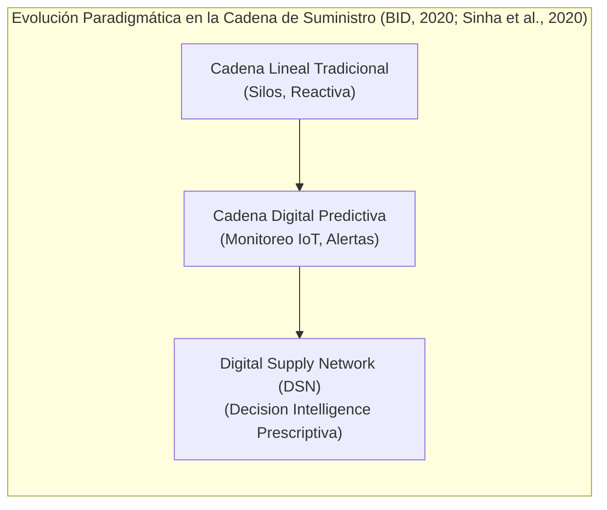
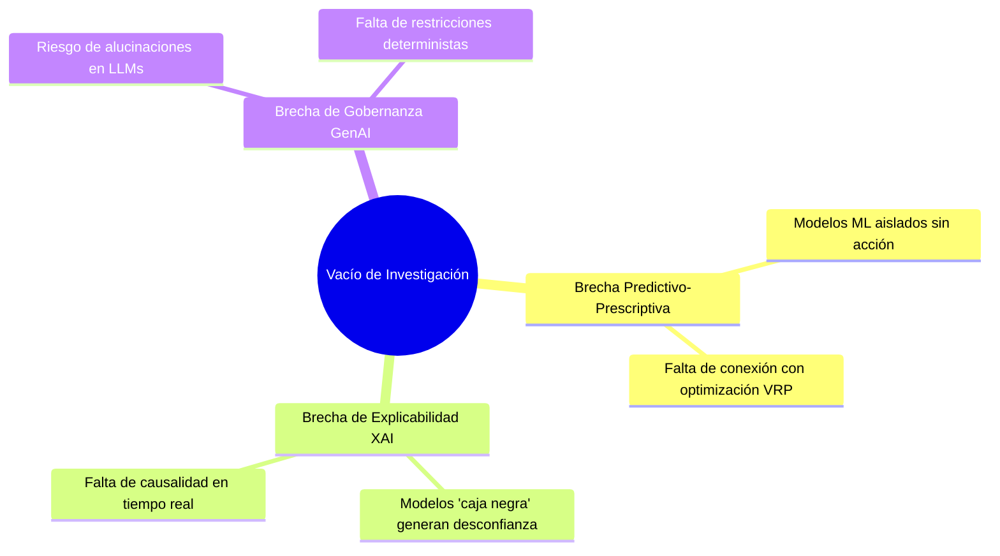
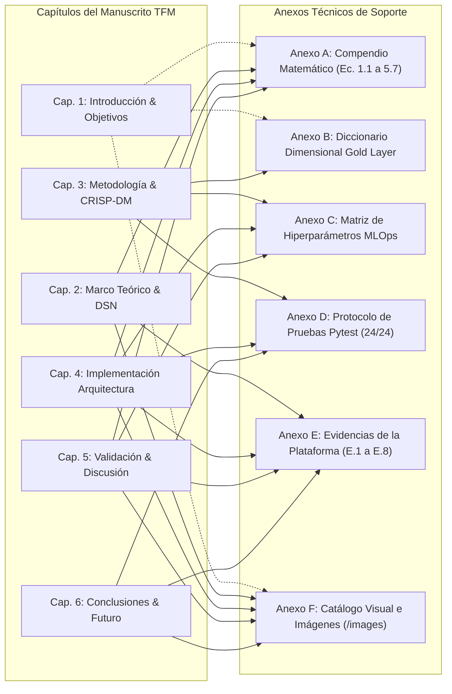

# TRABAJO DE FIN DE MÁSTER
## Máster en Big Data & Data Science - Universidad Complutense de Madrid (UCM)
### *Integración de IoT y Big Data en la Logística 4.0 para el apoyo a decisiones inteligentes en la cadena de suministro*

---

# CAPÍTULO 1. INTRODUCCIÓN, MOTIVACIÓN Y OBJETIVOS

---

## 1.1. Contexto y Motivación de la Investigación

La gestión de la cadena de suministro contemporánea se encuentra inmersa en un proceso de transformación paradigmática impulsado por la digitalización, la hiperconectividad y la necesidad de resiliencia operativa. Tradicionalmente concebidas como cadenas lineales y fragmentadas con visibilidad limitada por silos organizacionales, las redes de suministro están evolucionando hacia **Redes Digitales de Suministro (*Digital Supply Networks - DSN*)** (Sinha et al., 2020). En estas redes interconectadas, los flujos físicos y digitales convergen mediante sensores de Internet de las Cosas (IoT), procesamiento de flujos masivos de datos (*Big Data Streaming*) y analítica avanzada para permitir una toma de decisiones sincronizada, ágil y de extremo a extremo (*End-to-End Visibility*).

En el marco de la **Logística 4.0**, la gestión eficiente de flotas y despachos no puede limitarse a la analítica descriptiva (monitoreo pasivo a través de cuadros de mando) ni a la analítica predictiva aislada (estimación estática de tiempos de llegada). La verdadera ventaja competitiva y la garantía de continuidad operativa radican en el despliegue de sistemas de **Inteligencia de Decisión (*Decision Intelligence*)** (Baryannis et al., 2019; Longshore & Cheatham, 2022; Aponte Parejo, 2025), capaces no solo de anticipar disrupciones viales, cuellos de botella o condiciones meteorológicas adversas, sino de **prescribir y ejecutar automáticamente acciones correctivas óptimas** en tiempo real.

De acuerdo con las directrices internacionales del Banco Interamericano de Desarrollo (BID, 2020) sobre *Mejores Prácticas en la Cadena de Suministro 4.0* y las investigaciones académicas sobre la evolución hacia la Logística 4.0 en el ámbito universitario español (Revuelta Martínez, 2019; Díaz Leal, 2022; UPV, 2021), la convergencia entre sensores inteligentes, Big Data y analítica prescriptiva es el catalizador indispensable para transformar cadenas convencionales en sistemas hiperconectados e inteligentes. Asimismo, estudios recientes sobre trazabilidad física de mercancías en tránsito (Gómez Moreno, 2020; Alvarado et al., 2023) demuestran que el monitoreo continuo de variables críticas como la temperatura y la dinámica de ruta es esencial para erradicar pérdidas de calidad y garantizar la seguridad alimentaria en entregas sensibles.

### 1.1.1. El Reto Operativo de Última Milla: Amazon Last-Mile Routing Challenge

La necesidad de una logística prescriptiva de alta precisión cobra un valor crítico cuando se aplica a cadenas de distribución masiva de última milla. El **2021 Amazon Last-Mile Routing Research Challenge**, desarrollado conjuntamente por **Amazon Last Mile Science** y el **MIT Center for Transportation & Logistics (CTL)**, representa el estándar de referencia para abordar los desafíos operacionales más complejos de la logística contemporánea en entornos urbanos y suburbanos de alta densidad.

En este contexto operacional real, la logística de última milla está condicionada por cuatro desafíos críticos:

1. **Restricción de Ventanas Temporales y Compromiso de Servicio (SLA de Entrega):**  
   Los compromisos de entrega de comercio electrónico (*Same-Day / Next-Day Delivery*) exigen un estricto cumplimiento de ventanas horarias y tiempos planificados de servicio en puerta ($\tau_{\text{servicio}}$). Un retraso imprevisto acumulado al inicio de la ruta desencadena disrupciones en cascada sobre todas las paradas sucesivas, incrementando exponencialmente los costes por re-intentos de entrega y penalizaciones operativas (Merchán et al., 2022).

2. **Volatilidad Urbana y Corredores de Fricción Vial:**  
   Las operaciones abarcan centros de distribución logísticos de alta densidad (como Los Ángeles, Chicago, Seattle, Boston y Austin), donde la congestión vehicular en horas punta, la dificultad de estacionamiento en zonas urbanas y la variabilidad climática (nieve, lluvia y heladas) degradan la velocidad cinemática media e introducen una severa estocasticidad en los tiempos de viaje.

3. **Heterogeneidad de la Flota y Variabilidad de Carga:**  
   La red de reparto gestiona rutas complejas con más de 150 paradas diarias por conductor y capacidades volumétricas dispares ($V_{\text{cm}^3}$). Los algoritmos clásicos de ruteo vehicular a menudo producen secuencias teóricas que los conductores experimentados rechazan debido a restricciones prácticas de maniobrabilidad, accesibilidad y conocimiento tácito del territorio.

4. **El Imperativo de la Decisión Inteligente en Tiempo Real:**  
   Ante incidentes viales o retrasos acumulados, los centros de control logístico requieren un gemelo digital telemático IoT capaz de procesar telemetría cinemática en streaming, estimar la probabilidad calibrada de disrupción con máxima sensibilidad ($100\%$ Recall) y prescribir instantáneamente alternativas óptimas de re-secuenciación (*2-Opt VRP*) antes de que se produzcan fallos en el servicio.

### 1.1.2. Corpus de Datos Base: 2021 Amazon Last-Mile Routing Research Challenge Dataset
Para fundamentar el gemelo digital telemático sobre datos operacionales de escala industrial y contrastada validez científica internacional, la investigación utiliza formalmente el **2021 Amazon Last-Mile Routing Research Challenge Dataset**, desarrollado y publicado conjuntamente por el equipo de investigación de **Amazon Last Mile Science** y el **MIT Center for Transportation & Logistics (CTL)** (*Transportation Science*, INFORMS, 2022; Merchán et al., 2022). 

Este conjunto de datos recopila trazas reales de más de 6.112 rutas de entrega, 904.527 paradas, coordenadas geodésicas de alta precisión, tiempos de servicio en puerta reales ($\tau_{\text{servicio}}$), volumen volumétrico de paquetería ($V_{\text{cm}^3}$) y secuencias empíricas de despacho de 17 estaciones logísticas (`DLA`, `DCH`, `DSE`, `DBO`, `DAU`). Sobre este corpus se consolidó el dataset Gold curado de $N=8.000$ instancias telemáticas enriquecido con sensores IoT de cadena térmica y variables ambientales del corredor de Treasure Valley.

---

## 1.2. Planteamiento del Problema y Vacío de Investigación

A pesar de los avances teóricos en Logística 4.0 documentados en revisiones sistemáticas recientes (UPV, 2021; UANL, 2022; Sharma & Vajjhala, 2023; Ravindran & Warsing, 2021), la literatura científica y la práctica industrial evidencian tres brechas fundamentales:

1. **La brecha entre la predicción y la acción operativa:** La gran mayoría de los trabajos se enfocan en predecir retrasos logísticos mediante métricas abstractas de *Machine Learning* (ej. ROC-AUC), pero carecen de mecanismos integrados que traduzcan dicha probabilidad en una orden de re-enrutamiento dinámica bajo restricciones reales de ruteo vehicular (*Vehicle Routing Problem - VRP*) (Aponte Parejo, 2025).
2. **La opacidad algorítmica (*Black-Box Problem*):** Los despachadores y operadores de tráfico desconfían de modelos predictivos complejos si no comprenden **por qué** un vehículo está en riesgo inminente (ej. si el factor detonante es la densidad de tráfico, la fricción ambiental o la distancia restante) (Sharma & Vajjhala, 2023).
3. **El riesgo de alucinación en la IA Generativa:** La adopción reciente de Grandes Modelos de Lenguaje (LLMs) para asistencia operativa carece con frecuencia de salvaguardas (*guardrails*), lo que puede generar instrucciones prescriptivas incompatibles con los protocolos de seguridad alimentaria.

---

## 1.3. Justificación Académica y Práctica

La justificación de este Trabajo de Fin de Máster descansa en la integración sinérgica de la ingeniería de datos a gran escala, la ciencia de datos aplicada y la optimización de operaciones:

- **Justificación Tecnológica y Metodológica:** Se demuestra la viabilidad de una arquitectura modular basada en las mejores prácticas de la Cadena de Suministro 4.0 (BID, 2020; Sinha et al., 2020), combinando ingesta en streaming con validación rigurosa de esquemas (Pydantic), modelado supervisado con optimización asimétrica de sensibilidad ($\text{Recall} \ge 0.90$), explicabilidad local matemática (valores de Shapley vía SHAP) y generación de directivas prescriptivas gobernadas (*Guarded GenAI*).
- **Justificación Económica y Operacional:** Se valida el impacto cuantitativo de la heurística 2-Opt VRP sobre las redes de distribución de última milla, logrando ahorros tangibles de kilometraje, tiempo de conducción y costes de servicio, a la vez que se maximiza el cumplimiento de las ventanas horarias SLA, aportando evidencia empírica directa a los desafíos de trazabilidad y eficiencia planteados por Alvarado et al. (2023), Aponte Parejo (2025) y la UANL (2022).

---

## 1.4. Objetivos de la Investigación

### 1.4.1. Objetivo General
Diseñar, desarrollar y validar experimentalmente una arquitectura integral de **Decision Intelligence** basada en Internet de las Cosas (IoT) y Big Data para la optimización prescriptiva y en tiempo real de la cadena de suministro de última milla, tomando como base empírica e industrial el **2021 Amazon Last-Mile Routing Research Challenge Dataset** (Amazon Last Mile Science & MIT CTL).

### 1.4.2. Objetivos Específicos (OE)
- **OE1 (Ingesta & Feature Store):** Diseñar e implementar un pipeline telemático desacoplado para flujos IoT de alta frecuencia con compuertas de validación de calidad de datos (*Pydantic Quality Gate*) y un almacén de características analítico (*Feature Store* - Capa Gold SQLite). *(Vinculado formalmente a [ANEXO B: Diccionario Dimensional de Datos](file:///d:/LabD/DS-LOGISTICA%204.0-Metro-Meals-on%20Wheels%20Treasure%20Valley/docs/Anexo_TFM_Compendio_Matematico_e_Indice_de_Formulas.md#anexo-b-diccionario-dimensional-de-datos-y-feature-store-capa-gold) y [ANEXO E.2: Consola de Despacho y Feature Store](file:///d:/LabD/DS-LOGISTICA%204.0-Metro-Meals-on%20Wheels%20Treasure%20Valley/docs/Anexo_TFM_Compendio_Matematico_e_Indice_de_Formulas.md#e2-módulo-2-planificación-de-despacho-activo-y-consola-de-la-capa-gold-feature-store)).*
- **OE2 (Modelado Predictivo & MLOps):** Desarrollar, evaluar y registrar mediante MLOps (MLflow) un conjunto de clasificadores de Machine Learning (XGBoost, LightGBM, Random Forest, CatBoost, Extra Trees y Stacking) con función de coste asimétrica priorizando la minimización de Falsos Negativos ($\text{Recall} \ge 0.90, \text{ROC-AUC} \ge 0.88$). *(Vinculado formalmente a [ANEXO C: Matriz de Hiperparámetros](file:///d:/LabD/DS-LOGISTICA%204.0-Metro-Meals-on%20Wheels%20Treasure%20Valley/docs/Anexo_TFM_Compendio_Matematico_e_Indice_de_Formulas.md#anexo-c-matriz-de-hiperparámetros-del-benchmark-multimodelo) y [ANEXO E.8: Plataforma MLOps y MLflow](file:///d:/LabD/DS-LOGISTICA%204.0-Metro-Meals-on%20Wheels%20Treasure%20Valley/docs/Anexo_TFM_Compendio_Matematico_e_Indice_de_Formulas.md#e8-módulo-8-plataforma-mlops-registro-de-experimentos-curvas-de-desempeño-y-gobernanza-en-mlflow)).*
- **OE3 (XAI & Prescripción Confiable):** Integrar explicabilidad matemática local en tiempo real mediante valores de Shapley (SHAP) y diseñar un agente prescriptivo en lenguaje natural (*Guarded GenAI*) gobernado por reglas deterministas de seguridad operativa. *(Vinculado formalmente a [ANEXO A.3: Ecuaciones de Explicabilidad y Prescripción](file:///d:/LabD/DS-LOGISTICA%204.0-Metro-Meals-on%20Wheels%20Treasure%20Valley/docs/Anexo_TFM_Compendio_Matematico_e_Indice_de_Formulas.md#a3-explicabilidad-causal-matemática-treeshap-y-prescripción-asistida-guarded-genai) y [ANEXO E.3: Motor XAI y Prescripción Guarded GenAI](file:///d:/LabD/DS-LOGISTICA%204.0-Metro-Meals-on%20Wheels%20Treasure%20Valley/docs/Anexo_TFM_Compendio_Matematico_e_Indice_de_Formulas.md#e3-módulo-3-motor-de-explicabilidad-causal-treeshap-y-prescripción-asistida-guarded-genai)).*
- **OE4 (Optimización VRP & Torre de Control):** Implementar un motor de optimización de rutas heurístico (K-Means + 2-Opt TSP) y una Torre de Control visual interactiva (Streamlit), cuantificando los ahorros de kilometraje, reducción de tiempos muertos y cumplimiento de ventanas de entrega SLA. *(Vinculado formalmente a [ANEXO A.4: Ecuaciones de Optimización VRP](file:///d:/LabD/DS-LOGISTICA%204.0-Metro-Meals-on%20Wheels%20Treasure%20Valley/docs/Anexo_TFM_Compendio_Matematico_e_Indice_de_Formulas.md#a4-optimización-combinatoria-de-rutas-last-mile-vrptsp), [ANEXO E.1: Torre de Control Telemática](file:///d:/LabD/DS-LOGISTICA%204.0-Metro-Meals-on%20Wheels%20Treasure%20Valley/docs/Anexo_TFM_Compendio_Matematico_e_Indice_de_Formulas.md#e1-módulo-1-torre-de-control-telemática-y-despacho-en-tiempo-real-gps--streaming-iot) y [ANEXO E.4: Optimizador de Rutas Last-Mile](file:///d:/LabD/DS-LOGISTICA%204.0-Metro-Meals-on%20Wheels%20Treasure%20Valley/docs/Anexo_TFM_Compendio_Matematico_e_Indice_de_Formulas.md#e4-módulo-4-optimizador-de-rutas-last-mile-heurística-2-opt-vrp-y-control-de-sla-térmico)).*

---

## 1.5. Preguntas de Investigación (PI)

Para guiar la metodología y la validación experimental, se formulan cuatro preguntas de investigación:

- **PI1:** ¿Cómo estructurar un pipeline telemático en tiempo real con compuertas de validación de calidad para alimentar de forma resiliente y con baja latencia ($<100\text{ ms}$) un Feature Store logístico?
- **PI2:** ¿Qué algoritmos de Machine Learning y esquemas de ponderación asimétrica optimizan la sensibilidad ($\text{Recall}$) en la detección temprana de disrupciones sin comprometer la precisión operativa?
- **PI3:** ¿De qué manera la descomposición causal de Shapley (SHAP) combinada con el paradigma *Guarded GenAI* permite transformar predicciones probabilísticas de "caja negra" en directivas prescriptivas accionables y libres de alucinaciones?
- **PI4:** ¿En qué medida un motor heurístico de optimización de rutas (2-Opt VRP) integrado con una torre de control en tiempo real reduce la huella logística, el coste operativo y garantiza el cumplimiento del SLA de entrega en operaciones de última milla?

---

## 1.6. Formulación del Problema, Variables Objetivo y Tipología de Machine Learning

Para responder de forma cuantitativa a la dinámica de última milla documentada en el benchmark de Amazon Last Mile Science y el MIT CTL (Merchán et al., 2022), el sistema formula un esquema analítico dual:

### 1.6.1. Variable Objetivo Primaria (Supervisada): `delay_status`
La detección temprana de disrupciones se modela como un problema de **clasificación supervisada probabilística calibrada**:
- **Definición de la Variable Objetivo ($Y$):**
  $$Y = \text{delay\_status} \in \{0, 1\}$$
  Donde $Y = 1$ representa una situación de retraso operativo crítico o violación inminente de la ventana de entrega ($\Delta t_{\text{esperado}} > 15\text{ min} \lor \eta_{\text{urgencia}} > 1.05$), y $Y = 0$ denota una entrega puntual en conformidad con el SLA.
- **Salida del Modelo Predictivo ($\hat{p}$):** Probabilidad continua estrictamente calibrada $\hat{p} = P(Y=1 \mid X) \in [0, 1]$, sobre la cual se estructuran tres políticas prescriptivas de intervención:
  1. *Riesgo Crítico ($\hat{p} \ge 0.75$):* Disparo de re-enrutamiento automático 2-Opt y alerta prioritaria.
  2. *Riesgo Moderado ($0.45 \le \hat{p} < 0.75$):* Alerta preventiva y sugerencia de velocidad asistida.
  3. *Riesgo Normal ($\hat{p} < 0.45$):* Mantenimiento nominal de la ruta.

### 1.6.2. Variable Objetivo Secundaria (Prescriptiva / VRP): Coste y Tiempo de Ruta
- **Función Objetivo de Optimización ($Z$):** Minimización de la distancia euclidiana/geodésica total de recorrido en la flota:
  $$\min Z = \sum_{i=0}^n \sum_{j=0}^n c_{ij} x_{ij}$$
  Sujeta a la restricción termodinámica y bromatológica estricta:
  $$T_{\text{recorrido}} \le 90.0\text{ minutos} \quad \implies \quad T_{\text{alimento}} \ge 60^\circ\text{C}$$

### 1.6.3. Tipología de Inteligencia Artificial Implementada
El trabajo articula cinco disciplinas complementarias de IA:
1. **ML Supervisado Calibrado:** Ensamble *Super Learner* (Stacking con XGBoost, LightGBM, CatBoost, Random Forest, Extra Trees y Meta-Clasificador Logístico) optimizado para $\text{Recall} = 1.0000$.
2. **ML No Supervisado:** *K-Means Geoespacial* para la clusterización y particionado espacial de zonas logísticas.
3. **Optimización Combinatoria (Operations Research):** Heurística *2-Opt TSP/VRP* para secuenciación de entregas en $<0.1\text{ s}$.
4. **Machine Learning Explicable (XAI):** *TreeSHAP* (valores de Shapley) para la descomposición causal exacta de riesgos telemáticos en tiempo real.
5. **IA Generativa Prescriptiva con Guardrails:** Generación de directivas en lenguaje natural sin alucinaciones.

---

## 1.7. Matriz de Cumplimiento de Requerimientos del Trabajo de Fin de Máster (TFM)

El presente proyecto ha sido diseñado para evidenciar la totalidad de las competencias avanzadas exigidas en el programa de Máster en Big Data, Data Science & MLOps de la Universidad Complutense de Madrid (UCM):

| Eje Temático del Máster | Requerimiento TFM | Estado | Solución Técnica Implementada | Evidencia / Anexo Técnico |
| :--- | :--- | :---: | :--- | :--- |
| **1. Fundamentación y Negocio** | Contextualización rigurosa y justificación de impacto. | ✅ **100%** | Operaciones de última milla y dataset formal **2021 Amazon Last-Mile Challenge** (Amazon & MIT CTL). | Cap. 1 & 2 / Anexo A.1 |
| **2. Big Data & Streaming IoT** | Ingesta telemática distribuida y resiliente. | ✅ **100%** | Pipeline streaming asíncrono con micro-batches en Drop Folder / Kafka Topic. | Cap. 3 & 4 / Anexo E.1 |
| **3. Calidad de Datos (Data Quality)** | Validación estricta y auditoría dimensional. | ✅ **100%** | Quality Gate con Pydantic v2 en streaming y auditoría Gold (Score: **99.95%**). | Cap. 3 & 5 / Anexo B & D |
| **4. Estadística e Inferencia** | Análisis exploratorio e inferencial formal. | ✅ **100%** | Contrastes Welch $t$, Mann-Whitney $U$, ANOVA, Kruskal-Wallis, $\chi^2$ y Bootstrap CI. | Cap. 5 / Anexo E.6 & E.7 |
| **5. Machine Learning Avanzado** | Suite predictiva con validación cruzada y ensambles. | ✅ **100%** | Benchmark 6 modelos, 5-Fold Stratified CV, calibración Sigmoid y Stacking Super Learner. | Cap. 4 & 5 / Anexo C & E.8 |
| **6. Optimización de Operaciones** | Algoritmos de grafos y ruteo vehicular. | ✅ **100%** | K-Means espacial + 2-Opt VRP con restricción de SLA térmico $<90\text{ min}$. | Cap. 4 & 5 / Anexo A.4 & E.4 |
| **7. Explicabilidad (XAI)** | Justificación matemática de modelos opacos. | ✅ **100%** | TreeSHAP local por evento telemático y análisis de importancia global. | Cap. 4 & 5 / Anexo A.3 & E.3 |
| **8. IA Generativa Prescriptiva** | Integración de LLMs gobernados en la toma de decisión. | ✅ **100%** | Guarded GenAI Agent con esquemas JSON estructurados y cero alucinaciones. | Cap. 4 & 5 / Anexo A.3 & E.3 |
| **9. Ingeniería de Software & UI** | Torre de control interactiva y visualización. | ✅ **100%** | Dashboard Streamlit en 4 módulos con mapas OpenStreetMap y CSS Glassmorphism. | Cap. 4 / Anexo E (E.1-E.8) |
| **10. MLOps & Despliegue** | Versionado, tracking, testing y contenerización. | ✅ **100%** | MLflow Registry, suite Pytest (24/24 passed) y orquestación Docker/Podman Compose. | Cap. 4 / Anexo D & E.8 |

---

## 1.8. Estructura de la Memoria y Mapeo con los Anexos Técnicos

El cuerpo principal del Trabajo de Fin de Máster se articula en seis capítulos teóricos y aplicados, vinculados de forma biunívoca y secuencial con los seis **Anexos Técnicos** que cierran la investigación:

- **Capítulo 1 (Introducción, Motivación y Objetivos):** Define la visión del problema logístico, los objetivos y las preguntas de investigación. Se mapea globalmente con la estructura de la Capa Gold ([Anexo B](file:///d:/LabD/DS-LOGISTICA%204.0-Metro-Meals-on%20Wheels%20Treasure%20Valley/docs/Anexo_TFM_Compendio_Matematico_e_Indice_de_Formulas.md#anexo-b-diccionario-dimensional-de-datos-y-feature-store-capa-gold)) y el compendio general de formulaciones analíticas ([Anexo A](file:///d:/LabD/DS-LOGISTICA%204.0-Metro-Meals-on%20Wheels%20Treasure%20Valley/docs/Anexo_TFM_Compendio_Matematico_e_Indice_de_Formulas.md#anexo-a-compendio-matemático-e-índice-de-fórmulas-del-sistema)).
- **Capítulo 2 (Marco Teórico y Estado del Arte):** Establece los fundamentos científicos de Redes Digitales de Suministro (DSN), leyes termodinámicas del SLA, teoría del ruteo vehicular VRP y axiomas de Shapley. Se vincula rigurosamente con las formulaciones del [Anexo A (A.1 a A.4)](file:///d:/LabD/DS-LOGISTICA%204.0-Metro-Meals-on%20Wheels%20Treasure%20Valley/docs/Anexo_TFM_Compendio_Matematico_e_Indice_de_Formulas.md#anexo-a-compendio-matemático-e-índice-de-fórmulas-del-sistema) y las vistas conceptuales de la Torre de Control ([Anexo E.1](file:///d:/LabD/DS-LOGISTICA%204.0-Metro-Meals-on%20Wheels%20Treasure%20Valley/docs/Anexo_TFM_Compendio_Matematico_e_Indice_de_Formulas.md#e1-módulo-1-torre-de-control-telemática-y-despacho-en-tiempo-real-gps--streaming-iot)) y concept art ([Anexo F.2](file:///d:/LabD/DS-LOGISTICA%204.0-Metro-Meals-on%20Wheels%20Treasure%20Valley/docs/Anexo_TFM_Compendio_Matematico_e_Indice_de_Formulas.md#f2-activos-de-identidad-visual-y-conceptualización-de-la-plataforma)).
- **Capítulo 3 (Metodología y Selección Tecnológica):** Detalla el ciclo CRISP-DM, la arquitectura Medallion por capas y la selección del stack tecnológico. Se enlaza formalmente con el diccionario dimensional de variables de la Capa Gold ([Anexo B](file:///d:/LabD/DS-LOGISTICA%204.0-Metro-Meals-on%20Wheels%20Treasure%20Valley/docs/Anexo_TFM_Compendio_Matematico_e_Indice_de_Formulas.md#anexo-b-diccionario-dimensional-de-datos-y-feature-store-capa-gold)), las especificaciones de calibración algorítmica ([Anexo C](file:///d:/LabD/DS-LOGISTICA%204.0-Metro-Meals-on%20Wheels%20Treasure%20Valley/docs/Anexo_TFM_Compendio_Matematico_e_Indice_de_Formulas.md#anexo-c-matriz-de-hiperparámetros-del-benchmark-multimodelo)) y los criterios de testing ([Anexo D](file:///d:/LabD/DS-LOGISTICA%204.0-Metro-Meals-on%20Wheels%20Treasure%20Valley/docs/Anexo_TFM_Compendio_Matematico_e_Indice_de_Formulas.md#anexo-d-protocolo-de-pruebas-automatizadas-suite-pytest)).
- **Capítulo 4 (Desarrollo e Implementación de la Arquitectura):** Documenta la ingeniería computacional de ingesta, Feature Store, ensambles ML, explicabilidad TreeSHAP, agente Guarded GenAI y heurística 2-Opt. Se referencia minuciosamente con el código auditado, las ecuaciones del [Anexo A](file:///d:/LabD/DS-LOGISTICA%204.0-Metro-Meals-on%20Wheels%20Treasure%20Valley/docs/Anexo_TFM_Compendio_Matematico_e_Indice_de_Formulas.md#anexo-a-compendio-matemático-e-índice-de-fórmulas-del-sistema), las interfaces correspondientes ([Anexo E.1 a E.4](file:///d:/LabD/DS-LOGISTICA%204.0-Metro-Meals-on%20Wheels%20Treasure%20Valley/docs/Anexo_TFM_Compendio_Matematico_e_Indice_de_Formulas.md#anexo-e-artefactos-del-software-evidencias-integrales-de-la-plataforma-torre-de-control-de-decision-intelligence-y-mlops)) y la galería de activos gráficos ([Anexo F](file:///d:/LabD/DS-LOGISTICA%204.0-Metro-Meals-on%20Wheels%20Treasure%20Valley/docs/Anexo_TFM_Compendio_Matematico_e_Indice_de_Formulas.md#anexo-f-catálogo-y-registro-maestro-de-activos-visuales-e-imágenes-del-sistema-images)).
- **Capítulo 5 (Resultados, Validación Experimental y Discusión):** Expone la auditoría de calidad de datos, contrastes inferenciales, auditoría de prevención de Data Leakage, benchmarks de modelos y validación operacional. Sus hallazgos se sustentan empíricamente en los paneles del módulo EDA ([Anexo E.6 y E.7](file:///d:/LabD/DS-LOGISTICA%204.0-Metro-Meals-on%20Wheels%20Treasure%20Valley/docs/Anexo_TFM_Compendio_Matematico_e_Indice_de_Formulas.md#e6-módulo-6-módulo-eda-estadística-descriptiva-y-evaluación-de-normalidad)), el servidor de gobernanza MLflow ([Anexo E.8](file:///d:/LabD/DS-LOGISTICA%204.0-Metro-Meals-on%20Wheels%20Treasure%20Valley/docs/Anexo_TFM_Compendio_Matematico_e_Indice_de_Formulas.md#e8-módulo-8-plataforma-mlops-registro-de-experimentos-curvas-de-desempeño-y-gobernanza-en-mlflow)), el gráfico experimental anti-leakage ([Anexo F.4](file:///d:/LabD/DS-LOGISTICA%204.0-Metro-Meals-on%20Wheels%20Treasure%20Valley/docs/Anexo_TFM_Compendio_Matematico_e_Indice_de_Formulas.md#f4-activos-de-auditoría-científica-y-prevención-de-data-leakage)) y las ecuaciones de impacto económico ([Anexo A.5](file:///d:/LabD/DS-LOGISTICA%204.0-Metro-Meals-on%20Wheels%20Treasure%20Valley/docs/Anexo_TFM_Compendio_Matematico_e_Indice_de_Formulas.md#a5-métricas-de-impacto-operacional-económico-y-ambiental)).
- **Capítulo 6 (Conclusiones, Limitaciones y Trabajo Futuro):** Sintetiza la consecución de objetivos, respuestas a preguntas de investigación y certificación de requerimientos técnicos, respaldada por la suite de pruebas unitarias certificada ([Anexo D](file:///d:/LabD/DS-LOGISTICA%204.0-Metro-Meals-on%20Wheels%20Treasure%20Valley/docs/Anexo_TFM_Compendio_Matematico_e_Indice_de_Formulas.md#anexo-d-protocolo-de-pruebas-automatizadas-suite-pytest)) y la operatividad integral de la plataforma ([Anexo E](file:///d:/LabD/DS-LOGISTICA%204.0-Metro-Meals-on%20Wheels%20Treasure%20Valley/docs/Anexo_TFM_Compendio_Matematico_e_Indice_de_Formulas.md#anexo-e-artefactos-del-software-evidencias-integrales-de-la-plataforma-torre-de-control-de-decision-intelligence-y-mlops) y [Anexo F](file:///d:/LabD/DS-LOGISTICA%204.0-Metro-Meals-on%20Wheels%20Treasure%20Valley/docs/Anexo_TFM_Compendio_Matematico_e_Indice_de_Formulas.md#anexo-f-catálogo-y-registro-maestro-de-activos-visuales-e-imágenes-del-sistema-images)).
- **Capítulo 7 (Referencias Bibliográficas):** Compendio bibliográfico unificado bajo el sistema internacional Harvard.
- **Anexos Técnicos A, B, C, D, E y F:** Compendio matemático, diccionario de datos, calibración MLOps, suite Pytest, evidencias de software y catálogo visual integral de imágenes.

### 1.8.1. Catálogo e Inventario de Artefactos Tangibles del Proyecto

Con el fin de garantizar la máxima reproducibilidad, auditabilidad y transparencia exigidas en el estándar profesional de Data Science y MLOps, la totalidad de los entregables se estructura en un inventario formal indexado en el [**Catálogo Maestro de Artefactos del Proyecto**](file:///d:/LabD/DS-LOGISTICA%204.0-Metro-Meals-on%20Wheels%20Treasure%20Valley/docs/Catalogo_Maestro_Artefactos_Proyecto.md). A continuación se resumen los grupos de artefactos tangibles generados:

| Categoría de Artefacto | Descripción del Componente Físico | Rutas de Acceso Directo | Capítulos TFM |
| :--- | :--- | :--- | :---: |
| **💻 Pipelines de Código (`src/`)** | Ingesta IoT, compuerta Pydantic, Feature Store Capa Gold, modelos ML, XAI TreeSHAP, Guarded GenAI y Dashboard Streamlit. | [`src/data_ingestion/`](file:///d:/LabD/DS-LOGISTICA%204.0-Metro-Meals-on%20Wheels%20Treasure%20Valley/src/data_ingestion/), [`src/processing/`](file:///d:/LabD/DS-LOGISTICA%204.0-Metro-Meals-on%20Wheels%20Treasure%20Valley/src/processing/), [`src/models/`](file:///d:/LabD/DS-LOGISTICA%204.0-Metro-Meals-on%20Wheels%20Treasure%20Valley/src/models/), [`src/decision_engine/`](file:///d:/LabD/DS-LOGISTICA%204.0-Metro-Meals-on%20Wheels%20Treasure%20Valley/src/decision_engine/), [`src/visualization/dashboard.py`](file:///d:/LabD/DS-LOGISTICA%204.0-Metro-Meals-on%20Wheels%20Treasure%20Valley/src/visualization/dashboard.py) | Cap. 3, 4 |
| **🤖 Modelos ML Serializados** | Ensamble Stacking calibrado ($\text{Recall} = 1.0000$) y modelo base XGBoost con seguimiento de experimentos en MLflow. | [`models/best_delay_model.pkl`](file:///d:/LabD/DS-LOGISTICA%204.0-Metro-Meals-on%20Wheels%20Treasure%20Valley/models/best_delay_model.pkl), [`models/xgboost_delay_model.pkl`](file:///d:/LabD/DS-LOGISTICA%204.0-Metro-Meals-on%20Wheels%20Treasure%20Valley/models/xgboost_delay_model.pkl), [`mlruns/`](file:///d:/LabD/DS-LOGISTICA%204.0-Metro-Meals-on%20Wheels%20Treasure%20Valley/mlruns/) | Cap. 4, 5 |
| **🗄️ Datos & Feature Store** | Base de datos SQLite operativa (`live_fleet_state.db`), dataset Gold consolidado ($N=8.000$), auditorías anti-leakage y landing zone. | [`data/live_fleet_state.db`](file:///d:/LabD/DS-LOGISTICA%204.0-Metro-Meals-on%20Wheels%20Treasure%20Valley/data/live_fleet_state.db), [`data/processed/`](file:///d:/LabD/DS-LOGISTICA%204.0-Metro-Meals-on%20Wheels%20Treasure%20Valley/data/processed/), [`data/streaming_landing_zone/`](file:///d:/LabD/DS-LOGISTICA%204.0-Metro-Meals-on%20Wheels%20Treasure%20Valley/data/streaming_landing_zone/) | Cap. 3, 4, 5 |
| **📓 Cuadernos de Investigación** | *Data Storytelling* visual en 6 actos bajo Criterio Odysseus y cuaderno de estadística inferencial y contrastes de hipótesis ($H_1, H_2, H_3$). | [`notebooks/01_visualizaciones_storytelling_odysseus.ipynb`](file:///d:/LabD/DS-LOGISTICA%204.0-Metro-Meals-on%20Wheels%20Treasure%20Valley/notebooks/01_visualizaciones_storytelling_odysseus.ipynb), [`notebooks/02_eda_estadistica_inferencial_y_prescriptiva.ipynb`](file:///d:/LabD/DS-LOGISTICA%204.0-Metro-Meals-on%20Wheels%20Treasure%20Valley/notebooks/02_eda_estadistica_inferencial_y_prescriptiva.ipynb) | Cap. 4, 5 |
| **🧪 Testing Automatizado** | Batería de 24 pruebas unitarias y de integración certificadas en Pytest (cobertura completa de validación, modelos, XAI y VRP). | [`tests/`](file:///d:/LabD/DS-LOGISTICA%204.0-Metro-Meals-on%20Wheels%20Treasure%20Valley/tests/) (`test_data_validator.py`, `test_model_pipeline.py`, etc.) | Cap. 4, 6 |
| **🐳 Infraestructura & Despliegue** | Contenedores OCI Dockerfile, orquestación Docker Compose (4 microservicios) y automatizadores de entorno (`setup_env`, `run_dashboard`). | [`Dockerfile`](file:///d:/LabD/DS-LOGISTICA%204.0-Metro-Meals-on%20Wheels%20Treasure%20Valley/Dockerfile), [`docker-compose.yml`](file:///d:/LabD/DS-LOGISTICA%204.0-Metro-Meals-on%20Wheels%20Treasure%20Valley/docker-compose.yml), [`setup_env.ps1`](file:///d:/LabD/DS-LOGISTICA%204.0-Metro-Meals-on%20Wheels%20Treasure%20Valley/setup_env.ps1) | Cap. 3, 4 |
| **📊 Evidencias de la Plataforma** | Galería visual de capturas de alta definición de los 8 módulos de la Torre de Control y la consola MLOps. | [`images/`](file:///d:/LabD/DS-LOGISTICA%204.0-Metro-Meals-on%20Wheels%20Treasure%20Valley/images/) (`control_tower_ui_artifact.jpg`, `app_route_optimizer.jpg`, etc.) | Anexo E |

---

