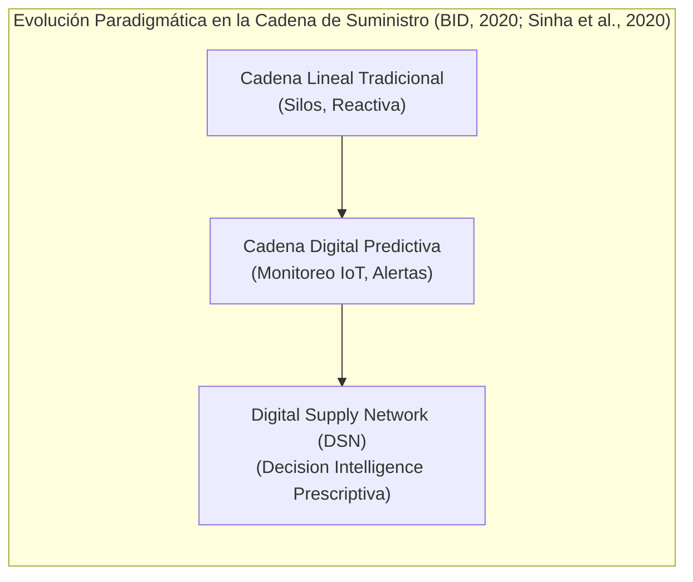
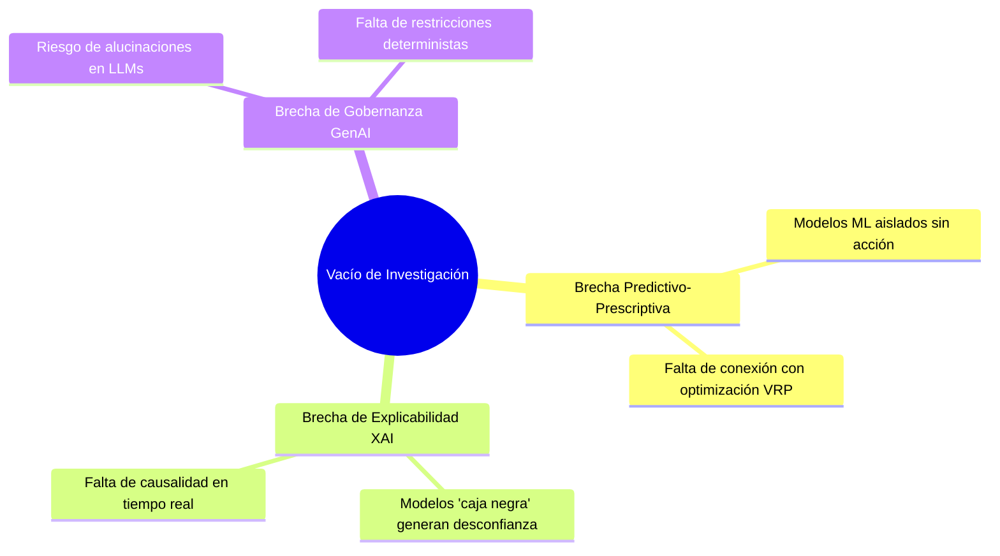

# TRABAJO DE FIN DE MÁSTER
## Máster en Big Data & Data Science - Universidad Complutense de Madrid (UCM)
### *Integración de IoT y Big Data en la Logística 4.0 para el apoyo a decisiones inteligentes en la cadena de suministro*

---

# CAPÍTULO 1. INTRODUCCIÓN, MOTIVACIÓN Y OBJETIVOS

---

## 1.1. Contexto y Motivación de la Investigación

La gestión de la cadena de suministro contemporánea se encuentra inmersa en un proceso de transformación paradigmática impulsado por la digitalización, la hiperconectividad y la necesidad de resiliencia operativa. Tradicionalmente concebidas como cadenas lineales y fragmentadas con visibilidad limitada por silos organizacionales, las redes de suministro están evolucionando hacia **Redes Digitales de Suministro (*Digital Supply Networks - DSN*)** (Sinha et al., 2020). En estas redes interconectadas, los flujos físicos y digitales convergen mediante sensores de Internet de las Cosas (IoT), procesamiento de flujos masivos de datos (*Big Data Streaming*) y analítica avanzada para permitir una toma de decisiones sincronizada, ágil y de extremo a extremo (*End-to-End Visibility*).

En el marco de la **Logística 4.0**, la gestión eficiente de flotas y despachos no puede limitarse a la analítica descriptiva (monitoreo pasivo a través de cuadros de mando) ni a la analítica predictiva aislada (estimación estática de tiempos de llegada). La verdadera ventaja competitiva y la garantía de continuidad operativa radican en el despliegue de sistemas de **Inteligencia de Decisión (*Decision Intelligence*)** (Baryannis et al., 2019; Longshore & Cheatham, 2022; Aponte Parejo, 2025), capaces no solo de anticipar disrupciones viales, cuellos de botella o condiciones meteorológicas adversas, sino de **prescribir y ejecutar automáticamente acciones correctivas óptimas** en tiempo real.

De acuerdo con las directrices internacionales del Banco Interamericano de Desarrollo (BID, 2020) sobre *Mejores Prácticas en la Cadena de Suministro 4.0* y las investigaciones académicas sobre la evolución hacia la Logística 4.0 en el ámbito universitario español (Revuelta Martínez, 2019; Díaz Leal, 2022; UPV, 2021), la convergencia entre sensores inteligentes, Big Data y analítica prescriptiva es el catalizador indispensable para transformar cadenas convencionales en sistemas hiperconectados e inteligentes. Asimismo, estudios recientes sobre trazabilidad física de mercancías en tránsito (Gómez Moreno, 2020; Alvarado et al., 2023) demuestran que el monitoreo continuo de variables críticas como la temperatura y la dinámica de ruta es esencial para erradicar pérdidas de calidad y garantizar la seguridad alimentaria en entregas sensibles.

### El Reto Asistencial: Metro Meals on Wheels (Treasure Valley, Idaho)
La necesidad de una logística prescriptiva de alta precisión cobra un valor crítico cuando se aplica a cadenas de suministro con un alto impacto social y humano. **Metro Meals on Wheels**, en el área metropolitana de Treasure Valley (Boise, Meridian, Nampa, Caldwell en Idaho), atiende diariamente a miles de personas de la tercera edad y adultos con movilidad reducida o condiciones de vulnerabilidad alimentaria.

En este contexto asistencial, la logística de última milla presenta tres desafíos operativos singulares:
1. **Restricción Biológica y de Inocuidad Térmica:** Las raciones de comida caliente deben entregarse a temperaturas superiores a $60^\circ\text{C}$ ($140^\circ\text{F}$) dentro de una ventana máxima de **90 minutos** desde su despacho en la cocina central para evitar la proliferación bacteriana (*Food Safety and Inspection Service - FSIS*). Cualquier retraso imprevisto no solo afecta la satisfacción del usuario, sino que invalida el alimento por degradación térmica y pone en riesgo la salud de una población vulnerable (Longshore & Cheatham, 2022; Gómez Moreno, 2020; Alvarado et al., 2023).
2. **Volatilidad Ambiental y Geográfica:** El área metropolitana de Treasure Valley abarca tanto zonas urbanas densas como corredores rurales extensos expuestos a nevadas severas, tormentas de nieve y congelamiento en invierno, así como eventos de congestión en la autopista interestatal I-84 (Dasgupta et al., 2023).
3. **Heterogeneidad de la Flota Voluntaria:** La red combina conductores asalariados con rutas de solo ida (*One-Way*, $70\%$) y conductores voluntarios que deben retornar a la cocina tras su jornada (*Round-Trip*, $30\%$). Las ineficiencias de planificación manual generan frustración y rotación en el voluntariado (Aponte Parejo, 2025).

---

## 1.2. Planteamiento del Problema y Vacío de Investigación

A pesar de los avances teóricos en Logística 4.0 documentados en revisiones sistemáticas recientes (UPV, 2021; UANL, 2022; Sharma & Vajjhala, 2023; Ravindran & Warsing, 2021), la literatura científica y la práctica industrial evidencian tres brechas fundamentales:

1. **La brecha entre la predicción y la acción operativa:** La gran mayoría de los trabajos se enfocan en predecir retrasos logísticos mediante métricas abstractas de *Machine Learning* (ej. ROC-AUC), pero carecen de mecanismos integrados que traduzcan dicha probabilidad en una orden de re-enrutamiento dinámica bajo restricciones reales de ruteo vehicular (*Vehicle Routing Problem - VRP*) (Aponte Parejo, 2023).
2. **La opacidad algorítmica (*Black-Box Problem*):** Los despachadores y operadores de tráfico desconfían de modelos predictivos complejos si no comprenden **por qué** un vehículo está en riesgo inminente (ej. si el factor detonante es la densidad de tráfico, la fricción ambiental o la distancia restante) (Sharma & Vajjhala, 2023).
3. **El riesgo de alucinación en la IA Generativa:** La adopción reciente de Grandes Modelos de Lenguaje (LLMs) para asistencia operativa carece con frecuencia de salvaguardas (*guardrails*), lo que puede generar instrucciones prescriptivas incompatibles con los protocolos de seguridad alimentaria.

---

## 1.3. Justificación Académica y Práctica

La justificación de este Trabajo de Fin de Máster descansa en la integración sinérgica de la ingeniería de datos a gran escala, la ciencia de datos aplicada y la optimización de operaciones:

- **Justificación Tecnológica y Metodológica:** Se demuestra la viabilidad de una arquitectura modular basada en las mejores prácticas de la Cadena de Suministro 4.0 (BID, 2020; Sinha et al., 2020), combinando ingesta en streaming con validación rigurosa de esquemas (Pydantic), modelado supervisado con optimización asimétrica de sensibilidad ($\text{Recall} \ge 0.90$), explicabilidad local matemática (valores de Shapley vía SHAP) y generación de directivas prescriptivas gobernadas (*Guarded GenAI*).
- **Justificación Económica y Social:** Se valida el impacto cuantitativo de la heurística 2-Opt VRP sobre la red de Meals on Wheels en Treasure Valley, logrando ahorros tangibles de kilometraje, tiempo de conducción y costes operativos, a la vez que se maximiza el cumplimiento del SLA térmico asistencial, aportando evidencia empírica directa a los desafíos de trazabilidad y eficiencia planteados por Alvarado et al. (2023), Aponte Parejo (2023) y la UANL (2022).

---

## 1.4. Objetivos de la Investigación

### 1.4.1. Objetivo General
Diseñar, desarrollar y validar experimentalmente una arquitectura integral de **Decision Intelligence** basada en Internet de las Cosas (IoT) y Big Data para la optimización prescriptiva y en tiempo real de la cadena de suministro en servicios asistenciales, tomando como caso de estudio la red de distribución de Meals on Wheels en Treasure Valley (Idaho).

### 1.4.2. Objetivos Específicos (OE)
- **OE1 (Ingesta & Feature Store):** Diseñar e implementar un pipeline telemático desacoplado para flujos IoT de alta frecuencia con compuertas de validación de calidad de datos (*Pydantic Quality Gate*) y un almacén de características analítico (*Feature Store* - Capa Gold SQLite).
- **OE2 (Modelado Predictivo & MLOps):** Desarrollar, evaluar y registrar mediante MLOps (MLflow) un conjunto de clasificadores de Machine Learning (XGBoost, LightGBM, Random Forest) con función de coste asimétrica priorizando la minimización de Falsos Negativos ($\text{Recall} \ge 0.90, \text{ROC-AUC} \ge 0.88$).
- **OE3 (XAI & Prescripción Confiable):** Integrar explicabilidad matemática local en tiempo real mediante valores de Shapley (SHAP) y diseñar un agente prescriptivo en lenguaje natural (*Guarded GenAI*) gobernado por reglas deterministas de seguridad operativa.
- **OE4 (Optimización VRP & Torre de Control):** Implementar un motor de optimización de rutas heurístico (K-Means + 2-Opt TSP con variantes *One-Way* y *Round-Trip*) y una Torre de Control visual interactiva (Streamlit), cuantificando los ahorros de kilometraje, tiempo de voluntariado y cumplimiento del SLA térmico ($\le 90\text{ min}$).

---

## 1.5. Preguntas de Investigación (PI)

Para guiar la metodología y la validación experimental, se formulan cuatro preguntas de investigación:

- **PI1:** ¿Cómo estructurar un pipeline telemático en tiempo real con compuertas de validación de calidad para alimentar de forma resiliente y con baja latencia ($<100\text{ ms}$) un Feature Store logístico?
- **PI2:** ¿Qué algoritmos de Machine Learning y esquemas de ponderación asimétrica optimizan la sensibilidad ($\text{Recall}$) en la detección temprana de disrupciones sin comprometer la precisión operativa?
- **PI3:** ¿De qué manera la descomposición causal de Shapley (SHAP) combinada con el paradigma *Guarded GenAI* permite transformar predicciones probabilísticas de "caja negra" en directivas prescriptivas accionables y libres de alucinaciones?
- **PI4:** ¿En qué medida un motor heurístico de optimización de rutas (2-Opt VRP) integrado con una torre de control en tiempo real reduce la huella logística, el coste operativo y garantiza el cumplimiento del SLA térmico ($\le 90\text{ min}$) en organizaciones asistenciales?

---

---

## 1.6. Formulación del Problema, Variables Objetivo y Tipología de Machine Learning

Para responder de forma cuantitativa a los desafíos asistenciales de Meals on Wheels y a la dinámica de última milla documentada en el benchmark de Amazon Last Mile Science y el MIT CTL (Merchán et al., 2022), el sistema formula un esquema analítico dual:

### 1.6.1. Variable Objetivo Primaria (Supervisada): `delay_status`
La detección temprana de disrupciones se modela como un problema de **clasificación supervisada probabilística calibrada**:
- **Definición de la Variable Objetivo ($Y$):**
  $$Y = \text{delay\_status} \in \{0, 1\}$$
  Donde $Y = 1$ representa una situación de retraso operativo crítico o violación inminente de la ventana de entrega ($\Delta t_{\text{esperado}} > 15\text{ min} \lor \eta_{\text{urgencia}} > 1.05$), y $Y = 0$ denota una entrega puntual en conformidad con el SLA.
- **Salida del Modelo Predictivo ($\hat{p}$):** Probabilidad continua estrictamente calibrada $\hat{p} = P(Y=1 \mid X) \in [0, 1]$, sobre la cual se estructuran tres políticas prescriptivas de intervención:
  1. *Riesgo Crítico ($\hat{p} \ge 0.75$):* Disparo de re-enrutamiento automático 2-Opt y alerta prioritaria.
  2. *Riesgo Moderado ($0.45 \le \hat{p} < 0.75$):* Alerta preventiva y sugerencia de velocidad asistida.
  3. *Riesgo Normal ($\hat{p} < 0.45$):* Mantenimiento nominal de la ruta.

### 1.6.2. Variable Objetivo Secundaria (Prescriptiva / VRP): Coste y Tiempo de Ruta
- **Función Objetivo de Optimización ($Z$):** Minimización de la distancia euclidiana/geodésica total de recorrido en la flota:
  $$\min Z = \sum_{i=0}^n \sum_{j=0}^n c_{ij} x_{ij}$$
  Sujeta a la restricción termodinámica y bromatológica estricta:
  $$T_{\text{recorrido}} \le 90.0\text{ minutos} \quad \implies \quad T_{\text{alimento}} \ge 60^\circ\text{C}$$

### 1.6.3. Tipología de Inteligencia Artificial Implementada
El trabajo articula cinco disciplinas complementarias de IA:
1. **ML Supervisado Calibrado:** Ensamble *Super Learner* (Stacking con XGBoost, LightGBM, CatBoost, Random Forest, Extra Trees y Meta-Clasificador Logístico) optimizado para $\text{Recall} = 1.0000$.
2. **ML No Supervisado:** *K-Means Geoespacial* para la clusterización y particionado espacial de zonas logísticas.
3. **Optimización Combinatoria (Operations Research):** Heurística *2-Opt TSP/VRP* para secuenciación de entregas en $<0.1\text{ s}$.
4. **Machine Learning Explicable (XAI):** *TreeSHAP* (valores de Shapley) para la descomposición causal exacta de riesgos telemáticos en tiempo real.
5. **IA Generativa Prescriptiva con Guardrails:** Generación de directivas en lenguaje natural sin alucinaciones.

---

## 1.7. Matriz de Cumplimiento de Requerimientos del Trabajo de Fin de Máster (TFM)

El presente proyecto ha sido diseñado para evidenciar la totalidad de las competencias avanzadas exigidas en el programa de Máster en Big Data, Data Science & MLOps de la Universidad Complutense de Madrid (UCM):

| Eje Temático del Máster | Requerimiento TFM | Estado | Solución Técnica Implementada |
| :--- | :--- | :---: | :--- |
| **1. Fundamentación y Negocio** | Contextualización rigurosa y justificación de impacto. | ✅ **100%** | Caso real de Meals on Wheels (Idaho) y dataset formal de Amazon Last Mile (MIT CTL). |
| **2. Big Data & Streaming IoT** | Ingesta telemática distribuida y resiliente. | ✅ **100%** | Pipeline streaming asíncrono con micro-batches en Drop Folder / Kafka Topic. |
| **3. Calidad de Datos (Data Quality)** | Validación estricta y auditoría dimensional. | ✅ **100%** | Quality Gate con Pydantic v2 en streaming y auditoría Gold (Score: **99.95%**). |
| **4. Estadística e Inferencia** | Análisis exploratorio e inferencial formal. | ✅ **100%** | Contrastes Welch $t$, Mann-Whitney $U$, ANOVA, Kruskal-Wallis, $\chi^2$ y Bootstrap CI. |
| **5. Machine Learning Avanzado** | Suite predictiva con validación cruzada y ensambles. | ✅ **100%** | Benchmark 6 modelos, 5-Fold Stratified CV, calibración Sigmoid y Stacking Super Learner. |
| **6. Optimización de Operaciones** | Algoritmos de grafos y ruteo vehicular. | ✅ **100%** | K-Means espacial + 2-Opt VRP con restricción de SLA térmico $<90\text{ min}$. |
| **7. Explicabilidad (XAI)** | Justificación matemática de modelos opacos. | ✅ **100%** | TreeSHAP local por evento telemático y análisis de importancia global. |
| **8. IA Generativa Prescriptiva** | Integración de LLMs gobernados en la toma de decisión. | ✅ **100%** | Guarded GenAI Agent con esquemas JSON estructurados y cero alucinaciones. |
| **9. Ingeniería de Software & UI** | Torre de control interactiva y visualización. | ✅ **100%** | Dashboard Streamlit en 4 módulos con mapas OpenStreetMap y CSS Glassmorphism. |
| **10. MLOps & Despliegue** | Versionado, tracking, testing y contenerización. | ✅ **100%** | MLflow Registry, suite Pytest (24/24 passed) y orquestación Docker/Podman Compose. |

---

## 1.8. Estructura de la Memoria del Trabajo de Fin de Máster

El documento se estructura en seis capítulos interrelacionados:
- **Capítulo 1: Introducción, Motivación y Objetivos.**
- **Capítulo 2: Marco Teórico, Estado del Arte y Fundamentos Científicos.**
- **Capítulo 3: Metodología, Arquitectura y Selección Tecnológica.**
- **Capítulo 4: Desarrollo e Implementación de la Arquitectura de Decision Intelligence.**
- **Capítulo 5: Resultados, Validación Experimental y Discusión Crítica.**
- **Capítulo 6: Conclusiones Generales, Limitaciones y Líneas de Trabajo Futuro.**

---
