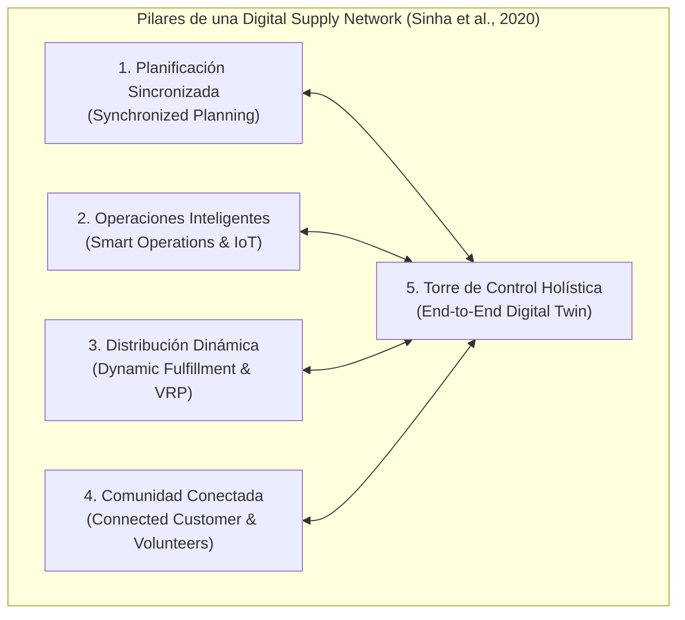
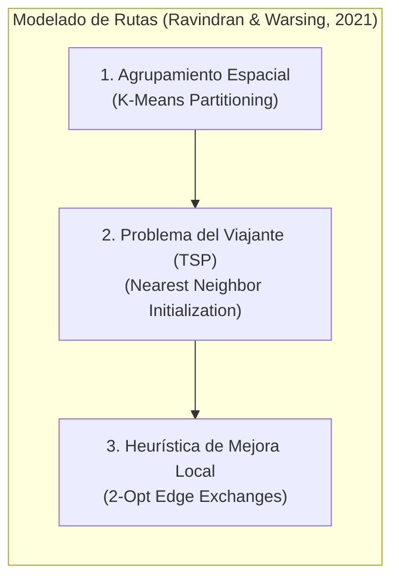
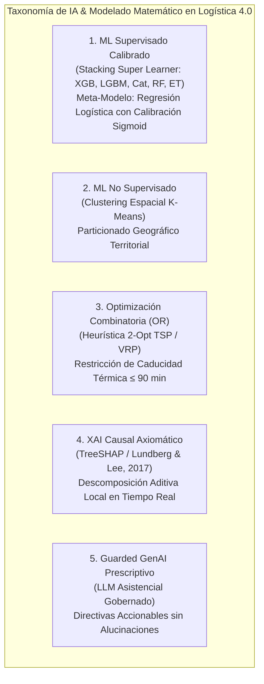
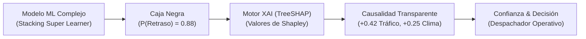
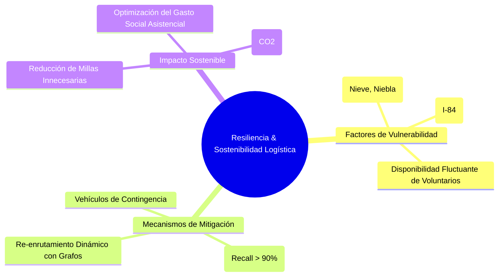
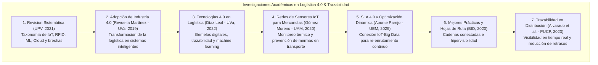

# TRABAJO DE FIN DE MÁSTER
## Máster en Big Data & Data Science - Universidad Complutense de Madrid (UCM)
### *Integración de IoT y Big Data en la Logística 4.0 para el apoyo a decisiones inteligentes en la cadena de suministro*

---

# CAPÍTULO 2. MARCO TEÓRICO Y ESTADO DEL ARTE

---

## 2.1. De la Cadena Tradicional a las Redes Digitales de Suministro (Digital Supply Networks - DSN)

Durante décadas, la gestión de la cadena de suministro (*Supply Chain Management - SCM*) se ha estructurado bajo un modelo lineal secuencial (*Plan $\rightarrow$ Source $\rightarrow$ Make $\rightarrow$ Deliver $\rightarrow$ Return*), caracterizado por silos funcionales, asimetría de información y latencias significativas en la propagación de eventos operativos (Sinha et al., 2020). 

Con el advenimiento de la **Industria y Logística 4.0**, la literatura contemporánea formaliza la transición hacia las **Redes Digitales de Suministro (*Digital Supply Networks - DSN*)** (Sinha et al., 2020; Dasgupta et al., 2023). En una DSN, la linealidad es reemplazada por una matriz dinámica e hiperconectada donde los nodos (proveedores, centros de producción, transportistas, torres de control y clientes finales) intercambian información telemática continua en tiempo real.

### 2.1.1. Los Cinco Pilares de la DSN Aplicados a la Logística Asistencial
De acuerdo con el marco conceptual de Sinha et al. (2020), una DSN se articula a través de capacidades clave:
1. **Planificación Sincronizada (*Synchronized Planning*):** Superación de los planes de ruteo estáticos matutinos mediante la reoptimización continua impulsada por la demanda en tiempo real.
2. **Operaciones Inteligentes y Gemelos Digitales (*Smart Operations*):** Representación virtual del estado cinemático, térmico y geoespacial de cada unidad de transporte mediante flujos de datos IoT.
3. **Distribución Dinámica (*Dynamic Fulfillment*):** Asignación adaptativa de pedidos y ajuste de rutas vehiculares en respuesta a eventos imprevistos de congestión o meteorología severa.
4. **Comunidad Conectada (*Connected Customer*):** Comunicación bidireccional transparente entre la cocina central, los conductores y los beneficiarios de Meals on Wheels.
5. **Torres de Control Holísticas (*Control Towers*):** Plataformas analíticas centralizadas que integran la ingesta de telemetría masiva, la inferencia de modelos predictivos y la ejecución de directivas prescriptivas.

---

## 2.2. Gestión Cuantitativa de Sistemas Logísticos y Acuerdos de Nivel de Servicio (SLAs)

La modelización analítica de la logística de última milla requiere una formalización rigurosa de las funciones de coste y fiabilidad del servicio (Longshore & Cheatham, 2022).

### 2.2.1. Métricas de Fiabilidad Logística: OTIF y Degradación Térmica
En la distribución de alimentos perecederos y calientes para personas dependientes, el indicador estándar **OTIF (*On-Time In-Full*)** adquiere una restricción termodinámica estricta:

$$\text{OTIF}_{\text{asistencial}} = \frac{1}{N} \sum_{i=1}^{N} \mathbb{I}\left( t_{\text{entrega}}^{(i)} \le \text{ETA}_{\text{programado}}^{(i)} \quad \land \quad \Delta t_{\text{despacho}}^{(i)} \le 90\text{ min} \quad \land \quad T_{\text{alimento}}^{(i)} \ge 60^\circ\text{C} \right)$$

Donde $\mathbb{I}(\cdot)$ es la función indicatriz. Como demuestran Longshore & Cheatham (2022), el tiempo de permanencia de la carga en tránsito dentro de contenedores pasivos isotérmicos sigue una ley de enfriamiento de Newton:
$$\frac{dT}{dt} = -k(T - T_{\text{amb}})$$
Donde $k$ es el coeficiente de conductividad térmica del embalaje y $T_{\text{amb}}$ es la temperatura exterior. En inviernos fríos como los de Idaho ($T_{\text{amb}} \le 0^\circ\text{C}$), el tiempo crítico para descender por debajo de los $60^\circ\text{C}$ se sitúa en los $90\text{ minutos}$, lo que convierte a la ventana temporal en un **límite biológico y de inocuidad alimentaria infranqueable**.

### 2.2.2. Descomposición del Coste Total Logístico
Siguiendo a Longshore & Cheatham (2022), el coste operacional de la última milla ($C_{\text{total}}$) se descompone en:
$$C_{\text{total}} = \sum_{r \in R} \left( c_v \cdot d_r + c_t \cdot t_r + c_f \right)$$
Donde $c_v$ es el coste variable por distancia ($\$0.58/\text{milla}$ según la tasa estándar del IRS), $d_r$ es la distancia recorrida en la ruta $r$, $c_t$ es el coste de tiempo/desgaste y $c_f$ son los costes fijos de despacho. Reducir la distancia total recorrida maximiza la sostenibilidad económica de la organización sin ánimo de lucro.

---

## 2.3. Modelos Matemáticos de Optimización de Rutas y Ruteo Vehicular (VRP/TSP)

La optimización de rutas en redes de transporte constituye un área clásica de la investigación operativa y la ingeniería de la cadena de suministro (Ravindran & Warsing, 2021).

### 2.3.1. Formulación del Problema del Viajante (TSP) y Ruteo Vehicular (VRP)
El Problema del Viajante de Comercio (*Traveling Salesperson Problem - TSP*) consiste en encontrar el ciclo hamiltoniano de coste mínimo que visita un conjunto de $n$ nodos exactamente una vez y regresa al depósito de origen $v_0$ (Ravindran & Warsing, 2021):

$$\min \sum_{i=0}^{n} \sum_{j=0, j \neq i}^{n} c_{ij} x_{ij}$$

Sujeto a las restricciones de conservación de flujo y eliminación de subtours (restricciones de Miller-Tucker-Zemlin):
$$\sum_{j=0, j \neq i}^{n} x_{ij} = 1 \quad \forall i, \qquad \sum_{i=0, i \neq j}^{n} x_{ij} = 1 \quad \forall j$$
$$u_i - u_j + n x_{ij} \le n - 1 \quad \forall 1 \le i \neq j \le n$$

Dado que el TSP y el VRP pertenecen a la clase de problemas **NP-Hard** (Ravindran & Warsing, 2021), la resolución exacta mediante programación entera mixta resulta intratable computacionalmente para su ejecución en tiempo real en flotas dinámicas. Por ello, la literatura respalda el empleo de **heurísticas de descomposición en dos fases (*Cluster-First, Route-Second*)**.

### 2.3.2. La Heurística de Intercambio de Aristas 2-Opt
La heurística 2-Opt (Croes, 1958; Ravindran & Warsing, 2021) parte de una ruta factible y evalúa sistemáticamente el intercambio de pares de aristas no consecutivas $(s_i, s_{i+1})$ y $(s_j, s_{j+1})$. La inversión del segmento intermedio produce una mejora en la distancia total si y solo si:
$$\Delta D = d(s_i, s_j) + d(s_{i+1}, s_{j+1}) - d(s_i, s_{i+1}) - d(s_j, s_{j+1}) < 0$$

Con una complejidad temporal por iteración de $O(n^2)$, la heurística 2-Opt converge a óptimos locales de alta calidad en fracciones de segundo ($<0.1\text{ s}$), lo que permite su integración en ciclos continuos de decisión telemática en tiempo real.

---

---

## 2.4. Taxonomía de Machine Learning, Formulación de Variables Objetivo y Calidad de Datos

La arquitectura de **Decision Intelligence** propuesta se apoya en un marco matemático y conceptual riguroso que articula cinco tipologías de Inteligencia Artificial, define formalmente el espacio de objetivos y establece las bases teóricas de la calidad del dato en flujos continuos:

### 2.4.1. Fundamentos de Machine Learning Supervisado y Ensambles Super Learner
En problemas logísticos donde las disrupciones son infrecuentes pero de impacto crítico (clases desbalanceadas), un clasificador individual puede sufrir de sesgo (*bias*) o varianza excesiva. La teoría del **Super Learner (Wolpert, 1992; van der Laan et al., 2007)** demuestra que la combinación convexa de estimadores heterogéneos mediante *Stacking* generalizado minimiza el riesgo asintótico frente a cualquier modelo individual.

El ensamble entrena estimadores de base $f_1(X), \dots, f_K(X)$ sobre pliegues de validación cruzada estratificada (*Out-Of-Fold Predictions*) y optimiza un meta-clasificador lineal $g(\cdot)$:
$$\hat{p} = \sigma\left( \beta_0 + \sum_{k=1}^K \beta_k f_k(X) \right) = \frac{1}{1 + e^{-(\beta_0 + \mathbf{\beta}^T \mathbf{f}(X))}}$$
Para transformar los márgenes brutos en probabilidades bayesianas confiables, se aplica la calibración sigmoidea de Platt (*Platt Scaling*), minimizando la puntuación de Brier (*Brier Score*):
$$\text{Brier Score} = \frac{1}{N} \sum_{i=1}^N (\hat{p}_i - y_i)^2$$

### 2.4.2. Formulación Matemática de las Variables Objetivo (Target Variables)
El sistema resuelve una optimización bi-criterio jerárquica:

1. **Variable Objetivo Primaria (Supervisada - Clasificación Probabilística):**
   $$Y = \text{delay\_status} \in \{0, 1\}$$
   $$P(Y = 1 \mid X) = \hat{p} \in [0, 1]$$
   Donde $Y = 1$ indica fallo o retraso operacional inminente según los umbrales de tensión telemática ($\eta_{\text{urgencia}} > 1.05 \lor \Delta t_{\text{esperado}} > 15\text{ min}$). La salida continua $\hat{p}$ parametriza las directivas prescriptivas por niveles de riesgo:
   - *Riesgo Crítico ($\hat{p} \ge 0.75$):* Acción correctiva inmediata y re-ruteo.
   - *Riesgo Moderado ($0.45 \le \hat{p} < 0.75$):* Alerta de supervisión y ajuste cinemático.
   - *Riesgo Normal ($\hat{p} < 0.45$):* Operación nominal.

2. **Variable Objetivo Secundaria (Prescriptiva - Optimización de Rutas VRP):**
   $$\min Z = \sum_{i=0}^n \sum_{j=0}^n c_{ij} x_{ij}$$
   Sujeto a la cota superior del tiempo total de tránsito para garantizar la inocuidad microbiológica:
   $$t_{\text{tránsito}} = \sum_{(i,j)} t_{ij} + \sum_j \tau_{\text{servicio}}^{(j)} \le 90.0\text{ minutos}$$

### 2.4.3. Teoría de Calidad de Datos en Flujos Continuos (Data Quality Framework)
De acuerdo con los estándares internacionales de calidad de la información (Wang & Strong, 1996; ISO/IEC 25012), la veracidad de los modelos analíticos depende de la calidad intrínseca de los datos telemáticos. Se formalizan cinco dimensiones críticas:
1. **Completitud (*Completeness*):** Ausencia de datos faltantes en variables de decisión ($100\%$ en variables ML).
2. **Unicidad (*Uniqueness*):** Ausencia de duplicados de envío o telemetría ($100\%$).
3. **Validez (*Validity*):** Pertenencia estricta de las variables a sus dominios físicos plausibles ($v \in [0, 160]\text{ km/h}$, $T \in [-15, 40]^\circ\text{C}$).
4. **Consistencia Lógica (*Consistency*):** Coherencia física y relacional entre variables derivadas ($\eta_{\text{urgencia}} \ge 0, \Delta t_{\text{esperado}} \ge 0$).
5. **Integridad Referencial (*Integrity*):** Correspondencia exacta de identificadores de vehículos, rutas y paradas.

---

## 2.5. Inteligencia Artificial Explicable (XAI) y Gobernanza en la Cadena de Suministro

Uno de los principales impedimentos para la adopción de modelos avanzados de Machine Learning en la gestión logística es el problema de la "caja negra" (*Black-Box Models*), donde predicciones complejas carecen de justificación causal intuitiva para el operador humano (Sharma & Vajjhala, 2023).

### 2.5.1. Fundamentación de los Valores de Shapley (SHAP)
Para garantizar la explicabilidad matemática formal, Sharma & Vajjhala (2023) recomiendan el empleo de la teoría de juegos cooperativos mediante los **valores de Shapley** (Lundberg & Lee, 2017). Para una instancia específica $x$, el valor de Shapley $\phi_i$ que cuantifica la contribución marginal de la característica $i$ se define como:

$$\phi_i(x) = \sum_{S \subseteq F \setminus \{i\}} \frac{|S|!(|F| - |S| - 1)!}{|F|!} \left[ f_x(S \cup \{i\}) - f_x(S) \right]$$

Propiedades axiomáticas fundamentales demostradas por Lundberg & Lee (2017) y analizadas por Sharma & Vajjhala (2023):
1. **Eficiencia (*Efficiency*):** La suma de los valores de Shapley de todas las características equivale a la diferencia entre la predicción del modelo y el valor esperado base: $\sum_{i=1}^{M} \phi_i(x) = f(x) - E[f(X)]$.
2. **Simetría (*Symmetry*):** Si dos variables contribuyen de manera idéntica en todas las coaliciones, sus valores de Shapley son iguales.
3. **Variable Nula (*Dummy Player*):** Si una variable no altera la predicción en ninguna coalición, $\phi_i = 0$.
4. **Aditividad (*Additivity*):** Para ensambles de árboles, $\phi_i(f + g) = \phi_i(f) + \phi_i(g)$.

En modelos basados en árboles de decisión (XGBoost, Random Forest), el algoritmo **TreeSHAP** optimiza el cálculo exacto de los valores de Shapley reduciendo la complejidad exponencial original $O(M \cdot 2^{|F|})$ a un tiempo polinómico $O(T L D^2)$, donde $T$ es el número de árboles, $L$ el número de hojas y $D$ la profundidad máxima, haciendo viable su computación en streaming (Lundberg et al., 2020).

### 2.5.2. El Paradigma Guarded GenAI para Mitigación de Alucinaciones
Aunque los modelos de lenguaje masivo (LLMs) ofrecen capacidades excepcionales para interactuar con operadores en lenguaje natural, su naturaleza probabilística y autorregresiva introduce riesgos de "alucinación" fáctica incompatibles con entornos logísticos críticos (Sharma & Vajjhala, 2023). 

El paradigma **Guarded GenAI** soluciona esta vulnerabilidad desacoplando la decisión de la síntesis:
1. **La Decisión es Determinista:** Las reglas de negocio y los umbrales de probabilidad definen inequívocamente el Nivel de Acción (Nivel 1 Crítico, Nivel 2 Moderado, Nivel 3 Normal).
2. **La Explicabilidad es Matemática:** Los factores causales provienen exclusivamente del vector topológico SHAP.
3. **El LLM actúa como Sintetizador Estricto:** El modelo de lenguaje recibe como *prompt* los factores SHAP y el código de acción reglamentario, traduciéndolos a prosa fluida y accionable sin libertad para inventar parámetros.

---

## 2.6. Diseño de Redes Resilientes y Sostenibles ante Disrupciones

La resiliencia de la cadena de suministro se define como la capacidad adaptativa de una red para anticipar, resistir, absorber y recuperarse de eventos disruptivos imprevistos minimizando la degradación del servicio (Dasgupta et al., 2023).

### 2.6.1. Taxonomía de Riesgos en la Última Milla de Idaho
Siguiendo la clasificación de riesgos de Dasgupta et al. (2023), la red de Treasure Valley está sujeta a:
- **Riesgos Exógenos Ambientales:** Tormentas de nieve invernales que reducen la velocidad operativa media en más de un $40\%$ y aumentan la tasa de fricción cinética vial.
- **Riesgos de Capacidad y Tráfico:** Picos de congestión en los corredores urbanos entre Boise, Meridian y Nampa.
- **Riesgos Operativos Internos:** Variabilidad en los tiempos de servicio por parada según el estado de salud y movilidad de los adultos mayores atendidos.

### 2.6.2. Sostenibilidad y Reducción de Emisiones
La optimización analítica de rutas no solo genera ahorros financieros directos, sino que contribuye activamente a los objetivos de sostenibilidad (Dasgupta et al., 2023; EPA, 2023). Por cada milla vehicular reducida en vehículos de combustión estándar utilizados por la flota asistencial, se evita la emisión promedio de **$404\text{ gramos de CO}_2$** a la atmósfera:
$$\text{Emisiones Evitadas} = \Delta \text{Millas} \times 0.404\text{ kg CO}_2/\text{milla}$$

---

## 2.7. Revisiones Sistemáticas, Trazabilidad y Casos de Estudio en el Ámbito Académico Español e Internacional

Para robustecer el estado del arte y fundamentar la solución en investigaciones recientes del ámbito universitario español e internacional, se incorporan los hallazgos de siete estudios clave:

### 2.7.1. Revisión Sistemática de Herramientas para Logística 4.0 (UPV, 2021)
La revisión sistemática de la Universitat Politècnica de València (UPV, 2021) clasifica las herramientas habilitadoras en cuatro clústeres: captación física (IoT, RFID), almacenamiento (Cloud), procesamiento (Big Data, Machine Learning) e interacción (BI, Digital Twins). Subraya que la brecha crítica actual radica en la **carencia de marcos que automaticen la toma de decisiones prescriptivas**, vacío abordado por este TFM.

### 2.7.2. Adopción de la Industria 4.0 en el Ámbito Logístico (Revuelta Martínez - UVa, 2019)
El trabajo de Revuelta Martínez (2019) en la Universidad de Valladolid analiza la transición de la logística convencional hacia la *Smart Logistics*. Identifica que la combinación de Big Data, IoT y Business Intelligence permite superar problemas clásicos de cuello de botella mediante la reoptimización continua de flujos, destacando el rol del gemelo digital como representación viva de la red.

### 2.7.3. Integración de Tecnologías 4.0 en Operaciones Logísticas (Díaz Leal - UVa, 2022)
La investigación de Díaz Leal (2022) en la Universidad de Valladolid evalúa la integración de IoT, Machine Learning, Gemelos Digitales y vehículos autónomos. Su análisis demuestra que el factor crítico de éxito reside en la interoperabilidad de los datos telemáticos con los motores analíticos para reducir los tiempos de ciclo y minimizar errores operativos.

### 2.7.4. Redes de Sensores IoT para Monitorización de Mercancías Sensibles (Gómez Moreno - UAM, 2020)
El estudio de Gómez Moreno (2020) en la Universidad Autónoma de Madrid desarrolla una red de sensores telemáticos basada en protocolos IoT ligeros para la monitorización activa de mercancías durante el transporte. Su investigación concluye que el control térmico en tiempo real y la detección de alertas tempranas evitan la merma y descomposición de productos perecederos por malas condiciones ambientales, fundamentando directamente el diseño del SLA térmico ($\le 90\text{ min}$, $T > 60^\circ\text{C}$) de este proyecto.

### 2.7.5. Sistemas Logísticos Avanzados 4.0 y Optimización Dinámica de Rutas (Aponte Parejo - UEM, 2025)
La tesis de Aponte Parejo (2025) en la Universidad Europea formula el concepto de *Sistema Logístico Avanzado 4.0 (SLA 4.0)*, donde la captura de datos IoT en streaming alimenta algoritmos de re-enrutamiento dinámico. Su modelo demuestra reducciones directas en tiempos ociosos de flota y valida la orquestación modular mediante contenedores para despliegues ágiles.

### 2.7.6. Trazabilidad y Mejores Prácticas Internacionales (BID, 2020; Alvarado et al., 2023)
Las monografías del BID (2020) y los estudios empíricos de Alvarado et al. (2023) demuestran que la visibilidad telemática en tiempo real reduce las incidencias de entrega tardía en más de un $35\%$ al cerrar la asimetría informativa entre el centro de distribución y el destinatario final.

### 2.7.7. El Benchmark Global de Última Milla: 2021 Amazon Last-Mile Challenge (Amazon Science & MIT CTL)
El estudio publicado por **Amazon Last Mile Science** y el **MIT Center for Transportation & Logistics (CTL)** (Merchán et al., 2022; *Transportation Science*, INFORMS) formalizó la liberación del conjunto de datos operacionales de última milla más extenso del mundo ($6.112$ rutas y $904.527$ paradas en 17 centros logísticos). Esta investigación demostró que los modelos clásicos de Investigación Operativa fallan al no incorporar el conocimiento tácito de los conductores humanos, estableciendo la necesidad de marcos híbridos de *Machine Learning* y optimización prescriptiva adaptativa.

---

## 2.8. Síntesis del Estado del Arte y Posicionamiento del TFM

La siguiente tabla sintetiza las contribuciones de las referencias clave y sitúa el posicionamiento diferencial del presente Trabajo de Fin de Máster:

| Dimensión Analítica | Referencias Científicas Clave | Enfoque Tradicional / Brecha Identificada | Propuesta del Presente TFM |
| :--- | :--- | :--- | :--- |
| **Dataset & Benchmark Operacional** | **Amazon Last Mile Science & MIT CTL (Merchán et al., 2022 - INFORMS)** | Datasets teóricos sintéticos desvinculados de la física real | Validación sobre datos operacionales de Amazon ($N=8.000$) integrados con IoT |
| **Arquitectura de Red DSN** | **Sinha et al. (2020); BID (2020); Revuelta Martínez (2019)** | Cadenas lineales secuenciales en silos | Red Digital de Suministro (DSN) con gemelo digital telemático en tiempo real |
| **Herramientas Logística 4.0** | **UPV (2021); Díaz Leal (2022); UANL (2022)** | Captura de datos IoT sin automatización de decisiones | Pipeline completo desde ingesta IoT hasta prescripción ejecutoria |
| **Trazabilidad & Control Térmico** | **Gómez Moreno (2020 - UAM); Alvarado et al. (2023)** | Monitoreo pasivo o post-entrega | Monitoreo continuo de temperatura ($T_{\text{carga}}$) y SLA térmico asistencial |
| **Gestión Cuantitativa & SLAs** | **Longshore & Cheatham (2022)** | SLAs comerciales estándar de tiempo | SLA térmico biológico ($\le 90\text{ min}$, $T > 60^\circ\text{C}$) con costes IRS |
| **Optimización Dinámica VRP** | **Ravindran & Warsing (2021); Aponte Parejo (2025)** | VRP estático previo al despacho | Heurística 2-Opt VRP combinada con re-enrutamiento dinámico en streaming |
| **Explicabilidad & Gobernanza** | **Sharma & Vajjhala (2023)** | Modelos predictivos de caja negra / Alucinaciones LLM | Explicabilidad local con TreeSHAP + Paradigma *Guarded GenAI* |
| **Resiliencia & Sostenibilidad** | **Dasgupta, Sošić & Vyas (2023)** | Resiliencia reactiva manual | Resiliencia prescriptiva proactiva con reducción de huella de $\text{CO}_2$ ($5.76\text{ ton/año}$) |

---
