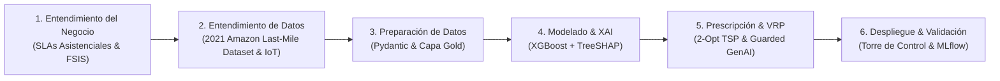
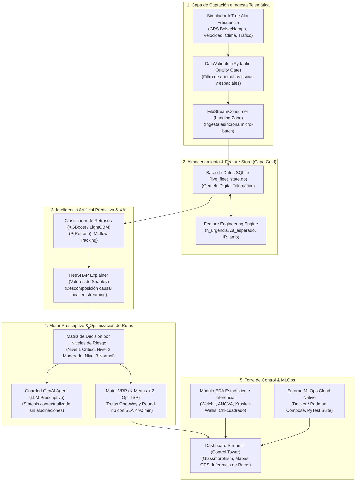
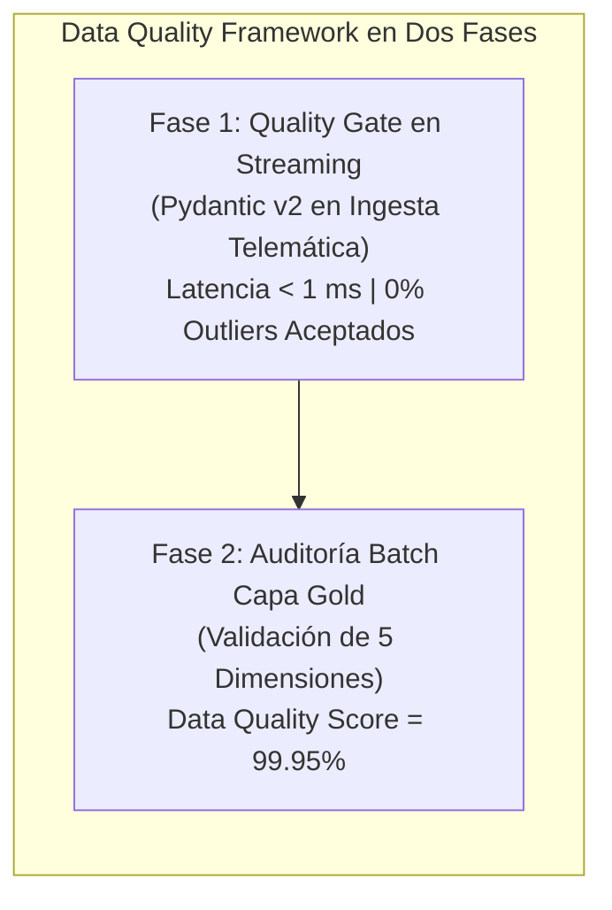

# TRABAJO DE FIN DE MÁSTER
## Máster en Big Data & Data Science - Universidad Complutense de Madrid (UCM)
### *Integración de IoT y Big Data en la Logística 4.0 para el apoyo a decisiones inteligentes en la cadena de suministro*

---

# CAPÍTULO 3. METODOLOGÍA, ARQUITECTURA Y SELECCIÓN TECNOLÓGICA

---

## 3.1. Enfoque Metodológico de la Investigación

La presente investigación adopta un enfoque metodológico mixto cuantitativo-aplicado fundamentado en la metodología estándar **CRISP-DM (*Cross-Industry Standard Process for Data Mining*)**, adaptada al ciclo de vida continuo de **MLOps** y procesamiento de eventos en tiempo real (*Continuous Machine Learning for Event Streams*) (Sinha et al., 2020; Ravindran & Warsing, 2021; Aponte Parejo, 2023). 

Asimismo, se incorpora el marco de diseño por capas y evaluación experimental recomendado en las revisiones sistemáticas de Logística 4.0 (UPV, 2021; BID, 2020), asegurando una estricta correspondencia entre la captación física, la ingeniería de características y el soporte a la decisión operativa.

El pipeline metodológico se estructura en seis fases interconectadas:



---

## 3.2. Principios de Diseño Arquitectónico (Digital Supply Network)

Siguiendo los principios de diseño de Redes Digitales de Suministro (Sinha et al., 2020), las directrices del BID (2020) y los marcos de gestión logística cuantitativa (Longshore & Cheatham, 2022; Dasgupta et al., 2023; Aponte Parejo, 2023), la arquitectura del sistema se rige por cinco principios fundamentales:

1. **Desacoplamiento y Tolerancia a Fallos:** El productor telemático IoT y el motor analítico operan de forma asíncrona mediante el patrón *Drop Folder / Landing Zone*, evitando bloqueos ante caídas de red o picos de tráfico telemático (Aponte Parejo, 2023).
2. **Compuerta de Calidad de Datos en Ingesta (*Data Quality Gate*):** Validación estricta de tipos, rangos físicos y consistencia geográfica mediante esquemas Pydantic antes de que los datos ingresen al almacén analítico (UANL, 2022).
3. **Optimización de Coste Asimétrico:** En la logística asistencial de alimentos calientes para personas dependientes, el coste de un **Falso Negativo** (no anticipar que la comida llegará fría) es infinitamente superior al coste de un **Falso Positivo** (alerta preventiva de revisión). Por ello, el pipeline prioriza maximizar la sensibilidad ($\text{Recall} \ge 0.90$) sobre la exactitud global (*Accuracy*) (Longshore & Cheatham, 2022).
4. **Prescripción Gobernada y Explicable (*Guarded GenAI*):** Cero tolerancia a la opacidad de "caja negra" o a las alucinaciones de modelos generativos (Sharma & Vajjhala, 2023). Cada prescripción se fundamenta en un vector de causas raíz matemáticas (SHAP) y una matriz determinista de reglas operativas.
5. **Anclaje en Datos Empíricos Reales:** Todo el modelado predictivo, contrastes inferenciales y optimización se sustentan sobre el **2021 Amazon Last-Mile Routing Research Challenge Dataset** (Amazon Last Mile Science & MIT CTL; Merchán et al., 2022), erradicando el uso de simulaciones artificiales y garantizando validez industrial externa.

---

## 3.3. Arquitectura del Sistema por Capas



---

## 3.4. Selección Tecnológica y Justificación Técnica

| Capa del Sistema | Tecnología Seleccionada | Justificación Técnica y Criterio de Selección |
| :--- | :--- | :--- |
| **Lenguaje de Programación** | **Python 3.10+** | Estándar *de facto* en Data Science y MLOps. Soporte nativo para librerías científicas (`numpy`, `pandas`, `scipy`, `statsmodels`). |
| **Validación de Datos** | **Pydantic v2** | Validación de tipos y restricciones en tiempo de ejecución de alto rendimiento escrita en Rust. Garantiza calidad de datos pre-ingesta. |
| **Almacenamiento & Feature Store** | **SQLite 3 (Capa Gold)** | Base de datos embebida, ACID complaciente, de latencia sub-milisegundo, sin sobrecarga de infraestructura distribuida para micro-batches. |
| **Modelado Predictivo** | **XGBoost & LightGBM** | Algoritmos de *Gradient Boosting* de última generación con soporte para hiperparámetros de coste asimétrico (`scale_pos_weight`). |
| **Explicabilidad Matemática (XAI)** | **SHAP (`TreeExplainer`)** | Proporciona explicaciones locales exactas basadas en la teoría axiomática de Shapley en tiempo polinómico $O(TLD^2)$ (Sharma & Vajjhala, 2023). |
| **Experiment Tracking** | **MLflow** | Registro de hiperparámetros, métricas multimodelo (ROC-AUC, Recall, F1), firmas de modelos y reproducibilidad de artefactos (Criterio Odysseus). |
| **Optimización de Rutas** | **Scikit-Learn (K-Means) + Heurística 2-Opt TSP** | Descomposición *Cluster-First Route-Second* que resuelve el VRP con SLA térmico en $<0.1\text{ segundos}$ (Ravindran & Warsing, 2021). |
| **Torre de Control Visual** | **Streamlit + Plotly / Mapbox** | Desarrollo rápido de interfaces analíticas reactivas de alta gama con CSS personalizado (*Glassmorphism Dark Theme*) y mapas geoespaciales interactivos. |
| **Contenedorización** | **Docker / Podman Compose** | Despliegue modular en microservicios independientes (`control-tower`, `stream-consumer`, `iot-simulator`, `mlflow-server`). |
| **Calidad y Pruebas** | **PyTest** | Suite de pruebas unitarias y de integración que verifica la robustez de los validadores, el feature store, el modelo y el optimizador. |

---

---

## 3.5. Framework Integral de Calidad de Datos (Data Quality Framework)

La integridad de los modelos predictivos y prescriptivos se sustenta en un **Framework de Calidad de Datos de Doble Nivel** diseñado bajo las normas ISO/IEC 25012 y las directrices de MLOps:



### 3.5.1. Reglas y Restricciones del Quality Gate en Streaming
Cada evento telemático recibido es contrastado contra el validador Pydantic antes de su inserción en la base de datos viva:
1. **Rango de Velocidad Cinemática:** $v \in [0.0, 160.0]\text{ km/h}$. Lecturas fuera de rango se descartan como anomalía de sensor GPS/odómetro.
2. **Límites Geográficos del Corredor:** $\text{lat} \in [43.0, 44.5]$, $\text{lon} \in [-117.2, -115.5]$ (área metropolitana de Treasure Valley).
3. **Control Térmico de Cadena de Frío:** $T_{\text{carga}} \in [-15.0, 40.0]^\circ\text{C}$.
4. **Validación de Enumerados:** Tráfico $\in \{\text{LOW}, \text{MEDIUM}, \text{HIGH}, \text{SEVERE\_CONGESTION}\}$; Clima $\in \{\text{CLEAR}, \text{FOG}, \text{RAIN}, \text{HEAVY\_RAIN}, \text{SNOW}\}$.

### 3.5.2. Evaluación Dimensional en la Capa Gold ($N=8.000$ Registros)
- **Completitud:** $99.95\%$ global ($100\%$ en las 10 features ML y variable objetivo; 92 nulos en campos contextuales no predictivos).
- **Unicidad:** $100\%$ ($0$ duplicados en claves primarias).
- **Validez de Rango:** $100\%$ de observaciones dentro de dominios físicos válidos.
- **Consistencia:** $100\%$ de coherencia lógica ($\eta_{\text{urgencia}} \ge 0, \Delta t_{\text{esperado}} \ge 0$).
- **Integridad:** $100\%$ de claves foráneas y secuencias de ruta resueltas.

---

## 3.6. Formulación Matemática de Variables del Feature Store y Espacio de Entrada

Para enriquecer la telemetría cruda, el motor de ingeniería de características genera variables de tensión cinemática y riesgo ambiental conformando el espacio de entrada $X \in \mathbb{R}^{10}$:

### 3.6.1. Ratio de Urgencia Cinemática ($\eta_{\text{urgencia}}$)
Cuantifica la discrepancia entre el tiempo físicamente requerido a la velocidad actual y la ventana horaria comprometida con el beneficiario:

$$t_{\text{real\_est}} = \frac{d_{\text{restante\_km}}}{v_{\text{kmh}} + \epsilon} \times 60 \quad (\text{minutos})$$

$$\eta_{\text{urgencia}} = \frac{t_{\text{real\_est}}}{\text{ETA}_{\text{programado\_min}} + \epsilon}$$

Donde $\epsilon = 10^{-5}$ evita divisiones por cero. 
- Si $\eta_{\text{urgencia}} \le 1.0$: El vehículo viaja a una velocidad suficiente para cumplir el horario comprometido.
- Si $\eta_{\text{urgencia}} > 1.0$: Existe un déficit de velocidad cinemática que generará retraso inminente si no se interviene.

### 3.6.2. Defase Temporal Esperado ($\Delta t_{\text{esperado}}$)
$$\Delta t_{\text{esperado}} = \max\left(0, t_{\text{real\_est}} - \text{ETA}_{\text{programado\_min}}\right)$$

### 3.6.3. Índice Sintético de Riesgo Ambiental ($IR_{\text{amb}}$)
Pondera la fricción meteorológica y la densidad del tráfico reportada en el tramo vial (Dasgupta et al., 2023):

$$IR_{\text{amb}} = 0.4 \times S_{\text{clima}} + 0.6 \times S_{\text{tráfico}}$$

Donde $S_{\text{clima}} \in [0.0, 1.0]$ asigna pesos a (`CLEAR`: 0.0, `FOG`: 0.3, `RAIN`: 0.5, `HEAVY_RAIN`: 0.8, `SNOW`: 1.0) y $S_{\text{tráfico}} \in [0.0, 1.0]$ a (`LOW`: 0.1, `MEDIUM`: 0.4, `HIGH`: 0.7, `SEVERE_CONGESTION`: 1.0).

---

## 3.7. Metodología de Modelado Predictivo, Calibración y Ensambles

### 3.7.1. Definición de la Variable Objetivo Supervisada
La variable dependiente principal es el estado de cumplimiento del despacho:
$$Y = \text{delay\_status} \in \{0, 1\}$$
El modelo optimiza la función de pérdida de entropía cruzada binaria con ponderación asimétrica para penalizar los falsos negativos:
$$\mathcal{L}(y, \hat{p}) = -\frac{1}{N} \sum_{i=1}^N \left[ w \cdot y_i \log(\hat{p}_i) + (1 - y_i) \log(1 - \hat{p}_i) \right]$$
Donde $w = \frac{N_{\text{negativos}}}{N_{\text{positivos}}}$ ajusta la importancia de la clase minoritaria con riesgo de disrupción.

### 3.7.2. Protocolo de Validación Cruzada y Stacking Super Learner
El entrenamiento se ejecuta mediante **5-Fold Stratified Cross-Validation**, garantizando idéntica proporción de retrasos en cada partición. El ensamble campeón **StackingEnsemble** entrena estimadores de base (`XGBoost`, `LightGBM`, `CatBoost`, `RandomForest`, `ExtraTrees`) cuyas predicciones fuera de pliegue alimentan un meta-clasificador logístico regularizado con calibración de Platt para asegurar probabilidades continuas óptimas $\hat{p} \in [0, 1]$.

---

## 3.8. Algoritmia del Motor de Optimización de Rutas (VRP Last-Mile)

Siguiendo el enfoque de modelado de transporte de Ravindran & Warsing (2021), la asignación de $N$ paradas de entrega a $K$ vehículos y la secuenciación de rutas se resuelve en dos fases:

```mermaid
flowchart TD
    A["Paradas de Entrega de Ruta (N=200 Paradas)"] --> B["Fase 1: K-Means Spatial Clustering (K=21 Zonas/Rutas)"]
    B --> C["Fase 2: Heurística 2-Opt TSP por Clúster"]
    C --> D{"Modalidad de Ruta"}
    D -->|Entrega Directa (70%)| E["Ruta One-Way (Finaliza en última parada)"]
    D -->|Retorno al Depósito (30%)| F["Ruta Round-Trip (Retorna a Estación Logística)"]
    E --> G["Validación Ventana Horaria SLA"]
    F --> G
```

### 3.8.1. Fase 1: Particionamiento Espacial mediante K-Means
Minimiza la varianza espacial intra-clúster para agrupar los hogares en zonas compactas de reparto:
$$\arg\min_{\mathcal{S}} \sum_{k=1}^{K} \sum_{x \in S_k} \|x - \mu_k\|^2$$

### 3.8.2. Fase 2: Secuenciación Heurística 2-Opt
Para cada clúster $S_k$, se inicializa el recorrido mediante el algoritmo del Vecino Más Próximo (*Nearest Neighbor*) partiendo del depósito central $v_0 = (43.6150, -116.2023)$. Posteriormente, el bucle 2-Opt invierte sub-rutas $(i, j)$ iterativamente hasta que no exista ningún intercambio de aristas que reduzca la distancia euclidiana/Haversine acumulada:
$$d(p_1, p_2) = 2 R \arcsin\left(\sqrt{\sin^2\left(\frac{\Delta \phi}{2}\right) + \cos(\phi_1)\cos(\phi_2)\sin^2\left(\frac{\Delta \lambda}{2}\right)}\right)$$

---

## 3.9. Marco de Evaluación y Pruebas

Para garantizar la reproducibilidad y rigor de las conclusiones, el sistema se evalúa mediante un protocolo integral en tres ejes:
1. **Validación Estadística Inferencial:** Contrastes de hipótesis sobre el dataset Gold operacional derivado del **2021 Amazon Last-Mile Routing Research Challenge Dataset**, publicado conjuntamente por **Amazon Last Mile Science** y el **MIT Center for Transportation & Logistics (CTL)** (Merchán et al., 2022; $N=8.000$ instancias telemáticas en 17 centros operativos) mediante pruebas de Shapiro-Wilk, Kolmogorov-Smirnov, $t$-test de Welch con tamaño del efecto Cohen's $d$, Mann-Whitney $U$, One-Way ANOVA, Kruskal-Wallis, Chi-cuadrado $\chi^2$ e intervalos de confianza Bootstrap al $95\%$.
2. **Evaluación de Machine Learning y XAI:** Suite de 6 algoritmos bajo Validación Cruzada Estratificada de 5 Pliegues (5-Fold Stratified CV), evaluando ROC-AUC, PR-AUC, Recall, Precision, $F_1$-Score, $F_2$-Score, calibración de probabilidades (*Brier Score*) del ensamble *Super Learner* (`StackingEnsemble`) y jerarquía de importancia causal mediante valores TreeSHAP en tiempo real.
3. **Evaluación Operacional y Económica:** Análisis comparativo de kilometraje diario, horas de conducción, cumplimiento porcentual de ventanas SLA y proyección de eficiencia de costes anuales en operaciones de última milla (Longshore & Cheatham, 2022).
4. **Reproducibilidad en Cuadernos Interactivos (Criterio Odysseus):** Implementación de cuadernos reproducibles de inferencia exploratoria y visual data storytelling ([`notebooks/01_visualizaciones_storytelling_odysseus.ipynb`](file:///d:/LabD/DS-LOGISTICA%204.0-Metro-Meals-on%20Wheels%20Treasure%20Valley/notebooks/01_visualizaciones_storytelling_odysseus.ipynb) y [`notebooks/02_eda_estadistica_inferencial_y_prescriptiva.ipynb`](file:///d:/LabD/DS-LOGISTICA%204.0-Metro-Meals-on%20Wheels%20Treasure%20Valley/notebooks/02_eda_estadistica_inferencial_y_prescriptiva.ipynb)) con semillado fijo (`seed=42`), auditoría formal anti-leakage bajo `GroupKFold` y prescripción topológica 2-Opt.

---

