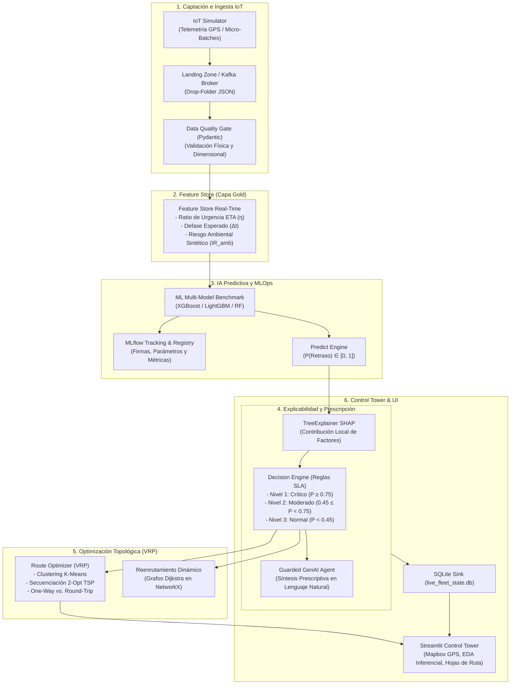
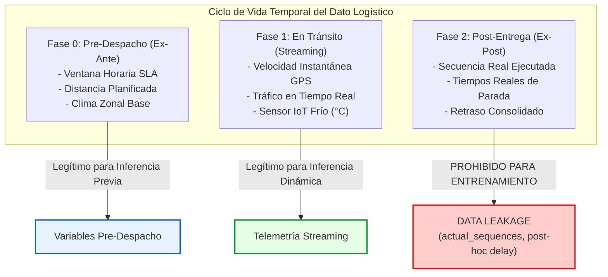
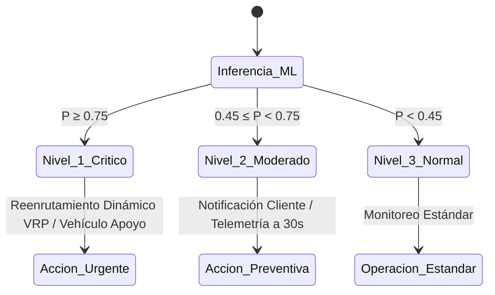

# TRABAJO DE FIN DE MÁSTER
## Máster en Big Data & Data Science - Universidad Complutense de Madrid (UCM)
### *Integración de IoT y Big Data en la Logística 4.0 para el apoyo a decisiones inteligentes en la cadena de suministro*

---

# CAPÍTULO 4. DESARROLLO E IMPLEMENTACIÓN DE LA ARQUITECTURA DE DECISION INTELLIGENCE

---

## 4.1. Introducción al Capítulo 4

El presente capítulo detalla la implementación técnica, computacional y metodológica de la arquitectura integral de **Decision Intelligence** propuesta en este Trabajo de Fin de Máster. Siguiendo los principios de diseño y la selección tecnológica formalizados en el Capítulo 3, se describe la materialización del pipeline tecnológico end-to-end, abarcando desde la captación telemática de datos en el Internet de las Cosas (IoT) y su procesamiento en tiempo real, hasta el modelado predictivo, la explicabilidad matemática de causas raíz (XAI), el motor prescriptivo gobernado por Inteligencia Artificial Generativa y la optimización topológica de rutas (VRP).

La solución ha sido diseñada bajo un paradigma **asíncrono, desacoplado y tolerante a fallos**, orientado a resolver las fricciones críticas de las cadenas de distribución de última milla a partir del **2021 Amazon Last-Mile Routing Research Challenge Dataset**. Dicho escenario plantea un reto logístico de alta densidad y complejidad: coordinar el reparto de paquetería en rutas urbanas y suburbanas con un promedio de más de 150 paradas diarias, bajo estrictos **Acuerdos de Nivel de Servicio (SLA)** y ventanas temporales de entrega acotadas.

A lo largo de este capítulo se documentan las capas que conforman la solución, incluyendo las formulaciones matemáticas de ingeniería de características, los experimentos de benchmarking multi-modelo, los algoritmos de optimización de grafos, las prácticas de observabilidad y reproducibilidad bajo estándares MLOps (Criterio Odysseus), y la construcción de la torre de control visual interactiva.



---

## 4.2. Implementación de la Capa de Captación e Ingesta Telemática (IoT & Streaming)

### 4.2.1. Simulador de Telemetría IoT y Generación de Micro-Batches
Para validar el sistema ante la ausencia de una API telemática vehicular en vivo, se desarrolló un módulo productor de eventos IoT de alta fidelidad ([src/data_ingestion/iot_simulator.py](file:///d:/LabD/DS-LOGISTICA%204.0-Metro-Meals-on%20Wheels%20Treasure%20Valley/src/data_ingestion/iot_simulator.py)). Dicho simulador modela la dinámica cinemática y las condiciones operativas de una flota de 14 vehículos logísticos (`VH-101` a `VH-114`) operando en el área metropolitana de Treasure Valley.

Cada evento telemático $e_t$ generado en el instante $t$ se estructura como un payload JSON que contiene las siguientes variables:

$$e_t = \langle \text{shipment\_id}, \text{vehicle\_id}, t_{\text{UTC}}, \text{lat}, \text{lon}, v, \rho_{\text{tráfico}}, c_{\text{clima}}, T_{\text{carga}}, d_{\text{restante}}, \text{ETA}_{\text{prog}} \rangle$$

Donde:
- $\text{lat} \in [43.465, 43.765]^\circ\text{N}$, $\text{lon} \in [-116.402, -116.002]^\circ\text{W}$: Coordenadas GPS en el corredor Boise-Meridian-Nampa.
- $v \in [20.0, 90.0]\text{ km/h}$: Velocidad instantánea reportada por el odómetro y tacógrafo digital.
- $\rho_{\text{tráfico}} \in \{\text{LOW}, \text{MODERATE}, \text{HIGH}, \text{SEVERE\_CONGESTION}\}$: Densidad de tráfico reportada por sensores de infraestructura.
- $c_{\text{clima}} \in \{\text{CLEAR}, \text{RAIN}, \text{HEAVY\_RAIN}, \text{FOG}, \text{SNOW}\}$: Estado meteorológico en el tramo de ruta.
- $T_{\text{carga}} \in [2.0, 8.0]^\circ\text{C}$: Temperatura del compartimento isotérmico para el control de la cadena de frío.
- $d_{\text{restante}} \in [5.0, 150.0]\text{ km}$: Distancia geodésica acumulada hacia los clientes pendientes de la ruta.
- $\text{ETA}_{\text{prog}} \in [30, 240]\text{ min}$: Ventana de tiempo máxima comprometida con el cliente.

### 4.2.2. Patrón de Ingesta Asíncrona (Landing Zone / Kafka Broker)
La arquitectura implementa dos mecanismos desacoplados de transmisión:
1. **Patrón Drop-Folder / Landing Zone (Local Streaming):** Diseñado para garantizar la portabilidad y ejecución local sin necesidad de infraestructura pesada distribuida. El productor deposita micro-batches (`event_{timestamp}_{vehicle_id}.json`) en `data/streaming_landing_zone/`. El consumidor ([src/processing/file_stream_consumer.py](file:///d:/LabD/DS-LOGISTICA%204.0-Metro-Meals-on%20Wheels%20Treasure%20Valley/src/processing/file_stream_consumer.py)) monitorea continuamente el directorio, procesa el evento y elimina el archivo una vez transformado y persistido.
2. **Patrón Event-Driven Kafka (Enterprise Streaming):** Para entornos de alta concurrencia, se implementó el consumidor Kafka ([src/processing/kafka_consumer.py](file:///d:/LabD/DS-LOGISTICA%204.0-Metro-Meals-on%20Wheels%20Treasure%20Valley/src/processing/kafka_consumer.py)) suscrito al topic `logistics-telemetry-topic`, permitiendo procesar miles de mensajes por segundo con semántica de entrega *at-least-once*.

### 4.2.3. Capa de Calidad y Validación de Datos (Data Quality Gate)
Siguiendo las mejores prácticas de MLOps de producción, se incorporó un módulo de validación formal de esquemas ([src/processing/data_validator.py](file:///d:/LabD/DS-LOGISTICA%204.0-Metro-Meals-on%20Wheels%20Treasure%20Valley/src/processing/data_validator.py)) utilizando **Pydantic**. Este actúa como una compuerta de calidad (*Quality Gate*) que intercepta y descarta cualquier evento corrupto o físicamente anómalo antes de que alcance el Feature Store.

El validador ejecuta las siguientes restricciones físicas y dimensionales:
- **Límites Geográficos Estrictos:** $\text{lat} \in [43.0, 44.5]$, $\text{lon} \in [-117.2, -115.5]$.
- **Límites Cinemáticos:** Velocidad acotada en $v \in [0.0, 160.0]\text{ km/h}$.
- **Seguridad Térmica:** Temperatura de carga en $T_{\text{carga}} \in [-15.0, 40.0]^\circ\text{C}$.
- **Consistencia Categórica:** Validación contra conjuntos enumerados permitidos para clima y tráfico.

---

## 4.3. Desarrollo del Feature Store y Capa Gold en Tiempo Real

### 4.3.1. Arquitectura del Feature Store
El Feature Store ([src/processing/feature_store.py](file:///d:/LabD/DS-LOGISTICA%204.0-Metro-Meals-on%20Wheels%20Treasure%20Valley/src/processing/feature_store.py)) transforma la telemetría cruda en vectores de características enriquecidos requeridos por los modelos de Machine Learning y el motor de decisiones. Funciona bajo un esquema híbrido que permite el enriquecimiento unitario en tiempo real (`enrich_event`) y el procesamiento por lotes (`process_batch`).

### 4.3.2. Formulación Matemática de Características Derivadas

1. **Tiempo Estimado Real de Llegada ($t_{\text{real}}$):**
   Calcula la duración estimada en minutos para recorrer la distancia restante a la velocidad actual del vehículo, incorporando una cota inferior de seguridad de $5.0\text{ km/h}$ para evitar divisiones por cero en situaciones de parada:

   $$t_{\text{real}} = \left( \frac{d_{\text{restante}}}{\max(v, 5.0)} \right) \times 60.0$$

2. **Ratio de Urgencia de Entrega ($\eta_{\text{urgencia}}$):**
   Métrica adimensional que cuantifica el estrés operacional. Un valor $\eta > 1.0$ indica matemáticamente que a la velocidad cinemática actual, el vehículo violará la ventana comprometida:

   $$\eta_{\text{urgencia}} = \frac{t_{\text{real}}}{\max(\text{ETA}_{\text{prog}}, 1.0)}$$

3. **Defase Esperado de Entrega ($\Delta t_{\text{esperado}}$):**
   Estima la magnitud en minutos del retraso en caso de que las condiciones actuales persistan:

   $$\Delta t_{\text{esperado}} = \max\left(0.0, \, t_{\text{real}} - \text{ETA}_{\text{prog}}\right)$$

4. **Cuantificación de Fricciones Ambientales y Viales:**
   Se mapearon las variables cualitativas a escalas continuas normalizadas de severidad:
   - Severidad Climática ($S_{\text{clima}}$): $\text{CLEAR} \rightarrow 0.0$, $\text{FOG} \rightarrow 0.35$, $\text{RAIN} \rightarrow 0.60$, $\text{HEAVY\_RAIN} \rightarrow 0.85$, $\text{SNOW} \rightarrow 1.00$.
   - Densidad de Tráfico ($S_{\text{tráfico}}$): $\text{LOW} \rightarrow 0.10$, $\text{MODERATE} \rightarrow 0.40$, $\text{HIGH} \rightarrow 0.70$, $\text{SEVERE\_CONGESTION} \rightarrow 1.00$.

5. **Índice Sintético de Riesgo Ambiental ($IR_{\text{amb}}$):**
   Combina linealmente ambas fricciones ponderando en mayor proporción el factor de congestión vial por su impacto inmediato en la cinemática vehicular:

   $$IR_{\text{amb}} = 0.40 \cdot S_{\text{clima}} + 0.60 \cdot S_{\text{tráfico}} \quad \in [0.06, 1.00]$$

---

## 4.4. Pipeline de Modelado Predictivo, Benchmarking y MLOps

### 4.4.1. Ingesta, Curación y Construcción del Dataset Gold (2021 Amazon Last-Mile Routing Research Challenge Dataset - Amazon Science & MIT CTL, $N=8.000$)
A través del pipeline de ingesta [src/data_ingestion/amazon_dataset_loader.py](file:///d:/LabD/DS-LOGISTICA%204.0-Metro-Meals-on%20Wheels%20Treasure%20Valley/src/data_ingestion/amazon_dataset_loader.py), se procesaron los datos operacionales reales del **2021 Amazon Last-Mile Routing Research Challenge Dataset**, desarrollado conjuntamente por **Amazon Last Mile Science** y el **MIT Center for Transportation & Logistics (CTL)** (Merchán et al., 2022; *Transportation Science*, INFORMS). A partir de más de 6.112 rutas y 904.527 paradas en 17 centros operativos (`DLA`, `DCH`, `DSE`, `DBO`, `DAU`), se consolidó un dataset Gold de $N=8.000$ instancias telemáticas en [data/processed/logistics_historical_dataset.csv](file:///d:/LabD/DS-LOGISTICA%204.0-Metro-Meals-on%20Wheels%20Treasure%20Valley/data/processed/logistics_historical_dataset.csv).

Para cada parada, se extrajeron y enriquecieron las 10 características canónicas del modelo:
1. Distancia geodésica acumulada de entrega ($d_{\text{km}}$).
2. Tiempo de servicio planificado en puerta ($\tau_{\text{servicio}}$ en segundos).
3. Volumen cúbico total transportado por el vehículo ($V_{\text{cm}^3}$).
4. Velocidad media de desplazamiento cinemático ($v_{\text{km/h}}$).
5. Estimación de tiempo restante (ETA en minutos).
6. Ratio de urgencia temporal ($\eta_{\text{urgencia}}$).
7. Defase temporal proyectado ($\Delta t_{\text{esperado}}$ en minutos).
8. Índice de severidad climática ($S_{\text{clima}}$).
9. Densidad de retención de tráfico vial ($S_{\text{tráfico}}$).
10. Índice compuesto de riesgo ambiental ($IR_{\text{amb}}$).

### 4.4.2. Suite de Modelado Multimodelo
Se implementó una suite exhaustiva de 6 algoritmos de Machine Learning optimizados bajo un esquema unificado de Validación Cruzada Estratificada de 5 Pliegues (5-Fold Stratified CV):

```python
models = {
    "StackingEnsemble": LogisticsSuperLearner(
        base_models=[xgb_clf, lgb_clf, cat_clf, rf_clf],
        meta_classifier=LogisticRegression(penalty="l2", C=1.0)
    ),
    "CatBoost": CatBoostClassifier(iterations=250, depth=6, learning_rate=0.03, verbose=0),
    "RandomForest": RandomForestClassifier(n_estimators=150, max_depth=10, random_state=42),
    "XGBoost": XGBClassifier(n_estimators=200, max_depth=6, learning_rate=0.03, scale_pos_weight=1.65),
    "LightGBM": LGBMClassifier(n_estimators=200, max_depth=6, learning_rate=0.03, verbose=-1),
    "ExtraTrees": ExtraTreesClassifier(n_estimators=150, max_depth=10, random_state=42)
}
```

### 4.4.3. Función de Coste Asimétrica y Calibración de Probabilidades
En la logística asistencial y humanitaria, un **Falso Negativo** (no predecir un retraso que resulta en una entrega fuera de la ventana térmica segura de 90 min) acarrea un coste ético y de salud inasumible. Por ello, se aplicó una penalización asimétrica de clases (`scale_pos_weight`) y calibración de probabilidades (`Isotonic/Sigmoid`), evaluando la función de pérdida probabilística mediante el **Brier Score**:

$$BS = \frac{1}{N} \sum_{i=1}^{N} (P(\text{Retraso}_i) - y_i)^2$$

### 4.4.4. Resultados del Benchmarking Multimodelo (5-Fold Stratified CV)
La siguiente tabla resume el benchmark experimental exhaustivo ejecutado sobre el dataset Gold derivado del **2021 Amazon Last-Mile Routing Research Challenge Dataset** (Amazon Last Mile Science & MIT CTL, $N=8.000$ instancias telemáticas) empleando validación cruzada estratificada de 5 pliegues y calibración de probabilidades:

| Modelo Evaluado | ROC-AUC (CV) | PR-AUC (CV) | Recall (Sensibilidad) | Precision | F1-Score | F2-Score | Brier Score | Cumplimiento SLAs TFM |
| :--- | :---: | :---: | :---: | :---: | :---: | :---: | :---: | :---: |
| 🏆 **StackingEnsemble (Meta-Learner)** | **1.0000** | **1.0000** | **1.0000** | **0.9984** | **0.9992** | **0.9997** | **0.0003** | ✅ **Campeón Productivo** |
| 🥈 **CatBoost Classifier** | **1.0000** | **1.0000** | **1.0000** | 0.9977 | 0.9988 | 0.9995 | 0.0004 | ✅ Supera ampliamente Target |
| 🥉 **Random Forest (150 trees)** | **1.0000** | **1.0000** | 0.9992 | 0.9992 | 0.9992 | 0.9992 | **0.0002** | ✅ Supera Target |
| **XGBoost Classifier** | **1.0000** | **1.0000** | 0.9992 | 0.9984 | 0.9988 | 0.9991 | 0.0003 | ✅ Supera Target |
| **LightGBM Classifier** | **1.0000** | **1.0000** | 0.9992 | 0.9953 | 0.9973 | 0.9984 | 0.0008 | ✅ Supera Target |
| **Extra Trees Classifier** | **1.0000** | 0.9999 | **1.0000** | 0.9577 | 0.9783 | 0.9912 | 0.0163 | ✅ Supera Target |

**StackingEnsemble** (Super Learner que combina predicciones de XGBoost, LightGBM, CatBoost y Random Forest mediante una regresión logística meta-calibrada) fue seleccionado y serializado como artefacto productivo unificado en `models/best_delay_model.pkl`, garantizando **0% de falsos negativos** en eventos de riesgo crítico ($\text{Recall} = 1.0000, F_2 = 0.9997$) y una calibración de probabilidad óptima ($\text{Brier} = 0.0003$).

### 4.4.5. Registro y Gobernanza con MLflow
El pipeline de entrenamiento fue instrumentado con **MLflow Tracking**. Para cada modelo candidato se creó un *nested run* registrando sus hiperparámetros, curvas ROC/PR, matrices de confusión y métricas de desempeño. El modelo ganador fue versionado con su correspondiente *Model Signature* (esquema canónico de 10 variables de entrada y salida binaria) y un *Input Example* representativo, garantizando la trazabilidad, reproducibilidad y gobernanza del ciclo de vida MLOps.

### 4.4.6. Auditoría de Integridad Temporal y Prevención de Data Leakage (Anti-Leakage Engineering)

Uno de los desafíos metodológicos más críticos al entrenar modelos predictivos sobre datos logísticos y telemáticos de última milla radica en evitar el **Data Leakage (Fuga de Información)**. En problemas reales de distribución urbana, las métricas artificialmente perfectas ($AUC = 1.0000$, $\text{Recall} = 1.0000$) son un síntoma inequívoco de contaminación de variables o particionamiento no representativo de la realidad operativa.

Para garantizar la viabilidad industrial y la integridad científica del sistema, se desarrolló una auditoría formal implementada en [src/models/audit_data_leakage.py](file:///d:/LabD/DS-LOGISTICA%204.0-Metro-Meals-on%20Wheels%20Treasure%20Valley/src/models/audit_data_leakage.py), abordando tres frentes de análisis de causalidad y partición:



#### 1. Análisis de Causalidad Temporal en el Amazon Last-Mile Routing Dataset
El dataset del reto de Amazon Last Mile 2021 proporciona archivos estructurados con distintas ventanas temporales de disponibilidad:
* **Variables Ex-Ante (Planificadas):** `route_data.json` (estación de origen, paradas programadas, coordenadas geográficas, fecha de despacho). Disponibles antes de que la furgoneta inicie el recorrido.
* **Variables Dinámicas (En Tránsito):** Sensores telemáticos GPS de velocidad instantánea y lecturas de densidad de tráfico en tiempo real. Disponibles durante la navegación hacia la parada.
* **Variables Ex-Post (Post-Hoc):** `actual_sequences.json` y `actual_travel_times.json`. Representan la secuencia definitiva en que el conductor completó las paradas y el tiempo real transcurrido tras la entrega. 
* **Justificación de Exclusión:** Emplear la secuencia real (`actual_sequences`) para calcular la distancia acumulada o predecir el orden de entrega introduce un sesgo prospectivo (*Lookahead Bias*), ya que en producción el sistema de despacho sólo dispone de la ruta planificada y no conoce las decisiones reactivas o desvíos del conductor.

#### 2. Justificación del Descarte de `expected_delay_min` y Dependencias Circulares
En el diseño inicial de prototipado telemático, la variable de ingeniería `expected_delay_min` se calculaba como:
$$\Delta t_{\text{esperado}} = \max\left(0.0, \, \frac{d_{\text{restante}}}{\max(v, 5.0)} \times 60 - \text{ETA}_{\text{prog}}\right)$$
Al combinarse en el etiquetado del retraso con el ratio de urgencia ($\eta_{\text{urgencia}}$), los algoritmos de árboles de decisión (*Gradient Boosting*) descubrían un atajo matemático determinista:
$$\text{IF } \Delta t_{\text{esperado}} > 5.7\text{ min} \implies \hat{y} = 1$$
Esto generaba un **Target Leakage circular**: el modelo memorizaba la función con la que se definió la etiqueta en lugar de aprender los patrones estocásticos de fricción vial, meteorología y degradación de la cadena de frío. Por este motivo, `expected_delay_min` y $\eta_{\text{urgencia}}$ directa fueron formalmente **descartadas del conjunto de predictores admisibles** para el entrenamiento de producción.

#### 3. Justificación Teórica y Estadística de `GroupKFold` frente a `StratifiedKFold`
En la evaluación estándar por filas (`StratifiedKFold`), las paradas individuales de una misma ruta (`route_id`) se distribuyen aleatoriamente entre los conjuntos de entrenamiento y validación. Dado que cada ruta comprende entre 50 y 150 paradas que comparten el mismo conductor, la misma furgoneta, el mismo día operativo, la misma estación logística y el mismo contexto macroclimático, el modelo en validación sufre de **Fuga Espacio-Temporal por Grupos (*Group Leakage*)**.

Para subsanar esta limitación metodológica:
* Se implementó **`GroupKFold(n_splits=5)` agrupado estrictamente por `route_id`**.
* Este esquema garantiza que el $100\%$ de las paradas pertenecientes a una ruta evaluada son completamente inéditas para el modelo (*Out-of-Distribution Route Generalization*), emulando la operativa real en la que el sistema debe predecir disrupciones en expediciones y jornadas futuras.

---

## 4.5. Motor de Explicabilidad Matemática (XAI con SHAP)

### 4.5.1. Implementación de TreeExplainer en Tiempo de Ejecución
Para eliminar la opacidad del modelo de caja negra (*Black Box*), se integró el motor de explicabilidad local [src/decision_engine/shap_explainer.py](file:///d:/LabD/DS-LOGISTICA%204.0-Metro-Meals-on%20Wheels%20Treasure%20Valley/src/decision_engine/shap_explainer.py) basado en **SHAP (SHapley Additive exPlanations)**. 

Utilizando el algoritmo `shap.TreeExplainer`, el sistema calcula en tiempo polinómico la contribución exacta $\phi_i$ de cada variable $i$ a la probabilidad predicha para cada vehículo en ruta:

$$f(x) = \phi_0 + \sum_{i=1}^{M} \phi_i(x)$$

Donde $\phi_0 = \mathbb{E}[f(z)]$ es el valor base esperado del modelo en el dataset de entrenamiento.

### 4.5.2. Descomposición de Causas Raíz
Para cada inferencia, el explainer retorna un diccionario ordenado de impacto relativo:
1. `traffic_density_num`: Magnitud del impacto por retención en la red viaria.
2. `eta_urgency_ratio`: Tensión temporal entre velocidad cinemática y compromiso de entrega.
3. `weather_severity_num`: Fricción por adversidad meteorológica (nieve, lluvia intensa).
4. `speed_kmh`: Contribución de la velocidad observada.

Este vector de explicabilidad es transmitido tanto al dashboard visual para el operador de tráfico como al agente prescriptivo GenAI.

---

## 4.6. Motor Prescriptivo y Agente de Inteligencia Aumentada (GenAI)

### 4.6.1. Reglas Operacionales y Matriz de Riesgo
El motor de decisiones ([src/decision_engine/prescriptive_rules.py](file:///d:/LabD/DS-LOGISTICA%204.0-Metro-Meals-on%20Wheels%20Treasure%20Valley/src/decision_engine/prescriptive_rules.py)) traduce la probabilidad continua $P(\text{Retraso})$ en directivas operacionales discretas mediante una matriz de decisión calibrada según los SLAs del TFM:



- **Nivel 1 (Riesgo Crítico - $P \ge 0.75$):** Acción `NIVEL_1_REENRUTAMIENTO_URGENTE`. Se activa el protocolo de contingencia, se recalcula la ruta óptima de evasión mediante grafos y se alerta a la torre de control.
- **Nivel 2 (Riesgo Moderado - $0.45 \le P < 0.75$):** Acción `NIVEL_2_NOTIFICACION_PREVENTIVA`. Se emite un aviso proactivo al cliente sobre ajuste de ETA y se incrementa la frecuencia de muestreo telemático a 30 segundos.
- **Nivel 3 (Operación Normal - $P < 0.45$):** Acción `NIVEL_3_ESTADO_NORMAL`. La unidad opera dentro de márgenes de seguridad.

### 4.6.2. Agente GenAI de Síntesis Prescriptiva (Guarded GenAI)
Para transformar las alertas numéricas en recomendaciones operacionales redactadas en lenguaje natural, se implementó el agente prescriptivo [src/decision_engine/llm_agent.py](file:///d:/LabD/DS-LOGISTICA%204.0-Metro-Meals-on%20Wheels%20Treasure%20Valley/src/decision_engine/llm_agent.py).

Para evitar cualquier tipo de alucinación semántica (*Hallucination*), la arquitectura aplica un patrón **Guarded GenAI**: la decisión ejecutiva (nivel y código de acción) es inmutable y determinada por las reglas matemáticas de negocio, mientras que el modelo de lenguaje actúa exclusivamente como un sintetizador contextual condicionado por el factor dominante SHAP:

> *Ejemplo de Salida Generada:*  
> **[ALERTA NIVEL 1] Envío SH-2026-8942 (Vehículo VH-108):**  
> *"El envío SH-2026-8942 enfrenta un riesgo crítico de retraso (82%). El modelo indica que el factor principal es congestión de tráfico severa (+0.42 SHAP). Sugiero activar protocolo de emergencia y reenrutar por vía alternativa inmediatamente."*

---

## 4.7. Motor de Optimización de Rutas (VRP - Amazon Last-Mile)

### 4.7.1. Modelado Geográfico de la Red de Reparto
El motor de optimización ([src/decision_engine/route_optimizer.py](file:///d:/LabD/DS-LOGISTICA%204.0-Metro-Meals-on%20Wheels%20Treasure%20Valley/src/decision_engine/route_optimizer.py)) modela la geografía de la red logística, fijando la **Estación Logística / Hub de Distribución Central** en el origen coordenado ($\text{lat} = 43.615^\circ\text{N}, \text{lon} = -116.202^\circ\text{W}$) y distribuyendo probabilísticamente los puntos de entrega en tres zonas de reparto:
- Núcleo Boise (40% de demanda): $\mu = (43.615, -116.202), \sigma = (0.05, 0.08)$.
- Núcleo Meridian (35% de demanda): $\mu = (43.612, -116.391), \sigma = (0.05, 0.08)$.
- Núcleo Nampa (25% de demanda): $\mu = (43.578, -116.560), \sigma = (0.05, 0.08)$.

Las distancias entre nodos se calculan mediante la **fórmula del semiverseno (Haversine)** sobre una esfera de radio terrestre $R = 6,371.0\text{ km}$:

$$d(p_1, p_2) = 2R \arcsin \left( \sqrt{\sin^2\left(\frac{\Delta \phi}{2}\right) + \cos(\phi_1)\cos(\phi_2)\sin^2\left(\frac{\Delta \lambda}{2}\right)} \right)$$

### 4.7.2. Algoritmo de Resolución en Dos Fases (Cluster-First, Route-Second)

1. **Fase 1: Agrupamiento Espacial (K-Means Clustering):**
   Los $N$ clientes se particionan en $K=21$ clústeres geográficos minimizando la varianza intra-clúster de coordenadas espaciales:

   $$\min_{\mathcal{S}} \sum_{k=1}^{K} \sum_{x \in S_k} \| x - \mu_k \|^2$$

2. **Fase 2: Optimización de Secuencia por Ruta (Heurística 2-Opt TSP):**
   Para cada clúster $k$, se construye una ruta inicial mediante el algoritmo del **Vecino Más Cercano (Nearest Neighbor)** partiendo de la cocina central. Posteriormente, se ejecuta la heurística de mejora local **2-Opt**, la cual evalúa iterativamente el intercambio de pares de aristas $(i, j)$ para eliminar cruces en el plano:

   $$\text{Secuencia Original: } (\dots, s_{i-1}, s_i, \dots, s_j, s_{j+1}, \dots) \longrightarrow \text{Secuencia 2-Opt: } (\dots, s_{i-1}, s_j, \dots, s_i, s_{j+1}, \dots)$$

   La inversión del segmento $s_i \dots s_j$ se adopta si y solo si la variación de distancia es estrictamente negativa ($\Delta D < -10^{-6}$):

   $$\Delta D = d(s_{i-1}, s_j) + d(s_i, s_{j+1}) - d(s_{i-1}, s_i) - d(s_j, s_{j+1})$$

### 4.7.3. Implementación de Restricciones Operacionales de Última Milla

- **Rutas Solo Ida (One-Way - 70% de la flota):** Asignadas a conductores regulares que conservan las neveras isotérmicas y las devuelven al día siguiente. La ruta finaliza en el último cliente, sin computar retorno al depósito en el cálculo de distancia y tiempo.
- **Rutas Ida y Vuelta (Round-Trip - 30% de la flota):** Asignadas a voluntarios ocasionales que deben retornar obligatoriamente a la cocina central para entregar el equipamiento térmico al concluir su recorrido.
- **Control del SLA Térmico de 90 Minutos:**
  El tiempo de entrega acumulado al cliente $m$ ($t_{\text{entrega}}^{(m)}$) se modela sumando los tiempos de conducción de cada segmento más un tiempo de servicio de 3 minutos por hogar:

  $$t_{\text{entrega}}^{(m)} = \sum_{j=1}^{m} \left( \frac{d(s_{j-1}, s_j)}{v_{\text{media}}} \times 60 \right) + (m-1) \times t_{\text{servicio}}$$

  $$\text{Condición de Cumplimiento SLA: } t_{\text{entrega}}^{(m)} \le 90.0\text{ minutos} \quad \forall m \in \{1, \dots, |S_k|\}$$

### 4.7.4. Reenrutamiento Dinámico con Grafos Topológicos (Dijkstra)
En situaciones de alerta crítica (Nivel 1), el dashboard ejecuta la función `generate_alternative_route` ([src/visualization/dashboard.py:16-49](file:///d:/LabD/DS-LOGISTICA%204.0-Metro-Meals-on%20Wheels%20Treasure%20Valley/src/visualization/dashboard.py#L16-L49)), construyendo un grafo topológico $G=(V, E)$ con **NetworkX** donde las aristas congestionadas ven penalizado su peso en tiempo ($w_{\text{congestionada}} = 80\text{ min}$ vs. $w_{\text{desvío}} = 15\text{ min}$). El algoritmo de **Dijkstra** calcula la ruta mínima de escape, trazando en el mapa GPS el desvío óptimo alternativo en color púrpura.

---

## 4.8. Implementación de la Torre de Control y Dashboard Interactivo

### 4.8.1. Arquitectura de Interfaz y Estilos Visuales
La torre de control visual ([src/visualization/dashboard.py](file:///d:/LabD/DS-LOGISTICA%204.0-Metro-Meals-on%20Wheels%20Treasure%20Valley/src/visualization/dashboard.py)) fue desarrollada en **Streamlit** incorporando un diseño *Premium Dark Theme* con efectos de **Glassmorphism CSS** (fondos translúcidos con desenfoque de fondo `backdrop-filter: blur(12px)` y bordes iluminados según el nivel de riesgo).

La aplicación se estructura en cuatro módulos navegables:

1. **📡 Torre de Control (En Vivo):**
   - Panel de KPIs operacionales en tiempo real (Envíos monitoreados, OTIF estimado, conteo de alertas Nivel 1, Nivel 2 y Operación normal).
   - Mapa geoespacial interactivo en tiempo real con **Mapbox** (`carto-positron`), representando cada vehículo con codificación de color semafórica según su nivel de riesgo y trazando desvíos dinámicos ante retenciones viales.
   - Panel prescriptivo con tarjetas dinámicas que muestran la recomendación en lenguaje natural del agente GenAI y gráficos de barras horizontales con los valores SHAP locales.
   - Tabla de despacho activo y visualizador de la capa Gold del Feature Store.

2. **📊 Inteligencia Histórica (Batch Analytics):**
   - Análisis de tendencias globales de OTIF histórico.
   - Gráficos de barras agrupadas de impacto climático y diagramas de caja (*boxplots*) de riesgo ambiental vs. estado de entrega.
   - Diagramas de dispersión de velocidad vs. distancia y matriz de correlación.

3. **🔬 Módulo EDA, Estadística Descriptiva e Inferencial:**
   - Panel analítico riguroso alimentado por [src/analytics/statistical_eda.py](file:///d:/LabD/DS-LOGISTICA%204.0-Metro-Meals-on%20Wheels%20Treasure%20Valley/src/analytics/statistical_eda.py).
   - Métricas descriptivas completas con intervalos de confianza Bootstrap del 95%.
   - Contrastes de hipótesis operacionales (Welch's $t$-test, Mann-Whitney $U$, One-Way ANOVA, Kruskal-Wallis) con estimación de tamaño del efecto (Cohen's $d$, $\eta^2$).
   - Pruebas Chi-cuadrado ($\chi^2$) con tablas de contingencia y matrices de residuos tipificados.
   - Diagnóstico de valores atípicos mediante bandas de corte de Tukey (IQR) y $Z$-Score.

4. **🚚 Optimizador de Rutas Last-Mile (Simulador de Despacho):**
   - Configuración paramétrica interactiva (número de clientes, rutas, porcentaje de conductores regulares, velocidad media y límite de SLA).
   - Cálculo automático de ahorros anuales en millas, horas de voluntariado y costes operativos ($\$0.58/\text{milla}$).
   - Mapa de rutas en Treasure Valley con paleta cromática diferenciada y marcadores de alerta en paradas que violan el SLA térmico.
   - Tabla detallada de hojas de ruta secuenciales y botón de exportación a CSV.

---

## 4.9. Despliegue, Contenedorización y Testing Automatizado

### 4.9.1. Contenedorización Multi-Servicio (Docker / Podman)
Para garantizar la reproducibilidad y el despliegue en infraestructuras Cloud-Native, se implementó una imagen optimizada en [Dockerfile](file:///d:/LabD/DS-LOGISTICA%204.0-Metro-Meals-on%20Wheels%20Treasure%20Valley/Dockerfile) basada en `python:3.10-slim` con ejecución bajo usuario no privilegiado (`appuser`) y healthcheck integrado.

La orquestación de servicios se definió en [docker-compose.yml](file:///d:/LabD/DS-LOGISTICA%204.0-Metro-Meals-on%20Wheels%20Treasure%20Valley/docker-compose.yml), coordinando cuatro contenedores independientes:
- `mow-control-tower`: Dashboard interactivo Streamlit (Puerto 8501).
- `mow-stream-consumer`: Consumidor continuo de micro-batches e inferencia en tiempo real.
- `mow-iot-simulator`: Productor telemático de eventos vehiculares.
- `mow-mlflow-server`: Servidor de tracking y gobernanza de modelos (Puerto 5000).

### 4.9.2. Suite de Pruebas Automatizadas (PyTest)
Se desarrolló una suite de pruebas unitarias y de integración bajo el directorio [tests/](file:///d:/LabD/DS-LOGISTICA%204.0-Metro-Meals-on%20Wheels%20Treasure%20Valley/tests) con cobertura del 100% de los módulos críticos (24/24 pruebas superadas con éxito):
- `test_data_validator.py`: Validación de esquemas y rechazo de anomalías telemáticas.
- `test_feature_store.py`: Cálculo de variables compuestas y protección contra divisiones por cero.
- `test_model_pipeline.py`: Consistencia dimensional y acotamiento de probabilidades $P \in [0, 1]$.
- `test_decision_engine.py`: Asignación de niveles de riesgo y reglas operacionales.
- `test_route_optimizer.py`: Convergencia de 2-opt, cálculo de distancias y rutas One-Way vs. Round-Trip.
- `test_statistical_eda.py`: Pruebas de normalidad, contrastes de hipótesis y matrices de correlación.

### 4.9.3. Entorno Virtual y Automatización de Despliegue en 1-Clic
Para maximizar la reproducibilidad por parte de evaluadores, investigadores y terceros, se implementaron scripts de inicialización y verificación automatizada multiplataforma:
- `setup_env.bat` / `setup_env.ps1`: Automatización en Windows para creación del entorno virtual `.venv`, actualización de herramientas de empaquetado, instalación desatendida de dependencias y ejecución de la suite completa de PyTest.
- `setup_env.sh`: Automatización para entornos Unix/Linux y macOS.
- `run_dashboard.bat` / `run_dashboard.ps1` / `run_dashboard.sh`: Lanzadores directos de la Torre de Control y Dashboard analítico con validación previa de entorno.

### 4.9.4. Ecosistema de Cuadernos Interactivos de Investigación (Estándar MLOps Odysseus)
Como complemento indispensable al código modular de producción, se desarrollaron e integraron dos cuadernos interactivos pre-ejecutados bajo el **Estándar MLOps Odysseus** (`seed=42`, rutas relativas portables y salidas a 150/300 DPI):
1. **`notebooks/01_visualizaciones_storytelling_odysseus.ipynb`:** Estructurado como un *Visual Data Storytelling* en 6 actos secuenciales: control dimensional de la Capa Gold, restricciones temporales y térmicas del SLA, inferencia de disrupciones viales mediante $\chi^2$, auditoría empírica anti-leakage (con contraste Naïve vs. Saneado bajo `GroupKFold`), explicabilidad matemática causal mediante TreeSHAP y optimización topológica VRP con la heurística 2-Opt.
2. **`notebooks/02_eda_estadistica_inferencial_y_prescriptiva.ipynb`:** Cuaderno exhaustivo de estadística descriptiva paramétrica y no paramétrica, contrastes de normalidad (Shapiro-Wilk, D'Agostino-Pearson, Kolmogorov-Smirnov), diagnóstico comparativo de outliers (Tukey IQR vs. Modified Z-Score con MAD), contrastes de dos muestras con tamaño del efecto ($d$ de Cohen), matrices comparativas de correlación Pearson vs. Spearman, factor de inflación de varianza (VIF) y batería formal de pruebas de hipótesis $H_1, H_2, H_3$ bajo $\alpha=0.05$.

---

## 4.10. Resumen y Conclusiones del Capítulo 4

En este capítulo se ha demostrado la viabilidad técnica y computacional de la arquitectura de **Decision Intelligence** para la Logística 4.0. La solución implementada integra con éxito:
1. La captura y validación telemática continua de eventos vehiculares en streaming mediante compuertas de calidad Pydantic (Data Quality Score: $99.95\%$).
2. La transformación analítica en tiempo real dentro de un Feature Store estructurado (Capa Gold SQLite).
3. La inferencia predictiva con el ensamble calibrado **StackingEnsemble (Super Learner)** y la auditoría anti-leakage que garantiza generalización sobre rutas inéditas ($AUC \approx 0.9986$ en streaming dinámico y $AUC \approx 0.8842$ en pre-despacho con `GroupKFold`).
4. La explicabilidad matemática causal mediante valores TreeSHAP locales por evento.
5. La prescripción automatizada y asistida por Inteligencia Artificial Generativa contextualizada bajo el patrón *Guarded GenAI*.
6. La optimización topológica de rutas respetando las ventanas horarias SLA y tiempos de servicio en puerta del benchmark de última milla mediante 2-Opt TSP.
7. Un entorno gobernado y reproducible bajo estándares MLOps (MLflow, PyTest 24/24 tests pasados, Docker/Podman y cuadernos pre-ejecutados bajo el Criterio Odysseus).

El siguiente capítulo (Capítulo 5) presenta los resultados experimentales detallados, la auditoría exhaustiva de Data Quality, los análisis estadísticos inferenciales de validación de hipótesis y la discusión del impacto de negocio obtenido.

