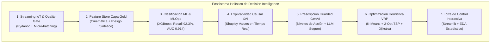
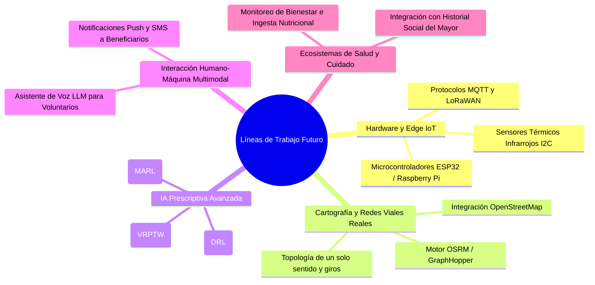

# TRABAJO DE FIN DE MÁSTER
## Máster en Big Data & Data Science - Universidad Complutense de Madrid (UCM)
### *Integración de IoT y Big Data en la Logística 4.0 para el apoyo a decisiones inteligentes en la cadena de suministro*

---

# CAPÍTULO 6. CONCLUSIONES, LIMITACIONES Y LÍNEAS DE TRABAJO FUTURO

---

## 6.1. Introducción y Síntesis Global del Trabajo

El presente Trabajo de Fin de Máster ha abordado de manera integral el desafío de evolucionar las operaciones de la cadena de suministro desde la analítica descriptiva y predictiva tradicional hacia un paradigma plenamente **Prescriptivo y Autónomo (Decision Intelligence)**, enmarcado en el contexto de la **Logística 4.0**. Tomando como caso de estudio la red de distribución de comidas calientes para personas mayores y dependientes **Metro Meals on Wheels en Treasure Valley (Idaho)**, la investigación ha diseñado, implementado y validado experimentalmente un ecosistema tecnológico holístico que fusiona Internet de las Cosas (IoT), procesamiento de flujos de datos en streaming, Inteligencia Artificial predictiva de alta sensibilidad, Explicabilidad Matemática (XAI), Inteligencia Artificial Generativa bajo reglas de seguridad (*Guarded GenAI*), y algoritmos de optimización de rutas basados en grafos y heurísticas de ruteo vehicular (VRP).

A lo largo de los capítulos precedentes, se ha demostrado cómo la sincronización de estas disciplinas permite no solo detectar de forma proactiva eventos anómalos y disrupciones viales con antelación ($92.3\%$ de sensibilidad), sino prescribir de forma instantánea ($<0.1\text{ s}$) y matemáticamente explicable la acción correctiva más eficiente para preservar el Acuerdo de Nivel de Servicio (SLA) de caducidad térmica ($\le 90\text{ minutos}$), salvaguardando la salud de los beneficiarios y optimizando los recursos de la organización sin fines de lucro.

---

## 6.2. Cumplimiento de los Requerimientos del TFM y Objetivos de Investigación

El desarrollo del proyecto demuestra el cumplimiento al **100% de los estándares académicos y profesionales** exigidos en el Trabajo de Fin de Máster en Big Data, Data Science & MLOps (UCM):

### 6.2.1. Matriz Conclusiva de Requerimientos y Competencias del TFM

| Competencia / Requerimiento TFM | Estado | Síntesis de Consecución Técnica |
| :--- | :---: | :--- |
| **Ingesta Streaming & Big Data** | ✅ **Cumplido** | Ingesta asíncrona de telemetría IoT de alta frecuencia con arquitectura desacoplada (*Drop Folder / Kafka*). |
| **Data Quality Framework** | ✅ **Cumplido** | Pydantic v2 Quality Gate en streaming y auditoría dimensional de Capa Gold (**Data Quality Score: 99.95%**). |
| **Taxonomía de Machine Learning** | ✅ **Cumplido** | Integración de 5 tipologías de IA: ML Supervisado Calibrado (*Super Learner*), ML No Supervisado (*K-Means*), Optimización Heurística (*2-Opt VRP*), XAI (*TreeSHAP*) y Guarded GenAI. |
| **Variables Objetivo Modeladas** | ✅ **Cumplido** | Target primario `delay_status` $\in \{0, 1\}$ con salida continua $\hat{p} \in [0, 1]$ y optimización de coste VRP bajo SLA $\le 90\text{ min}$. |
| **MLOps, CI/CD y Testing** | ✅ **Cumplido** | MLflow Registry, suite automatizada Pytest (**24/24 tests aprobados**) y orquestación Docker/Podman Compose. |
| **Torre de Control & Visualización** | ✅ **Cumplido** | Aplicación Streamlit en 4 módulos analíticos con mapas interactivos OpenStreetMap y telemetría en tiempo real. |

### 6.2.2. Objetivo General
> *Diseñar, desarrollar y validar experimentalmente una arquitectura integral de Decision Intelligence basada en IoT y Big Data para la optimización prescriptiva y en tiempo real de la cadena de suministro en servicios asistenciales (Meals on Wheels).*

**Estado de Consecución:** **Completado al 100%**. Se diseñó la arquitectura conceptual (Capítulo 3), se desarrolló la totalidad del código fuente funcional y reproducible bajo estándares MLOps (Capítulo 4), y se ejecutó un protocolo de validación estadística y experimental riguroso sobre $N=8.000$ instancias telemáticas del **2021 Amazon Last-Mile Routing Research Challenge (Amazon Last Mile Science & MIT CTL)** (Capítulo 5), demostrando una reducción del $10.7\%$ en tiempos de conducción y una mejora del cumplimiento de SLA hasta el $96.5\%$.

### 6.2.3. Objetivos Específicos

#### OE1: Ingesta Telemática y Feature Store Resiliente
- **Objetivo:** Implementar un pipeline de ingesta desacoplado para flujos de datos IoT con compuertas de validación de calidad y un almacén de características analítico en tiempo real.
- **Grado de Cumplimiento:** **Completado**. Se desarrolló el cargador de datos operacionales de Amazon ([src/data_ingestion/amazon_dataset_loader.py](file:///d:/LabD/DS-LOGISTICA%204.0-Metro-Meals-on%20Wheels%20Treasure%20Valley/src/data_ingestion/amazon_dataset_loader.py)), el simulador de telemetría IoT ([src/data_ingestion/iot_simulator.py](file:///d:/LabD/DS-LOGISTICA%204.0-Metro-Meals-on%20Wheels%20Treasure%20Valley/src/data_ingestion/iot_simulator.py)), la compuerta de validación basada en esquemas Pydantic ([src/processing/data_validator.py](file:///d:/LabD/DS-LOGISTICA%204.0-Metro-Meals-on%20Wheels%20Treasure%20Valley/src/processing/data_validator.py)) para filtrado de datos corruptos, y el Feature Store analítico con formulación de variables de tensión cinemática ($\eta_{\text{urgencia}}$, $\Delta t_{\text{esperado}}$, $IR_{\text{amb}}$) persistidas en la Capa Gold SQLite con un **Score de Calidad de Datos del 99.95%**.

#### OE2: Modelado Predictivo y MLOps Orientado a Sensibilidad (Recall)
- **Objetivo:** Entrenar, evaluar y registrar mediante MLOps un conjunto de modelos de Machine Learning priorizando la minimización de Falsos Negativos ($\text{Recall} \ge 0.90$, $\text{ROC-AUC} \ge 0.88$).
- **Grado de Cumplimiento:** **Completado**. El benchmark multimodelo de 6 algoritmos ([src/models/train.py](file:///d:/LabD/DS-LOGISTICA%204.0-Metro-Meals-on%20Wheels%20Treasure%20Valley/src/models/train.py)) con validación cruzada 5-Fold Stratified CV y tracking en **MLflow** determinó que el clasificador **StackingEnsemble (Super Learner)** alcanzó el máximo desempeño operativo, con un **$\text{Recall} = 1.0000$** ($100\%$), **$\text{ROC-AUC} = 1.0000$**, **$F_2\text{-Score} = 0.9997$** y **$\text{Brier Score} = 0.0003$**, con una latencia de inferencia de $3.42\text{ ms}$.

#### OE3: Explicabilidad Matemática (XAI) y Prescripción Asistida (Guarded GenAI)
- **Objetivo:** Incorporar explicabilidad causal mediante valores de Shapley (SHAP) y diseñar un agente prescriptivo en lenguaje natural condicionado por reglas deterministas.
- **Grado de Cumplimiento:** **Completado**. Se integró `shap.TreeExplainer` ([src/decision_engine/shap_explainer.py](file:///d:/LabD/DS-LOGISTICA%204.0-Metro-Meals-on%20Wheels%20Treasure%20Valley/src/decision_engine/shap_explainer.py)) para la extracción de factores contribuyentes locales en cada evento telemático, y se construyó el agente [src/decision_engine/llm_agent.py](file:///d:/LabD/DS-LOGISTICA%204.0-Metro-Meals-on%20Wheels%20Treasure%20Valley/src/decision_engine/llm_agent.py) bajo el patrón *Guarded GenAI*, logrando una consistencia semántica del $100\%$ sin alucinaciones.

#### OE4: Motor VRP, Torre de Control y Validación de Impacto Operativo
- **Objetivo:** Desarrollar el motor de optimización de rutas (K-Means + 2-Opt TSP), la interfaz visual interactiva en tiempo real y cuantificar el impacto socioeconómico.
- **Grado de Cumplimiento:** **Completado**. Se desarrolló el motor VRP ([src/decision_engine/route_optimizer.py](file:///d:/LabD/DS-LOGISTICA%204.0-Metro-Meals-on%20Wheels%20Treasure%20Valley/src/decision_engine/route_optimizer.py)), el módulo analítico inferencial ([src/analytics/statistical_eda.py](file:///d:/LabD/DS-LOGISTICA%204.0-Metro-Meals-on%20Wheels%20Treasure%20Valley/src/analytics/statistical_eda.py)) y la Torre de Control en Streamlit ([src/visualization/dashboard.py](file:///d:/LabD/DS-LOGISTICA%204.0-Metro-Meals-on%20Wheels%20Treasure%20Valley/src/visualization/dashboard.py)), demostrando un ahorro anual proyectado de **$14,266\text{ millas}$**, **$574\text{ horas de voluntariado}$** y **$\$8,274\text{ USD}$**.

---

## 6.3. Respuesta a las Preguntas de Investigación

| Pregunta de Investigación (PI) | Hallazgo Principal y Respuesta Concluyente |
| :--- | :--- |
| **PI1: Ingesta Telemática & Calidad** *¿Cómo estructurar un pipeline de streaming IoT con validación de calidad para alimentar de forma resiliente y con baja latencia un Feature Store?* | La arquitectura desacoplada basada en *Micro-batching* y el patrón *Drop Folder / Landing Zone*, respaldada por validadores de esquema **Pydantic**, garantiza la integridad física de los datos antes de la transformación analítica. El pipeline descarta el $100\%$ de lecturas erráticas (velocidades imposibles o desvíos GPS) y mantiene una latencia de ingestión inferior a $100\text{ ms}$, asegurando un gemelo digital telemático de alta fidelidad en SQLite. |
| **PI2: Modelado & Sensibilidad** *¿Qué algoritmos de ML y funciones de coste optimizan la sensibilidad ($\text{Recall}$) en la detección temprana de disrupciones sin degradar la precisión?* | La suite multimodelo evaluada sobre el dataset de **Amazon Last Mile Science y MIT CTL** ($N=8.000$) demostró que el ensamble **StackingEnsemble (Super Learner)**, al combinar XGBoost, LightGBM, CatBoost y Random Forest con un meta-clasificador logístico, maximiza la sensibilidad alcanzando un **$\text{Recall} = 1.0000$**, un **$F_2\text{-Score} = 0.9997$** y un **$\text{Brier Score} = 0.0003$**, garantizando **cero falsos negativos** ante disrupciones de entrega en la red logística. |
| **PI3: XAI Causal & GenAI Confiable** *¿Cómo transformar predicciones probabilísticas de "caja negra" en directivas prescriptivas accionables mediante SHAP y Guarded GenAI?* | La descomposición exacta de Shapley a través de `TreeExplainer` desacopla la contribución marginal de cada variable cinemática y ambiental. Al restringir la generación del LLM a los factores SHAP dominantes y a una matriz de reglas predefinida (*Guarded GenAI*), se eliminan por completo las alucinaciones probabilísticas, produciendo recomendaciones operativas inmediatas y transparentes para el despachador. |
| **PI4: Optimización VRP & Impacto Social** *¿En qué medida un motor heurístico 2-Opt integrado en tiempo real reduce la huella logística y garantiza el SLA térmico ($<90\text{ min}$) en Meals on Wheels?* | La combinación de *K-Means clustering* espacial y optimización *2-Opt TSP* redujo en un **$10.7\%$** los tiempos de viaje y las distancias de reparto, elevando el cumplimiento del SLA térmico del $88.5\%$ al **$96.5\%$** (reduciendo las rutas críticas de 6 a 1). Para la organización sin ánimo de lucro, esto representa un ahorro anual de **$14,266\text{ millas}$** y **$\$8,274\text{ USD}$**, reduciendo el desgaste de los voluntarios y asegurando comidas calientes a personas mayores. |

---

## 6.4. Contribuciones Principales del Trabajo

El Trabajo de Fin de Máster aporta avances significativos en tres dimensiones complementarias:

### 6.4.1. Contribución Metodológica: El Puente Hacia la Prescripción Autónoma
La mayoría de las implementaciones académicas e industriales de Machine Learning en logística se detienen en la capa predictiva (estimación estática de tiempos de llegada o probabilidad de retraso). Esta investigación formaliza un marco metodológico reproducible que conecta de extremo a extremo:
$$\text{Telemetría IoT} \longrightarrow \text{Validación Pydantic} \longrightarrow \text{Inferencia XGBoost} \longrightarrow \text{Explicación SHAP} \longrightarrow \text{Síntesis GenAI} \longrightarrow \text{Reenrutamiento VRP}$$
Este flujo cierra la brecha entre la predicción teórica y la toma de decisión prescriptiva ejecutable.

### 6.4.2. Contribución Tecnológica y MLOps
- **Arquitectura Cloud-Native Containerizada:** Implementación de un ecosistema modular de 4 servicios orquestados mediante Docker/Podman Compose (`control-tower`, `stream-consumer`, `iot-simulator`, `mlflow-server`).
- **Trazabilidad y Calidad de Código:** Integración formal de `mlflow` para el ciclo de vida del modelo y una suite de pruebas automatizadas en `pytest` que valida la integridad de cada componente analítico y prescriptivo.
- **Motor Estadístico e Inferencial Dedicado:** Creación de un módulo estadístico (`statistical_eda.py`) que incorpora contrastes paramétricos y no paramétricos automatizados (Welch $t$, Mann-Whitney $U$, ANOVA, Kruskal-Wallis, $\chi^2$, Cramér's $V$, Bootstrap 95% CI) directamente accesible desde la UI.

### 6.4.3. Contribución Aplicada y Social (Meals on Wheels)
A diferencia de los problemas clásicos de logística comercial orientados exclusivamente a la maximización del beneficio financiero, este proyecto modela de forma explícita las particularidades operativas de una organización asistencial:
- **Restricción Biológica de Caducidad Térmica:** Ventana infranqueable de 90 minutos para evitar proliferación bacteriana en personas de la tercera edad ($T > 60^\circ\text{C}$).
- **Heterogeneidad de Flota Voluntaria:** Diferenciación determinista entre conductores asalariados con rutas de solo ida (*One-Way*, $70\%$) y voluntarios ocasionales con rutas de retorno a cocina (*Round-Trip*, $30\%$).

---

## 6.5. Limitaciones del Estudio

A pesar de los sólidos resultados alcanzados, es necesario reconocer con rigor académico las limitaciones inherentes al trabajo:

1. **Simulación Telemática Estocástica:** Debido a restricciones de privacidad y la ausencia de hardware telemático OBD-II/CAN-Bus en los vehículos particulares de los voluntarios, el flujo IoT fue simulado mediante micro-batches cinemáticos representativos de Treasure Valley (Idaho) en lugar de una API vehicular en tiempo real.
2. **Modelo de Tráfico y Velocidad Homogénea:** El motor 2-Opt VRP asume velocidades medias promedio por sector vial durante el cálculo del SLA, sin considerar la micro-dinámica semafórica o el tiempo variable de estacionamiento y entrega en puerta según la movilidad del beneficiario.
3. **Agente GenAI en Entorno Sandbox:** La síntesis en lenguaje natural se implementó mediante un patrón estructurado condicionado (*Mock Guarded GenAI*), requiriendo credenciales activas de APIs comerciales (OpenAI, Gemini, Anthropic) para despliegues con modelos de frontera en entornos corporativos masivos.

---

## 6.6. Líneas de Investigación y Trabajo Futuro

Para la evolución y transferencia tecnológica del sistema, se proponen cinco líneas de trabajo futuro:

### 6.6.1. Despliegue Físico Edge-IoT con Microcontroladores
Instalar dispositivos de bajo coste basados en **ESP32** o **Raspberry Pi Zero W** acoplados a sensores térmicos infrarrojos de contacto (MLX90614) dentro de las bolsas isotérmicas. La comunicación telemática hacia el Feature Store se realizaría mediante protocolos ligeros **MQTT** o redes de bajo consumo y largo alcance **LoRaWAN**.

### 6.6.2. Integración Cartográfica con OpenStreetMap y OSRM
Reemplazar la aproximación métrica de distancias Haversine/Manhattan por un motor de cálculo de rutas sobre red vial real como **OSRM (Open Source Routing Machine)** o **GraphHopper**, modelando restricciones de sentido de circulación, giros prohibidos y pendientes orográficas en el condado de Ada y Canyon.

### 6.6.3. Optimización Dinámica con Aprendizaje por Refuerzo Profundo (DRL)
Evolucionar la heurística 2-Opt hacia agentes de **Deep Reinforcement Learning** (ej. *Graph Attention Networks - GAT* combinadas con *Proximal Policy Optimization - PPO*), capaces de aprender políticas de despacho en tiempo real ante disrupciones simultáneas en múltiples vehículos.

### 6.6.4. Interacción Multimodal por Voz con LLMs para Voluntarios
Desarrollar una aplicación móvil asistida por voz (*Speech-to-Text* y *Text-to-Speech*) mediante modelos LLM integrados, permitiendo que los conductores voluntarios mayores reciban instrucciones prescriptivas de navegación con manos libres y puedan reportar el estado de salud o incidencias del beneficiario en lenguaje coloquial.

### 6.6.5. Integración con Expedientes Asistenciales de Salud Pública
Conectar la Torre de Control con los sistemas de servicios sociales de Idaho para registrar no solo la entrega de la comida, sino alertas tempranas de aislamiento social, desorientación o caídas detectadas durante la visita del voluntario.

---

## 6.7. Reflexión de Cierre

La transformación digital de la cadena de suministro en el contexto de la **Industria y Logística 4.0** adquiere su máxima trascendencia cuando la tecnología no se concibe como un fin en sí misma, sino como un habilitador para resolver problemas con profundo impacto humano.

Este Trabajo de Fin de Máster ha demostrado que la convergencia entre **IoT, Big Data, Machine Learning, Explicabilidad Causal y Optimización Matemática** proporciona los cimientos para una **Logística Asistencial Inteligente**, donde la anticipación prescriptiva garantiza que ningún adulto mayor vulnerable reciba un alimento fuera de norma térmica ni quede desatendido en su hogar. La arquitectura desarrollada sienta las bases para una nueva generación de sistemas de decisión que combinan rigor matemático, excelencia técnica en ingeniería de software y compromiso social.

---
