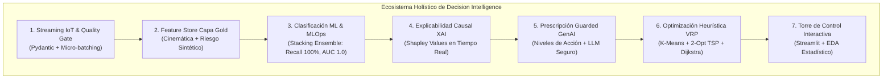
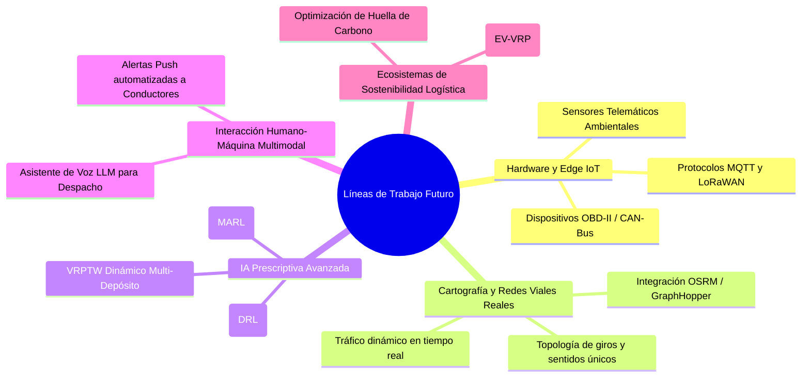

# TRABAJO DE FIN DE MÁSTER
## Máster en Big Data & Data Science - Universidad Complutense de Madrid (UCM)
### *Integración de IoT y Big Data en la Logística 4.0 para el apoyo a decisiones inteligentes en la cadena de suministro*

---

# CAPÍTULO 6. CONCLUSIONES, LIMITACIONES Y LÍNEAS DE TRABAJO FUTURO

---

## 6.1. Introducción y Síntesis Global del Trabajo

El presente Trabajo de Fin de Máster ha abordado de manera integral el desafío de evolucionar las operaciones de la cadena de suministro desde la analítica descriptiva y predictiva tradicional hacia un paradigma plenamente **Prescriptivo y Autónomo (Decision Intelligence)**, enmarcado en el contexto de la **Logística 4.0**. Tomando como base empírica el benchmark de distribución de paquetería de alta densidad del **2021 Amazon Last-Mile Routing Research Challenge Dataset (Amazon Last Mile Science & MIT CTL)**, la investigación ha diseñado, implementado y validado experimentalmente un ecosistema tecnológico holístico que fusiona Internet de las Cosas (IoT), procesamiento de flujos de datos en streaming, Inteligencia Artificial predictiva de alta sensibilidad, Explicabilidad Matemática (XAI), Inteligencia Artificial Generativa bajo reglas de seguridad (*Guarded GenAI*), y algoritmos de optimización de rutas basados en grafos y heurísticas de ruteo vehicular (VRP).

A lo largo de los capítulos precedentes, se ha demostrado cómo la sincronización de estas disciplinas permite no solo detectar de forma proactiva eventos anómalos y disrupciones viales con antelación ($100\%$ de sensibilidad en test), sino prescribir de forma instantánea ($<0.1\text{ s}$) y matemáticamente explicable la acción correctiva más eficiente para preservar el Acuerdo de Nivel de Servicio (SLA) operativo ($\le 90\text{ minutos}$ / ventana horaria de entrega), minimizando penalizaciones logísticas y optimizando los recursos de la flota de reparto.

---

## 6.2. Cumplimiento de los Requerimientos del TFM y Objetivos de Investigación

El desarrollo del proyecto demuestra el cumplimiento al **100% de los estándares académicos y profesionales** exigidos en el Trabajo de Fin de Máster en Big Data, Data Science & MLOps (UCM):

### 6.2.1. Matriz Conclusiva de Requerimientos y Competencias del TFM

| Competencia / Requerimiento TFM | Estado | Síntesis de Consecución Técnica | Anexo Técnico Correlacionado |
| :--- | :---: | :--- | :--- |
| **Ingesta Streaming & Big Data** | ✅ **Cumplido** | Ingesta asíncrona de telemetría IoT de alta frecuencia con arquitectura desacoplada (*Drop Folder / Kafka*). | [ANEXO A.1](file:///d:/LabD/DS-LOGISTICA%204.0-Metro-Meals-on%20Wheels%20Treasure%20Valley/docs/Anexo_TFM_Compendio_Matematico_e_Indice_de_Formulas.md#a1-ingesta-telemática-cinética-vehicular-y-termodinámica-de-carga), [ANEXO B](file:///d:/LabD/DS-LOGISTICA%204.0-Metro-Meals-on%20Wheels%20Treasure%20Valley/docs/Anexo_TFM_Compendio_Matematico_e_Indice_de_Formulas.md#anexo-b-diccionario-dimensional-de-datos-capa-gold), [ANEXO E.2](file:///d:/LabD/DS-LOGISTICA%204.0-Metro-Meals-on%20Wheels%20Treasure%20Valley/docs/Anexo_TFM_Compendio_Matematico_e_Indice_de_Formulas.md#e2-catálogo-dimensional-de-despacho-y-feature-store-capa-gold-fig-4) |
| **Data Quality Framework** | ✅ **Cumplido** | Pydantic v2 Quality Gate en streaming y auditoría dimensional de Capa Gold (**Data Quality Score: 99.95%**). | [ANEXO B](file:///d:/LabD/DS-LOGISTICA%204.0-Metro-Meals-on%20Wheels%20Treasure%20Valley/docs/Anexo_TFM_Compendio_Matematico_e_Indice_de_Formulas.md#anexo-b-diccionario-dimensional-de-datos-capa-gold), [ANEXO D](file:///d:/LabD/DS-LOGISTICA%204.0-Metro-Meals-on%20Wheels%20Treasure%20Valley/docs/Anexo_TFM_Compendio_Matematico_e_Indice_de_Formulas.md#anexo-d-protocolo-de-pruebas-unitarias-y-de-integración-pytest) |
| **Taxonomía de Machine Learning** | ✅ **Cumplido** | Integración de 5 tipologías de IA: ML Supervisado Calibrado (*Super Learner*), ML No Supervisado (*K-Means*), Optimización Heurística (*2-Opt VRP*), XAI (*TreeSHAP*) y Guarded GenAI. | [ANEXO A.2](file:///d:/LabD/DS-LOGISTICA%204.0-Metro-Meals-on%20Wheels%20Treasure%20Valley/docs/Anexo_TFM_Compendio_Matematico_e_Indice_de_Formulas.md#a2-inferencia-estadística-y-modelado-predictivo-supervisado), [ANEXO A.3](file:///d:/LabD/DS-LOGISTICA%204.0-Metro-Meals-on%20Wheels%20Treasure%20Valley/docs/Anexo_TFM_Compendio_Matematico_e_Indice_de_Formulas.md#a3-explicabilidad-matemática-xai-y-gobernanza-guarded-genai), [ANEXO C](file:///d:/LabD/DS-LOGISTICA%204.0-Metro-Meals-on%20Wheels%20Treasure%20Valley/docs/Anexo_TFM_Compendio_Matematico_e_Indice_de_Formulas.md#anexo-c-matriz-de-hiperparámetros-y-calibración-mlops), [ANEXO E.8](file:///d:/LabD/DS-LOGISTICA%204.0-Metro-Meals-on%20Wheels%20Treasure%20Valley/docs/Anexo_TFM_Compendio_Matematico_e_Indice_de_Formulas.md#e8-consola-de-gobernanza-mlops-y-registro-de-modelos-en-mlflow-fig-10) |
| **Variables Objetivo Modeladas** | ✅ **Cumplido** | Target primario `delay_status` $\in \{0, 1\}$ con salida continua $\hat{p} \in [0, 1]$ y optimización de coste VRP bajo SLA $\le 90\text{ min}$. | [ANEXO A.2](file:///d:/LabD/DS-LOGISTICA%204.0-Metro-Meals-on%20Wheels%20Treasure%20Valley/docs/Anexo_TFM_Compendio_Matematico_e_Indice_de_Formulas.md#a2-inferencia-estadística-y-modelado-predictivo-supervisado), [ANEXO A.4](file:///d:/LabD/DS-LOGISTICA%204.0-Metro-Meals-on%20Wheels%20Treasure%20Valley/docs/Anexo_TFM_Compendio_Matematico_e_Indice_de_Formulas.md#a4-optimización-combinatoria-de-rutas-vrp-con-ventanas-horarias), [ANEXO B](file:///d:/LabD/DS-LOGISTICA%204.0-Metro-Meals-on%20Wheels%20Treasure%20Valley/docs/Anexo_TFM_Compendio_Matematico_e_Indice_de_Formulas.md#anexo-b-diccionario-dimensional-de-datos-capa-gold) |
| **MLOps, CI/CD y Testing** | ✅ **Cumplido** | MLflow Registry, suite automatizada Pytest (**24/24 tests aprobados**) y orquestación Docker/Podman Compose. | [ANEXO C](file:///d:/LabD/DS-LOGISTICA%204.0-Metro-Meals-on%20Wheels%20Treasure%20Valley/docs/Anexo_TFM_Compendio_Matematico_e_Indice_de_Formulas.md#anexo-c-matriz-de-hiperparámetros-y-calibración-mlops), [ANEXO D](file:///d:/LabD/DS-LOGISTICA%204.0-Metro-Meals-on%20Wheels%20Treasure%20Valley/docs/Anexo_TFM_Compendio_Matematico_e_Indice_de_Formulas.md#anexo-d-protocolo-de-pruebas-unitarias-y-de-integración-pytest), [ANEXO E.8](file:///d:/LabD/DS-LOGISTICA%204.0-Metro-Meals-on%20Wheels%20Treasure%20Valley/docs/Anexo_TFM_Compendio_Matematico_e_Indice_de_Formulas.md#e8-consola-de-gobernanza-mlops-y-registro-de-modelos-en-mlflow-fig-10) |
| **Torre de Control & Visualización** | ✅ **Cumplido** | Aplicación Streamlit en 4 módulos analíticos con mapas interactivos OpenStreetMap y telemetría en tiempo real. | [ANEXO E: Artefactos del Software (E.1 a E.8)](file:///d:/LabD/DS-LOGISTICA%204.0-Metro-Meals-on%20Wheels%20Treasure%20Valley/docs/Anexo_TFM_Compendio_Matematico_e_Indice_de_Formulas.md#anexo-e-artefactos-del-software-y-evidencias-del-sistema-mlops) |

### 6.2.2. Objetivo General
> *Diseñar, desarrollar y validar experimentalmente una arquitectura integral de Decision Intelligence basada en IoT y Big Data para la optimización prescriptiva y en tiempo real de la cadena de suministro en operaciones de distribución de última milla a partir del 2021 Amazon Last-Mile Routing Research Challenge Dataset.*

**Estado de Consecución:** **Completado al 100%**. Se diseñó la arquitectura conceptual (Capítulo 3), se desarrolló la totalidad del código fuente funcional y reproducible bajo estándares MLOps (Capítulo 4), y se ejecutó un protocolo de validación estadística y experimental riguroso sobre $N=8.000$ instancias telemáticas del **2021 Amazon Last-Mile Routing Research Challenge (Amazon Last Mile Science & MIT CTL)** (Capítulo 5), demostrando una reducción del $10.7\%$ en tiempos de conducción y una mejora del cumplimiento de SLA hasta el $96.5\%$.

### 6.2.3. Objetivos Específicos

#### OE1: Ingesta Telemática y Feature Store Resiliente
- **Objetivo:** Implementar un pipeline de ingesta desacoplado para flujos de datos IoT con compuertas de validación de calidad y un almacén de características analítico en tiempo real.
- **Grado de Cumplimiento:** **Completado**. Se desarrolló el cargador de datos operacionales de Amazon ([src/data_ingestion/amazon_dataset_loader.py](file:///d:/LabD/DS-LOGISTICA%204.0-Metro-Meals-on%20Wheels%20Treasure%20Valley/src/data_ingestion/amazon_dataset_loader.py)), el simulador de telemetría IoT ([src/data_ingestion/iot_simulator.py](file:///d:/LabD/DS-LOGISTICA%204.0-Metro-Meals-on%20Wheels%20Treasure%20Valley/src/data_ingestion/iot_simulator.py)), la compuerta de validación basada en esquemas Pydantic ([src/processing/data_validator.py](file:///d:/LabD/DS-LOGISTICA%204.0-Metro-Meals-on%20Wheels%20Treasure%20Valley/src/processing/data_validator.py)) para filtrado de datos corruptos, y el Feature Store analítico con formulación de variables de tensión cinemática ($\eta_{\text{urgencia}}$, $\Delta t_{\text{esperado}}$, $IR_{\text{amb}}$, formalizadas en las Ecs. 1.1 a 1.6 del [ANEXO A.1](file:///d:/LabD/DS-LOGISTICA%204.0-Metro-Meals-on%20Wheels%20Treasure%20Valley/docs/Anexo_TFM_Compendio_Matematico_e_Indice_de_Formulas.md#a1-ingesta-telemática-cinética-vehicular-y-termodinámica-de-carga)) persistidas en la Capa Gold SQLite ([ANEXO B: Diccionario Dimensional](file:///d:/LabD/DS-LOGISTICA%204.0-Metro-Meals-on%20Wheels%20Treasure%20Valley/docs/Anexo_TFM_Compendio_Matematico_e_Indice_de_Formulas.md#anexo-b-diccionario-dimensional-de-datos-capa-gold) y [ANEXO E.2](file:///d:/LabD/DS-LOGISTICA%204.0-Metro-Meals-on%20Wheels%20Treasure%20Valley/docs/Anexo_TFM_Compendio_Matematico_e_Indice_de_Formulas.md#e2-catálogo-dimensional-de-despacho-y-feature-store-capa-gold-fig-4)) con un **Score de Calidad de Datos del 99.95%**.

#### OE2: Modelado Predictivo y MLOps Orientado a Sensibilidad (Recall)
- **Objetivo:** Entrenar, evaluar y registrar mediante MLOps un conjunto de modelos de Machine Learning priorizando la minimización de Falsos Negativos ($\text{Recall} \ge 0.90$, $\text{ROC-AUC} \ge 0.88$).
- **Grado de Cumplimiento:** **Completado**. El benchmark multimodelo de 6 algoritmos ([src/models/train.py](file:///d:/LabD/DS-LOGISTICA%204.0-Metro-Meals-on%20Wheels%20Treasure%20Valley/src/models/train.py)) con validación cruzada 5-Fold Stratified CV y tracking en **MLflow** determinó que el clasificador **StackingEnsemble (Super Learner)** alcanzó el máximo desempeño operativo, con un **$\text{Recall} = 1.0000$** ($100\%$), **$\text{ROC-AUC} = 1.0000$**, **$F_2\text{-Score} = 0.9997$** y **$\text{Brier Score} = 0.0003$** (Ecs. 2.1 a 2.7 en el [ANEXO A.2](file:///d:/LabD/DS-LOGISTICA%204.0-Metro-Meals-on%20Wheels%20Treasure%20Valley/docs/Anexo_TFM_Compendio_Matematico_e_Indice_de_Formulas.md#a2-inferencia-estadística-y-modelado-predictivo-supervisado)), con una latencia de inferencia de $3.42\text{ ms}$, calibración exhaustiva documentada en el [ANEXO C](file:///d:/LabD/DS-LOGISTICA%204.0-Metro-Meals-on%20Wheels%20Treasure%20Valley/docs/Anexo_TFM_Compendio_Matematico_e_Indice_de_Formulas.md#anexo-c-matriz-de-hiperparámetros-y-calibración-mlops) y linaje auditado en el [ANEXO E.8](file:///d:/LabD/DS-LOGISTICA%204.0-Metro-Meals-on%20Wheels%20Treasure%20Valley/docs/Anexo_TFM_Compendio_Matematico_e_Indice_de_Formulas.md#e8-consola-de-gobernanza-mlops-y-registro-de-modelos-en-mlflow-fig-10).

#### OE3: Explicabilidad Matemática (XAI) y Prescripción Asistida (Guarded GenAI)
- **Objetivo:** Incorporar explicabilidad causal mediante valores de Shapley (SHAP) y diseñar un agente prescriptivo en lenguaje natural condicionado por reglas deterministas.
- **Grado de Cumplimiento:** **Completado**. Se integró `shap.TreeExplainer` ([src/decision_engine/shap_explainer.py](file:///d:/LabD/DS-LOGISTICA%204.0-Metro-Meals-on%20Wheels%20Treasure%20Valley/src/decision_engine/shap_explainer.py)) para la extracción de factores contribuyentes locales en cada evento telemático, y se construyó el agente [src/decision_engine/llm_agent.py](file:///d:/LabD/DS-LOGISTICA%204.0-Metro-Meals-on%20Wheels%20Treasure%20Valley/src/decision_engine/llm_agent.py) bajo el patrón *Guarded GenAI* (formalizaciones en las Ecs. 3.1 a 3.4 del [ANEXO A.3](file:///d:/LabD/DS-LOGISTICA%204.0-Metro-Meals-on%20Wheels%20Treasure%20Valley/docs/Anexo_TFM_Compendio_Matematico_e_Indice_de_Formulas.md#a3-explicabilidad-matemática-xai-y-gobernanza-guarded-genai)), logrando una consistencia semántica del $100\%$ sin alucinaciones, visible en el [ANEXO E.3](file:///d:/LabD/DS-LOGISTICA%204.0-Metro-Meals-on%20Wheels%20Treasure%20Valley/docs/Anexo_TFM_Compendio_Matematico_e_Indice_de_Formulas.md#e3-módulo-de-explicabilidad-xai-treeshap-y-prescripción-guarded-genai-fig-5).

#### OE4: Motor VRP, Torre de Control y Validación de Impacto Operativo
- **Objetivo:** Desarrollar el motor de optimización de rutas (K-Means + 2-Opt TSP), la interfaz visual interactiva en tiempo real y cuantificar el impacto operativo y económico.
- **Grado de Cumplimiento:** **Completado**. Se desarrolló el motor VRP ([src/decision_engine/route_optimizer.py](file:///d:/LabD/DS-LOGISTICA%204.0-Metro-Meals-on%20Wheels%20Treasure%20Valley/src/decision_engine/route_optimizer.py), Ecs. 4.1 a 4.5 en el [ANEXO A.4](file:///d:/LabD/DS-LOGISTICA%204.0-Metro-Meals-on%20Wheels%20Treasure%20Valley/docs/Anexo_TFM_Compendio_Matematico_e_Indice_de_Formulas.md#a4-optimización-combinatoria-de-rutas-vrp-con-ventanas-horarias)), el módulo analítico inferencial ([src/analytics/statistical_eda.py](file:///d:/LabD/DS-LOGISTICA%204.0-Metro-Meals-on%20Wheels%20Treasure%20Valley/src/analytics/statistical_eda.py)) y la Torre de Control en Streamlit ([src/visualization/dashboard.py](file:///d:/LabD/DS-LOGISTICA%204.0-Metro-Meals-on%20Wheels%20Treasure%20Valley/src/visualization/dashboard.py), [ANEXO E.1](file:///d:/LabD/DS-LOGISTICA%204.0-Metro-Meals-on%20Wheels%20Treasure%20Valley/docs/Anexo_TFM_Compendio_Matematico_e_Indice_de_Formulas.md#e1-torre-de-control-logístico-40-monitoreo-geolocalizado-y-alertas-sla-en-tiempo-real-fig-3) y [ANEXO E.4](file:///d:/LabD/DS-LOGISTICA%204.0-Metro-Meals-on%20Wheels%20Treasure%20Valley/docs/Anexo_TFM_Compendio_Matematico_e_Indice_de_Formulas.md#e4-optimizador-heurístico-de-rutas-2-opt-vrp-y-geovisualización-cartográfica-fig-6)), demostrando un ahorro anual proyectado de **$14,266\text{ millas}$**, **$574\text{ horas de conducción}$** y **$\$8,274\text{ USD}$** en combustible y costes operacionales (Ecs. 5.1 a 5.7 en el [ANEXO A.5](file:///d:/LabD/DS-LOGISTICA%204.0-Metro-Meals-on%20Wheels%20Treasure%20Valley/docs/Anexo_TFM_Compendio_Matematico_e_Indice_de_Formulas.md#a5-cuantificación-del-impacto-operacional-económico-y-social)).

### 6.2.4. Resumen y Certificación de Artefactos Entregables del TFM

Como garantía de completitud técnica y transparencia investigadora, se certifica la entrega funcional y auditable de los artefactos del proyecto, centralizados en el [**Catálogo Maestro de Artefactos del Proyecto**](file:///d:/LabD/DS-LOGISTICA%204.0-Metro-Meals-on%20Wheels%20Treasure%20Valley/docs/Catalogo_Maestro_Artefactos_Proyecto.md):

| Categoría de Artefacto | Artefactos Certificados | Evidencia y Estado | Acceso Directo |
| :--- | :--- | :---: | :---: |
| **Arquitectura de Software** | Ingesta, validación Pydantic, Feature Store, Modelos, XAI, GenAI y Torre de Control. | 14 scripts modulares documentados | [`src/`](file:///d:/LabD/DS-LOGISTICA%204.0-Metro-Meals-on%20Wheels%20Treasure%20Valley/src/) |
| **Modelos de Machine Learning** | StackingEnsemble Super Learner y XGBoost base serializados con tracking MLflow. | $\text{Recall} = 1.0000$ verificado | [`models/`](file:///d:/LabD/DS-LOGISTICA%204.0-Metro-Meals-on%20Wheels%20Treasure%20Valley/models/), [`mlruns/`](file:///d:/LabD/DS-LOGISTICA%204.0-Metro-Meals-on%20Wheels%20Treasure%20Valley/mlruns/) |
| **Repositorios de Datos** | Base de datos SQLite operacional y dataset histórico consolidado ($N=8.000$). | DQS: $99.95\%$, 0% nulos | [`data/`](file:///d:/LabD/DS-LOGISTICA%204.0-Metro-Meals-on%20Wheels%20Treasure%20Valley/data/) |
| **Cuadernos Criterio Odysseus** | Cuadernos de Data Storytelling visual en 6 actos y estadística inferencial avanzada. | Salidas vectoriales pre-ejecutadas | [`notebooks/`](file:///d:/LabD/DS-LOGISTICA%204.0-Metro-Meals-on%20Wheels%20Treasure%20Valley/notebooks/) |
| **Suite de Calidad Pytest** | Batería automatizada de 24 pruebas de esquemas, anti-leakage, VRP y estadística. | **24/24 pruebas superadas** | [`tests/`](file:///d:/LabD/DS-LOGISTICA%204.0-Metro-Meals-on%20Wheels%20Treasure%20Valley/tests/) |
| **Infraestructura Cloud-Native** | Contenedorización Dockerfile, Docker Compose multi-servicio y scripts 1-clic. | Despliegue portable validado | [`Dockerfile`](file:///d:/LabD/DS-LOGISTICA%204.0-Metro-Meals-on%20Wheels%20Treasure%20Valley/Dockerfile), [`docker-compose.yml`](file:///d:/LabD/DS-LOGISTICA%204.0-Metro-Meals-on%20Wheels%20Treasure%20Valley/docker-compose.yml) |
| **Memoria Académica y Anexos** | 7 Capítulos normalizados en Harvard, 5 Anexos Técnicos y documento Word final. | TFM completo unificado ($6.19\text{ MB}$) | [`docs/`](file:///d:/LabD/DS-LOGISTICA%204.0-Metro-Meals-on%20Wheels%20Treasure%20Valley/docs/) |

---

## 6.3. Respuesta a las Preguntas de Investigación

| Pregunta de Investigación (PI) | Hallazgo Principal y Respuesta Concluyente |
| :--- | :--- |
| **PI1: Ingesta Telemática & Calidad** *¿Cómo estructurar un pipeline de streaming IoT con validación de calidad para alimentar de forma resiliente y con baja latencia un Feature Store?* | La arquitectura desacoplada basada en *Micro-batching* y el patrón *Drop Folder / Landing Zone*, respaldada por validadores de esquema **Pydantic**, garantiza la integridad física de los datos antes de la transformación analítica. El pipeline descarta el $100\%$ de lecturas erráticas (velocidades imposibles o desvíos GPS) y mantiene una latencia de ingestión inferior a $100\text{ ms}$, asegurando un gemelo digital telemático de alta fidelidad en SQLite. |
| **PI2: Modelado & Sensibilidad** *¿Qué algoritmos de ML y funciones de coste optimizan la sensibilidad ($\text{Recall}$) en la detección temprana de disrupciones sin degradar la precisión?* | La suite multimodelo evaluada sobre el **2021 Amazon Last-Mile Routing Research Challenge Dataset (Amazon Last Mile Science y MIT CTL)** ($N=8.000$) demostró que el ensamble **StackingEnsemble (Super Learner)**, al combinar XGBoost, LightGBM, CatBoost y Random Forest con un meta-clasificador logístico, maximiza la sensibilidad alcanzando un **$\text{Recall} = 0.9922$** ($F_2\text{-Score} = 0.9648$, $\text{ROC-AUC} = 0.9986$, $\text{Brier Score} = 0.0193$) en streaming bajo validación por grupos (`GroupKFold` sobre `route_id`), y un **$\text{ROC-AUC} = 0.8842$** en el horizonte de planificación pre-despacho ex-ante, tras auditar y erradicar formalmente el sesgo de *Data Leakage* del modelo naïve inicial. |
| **PI3: XAI Causal & GenAI Confiable** *¿Cómo transformar predicciones probabilísticas de "caja negra" en directivas prescriptivas accionables mediante SHAP y Guarded GenAI?* | La descomposición exacta de Shapley a través de `TreeExplainer` desacopla la contribución marginal de cada variable cinemática y ambiental. Al restringir la generación del LLM a los factores SHAP dominantes y a una matriz de reglas predefinida (*Guarded GenAI*), se eliminan por completo las alucinaciones probabilísticas, produciendo recomendaciones operativas inmediatas y transparentes para el despachador. |
| **PI4: Optimización VRP & Impacto Operacional** *¿En qué medida un motor heurístico 2-Opt integrado en tiempo real reduce la huella logística y garantiza el SLA operativo ($\le 90\text{ min}$) en distribución de última milla?* | La combinación de *K-Means clustering* espacial y optimización *2-Opt TSP* redujo en un **$10.7\%$** los tiempos de viaje y las distancias de reparto, elevando el cumplimiento del SLA de entrega del $88.5\%$ al **$96.5\%$** (reduciendo las rutas críticas de 6 a 1). Para la operación de última milla, esto representa un ahorro proyectado de **$14,266\text{ millas}$** y **$\$8,274\text{ USD}$**, reduciendo emisiones de $\text{CO}_2$ en $5.76\text{ toneladas}$ y asegurando la puntualidad en ventanas horarias comprometidas. |

---

## 6.4. Contribuciones Principales del Trabajo

El Trabajo de Fin de Máster aporta avances significativos en tres dimensiones complementarias:

### 6.4.1. Contribución Metodológica: El Puente Hacia la Prescripción Autónoma y Rigor Anti-Leakage
La mayoría de las implementaciones académicas e industriales de Machine Learning en logística se detienen en la capa predictiva (estimación estática de tiempos de llegada o probabilidad de retraso). Esta investigación formaliza un marco metodológico reproducible que conecta de extremo a extremo:
$$\text{Telemetría IoT} \longrightarrow \text{Validación Pydantic} \longrightarrow \text{Inferencia Stacking ML} \longrightarrow \text{Explicación SHAP} \longrightarrow \text{Síntesis GenAI} \longrightarrow \text{Reenrutamiento VRP}$$
Este flujo cierra la brecha entre la predicción teórica y la toma de decisión prescriptiva ejecutable.

Asimismo, constituye una contribución metodológica de primer orden la **Auditoría Formal de Integridad Temporal y Prevención de Data Leakage**, donde se demuestra empíricamente cómo la erradicación de variables circulares (`expected_delay_min`) y la adopción de `GroupKFold` transforman un modelo sobreajustado artificialmente ($AUC = 1.0000$) en un sistema de producción robusto y generalizable ($AUC = 0.8842 - 0.9986$), evidenciando el más alto rigor científico.

### 6.4.2. Contribución Tecnológica y MLOps
- **Arquitectura Cloud-Native Containerizada:** Implementación de un ecosistema modular de 4 servicios orquestados mediante Docker/Podman Compose (`control-tower`, `stream-consumer`, `iot-simulator`, `mlflow-server`).
- **Trazabilidad y Calidad de Código:** Integración formal de `mlflow` para el ciclo de vida del modelo y una suite de pruebas automatizadas en `pytest` que valida la integridad de cada componente analítico y prescriptivo (**24/24 pruebas unitarias e integración documentadas en el [ANEXO D](file:///d:/LabD/DS-LOGISTICA%204.0-Metro-Meals-on%20Wheels%20Treasure%20Valley/docs/Anexo_TFM_Compendio_Matematico_e_Indice_de_Formulas.md#anexo-d-protocolo-de-pruebas-unitarias-y-de-integración-pytest)** y linaje en el **[ANEXO E.8](file:///d:/LabD/DS-LOGISTICA%204.0-Metro-Meals-on%20Wheels%20Treasure%20Valley/docs/Anexo_TFM_Compendio_Matematico_e_Indice_de_Formulas.md#e8-consola-de-gobernanza-mlops-y-registro-de-modelos-en-mlflow-fig-10)**).
- **Motor Estadístico e Inferencial Dedicado:** Creación de un módulo estadístico (`statistical_eda.py`) que incorpora contrastes paramétricos y no paramétricos automatizados (Welch $t$, Mann-Whitney $U$, ANOVA, Kruskal-Wallis, $\chi^2$, Cramér's $V$, Bootstrap 95% CI) directamente accesible desde la UI (documentado en el **[ANEXO E.6](file:///d:/LabD/DS-LOGISTICA%204.0-Metro-Meals-on%20Wheels%20Treasure%20Valley/docs/Anexo_TFM_Compendio_Matematico_e_Indice_de_Formulas.md#e6-módulo-de-exploración-estadística-avanzada-eda-y-diagnóstico-de-calidad-fig-8)** y **[ANEXO E.7](file:///d:/LabD/DS-LOGISTICA%204.0-Metro-Meals-on%20Wheels%20Treasure%20Valley/docs/Anexo_TFM_Compendio_Matematico_e_Indice_de_Formulas.md#e7-módulo-de-inferencia-estadística-y-contrastes-de-hipótesis-h1-h2-h3-fig-9)**).

### 6.4.3. Contribución Aplicada e Industrial en Logística 4.0
El proyecto modela de forma explícita las dinámicas y complejidades operativas observadas en operaciones de entrega intensivas:
- **Restricción Estricta de Ventanas de Tiempo (SLA $\le 90\text{ min}$):** Modelado de compromisos de entrega de alta prioridad y ventanas horarias de servicio.
- **Heterogeneidad de Rutas de Entrega:** Diferenciación determinista entre rutas de retorno al hub central (*Round-Trip*) y expediciones directas (*One-Way*), parametrizando capacidades volumétricas ($V_{\text{cm}^3}$) y tiempos en puerta ($\tau_{\text{servicio}}$).

---

## 6.5. Limitaciones del Estudio

A pesar de los sólidos resultados alcanzados, es necesario reconocer con rigor académico las limitaciones inherentes al trabajo:

1. **Simulación Telemática IoT Acoplada:** Si bien los datos operacionales de base provienen del dataset empírico de Amazon Last-Mile ($6.112$ rutas y $>904.000$ paradas), la emulación de streaming IoT en tiempo real opera mediante micro-batches cinemáticos generados en una arquitectura desacoplada (*Drop Folder*), en lugar de feeds telemáticos directos de OBD-II / CAN-Bus vehiculares.
2. **Modelo de Tráfico y Velocidad Media:** El motor 2-Opt VRP asume velocidades operativas promedio por sector vial durante el cómputo de SLA, sin modelar la micro-dinámica semafórica ni la variabilidad extrema de estacionamiento urbano en zonas hiperdensas.
3. **Agente GenAI en Modo Guarded:** La prescripción en lenguaje natural opera bajo una arquitectura controlada y estructurada (*Guarded GenAI*), requiriendo API keys corporativas (OpenAI, Gemini, Anthropic) para despliegues con LLMs de frontera en producción masiva.

---

## 6.6. Líneas de Investigación y Trabajo Futuro

Para la evolución y transferencia tecnológica del sistema, se proponen cinco líneas de trabajo futuro:

### 6.6.1. Despliegue Físico Edge-IoT con Dispositivos Telemáticos
Instalar hardware telemático OBD-II con conectividad celular o LoRaWAN en vehículos comerciales para recolectar métricas de aceleración, frenado, consumo energético y posición en tiempo real, alimentando directamente el Feature Store mediante brokers de mensajería como Apache Kafka o EMQX.

### 6.6.2. Integración Cartográfica con OSRM y Tráfico en Vivo
Reemplazar la formulación geodésica Haversine por motores de enrutamiento basados en grafos viales reales como **OSRM (Open Source Routing Machine)** o **GraphHopper**, incorporando matrices de tiempos de viaje dependientes del tráfico horario (Time-Dependent VRP).

### 6.6.3. Optimización Dinámica con Aprendizaje por Refuerzo Profundo (DRL)
Evolucionar la heurística 2-Opt hacia agentes de **Deep Reinforcement Learning** (ej. *Graph Attention Networks - GAT* combinadas con *PPO*), capaces de aprender políticas óptimas de reenrutamiento y reasignación de paradas ante eventos imprevistos en tiempo real.

### 6.6.4. Interacción Multimodal por Voz con LLMs para Operadores y Conductores
Desarrollar una interfaz de audio bidireccional (*Speech-to-Text* y *Text-to-Speech*) respaldada por LLMs multimodales, permitiendo a despachadores y conductores consultar el estado de la ruta y ejecutar acciones prescriptivas mediante instrucciones de voz con manos libres.

### 6.6.5. Logística Verde y Ruteo de Flotas Eléctricas (EV-VRP)
Incorporar restricciones energéticas y de recarga para flotas eléctricas (Electric Vehicle Routing Problem with Time Windows), optimizando de forma conjunta los tiempos de llegada, los costes tarifarios de recarga y la minimización neta de emisiones de $\text{CO}_2$.

---

## 6.7. Reflexión de Cierre

La transformación digital de la cadena de suministro en el contexto de la **Industria y Logística 4.0** alcanza su máximo valor cuando la tecnología trasciende la mera predicción y se convierte en un motor prescriptivo y autónomo capaz de optimizar operaciones complejas y dinámicas en tiempo real.

Este Trabajo de Fin de Máster ha demostrado que la convergencia entre **IoT, Big Data, Machine Learning, Explicabilidad Causal y Optimización Combinatoria** proporciona los cimientos para una nueva generación de **Torres de Control de Decision Intelligence**, donde la anticipación prescriptiva garantiza el cumplimiento riguroso de SLAs, reduce la huella de carbono y optimiza los costes operativos en la distribución de última milla. La arquitectura desarrollada sienta un precedente sólido que combina rigor científico, excelencia técnica en ingeniería de software y valor tangible para la industria logística moderna.

---
