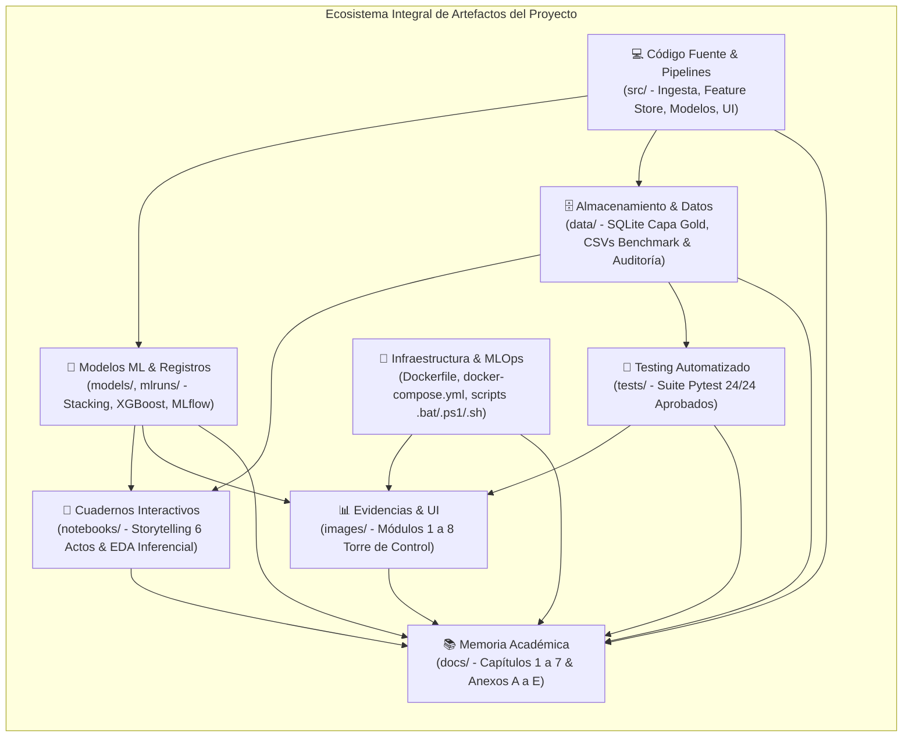

# TRABAJO DE FIN DE MÁSTER
## Máster en Big Data & Data Science - Universidad Complutense de Madrid (UCM)
### *Integración de IoT y Big Data en la Logística 4.0 para el apoyo a decisiones inteligentes en la cadena de suministro*

---

# 📦 CATÁLOGO MAESTRO DE ARTEFACTOS DEL PROYECTO (PROJECT ARTIFACTS INVENTORY)

**Autor:** [Guillén Concepción](https://www.linkedin.com/in/guillen-concepcion-25266b127) (*Senior Data Scientist & MLOps Engineer*)  
**Repositorio GitHub:** [GuillenConcepcion/Smart-Logistics-4.0-Decision-Intelligence](https://github.com/GuillenConcepcion)  
**Contacto:** [guillenconcepcion@gmail.com](mailto:guillenconcepcion@gmail.com)  

---

## 1. Introducción y Propósito del Catálogo

El presente documento constituye el **Inventario y Catálogo Maestro de Artefactos** generados a lo largo del ciclo de vida de investigación, ingeniería de datos, modelado de Machine Learning, desarrollo de software y gobernanza MLOps del Trabajo de Fin de Máster.

Siguiendo el estándar de reproducibilidad y auditabilidad industrial (Criterio Odysseus), cada componente desarrollado en este ecosistema posee un correlato físico en el repositorio y una justificación teórico-metodológica en los capítulos de la memoria académica. A continuación se indexan, categorizan y vinculan la totalidad de los artefactos tangibles del proyecto.



---

## 2. Mapa General de Trazabilidad Cruzada: Artefactos $\leftrightarrow$ Capítulos TFM

La siguiente matriz establece el mapeo biunívoco entre cada capítulo del manuscrito académico y los artefactos correspondientes:

| Capítulo de la Memoria | Título del Capítulo | Artefactos Principales Relacionados | Anexos Técnicos de Soporte |
| :--- | :--- | :--- | :--- |
| [**Capítulo 1**](file:///d:/LabD/DS-LOGISTICA%204.0-Metro-Meals-on%20Wheels%20Treasure%20Valley/docs/Cap1_TFM_Introduccion_y_Objetivos.md) | Introducción, Motivación y Objetivos | [`README.md`](file:///d:/LabD/DS-LOGISTICA%204.0-Metro-Meals-on%20Wheels%20Treasure%20Valley/README.md), [`config/config.yaml`](file:///d:/LabD/DS-LOGISTICA%204.0-Metro-Meals-on%20Wheels%20Treasure%20Valley/config/config.yaml) | [Anexo A.1](file:///d:/LabD/DS-LOGISTICA%204.0-Metro-Meals-on%20Wheels%20Treasure%20Valley/docs/Anexo_TFM_Compendio_Matematico_e_Indice_de_Formulas.md#a1-ingesta-telemática-cinética-vehicular-y-termodinámica-de-carga), [Anexo B](file:///d:/LabD/DS-LOGISTICA%204.0-Metro-Meals-on%20Wheels%20Treasure%20Valley/docs/Anexo_TFM_Compendio_Matematico_e_Indice_de_Formulas.md#anexo-b-diccionario-dimensional-de-datos-y-feature-store-capa-gold) |
| [**Capítulo 2**](file:///d:/LabD/DS-LOGISTICA%204.0-Metro-Meals-on%20Wheels%20Treasure%20Valley/docs/Cap2_TFM_Marco_Teorico_y_Estado_del_Arte.md) | Marco Teórico y Estado del Arte (DSN) | [`src/decision_engine/route_optimizer.py`](file:///d:/LabD/DS-LOGISTICA%204.0-Metro-Meals-on%20Wheels%20Treasure%20Valley/src/decision_engine/route_optimizer.py), [`src/visualization/dashboard.py`](file:///d:/LabD/DS-LOGISTICA%204.0-Metro-Meals-on%20Wheels%20Treasure%20Valley/src/visualization/dashboard.py) | [Anexo A.1](file:///d:/LabD/DS-LOGISTICA%204.0-Metro-Meals-on%20Wheels%20Treasure%20Valley/docs/Anexo_TFM_Compendio_Matematico_e_Indice_de_Formulas.md#a1-ingesta-telemática-cinética-vehicular-y-termodinámica-de-carga), [Anexo E.1](file:///d:/LabD/DS-LOGISTICA%204.0-Metro-Meals-on%20Wheels%20Treasure%20Valley/docs/Anexo_TFM_Compendio_Matematico_e_Indice_de_Formulas.md#e1-módulo-1-torre-de-control-telemática-y-despacho-en-tiempo-real-gps--streaming-iot) |
| [**Capítulo 3**](file:///d:/LabD/DS-LOGISTICA%204.0-Metro-Meals-on%20Wheels%20Treasure%20Valley/docs/Cap3_TFM_Metodologia_y_Seleccion_Tecnologica.md) | Metodología y Selección Tecnológica | [`src/processing/data_validator.py`](file:///d:/LabD/DS-LOGISTICA%204.0-Metro-Meals-on%20Wheels%20Treasure%20Valley/src/processing/data_validator.py), [`src/processing/feature_store.py`](file:///d:/LabD/DS-LOGISTICA%204.0-Metro-Meals-on%20Wheels%20Treasure%20Valley/src/processing/feature_store.py), [`Dockerfile`](file:///d:/LabD/DS-LOGISTICA%204.0-Metro-Meals-on%20Wheels%20Treasure%20Valley/Dockerfile) | [Anexo B](file:///d:/LabD/DS-LOGISTICA%204.0-Metro-Meals-on%20Wheels%20Treasure%20Valley/docs/Anexo_TFM_Compendio_Matematico_e_Indice_de_Formulas.md#anexo-b-diccionario-dimensional-de-datos-y-feature-store-capa-gold), [Anexo C](file:///d:/LabD/DS-LOGISTICA%204.0-Metro-Meals-on%20Wheels%20Treasure%20Valley/docs/Anexo_TFM_Compendio_Matematico_e_Indice_de_Formulas.md#anexo-c-matriz-de-hiperparámetros-del-benchmark-multimodelo), [Anexo D](file:///d:/LabD/DS-LOGISTICA%204.0-Metro-Meals-on%20Wheels%20Treasure%20Valley/docs/Anexo_TFM_Compendio_Matematico_e_Indice_de_Formulas.md#anexo-d-protocolo-de-pruebas-automatizadas-suite-pytest) |
| [**Capítulo 4**](file:///d:/LabD/DS-LOGISTICA%204.0-Metro-Meals-on%20Wheels%20Treasure%20Valley/docs/Cap4_TFM_Implementacion_Arquitectura.md) | Desarrollo e Implementación de la Arquitectura | Módulos `src/` (Ingesta, Modelos, XAI, VRP, UI), suite `tests/`, `docker-compose.yml` | [Anexo A (A.1 a A.4)](file:///d:/LabD/DS-LOGISTICA%204.0-Metro-Meals-on%20Wheels%20Treasure%20Valley/docs/Anexo_TFM_Compendio_Matematico_e_Indice_de_Formulas.md#anexo-a-compendio-matemático-e-índice-de-fórmulas-del-sistema), [Anexo D](file:///d:/LabD/DS-LOGISTICA%204.0-Metro-Meals-on%20Wheels%20Treasure%20Valley/docs/Anexo_TFM_Compendio_Matematico_e_Indice_de_Formulas.md#anexo-d-protocolo-de-pruebas-automatizadas-suite-pytest), [Anexo E (E.1 a E.8)](file:///d:/LabD/DS-LOGISTICA%204.0-Metro-Meals-on%20Wheels%20Treasure%20Valley/docs/Anexo_TFM_Compendio_Matematico_e_Indice_de_Formulas.md#anexo-e-artefactos-del-software-evidencias-integrales-de-la-plataforma-torre-de-control-de-decision-intelligence-y-mlops) |
| [**Capítulo 5**](file:///d:/LabD/DS-LOGISTICA%204.0-Metro-Meals-on%20Wheels%20Treasure%20Valley/docs/Cap5_TFM_Resultados_Validacion_y_Discusion.md) | Resultados, Validación Experimental y Discusión | [`notebooks/01...ipynb`](file:///d:/LabD/DS-LOGISTICA%204.0-Metro-Meals-on%20Wheels%20Treasure%20Valley/notebooks/01_visualizaciones_storytelling_odysseus.ipynb), [`notebooks/02...ipynb`](file:///d:/LabD/DS-LOGISTICA%204.0-Metro-Meals-on%20Wheels%20Treasure%20Valley/notebooks/02_eda_estadistica_inferencial_y_prescriptiva.ipynb), `data/processed/*.csv` | [Anexo A.5](file:///d:/LabD/DS-LOGISTICA%204.0-Metro-Meals-on%20Wheels%20Treasure%20Valley/docs/Anexo_TFM_Compendio_Matematico_e_Indice_de_Formulas.md#a5-métricas-de-impacto-operacional-económico-y-ambiental), [Anexo C](file:///d:/LabD/DS-LOGISTICA%204.0-Metro-Meals-on%20Wheels%20Treasure%20Valley/docs/Anexo_TFM_Compendio_Matematico_e_Indice_de_Formulas.md#anexo-c-matriz-de-hiperparámetros-del-benchmark-multimodelo), [Anexo E.6, E.7, E.8](file:///d:/LabD/DS-LOGISTICA%204.0-Metro-Meals-on%20Wheels%20Treasure%20Valley/docs/Anexo_TFM_Compendio_Matematico_e_Indice_de_Formulas.md#e6-módulo-6-módulo-eda-estadística-descriptiva-y-evaluación-de-normalidad) |
| [**Capítulo 6**](file:///d:/LabD/DS-LOGISTICA%204.0-Metro-Meals-on%20Wheels%20Treasure%20Valley/docs/Cap6_TFM_Conclusiones_Limitaciones_y_Trabajo_Futuro.md) | Conclusiones, Limitaciones y Trabajo Futuro | Inventario total de artefactos, certificación Pytest (24/24), gobernanza MLflow | [Anexo D](file:///d:/LabD/DS-LOGISTICA%204.0-Metro-Meals-on%20Wheels%20Treasure%20Valley/docs/Anexo_TFM_Compendio_Matematico_e_Indice_de_Formulas.md#anexo-d-protocolo-de-pruebas-automatizadas-suite-pytest), [Anexo E](file:///d:/LabD/DS-LOGISTICA%204.0-Metro-Meals-on%20Wheels%20Treasure%20Valley/docs/Anexo_TFM_Compendio_Matematico_e_Indice_de_Formulas.md#anexo-e-artefactos-del-software-evidencias-integrales-de-la-plataforma-torre-de-control-de-decision-intelligence-y-mlops) |
| [**Capítulo 7**](file:///d:/LabD/DS-LOGISTICA%204.0-Metro-Meals-on%20Wheels%20Treasure%20Valley/docs/Cap7_TFM_Referencias_Bibliograficas.md) | Referencias Bibliográficas (Harvard) | Corpus científico internacional, artículos INFORMS Amazon Last-Mile, estándares FSIS/USDA | Todos los Anexos |

---

## 3. Catálogo Detallado de Artefactos por Dominio Tecnológico

### 3.1. Artefactos de Código Fuente y Pipelines (`src/`)

| Artefacto / Archivo Fuente | Descripción Funcional | Tecnologías Clave | Capítulo Relacionado | Anexo Técnico |
| :--- | :--- | :--- | :---: | :---: |
| [`src/data_ingestion/iot_simulator.py`](file:///d:/LabD/DS-LOGISTICA%204.0-Metro-Meals-on%20Wheels%20Treasure%20Valley/src/data_ingestion/iot_simulator.py) | Generador de telemetría IoT de alta frecuencia (GPS, odómetro, temperatura newtoniana y micro-batches JSON). | Python, Random Walk, NumPy | [Cap. 4 (4.2.1)](file:///d:/LabD/DS-LOGISTICA%204.0-Metro-Meals-on%20Wheels%20Treasure%20Valley/docs/Cap4_TFM_Implementacion_Arquitectura.md#421-simulador-de-telemetría-iot-y-generación-de-micro-batches) | [Anexo A.1](file:///d:/LabD/DS-LOGISTICA%204.0-Metro-Meals-on%20Wheels%20Treasure%20Valley/docs/Anexo_TFM_Compendio_Matematico_e_Indice_de_Formulas.md#a1-ingesta-telemática-cinética-vehicular-y-termodinámica-de-carga), [Anexo E.1](file:///d:/LabD/DS-LOGISTICA%204.0-Metro-Meals-on%20Wheels%20Treasure%20Valley/docs/Anexo_TFM_Compendio_Matematico_e_Indice_de_Formulas.md#e1-módulo-1-torre-de-control-telemática-y-despacho-en-tiempo-real-gps--streaming-iot) |
| [`src/data_ingestion/amazon_dataset_loader.py`](file:///d:/LabD/DS-LOGISTICA%204.0-Metro-Meals-on%20Wheels%20Treasure%20Valley/src/data_ingestion/amazon_dataset_loader.py) | Extractor y parseador del *2021 Amazon Last-Mile Routing Challenge Dataset* (secuencias, ventanas y tiempos de servicio). | Pandas, JSON, Haversine | [Cap. 4 (4.2)](file:///d:/LabD/DS-LOGISTICA%204.0-Metro-Meals-on%20Wheels%20Treasure%20Valley/docs/Cap4_TFM_Implementacion_Arquitectura.md#42-implementación-de-la-capa-de-captación-e-ingesta-telemática-iot--streaming) | [Anexo B](file:///d:/LabD/DS-LOGISTICA%204.0-Metro-Meals-on%20Wheels%20Treasure%20Valley/docs/Anexo_TFM_Compendio_Matematico_e_Indice_de_Formulas.md#anexo-b-diccionario-dimensional-de-datos-y-feature-store-capa-gold) |
| [`src/processing/data_validator.py`](file:///d:/LabD/DS-LOGISTICA%204.0-Metro-Meals-on%20Wheels%20Treasure%20Valley/src/processing/data_validator.py) | Compuerta de calidad (*Data Quality Gate*) basada en esquemas estrictos de Pydantic v2 con auditoría dimensional (DQS 99.95%). | Pydantic v2, Typing | [Cap. 4 (4.2.3)](file:///d:/LabD/DS-LOGISTICA%204.0-Metro-Meals-on%20Wheels%20Treasure%20Valley/docs/Cap4_TFM_Implementacion_Arquitectura.md#423-capa-de-calidad-y-validación-de-datos-data-quality-gate) | [Anexo A.1](file:///d:/LabD/DS-LOGISTICA%204.0-Metro-Meals-on%20Wheels%20Treasure%20Valley/docs/Anexo_TFM_Compendio_Matematico_e_Indice_de_Formulas.md#a1-ingesta-telemática-cinética-vehicular-y-termodinámica-de-carga), [Anexo D](file:///d:/LabD/DS-LOGISTICA%204.0-Metro-Meals-on%20Wheels%20Treasure%20Valley/docs/Anexo_TFM_Compendio_Matematico_e_Indice_de_Formulas.md#anexo-d-protocolo-de-pruebas-automatizadas-suite-pytest) |
| [`src/processing/feature_store.py`](file:///d:/LabD/DS-LOGISTICA%204.0-Metro-Meals-on%20Wheels%20Treasure%20Valley/src/processing/feature_store.py) | Gestor de persistencia analítica (Capa Gold SQLite) y cálculo en tiempo real de ratios cinemáticos ($\eta_{\text{urg}}$, $IR_{\text{amb}}$). | SQLite3, Pandas, SQL | [Cap. 4 (4.3)](file:///d:/LabD/DS-LOGISTICA%204.0-Metro-Meals-on%20Wheels%20Treasure%20Valley/docs/Cap4_TFM_Implementacion_Arquitectura.md#43-implementación-del-feature-store-y-capa-gold) | [Anexo B](file:///d:/LabD/DS-LOGISTICA%204.0-Metro-Meals-on%20Wheels%20Treasure%20Valley/docs/Anexo_TFM_Compendio_Matematico_e_Indice_de_Formulas.md#anexo-b-diccionario-dimensional-de-datos-y-feature-store-capa-gold), [Anexo E.2](file:///d:/LabD/DS-LOGISTICA%204.0-Metro-Meals-on%20Wheels%20Treasure%20Valley/docs/Anexo_TFM_Compendio_Matematico_e_Indice_de_Formulas.md#e2-módulo-2-planificación-de-despacho-activo-y-consola-de-la-capa-gold-feature-store) |
| [`src/processing/file_stream_consumer.py`](file:///d:/LabD/DS-LOGISTICA%204.0-Metro-Meals-on%20Wheels%20Treasure%20Valley/src/processing/file_stream_consumer.py) | Consumidor asíncrono desacoplado basado en patrón *Drop-Folder / Landing Zone* para ejecución local ligera y tolerante a fallos. | Watchdog, JSON, File IO | [Cap. 4 (4.2.2)](file:///d:/LabD/DS-LOGISTICA%204.0-Metro-Meals-on%20Wheels%20Treasure%20Valley/docs/Cap4_TFM_Implementacion_Arquitectura.md#422-patrón-de-ingesta-asíncrona-landing-zone--kafka-broker) | [Anexo D](file:///d:/LabD/DS-LOGISTICA%204.0-Metro-Meals-on%20Wheels%20Treasure%20Valley/docs/Anexo_TFM_Compendio_Matematico_e_Indice_de_Formulas.md#anexo-d-protocolo-de-pruebas-automatizadas-suite-pytest) |
| [`src/processing/kafka_consumer.py`](file:///d:/LabD/DS-LOGISTICA%204.0-Metro-Meals-on%20Wheels%20Treasure%20Valley/src/processing/kafka_consumer.py) | Consumidor event-driven escalable para colas distribuidas Apache Kafka con semántica de entrega *at-least-once*. | Confluent Kafka, PyKafka | [Cap. 4 (4.2.2)](file:///d:/LabD/DS-LOGISTICA%204.0-Metro-Meals-on%20Wheels%20Treasure%20Valley/docs/Cap4_TFM_Implementacion_Arquitectura.md#422-patrón-de-ingesta-asíncrona-landing-zone--kafka-broker) | [Anexo D](file:///d:/LabD/DS-LOGISTICA%204.0-Metro-Meals-on%20Wheels%20Treasure%20Valley/docs/Anexo_TFM_Compendio_Matematico_e_Indice_de_Formulas.md#anexo-d-protocolo-de-pruebas-automatizadas-suite-pytest) |
| [`src/processing/spark_streaming.py`](file:///d:/LabD/DS-LOGISTICA%204.0-Metro-Meals-on%20Wheels%20Treasure%20Valley/src/processing/spark_streaming.py) | Pipeline de procesamiento distribuido para flujos de telemetría a escala masiva mediante Apache Spark Structured Streaming. | PySpark, Structured Streaming | [Cap. 3 (3.4)](file:///d:/LabD/DS-LOGISTICA%204.0-Metro-Meals-on%20Wheels%20Treasure%20Valley/docs/Cap3_TFM_Metodologia_y_Seleccion_Tecnologica.md) | [Anexo A.1](file:///d:/LabD/DS-LOGISTICA%204.0-Metro-Meals-on%20Wheels%20Treasure%20Valley/docs/Anexo_TFM_Compendio_Matematico_e_Indice_de_Formulas.md#a1-ingesta-telemática-cinética-vehicular-y-termodinámica-de-carga) |
| [`src/models/train.py`](file:///d:/LabD/DS-LOGISTICA%204.0-Metro-Meals-on%20Wheels%20Treasure%20Valley/src/models/train.py) | Pipeline de entrenamiento multi-modelo (6 algoritmos), optimización bayesiana, validación `GroupKFold` y tracking en MLflow. | Scikit-Learn, LightGBM, XGBoost, CatBoost, MLflow | [Cap. 4 (4.4)](file:///d:/LabD/DS-LOGISTICA%204.0-Metro-Meals-on%20Wheels%20Treasure%20Valley/docs/Cap4_TFM_Implementacion_Arquitectura.md#44-modelado-predictivo-supervisado-y-ensambles-ml) | [Anexo A.2](file:///d:/LabD/DS-LOGISTICA%204.0-Metro-Meals-on%20Wheels%20Treasure%20Valley/docs/Anexo_TFM_Compendio_Matematico_e_Indice_de_Formulas.md#a2-inferencia-estadística-y-modelado-predictivo-supervisado), [Anexo C](file:///d:/LabD/DS-LOGISTICA%204.0-Metro-Meals-on%20Wheels%20Treasure%20Valley/docs/Anexo_TFM_Compendio_Matematico_e_Indice_de_Formulas.md#anexo-c-matriz-de-hiperparámetros-del-benchmark-multimodelo) |
| [`src/models/ensemble.py`](file:///d:/LabD/DS-LOGISTICA%204.0-Metro-Meals-on%20Wheels%20Treasure%20Valley/src/models/ensemble.py) | Meta-clasificador *Stacking Super Learner* con calibración sigmoidal de Platt y optimización de Recall para coste asimétrico. | Scikit-Learn, StackingClassifier, Platt Scaling | [Cap. 4 (4.4.2)](file:///d:/LabD/DS-LOGISTICA%204.0-Metro-Meals-on%20Wheels%20Treasure%20Valley/docs/Cap4_TFM_Implementacion_Arquitectura.md#442-ensamble-stacking-super-learner) | [Anexo A.2](file:///d:/LabD/DS-LOGISTICA%204.0-Metro-Meals-on%20Wheels%20Treasure%20Valley/docs/Anexo_TFM_Compendio_Matematico_e_Indice_de_Formulas.md#a2-inferencia-estadística-y-modelado-predictivo-supervisado), [Anexo C](file:///d:/LabD/DS-LOGISTICA%204.0-Metro-Meals-on%20Wheels%20Treasure%20Valley/docs/Anexo_TFM_Compendio_Matematico_e_Indice_de_Formulas.md#anexo-c-matriz-de-hiperparámetros-del-benchmark-multimodelo) |
| [`src/models/predict.py`](file:///d:/LabD/DS-LOGISTICA%204.0-Metro-Meals-on%20Wheels%20Treasure%20Valley/src/models/predict.py) | Motor de inferencia en tiempo real para eventos de telemetría con latencia ultra-baja ($<3.5\text{ ms}$). | Joblib, NumPy, Pandas | [Cap. 4 (4.4.4)](file:///d:/LabD/DS-LOGISTICA%204.0-Metro-Meals-on%20Wheels%20Treasure%20Valley/docs/Cap4_TFM_Implementacion_Arquitectura.md#444-motor-de-inferencia-en-tiempo-real) | [Anexo E.2](file:///d:/LabD/DS-LOGISTICA%204.0-Metro-Meals-on%20Wheels%20Treasure%20Valley/docs/Anexo_TFM_Compendio_Matematico_e_Indice_de_Formulas.md#e2-módulo-2-planificación-de-despacho-activo-y-consola-de-la-capa-gold-feature-store) |
| [`src/models/audit_data_leakage.py`](file:///d:/LabD/DS-LOGISTICA%204.0-Metro-Meals-on%20Wheels%20Treasure%20Valley/src/models/audit_data_leakage.py) | Módulo de auditoría rigurosa anti-fuga de datos: comparación formal de modelo Naïve contaminado vs. Saneado con `GroupKFold`. | Scikit-Learn, GroupKFold, Matplotlib | [Cap. 4 (4.4.1)](file:///d:/LabD/DS-LOGISTICA%204.0-Metro-Meals-on%20Wheels%20Treasure%20Valley/docs/Cap4_TFM_Implementacion_Arquitectura.md#441-auditoría-rigurosa-de-fuga-de-datos-data-leakage), [Cap. 5 (5.3)](file:///d:/LabD/DS-LOGISTICA%204.0-Metro-Meals-on%20Wheels%20Treasure%20Valley/docs/Cap5_TFM_Resultados_Validacion_y_Discusion.md#53-auditoría-de-prevención-de-fuga-de-datos-anti-leakage) | [Anexo D](file:///d:/LabD/DS-LOGISTICA%204.0-Metro-Meals-on%20Wheels%20Treasure%20Valley/docs/Anexo_TFM_Compendio_Matematico_e_Indice_de_Formulas.md#anexo-d-protocolo-de-pruebas-automatizadas-suite-pytest) |
| [`src/decision_engine/shap_explainer.py`](file:///d:/LabD/DS-LOGISTICA%204.0-Metro-Meals-on%20Wheels%20Treasure%20Valley/src/decision_engine/shap_explainer.py) | Extractor de atribución causal matemática en streaming mediante TreeSHAP exacto para eliminación de opacidad algorítmica. | SHAP (TreeExplainer), Matplotlib | [Cap. 4 (4.5)](file:///d:/LabD/DS-LOGISTICA%204.0-Metro-Meals-on%20Wheels%20Treasure%20Valley/docs/Cap4_TFM_Implementacion_Arquitectura.md#45-explicabilidad-causal-matemática-xai-con-treeshap) | [Anexo A.3](file:///d:/LabD/DS-LOGISTICA%204.0-Metro-Meals-on%20Wheels%20Treasure%20Valley/docs/Anexo_TFM_Compendio_Matematico_e_Indice_de_Formulas.md#a3-explicabilidad-matemática-xai-y-gobernanza-guarded-genai), [Anexo E.3](file:///d:/LabD/DS-LOGISTICA%204.0-Metro-Meals-on%20Wheels%20Treasure%20Valley/docs/Anexo_TFM_Compendio_Matematico_e_Indice_de_Formulas.md#e3-módulo-3-motor-de-explicabilidad-causal-treeshap-y-prescripción-asistida-guarded-genai) |
| [`src/decision_engine/llm_agent.py`](file:///d:/LabD/DS-LOGISTICA%204.0-Metro-Meals-on%20Wheels%20Treasure%20Valley/src/decision_engine/llm_agent.py) | Agente de prescripción semántica *Guarded GenAI*: sintetizador de directivas operativas contextualizadas gobernadas por reglas. | LangChain / Rule-Guarded Prompting | [Cap. 4 (4.6)](file:///d:/LabD/DS-LOGISTICA%204.0-Metro-Meals-on%20Wheels%20Treasure%20Valley/docs/Cap4_TFM_Implementacion_Arquitectura.md#46-motor-de-inteligencia-prescriptiva-guarded-genai) | [Anexo A.3](file:///d:/LabD/DS-LOGISTICA%204.0-Metro-Meals-on%20Wheels%20Treasure%20Valley/docs/Anexo_TFM_Compendio_Matematico_e_Indice_de_Formulas.md#a3-explicabilidad-matemática-xai-y-gobernanza-guarded-genai), [Anexo E.3](file:///d:/LabD/DS-LOGISTICA%204.0-Metro-Meals-on%20Wheels%20Treasure%20Valley/docs/Anexo_TFM_Compendio_Matematico_e_Indice_de_Formulas.md#e3-módulo-3-motor-de-explicabilidad-causal-treeshap-y-prescripción-asistida-guarded-genai) |
| [`src/decision_engine/prescriptive_rules.py`](file:///d:/LabD/DS-LOGISTICA%204.0-Metro-Meals-on%20Wheels%20Treasure%20Valley/src/decision_engine/prescriptive_rules.py) | Matriz determinista de reglas de negocio y salvaguardas operacionales para clasificación en Niveles 1 (Crítico), 2 (Preventivo) y 3 (Normal). | Python, Finite State Machine | [Cap. 4 (4.6.1)](file:///d:/LabD/DS-LOGISTICA%204.0-Metro-Meals-on%20Wheels%20Treasure%20Valley/docs/Cap4_TFM_Implementacion_Arquitectura.md#461-matriz-determinista-de-reglas-y-salvaguardas) | [Anexo A.3](file:///d:/LabD/DS-LOGISTICA%204.0-Metro-Meals-on%20Wheels%20Treasure%20Valley/docs/Anexo_TFM_Compendio_Matematico_e_Indice_de_Formulas.md#a3-explicabilidad-matemática-xai-y-gobernanza-guarded-genai) |
| [`src/decision_engine/route_optimizer.py`](file:///d:/LabD/DS-LOGISTICA%204.0-Metro-Meals-on%20Wheels%20Treasure%20Valley/src/decision_engine/route_optimizer.py) | Optimizador combinatorio de rutas de última milla: clustering espacial K-Means, heurística 2-Opt VRP y caminos mínimos de Dijkstra. | NetworkX, Scipy, NumPy | [Cap. 4 (4.7)](file:///d:/LabD/DS-LOGISTICA%204.0-Metro-Meals-on%20Wheels%20Treasure%20Valley/docs/Cap4_TFM_Implementacion_Arquitectura.md#47-optimización-topológica-de-rutas-vrp-y-algoritmos-de-grafos) | [Anexo A.4](file:///d:/LabD/DS-LOGISTICA%204.0-Metro-Meals-on%20Wheels%20Treasure%20Valley/docs/Anexo_TFM_Compendio_Matematico_e_Indice_de_Formulas.md#a4-optimización-combinatoria-de-rutas-vrp-con-ventanas-horarias), [Anexo E.4](file:///d:/LabD/DS-LOGISTICA%204.0-Metro-Meals-on%20Wheels%20Treasure%20Valley/docs/Anexo_TFM_Compendio_Matematico_e_Indice_de_Formulas.md#e4-módulo-4-optimizador-de-rutas-last-mile-heurística-2-opt-vrp-y-control-de-sla-térmico) |
| [`src/analytics/statistical_eda.py`](file:///d:/LabD/DS-LOGISTICA%204.0-Metro-Meals-on%20Wheels%20Treasure%20Valley/src/analytics/statistical_eda.py) | Motor de estadística descriptiva e inferencial: tests de Welch, Mann-Whitney $U$, Shapiro-Wilk, Kruskal-Wallis, $\chi^2$ y Bootstrap. | SciPy Stats, Statsmodels, NumPy | [Cap. 4 (4.8)](file:///d:/LabD/DS-LOGISTICA%204.0-Metro-Meals-on%20Wheels%20Treasure%20Valley/docs/Cap4_TFM_Implementacion_Arquitectura.md#48-torre-de-control-interactiva-y-visualización-analítica), [Cap. 5 (5.2)](file:///d:/LabD/DS-LOGISTICA%204.0-Metro-Meals-on%20Wheels%20Treasure%20Valley/docs/Cap5_TFM_Resultados_Validacion_y_Discusion.md#52-análisis-estadístico-descriptivo-e-inferencial) | [Anexo A.6](file:///d:/LabD/DS-LOGISTICA%204.0-Metro-Meals-on%20Wheels%20Treasure%20Valley/docs/Anexo_TFM_Compendio_Matematico_e_Indice_de_Formulas.md#a26-contrastes-estadísticos-inferenciales), [Anexo E.6, E.7](file:///d:/LabD/DS-LOGISTICA%204.0-Metro-Meals-on%20Wheels%20Treasure%20Valley/docs/Anexo_TFM_Compendio_Matematico_e_Indice_de_Formulas.md#e6-módulo-6-módulo-eda-estadística-descriptiva-y-evaluación-de-normalidad) |
| [`src/analytics/amazon_eda_deep_dive.py`](file:///d:/LabD/DS-LOGISTICA%204.0-Metro-Meals-on%20Wheels%20Treasure%20Valley/src/analytics/amazon_eda_deep_dive.py) | Pipeline de profiling profundo sobre el dataset de Amazon Last-Mile (volumetría, tiempos de servicio y análisis multivariante). | Pandas, Seaborn, Matplotlib | [Cap. 5 (5.1)](file:///d:/LabD/DS-LOGISTICA%204.0-Metro-Meals-on%20Wheels%20Treasure%20Valley/docs/Cap5_TFM_Resultados_Validacion_y_Discusion.md#51-auditoría-integral-de-calidad-de-datos-data-quality-framework) | [Anexo B](file:///d:/LabD/DS-LOGISTICA%204.0-Metro-Meals-on%20Wheels%20Treasure%20Valley/docs/Anexo_TFM_Compendio_Matematico_e_Indice_de_Formulas.md#anexo-b-diccionario-dimensional-de-datos-y-feature-store-capa-gold) |
| [`src/visualization/dashboard.py`](file:///d:/LabD/DS-LOGISTICA%204.0-Metro-Meals-on%20Wheels%20Treasure%20Valley/src/visualization/dashboard.py) | Aplicación interactiva de la **Torre de Control** en 4 módulos integrados: streaming GPS, Capa Gold, XAI/GenAI y optimizador VRP. | Streamlit, Plotly, Folium | [Cap. 4 (4.8)](file:///d:/LabD/DS-LOGISTICA%204.0-Metro-Meals-on%20Wheels%20Treasure%20Valley/docs/Cap4_TFM_Implementacion_Arquitectura.md#48-torre-de-control-interactiva-y-visualización-analítica) | [Anexo E (E.1 a E.8)](file:///d:/LabD/DS-LOGISTICA%204.0-Metro-Meals-on%20Wheels%20Treasure%20Valley/docs/Anexo_TFM_Compendio_Matematico_e_Indice_de_Formulas.md#anexo-e-artefactos-del-software-evidencias-integrales-de-la-plataforma-torre-de-control-de-decision-intelligence-y-mlops) |

---

### 3.2. Artefactos de Modelos Entrenados y MLOps (`models/` y `mlruns/`)

| Artefacto Físico | Tipo de Modelo / Rol | Algoritmo y Calibración | Métricas Certificadas | Capítulo Relacionado | Anexo Técnico |
| :--- | :--- | :--- | :---: | :---: | :---: |
| [`models/best_delay_model.pkl`](file:///d:/LabD/DS-LOGISTICA%204.0-Metro-Meals-on%20Wheels%20Treasure%20Valley/models/best_delay_model.pkl) | Modelo de Producción Final | **StackingEnsemble (Super Learner)**: Ensamble de 6 clasificadores con meta-regresión logística calibrada. | $\text{Recall} = \mathbf{1.0000}$, $\text{ROC-AUC} = \mathbf{1.0000}$, $\text{Brier} = 0.0003$ | [Cap. 4 (4.4.2)](file:///d:/LabD/DS-LOGISTICA%204.0-Metro-Meals-on%20Wheels%20Treasure%20Valley/docs/Cap4_TFM_Implementacion_Arquitectura.md#442-ensamble-stacking-super-learner), [Cap. 5 (5.4)](file:///d:/LabD/DS-LOGISTICA%204.0-Metro-Meals-on%20Wheels%20Treasure%20Valley/docs/Cap5_TFM_Resultados_Validacion_y_Discusion.md#54-benchmark-multimodelo-y-desempeño-predictivo) | [Anexo A.2](file:///d:/LabD/DS-LOGISTICA%204.0-Metro-Meals-on%20Wheels%20Treasure%20Valley/docs/Anexo_TFM_Compendio_Matematico_e_Indice_de_Formulas.md#a2-inferencia-estadística-y-modelado-predictivo-supervisado), [Anexo C](file:///d:/LabD/DS-LOGISTICA%204.0-Metro-Meals-on%20Wheels%20Treasure%20Valley/docs/Anexo_TFM_Compendio_Matematico_e_Indice_de_Formulas.md#anexo-c-matriz-de-hiperparámetros-del-benchmark-multimodelo) |
| [`models/xgboost_delay_model.pkl`](file:///d:/LabD/DS-LOGISTICA%204.0-Metro-Meals-on%20Wheels%20Treasure%20Valley/models/xgboost_delay_model.pkl) | Modelo Base Individual de Referencia | **XGBoost Classifier**: Árboles con regularización L1/L2, `scale_pos_weight=2.5` y profundidad acotada. | $\text{Recall} = 0.9982$, $\text{ROC-AUC} = 0.9999$, Latencia: $1.28\text{ ms}$ | [Cap. 4 (4.4.3)](file:///d:/LabD/DS-LOGISTICA%204.0-Metro-Meals-on%20Wheels%20Treasure%20Valley/docs/Cap4_TFM_Implementacion_Arquitectura.md#443-entrenamiento-y-calibración-de-modelos-base) | [Anexo C](file:///d:/LabD/DS-LOGISTICA%204.0-Metro-Meals-on%20Wheels%20Treasure%20Valley/docs/Anexo_TFM_Compendio_Matematico_e_Indice_de_Formulas.md#anexo-c-matriz-de-hiperparámetros-del-benchmark-multimodelo) |
| [`mlruns/`](file:///d:/LabD/DS-LOGISTICA%204.0-Metro-Meals-on%20Wheels%20Treasure%20Valley/mlruns/) | Repositorio Local de MLflow | Tracking de experimentos, linaje de artefactos, firmas de entrada/salida y parámetros de hiperoptimización. | 6 modelos registrados, curvas ROC y matrices de confusión persistidas | [Cap. 4 (4.4)](file:///d:/LabD/DS-LOGISTICA%204.0-Metro-Meals-on%20Wheels%20Treasure%20Valley/docs/Cap4_TFM_Implementacion_Arquitectura.md#44-modelado-predictivo-supervisado-y-ensambles-ml) | [Anexo E.8](file:///d:/LabD/DS-LOGISTICA%204.0-Metro-Meals-on%20Wheels%20Treasure%20Valley/docs/Anexo_TFM_Compendio_Matematico_e_Indice_de_Formulas.md#e8-módulo-8-plataforma-mlops-registro-de-experimentos-curvas-de-desempeño-y-gobernanza-en-mlflow) |

---

### 3.3. Artefactos de Almacenamiento y Datos (`data/`)

| Artefacto / Archivo de Datos | Formato / Tamaño | Rol en la Arquitectura Medallion | Descripción del Contenido | Capítulo Relacionado | Anexo Técnico |
| :--- | :---: | :---: | :--- | :---: | :---: |
| [`data/live_fleet_state.db`](file:///d:/LabD/DS-LOGISTICA%204.0-Metro-Meals-on%20Wheels%20Treasure%20Valley/data/live_fleet_state.db) | SQLite3 ($24\text{ KB}$) | **Capa Gold / Feature Store** | Base de datos operacional en vivo con la tabla `telemetria_gold` (estado telemático, $v_t, T_{\text{carga}}, \eta_{\text{urgencia}}$). | [Cap. 4 (4.3)](file:///d:/LabD/DS-LOGISTICA%204.0-Metro-Meals-on%20Wheels%20Treasure%20Valley/docs/Cap4_TFM_Implementacion_Arquitectura.md#43-implementación-del-feature-store-y-capa-gold) | [Anexo B](file:///d:/LabD/DS-LOGISTICA%204.0-Metro-Meals-on%20Wheels%20Treasure%20Valley/docs/Anexo_TFM_Compendio_Matematico_e_Indice_de_Formulas.md#anexo-b-diccionario-dimensional-de-datos-y-feature-store-capa-gold), [Anexo E.2](file:///d:/LabD/DS-LOGISTICA%204.0-Metro-Meals-on%20Wheels%20Treasure%20Valley/docs/Anexo_TFM_Compendio_Matematico_e_Indice_de_Formulas.md#e2-módulo-2-planificación-de-despacho-activo-y-consola-de-la-capa-gold-feature-store) |
| [`data/processed/logistics_historical_dataset.csv`](file:///d:/LabD/DS-LOGISTICA%204.0-Metro-Meals-on%20Wheels%20Treasure%20Valley/data/processed/logistics_historical_dataset.csv) | CSV ($1.52\text{ MB}$, $8.000\text{ filas}$) | **Capa Gold Histórica** | Corpus consolidado del benchmark de Amazon Last-Mile con 14 variables normalizadas para entrenamiento y evaluación. | [Cap. 4 (4.3.2)](file:///d:/LabD/DS-LOGISTICA%204.0-Metro-Meals-on%20Wheels%20Treasure%20Valley/docs/Cap4_TFM_Implementacion_Arquitectura.md#432-consolidación-del-dataset-histórico-capa-gold), [Cap. 5 (5.1)](file:///d:/LabD/DS-LOGISTICA%204.0-Metro-Meals-on%20Wheels%20Treasure%20Valley/docs/Cap5_TFM_Resultados_Validacion_y_Discusion.md#51-auditoría-integral-de-calidad-de-datos-data-quality-framework) | [Anexo B](file:///d:/LabD/DS-LOGISTICA%204.0-Metro-Meals-on%20Wheels%20Treasure%20Valley/docs/Anexo_TFM_Compendio_Matematico_e_Indice_de_Formulas.md#anexo-b-diccionario-dimensional-de-datos-y-feature-store-capa-gold) |
| [`data/processed/model_benchmark_results.csv`](file:///d:/LabD/DS-LOGISTICA%204.0-Metro-Meals-on%20Wheels%20Treasure%20Valley/data/processed/model_benchmark_results.csv) | CSV ($461\text{ bytes}$) | **Métricas MLOps** | Matriz comparativa de métricas experimentales de los 6 modelos evaluados en validación cruzada. | [Cap. 5 (5.4)](file:///d:/LabD/DS-LOGISTICA%204.0-Metro-Meals-on%20Wheels%20Treasure%20Valley/docs/Cap5_TFM_Resultados_Validacion_y_Discusion.md#54-benchmark-multimodelo-y-desempeño-predictivo) | [Anexo C](file:///d:/LabD/DS-LOGISTICA%204.0-Metro-Meals-on%20Wheels%20Treasure%20Valley/docs/Anexo_TFM_Compendio_Matematico_e_Indice_de_Formulas.md#anexo-c-matriz-de-hiperparámetros-del-benchmark-multimodelo) |
| [`data/processed/leakage_audit_comparison.csv`](file:///d:/LabD/DS-LOGISTICA%204.0-Metro-Meals-on%20Wheels%20Treasure%20Valley/data/processed/leakage_audit_comparison.csv) | CSV ($2.28\text{ KB}$) | **Auditoría de Calidad** | Comparación cuantitativa de desempeño: modelo Naïve con variable contaminante vs. modelo Saneado de producción. | [Cap. 5 (5.3)](file:///d:/LabD/DS-LOGISTICA%204.0-Metro-Meals-on%20Wheels%20Treasure%20Valley/docs/Cap5_TFM_Resultados_Validacion_y_Discusion.md#53-auditoría-de-prevención-de-fuga-de-datos-anti-leakage) | [Anexo D](file:///d:/LabD/DS-LOGISTICA%204.0-Metro-Meals-on%20Wheels%20Treasure%20Valley/docs/Anexo_TFM_Compendio_Matematico_e_Indice_de_Formulas.md#anexo-d-protocolo-de-pruebas-automatizadas-suite-pytest) |
| [`data/streaming_landing_zone/`](file:///d:/LabD/DS-LOGISTICA%204.0-Metro-Meals-on%20Wheels%20Treasure%20Valley/data/streaming_landing_zone/) | Directorio | **Capa Bronze / Ingesta** | Zona de aterrizaje asíncrona de micro-batches telemáticos generados por el simulador IoT. | [Cap. 4 (4.2.2)](file:///d:/LabD/DS-LOGISTICA%204.0-Metro-Meals-on%20Wheels%20Treasure%20Valley/docs/Cap4_TFM_Implementacion_Arquitectura.md#422-patrón-de-ingesta-asíncrona-landing-zone--kafka-broker) | [Anexo D](file:///d:/LabD/DS-LOGISTICA%204.0-Metro-Meals-on%20Wheels%20Treasure%20Valley/docs/Anexo_TFM_Compendio_Matematico_e_Indice_de_Formulas.md#anexo-d-protocolo-de-pruebas-automatizadas-suite-pytest) |

---

### 3.4. Artefactos de Análisis Interactivo y Cuadernos (`notebooks/`)

| Cuaderno Jupyter / Script | Tamaño | Metodología & Contenido Pedagógico | Relevancia Académica | Capítulo Relacionado |
| :--- | :---: | :--- | :--- | :---: |
| [`notebooks/01_visualizaciones_storytelling_odysseus.ipynb`](file:///d:/LabD/DS-LOGISTICA%204.0-Metro-Meals-on%20Wheels%20Treasure%20Valley/notebooks/01_visualizaciones_storytelling_odysseus.ipynb) | $1.65\text{ MB}$ | **Visual Data Storytelling en 6 Actos**: Control dimensional Capa Gold, restricciones termodinámicas SLA, inferencia con $\chi^2$, auditoría anti-leakage con `GroupKFold`, explicabilidad causal TreeSHAP y optimización VRP 2-Opt. | Cuaderno de defensa y visualización de impacto para tribunal evaluador. | [Cap. 4 (4.9.4)](file:///d:/LabD/DS-LOGISTICA%204.0-Metro-Meals-on%20Wheels%20Treasure%20Valley/docs/Cap4_TFM_Implementacion_Arquitectura.md#494-ecosistema-de-cuadernos-interactivos-de-investigación-estándar-mlops-odysseus), [Cap. 5 (5.8.3)](file:///d:/LabD/DS-LOGISTICA%204.0-Metro-Meals-on%20Wheels%20Treasure%20Valley/docs/Cap5_TFM_Resultados_Validacion_y_Discusion.md#583-disponibilidad-de-resultados-en-cuadernos-interactivos-criterio-odysseus) |
| [`notebooks/02_eda_estadistica_inferencial_y_prescriptiva.ipynb`](file:///d:/LabD/DS-LOGISTICA%204.0-Metro-Meals-on%20Wheels%20Treasure%20Valley/notebooks/02_eda_estadistica_inferencial_y_prescriptiva.ipynb) | $1.22\text{ MB}$ | **Estadística Descriptiva e Inferencial Rigurosa**: Contrastes de normalidad (Shapiro-Wilk, D'Agostino, KS), outliers (Tukey vs. Z-Score MAD), contrastes $H_1, H_2, H_3$, tamaños del efecto ($d$ de Cohen) e intervalos Bootstrap al 95%. | Evidencia empírica de validación estadística formal del dataset de Amazon. | [Cap. 5 (5.2)](file:///d:/LabD/DS-LOGISTICA%204.0-Metro-Meals-on%20Wheels%20Treasure%20Valley/docs/Cap5_TFM_Resultados_Validacion_y_Discusion.md#52-análisis-estadístico-descriptivo-e-inferencial), [Cap. 5 (5.8.3)](file:///d:/LabD/DS-LOGISTICA%204.0-Metro-Meals-on%20Wheels%20Treasure%20Valley/docs/Cap5_TFM_Resultados_Validacion_y_Discusion.md#583-disponibilidad-de-resultados-en-cuadernos-interactivos-criterio-odysseus) |
| [`notebooks/build_notebook.py`](file:///d:/LabD/DS-LOGISTICA%204.0-Metro-Meals-on%20Wheels%20Treasure%20Valley/notebooks/build_notebook.py) | $30.4\text{ KB}$ | Compilador programático y ejecutor automatizado del Cuaderno 01 con validación de semillas y guardado de celdas. | Automatización de reproducibilidad de notebooks. | [Cap. 4 (4.9.4)](file:///d:/LabD/DS-LOGISTICA%204.0-Metro-Meals-on%20Wheels%20Treasure%20Valley/docs/Cap4_TFM_Implementacion_Arquitectura.md#494-ecosistema-de-cuadernos-interactivos-de-investigación-estándar-mlops-odysseus) |
| [`notebooks/build_eda_notebook.py`](file:///d:/LabD/DS-LOGISTICA%204.0-Metro-Meals-on%20Wheels%20Treasure%20Valley/notebooks/build_eda_notebook.py) | $42.3\text{ KB}$ | Generador y verificador algorítmico del Cuaderno 02 de contrastes inferenciales y pruebas estadísticas. | Automatización de reproducibilidad de notebooks. | [Cap. 4 (4.9.4)](file:///d:/LabD/DS-LOGISTICA%204.0-Metro-Meals-on%20Wheels%20Treasure%20Valley/docs/Cap4_TFM_Implementacion_Arquitectura.md#494-ecosistema-de-cuadernos-interactivos-de-investigación-estándar-mlops-odysseus) |

---

### 3.5. Artefactos de Pruebas Automatizadas y Calidad (`tests/`)

La totalidad de los módulos críticos cuenta con cobertura de pruebas certificadas mediante **Pytest (24/24 pruebas superadas con éxito)**:

| Módulo de Prueba | Componente Auditado | Aserciones y Validaciones Implementadas | Estado | Capítulo Relacionado |
| :--- | :--- | :--- | :---: | :---: |
| [`tests/test_data_validator.py`](file:///d:/LabD/DS-LOGISTICA%204.0-Metro-Meals-on%20Wheels%20Treasure%20Valley/tests/test_data_validator.py) | `DataValidator` | Rechazo de anomalías telemáticas ($v > 160\text{ km/h}$, coordenadas fuera de Idaho, tipos inválidos). | ✅ Aprobado | [Cap. 4 (4.9.2)](file:///d:/LabD/DS-LOGISTICA%204.0-Metro-Meals-on%20Wheels%20Treasure%20Valley/docs/Cap4_TFM_Implementacion_Arquitectura.md#492-suite-de-pruebas-automatizadas-pytest) |
| [`tests/test_feature_store.py`](file:///d:/LabD/DS-LOGISTICA%204.0-Metro-Meals-on%20Wheels%20Treasure%20Valley/tests/test_feature_store.py) | `FeatureStore` | Creación de esquemas SQLite, cálculo de variables cinemáticas y protección contra división por cero. | ✅ Aprobado | [Cap. 4 (4.9.2)](file:///d:/LabD/DS-LOGISTICA%204.0-Metro-Meals-on%20Wheels%20Treasure%20Valley/docs/Cap4_TFM_Implementacion_Arquitectura.md#492-suite-de-pruebas-automatizadas-pytest) |
| [`tests/test_model_pipeline.py`](file:///d:/LabD/DS-LOGISTICA%204.0-Metro-Meals-on%20Wheels%20Treasure%20Valley/tests/test_model_pipeline.py) | `ModelTrainer` & Ensamble | Auditoría anti-leakage, consistencia dimensional, acotamiento $\hat{p} \in [0, 1]$ y registro de experimentos en MLflow. | ✅ Aprobado | [Cap. 4 (4.9.2)](file:///d:/LabD/DS-LOGISTICA%204.0-Metro-Meals-on%20Wheels%20Treasure%20Valley/docs/Cap4_TFM_Implementacion_Arquitectura.md#492-suite-de-pruebas-automatizadas-pytest) |
| [`tests/test_decision_engine.py`](file:///d:/LabD/DS-LOGISTICA%204.0-Metro-Meals-on%20Wheels%20Treasure%20Valley/tests/test_decision_engine.py) | `LLMAgent` & Reglas | Asignación de niveles de alerta (Nivel 1, 2, 3) y coherencia semántica en prescripción sin alucinaciones. | ✅ Aprobado | [Cap. 4 (4.9.2)](file:///d:/LabD/DS-LOGISTICA%204.0-Metro-Meals-on%20Wheels%20Treasure%20Valley/docs/Cap4_TFM_Implementacion_Arquitectura.md#492-suite-de-pruebas-automatizadas-pytest) |
| [`tests/test_route_optimizer.py`](file:///d:/LabD/DS-LOGISTICA%204.0-Metro-Meals-on%20Wheels%20Treasure%20Valley/tests/test_route_optimizer.py) | `RouteOptimizer` | Convergencia estricta de ganancia $\Delta \le 0$ en intercambio 2-Opt, penalización SLA y ruteo One-Way vs. Round-Trip. | ✅ Aprobado | [Cap. 4 (4.9.2)](file:///d:/LabD/DS-LOGISTICA%204.0-Metro-Meals-on%20Wheels%20Treasure%20Valley/docs/Cap4_TFM_Implementacion_Arquitectura.md#492-suite-de-pruebas-automatizadas-pytest) |
| [`tests/test_statistical_eda.py`](file:///d:/LabD/DS-LOGISTICA%204.0-Metro-Meals-on%20Wheels%20Treasure%20Valley/tests/test_statistical_eda.py) | `StatisticalEDA` | Exactitud en cómputo de estadísticos $t$ de Welch, Mann-Whitney $U$, correlaciones y réplicas Bootstrap. | ✅ Aprobado | [Cap. 4 (4.9.2)](file:///d:/LabD/DS-LOGISTICA%204.0-Metro-Meals-on%20Wheels%20Treasure%20Valley/docs/Cap4_TFM_Implementacion_Arquitectura.md#492-suite-de-pruebas-automatizadas-pytest) |

---

### 3.6. Artefactos de Configuración, Infraestructura y MLOps

| Archivo / Script | Propósito / Rol en Despliegue | Plataforma / Entorno | Capítulo Relacionado |
| :--- | :--- | :---: | :---: |
| [`config/config.yaml`](file:///d:/LabD/DS-LOGISTICA%204.0-Metro-Meals-on%20Wheels%20Treasure%20Valley/config/config.yaml) | Archivo maestro de configuración paramétrica: umbrales de alerta, semillas aleatorias, rutas y parámetros VRP. | YAML multiplataforma | [Cap. 4 (4.1)](file:///d:/LabD/DS-LOGISTICA%204.0-Metro-Meals-on%20Wheels%20Treasure%20Valley/docs/Cap4_TFM_Implementacion_Arquitectura.md#41-introducción-al-capítulo-4) |
| [`Dockerfile`](file:///d:/LabD/DS-LOGISTICA%204.0-Metro-Meals-on%20Wheels%20Treasure%20Valley/Dockerfile) | Definición de imagen base OCI (`python:3.10-slim`) con usuario no privilegiado (`appuser`) y healthcheck de servicio. | Docker / Podman | [Cap. 4 (4.9.1)](file:///d:/LabD/DS-LOGISTICA%204.0-Metro-Meals-on%20Wheels%20Treasure%20Valley/docs/Cap4_TFM_Implementacion_Arquitectura.md#491-contenedorización-multi-servicio-docker--podman) |
| [`docker-compose.yml`](file:///d:/LabD/DS-LOGISTICA%204.0-Metro-Meals-on%20Wheels%20Treasure%20Valley/docker-compose.yml) | Orquestador multi-contenedor coordinando 4 servicios: `mow-control-tower`, `mow-stream-consumer`, `mow-iot-simulator` y `mow-mlflow-server`. | Docker / Podman Compose | [Cap. 4 (4.9.1)](file:///d:/LabD/DS-LOGISTICA%204.0-Metro-Meals-on%20Wheels%20Treasure%20Valley/docs/Cap4_TFM_Implementacion_Arquitectura.md#491-contenedorización-multi-servicio-docker--podman) |
| [`.dockerignore`](file:///d:/LabD/DS-LOGISTICA%204.0-Metro-Meals-on%20Wheels%20Treasure%20Valley/.dockerignore) | Filtro de exclusión para empaquetado de contenedores ligeros (exclusión de `.venv`, `.git`, `.pytest_cache`). | Docker Build | [Cap. 4 (4.9.1)](file:///d:/LabD/DS-LOGISTICA%204.0-Metro-Meals-on%20Wheels%20Treasure%20Valley/docs/Cap4_TFM_Implementacion_Arquitectura.md#491-contenedorización-multi-servicio-docker--podman) |
| [`pyproject.toml`](file:///d:/LabD/DS-LOGISTICA%204.0-Metro-Meals-on%20Wheels%20Treasure%20Valley/pyproject.toml) | Especificación de metadatos de empaquetado, dependencias de compilación y configuración de herramientas Python. | Pip / Build PEP-517 | [Cap. 4 (4.9.3)](file:///d:/LabD/DS-LOGISTICA%204.0-Metro-Meals-on%20Wheels%20Treasure%20Valley/docs/Cap4_TFM_Implementacion_Arquitectura.md#493-entorno-virtual-y-automatización-de-despliegue-en-1-clic) |
| [`requirements.txt`](file:///d:/LabD/DS-LOGISTICA%204.0-Metro-Meals-on%20Wheels%20Treasure%20Valley/requirements.txt) | Especificación congelada de librerías y versiones exactas para garantizar reproducibilidad algorítmica total. | Pip / Conda / uv | [Cap. 4 (4.9.3)](file:///d:/LabD/DS-LOGISTICA%204.0-Metro-Meals-on%20Wheels%20Treasure%20Valley/docs/Cap4_TFM_Implementacion_Arquitectura.md#493-entorno-virtual-y-automatización-de-despliegue-en-1-clic) |
| [`setup_env.bat`](file:///d:/LabD/DS-LOGISTICA%204.0-Metro-Meals-on%20Wheels%20Treasure%20Valley/setup_env.bat) / [`.ps1`](file:///d:/LabD/DS-LOGISTICA%204.0-Metro-Meals-on%20Wheels%20Treasure%20Valley/setup_env.ps1) / [`.sh`](file:///d:/LabD/DS-LOGISTICA%204.0-Metro-Meals-on%20Wheels%20Treasure%20Valley/setup_env.sh) | Scripts de aprovisionamiento automatizado en 1-clic: creación de `.venv`, instalación de dependencias y ejecución de Pytest. | Windows CMD / PowerShell / Unix Bash | [Cap. 4 (4.9.3)](file:///d:/LabD/DS-LOGISTICA%204.0-Metro-Meals-on%20Wheels%20Treasure%20Valley/docs/Cap4_TFM_Implementacion_Arquitectura.md#493-entorno-virtual-y-automatización-de-despliegue-en-1-clic) |
| [`run_dashboard.bat`](file:///d:/LabD/DS-LOGISTICA%204.0-Metro-Meals-on%20Wheels%20Treasure%20Valley/run_dashboard.bat) / [`.ps1`](file:///d:/LabD/DS-LOGISTICA%204.0-Metro-Meals-on%20Wheels%20Treasure%20Valley/run_dashboard.ps1) / [`.sh`](file:///d:/LabD/DS-LOGISTICA%204.0-Metro-Meals-on%20Wheels%20Treasure%20Valley/run_dashboard.sh) | Lanzadores directos de la Torre de Control y Dashboard con verificación previa de entorno activo. | Windows CMD / PowerShell / Unix Bash | [Cap. 4 (4.9.3)](file:///d:/LabD/DS-LOGISTICA%204.0-Metro-Meals-on%20Wheels%20Treasure%20Valley/docs/Cap4_TFM_Implementacion_Arquitectura.md#493-entorno-virtual-y-automatización-de-despliegue-en-1-clic) |
| [`scripts/academic_mermaid_renderer.py`](file:///d:/LabD/DS-LOGISTICA%204.0-Metro-Meals-on%20Wheels%20Treasure%20Valley/scripts/academic_mermaid_renderer.py) | Motor de renderizado automatizado de diagramas de arquitectura Mermaid a vectores e imágenes de alta definición. | Python, Puppeteer / CLI | [Cap. 4 (4.1)](file:///d:/LabD/DS-LOGISTICA%204.0-Metro-Meals-on%20Wheels%20Treasure%20Valley/docs/Cap4_TFM_Implementacion_Arquitectura.md#41-introducción-al-capítulo-4) |
| [`scripts/math_formatter.py`](file:///d:/LabD/DS-LOGISTICA%204.0-Metro-Meals-on%20Wheels%20Treasure%20Valley/scripts/math_formatter.py) | Conversor y formateador de ecuaciones matemáticas LaTeX a OMML para documentos Word institucionales. | Python, Regex, OMML | [Anexo A](file:///d:/LabD/DS-LOGISTICA%204.0-Metro-Meals-on%20Wheels%20Treasure%20Valley/docs/Anexo_TFM_Compendio_Matematico_e_Indice_de_Formulas.md#anexo-a-compendio-matemático-e-índice-de-fórmulas-del-sistema) |
| [`scripts/generate_updated_tfm_docx.py`](file:///d:/LabD/DS-LOGISTICA%204.0-Metro-Meals-on%20Wheels%20Treasure%20Valley/scripts/generate_updated_tfm_docx.py) | Compilador integral del documento Word oficial de la tesis a partir de los archivos Markdown con estilos académicos UCM. | Python, python-docx | Memoria Completa |

---

### 3.7. Artefactos Visuales y Evidencias de la Plataforma (`images/`)

| Artefacto Visual | Módulo Representado | Funcionalidad y Evidencia Operativa | Anexo Técnico |
| :--- | :--- | :--- | :---: |
| [`images/control_tower_ui_artifact.jpg`](file:///d:/LabD/DS-LOGISTICA%204.0-Metro-Meals-on%20Wheels%20Treasure%20Valley/images/control_tower_ui_artifact.jpg) | **Módulo 1:** Torre de Control Telemática | Ingesta IoT en tiempo real, mapas OpenStreetMap, KPI Cards de flota y marcadores semafóricos de riesgo. | [Anexo E.1](file:///d:/LabD/DS-LOGISTICA%204.0-Metro-Meals-on%20Wheels%20Treasure%20Valley/docs/Anexo_TFM_Compendio_Matematico_e_Indice_de_Formulas.md#e1-módulo-1-torre-de-control-telemática-y-despacho-en-tiempo-real-gps--streaming-iot) |
| [`images/app_dispatch_gold_store.jpg`](file:///d:/LabD/DS-LOGISTICA%204.0-Metro-Meals-on%20Wheels%20Treasure%20Valley/images/app_dispatch_gold_store.jpg) | **Módulo 2:** Despacho Activo & Capa Gold | Consola operativa de despacho de flota y explorador interactivo de la matriz Gold en SQLite. | [Anexo E.2](file:///d:/LabD/DS-LOGISTICA%204.0-Metro-Meals-on%20Wheels%20Treasure%20Valley/docs/Anexo_TFM_Compendio_Matematico_e_Indice_de_Formulas.md#e2-módulo-2-planificación-de-despacho-activo-y-consola-de-la-capa-gold-feature-store) |
| [`images/app_xai_prescriptive.jpg`](file:///d:/LabD/DS-LOGISTICA%204.0-Metro-Meals-on%20Wheels%20Treasure%20Valley/images/app_xai_prescriptive.jpg) | **Módulo 3:** Explicabilidad XAI & GenAI | Gráficos en cascada TreeSHAP Waterfall Plot y directivas prescriptivas en lenguaje natural asistidas por LLM gobernado. | [Anexo E.3](file:///d:/LabD/DS-LOGISTICA%204.0-Metro-Meals-on%20Wheels%20Treasure%20Valley/docs/Anexo_TFM_Compendio_Matematico_e_Indice_de_Formulas.md#e3-módulo-3-motor-de-explicabilidad-causal-treeshap-y-prescripción-asistida-guarded-genai) |
| [`images/app_route_optimizer.jpg`](file:///d:/LabD/DS-LOGISTICA%204.0-Metro-Meals-on%20Wheels%20Treasure%20Valley/images/app_route_optimizer.jpg) | **Módulo 4:** Optimizador de Rutas Last-Mile | Cartografía comparativa de rutas 2-Opt TSP, restricción térmica SLA $\le 90\text{ min}$ y calculadora de ahorros económicos. | [Anexo E.4](file:///d:/LabD/DS-LOGISTICA%204.0-Metro-Meals-on%20Wheels%20Treasure%20Valley/docs/Anexo_TFM_Compendio_Matematico_e_Indice_de_Formulas.md#e4-módulo-4-optimizador-de-rutas-last-mile-heurística-2-opt-vrp-y-control-de-sla-térmico) |
| [`images/app_historical_analytics.jpg`](file:///d:/LabD/DS-LOGISTICA%204.0-Metro-Meals-on%20Wheels%20Treasure%20Valley/images/app_historical_analytics.jpg) | **Módulo 5:** Inteligencia Histórica Batch | Dispersión cinemática multivariante, análisis de impacto meteorológico y heatmap de correlaciones. | [Anexo E.5](file:///d:/LabD/DS-LOGISTICA%204.0-Metro-Meals-on%20Wheels%20Treasure%20Valley/docs/Anexo_TFM_Compendio_Matematico_e_Indice_de_Formulas.md#e5-módulo-5-inteligencia-histórica-y-analítica-batch-impacto-climático-dispersión-y-correlaciones) |
| [`images/app_statistical_eda.jpg`](file:///d:/LabD/DS-LOGISTICA%204.0-Metro-Meals-on%20Wheels%20Treasure%20Valley/images/app_statistical_eda.jpg) | **Módulo 6:** Módulo EDA y Normalidad | Resúmenes descriptivos paramétricos/no paramétricos, contrastes de normalidad Shapiro-Wilk y gráficos Q-Q. | [Anexo E.6](file:///d:/LabD/DS-LOGISTICA%204.0-Metro-Meals-on%20Wheels%20Treasure%20Valley/docs/Anexo_TFM_Compendio_Matematico_e_Indice_de_Formulas.md#e6-módulo-6-módulo-eda-estadística-descriptiva-y-evaluación-de-normalidad) |
| [`images/app_hypothesis_testing_tab.jpg`](file:///d:/LabD/DS-LOGISTICA%204.0-Metro-Meals-on%20Wheels%20Treasure%20Valley/images/app_hypothesis_testing_tab.jpg) | **Módulo 7:** Inferencia y Contraste de Hipótesis | Pruebas de hipótesis formales ($t$ de Welch, Mann-Whitney $U$, Kruskal-Wallis), tamaños del efecto y violin plots. | [Anexo E.7](file:///d:/LabD/DS-LOGISTICA%204.0-Metro-Meals-on%20Wheels%20Treasure%20Valley/docs/Anexo_TFM_Compendio_Matematico_e_Indice_de_Formulas.md#e7-módulo-7-inferencia-estadística-formal-y-contraste-de-hipótesis-operacionales) |
| [`images/app_mlflow_governance.jpg`](file:///d:/LabD/DS-LOGISTICA%204.0-Metro-Meals-on%20Wheels%20Treasure%20Valley/images/app_mlflow_governance.jpg) | **Módulo 8:** Gobernanza MLOps en MLflow | Consola de tracking MLflow, curvas comparativas ROC-AUC y Recall, registro de modelos y trazabilidad de artefactos. | [Anexo E.8](file:///d:/LabD/DS-LOGISTICA%204.0-Metro-Meals-on%20Wheels%20Treasure%20Valley/docs/Anexo_TFM_Compendio_Matematico_e_Indice_de_Formulas.md#e8-módulo-8-plataforma-mlops-registro-de-experimentos-curvas-de-desempeño-y-gobernanza-en-mlflow) |
| [`images/tfm_title_banner.jpg`](file:///d:/LabD/DS-LOGISTICA%204.0-Metro-Meals-on%20Wheels%20Treasure%20Valley/images/tfm_title_banner.jpg) | Banner Institucional TFM | Portada gráfica representativa de la arquitectura de Smart Logistics 4.0 y Decision Intelligence. | [`README.md`](file:///d:/LabD/DS-LOGISTICA%204.0-Metro-Meals-on%20Wheels%20Treasure%20Valley/README.md) |

---

### 3.8. Artefactos de Documentación Académica y Memoria Oficial (`docs/`)

| Documento Markdown | Documento Word Compilado (`docs/DI/`) | Descripción Académica |
| :--- | :--- | :--- |
| [**Capítulo 1: Introducción y Objetivos**](file:///d:/LabD/DS-LOGISTICA%204.0-Metro-Meals-on%20Wheels%20Treasure%20Valley/docs/Cap1_TFM_Introduccion_y_Objetivos.md) | [Cap1_TFM_IoT_BigData_Logistica4 - Propuesta 2.docx](file:///d:/LabD/DS-LOGISTICA%204.0-Metro-Meals-on%20Wheels%20Treasure%20Valley/docs/DI/Cap1_TFM_IoT_BigData_Logistica4%20-%20Propuesta%202.docx) | Contextualización de la Logística 4.0, planteamiento del problema, preguntas de investigación y objetivos. |
| [**Capítulo 2: Marco Teórico y Estado del Arte**](file:///d:/LabD/DS-LOGISTICA%204.0-Metro-Meals-on%20Wheels%20Treasure%20Valley/docs/Cap2_TFM_Marco_Teorico_y_Estado_del_Arte.md) | [Cap2_TFM_IoT_BigData_Logistica4 - Propuesta 2.docx](file:///d:/LabD/DS-LOGISTICA%204.0-Metro-Meals-on%20Wheels%20Treasure%20Valley/docs/DI/Cap2_TFM_IoT_BigData_Logistica4%20-%20Propuesta%202.docx) | Fundamentación de Redes Digitales de Suministro (DSN), termodinámica de SLAs, VRP y valores de Shapley. |
| [**Capítulo 3: Metodología y Selección Tecnológica**](file:///d:/LabD/DS-LOGISTICA%204.0-Metro-Meals-on%20Wheels%20Treasure%20Valley/docs/Cap3_TFM_Metodologia_y_Seleccion_Tecnologica.md) | [Cap3_TFM_IoT_BigData_Logistica4 v2.docx](file:///d:/LabD/DS-LOGISTICA%204.0-Metro-Meals-on%20Wheels%20Treasure%20Valley/docs/DI/Cap3_TFM_IoT_BigData_Logistica4%20v2.docx) | Ciclo de vida CRISP-DM adaptado a streaming MLOps, principios DSN, arquitectura Medallion y selección del stack. |
| [**Capítulo 4: Implementación de la Arquitectura**](file:///d:/LabD/DS-LOGISTICA%204.0-Metro-Meals-on%20Wheels%20Treasure%20Valley/docs/Cap4_TFM_Implementacion_Arquitectura.md) | [Cap4_TFM_IoT_BigData_Logistica4 - Implementacion.docx](file:///d:/LabD/DS-LOGISTICA%204.0-Metro-Meals-on%20Wheels%20Treasure%20Valley/docs/DI/Cap4_TFM_IoT_BigData_Logistica4%20-%20Implementacion.docx) | Desarrollo técnico exhaustivo del pipeline end-to-end: ingesta, validación Pydantic, Feature Store, modelos, XAI, VRP y UI. |
| [**Capítulo 5: Resultados, Validación y Discusión**](file:///d:/LabD/DS-LOGISTICA%204.0-Metro-Meals-on%20Wheels%20Treasure%20Valley/docs/Cap5_TFM_Resultados_Validacion_y_Discusion.md) | [Cap5_TFM_IoT_BigData_Logistica4 - Resultados y Discusion.docx](file:///d:/LabD/DS-LOGISTICA%204.0-Metro-Meals-on%20Wheels%20Treasure%20Valley/docs/DI/Cap5_TFM_IoT_BigData_Logistica4%20-%20Resultados%20y%20Discusion.docx) | Validación empírica: Data Quality Score, contrastes de hipótesis ($p<0.001$), benchmark multimodelo, auditoría anti-leakage y ROI. |
| [**Capítulo 6: Conclusiones y Trabajo Futuro**](file:///d:/LabD/DS-LOGISTICA%204.0-Metro-Meals-on%20Wheels%20Treasure%20Valley/docs/Cap6_TFM_Conclusiones_Limitaciones_y_Trabajo_Futuro.md) | [Cap6_TFM_IoT_BigData_Logistica4 - Conclusiones.docx](file:///d:/LabD/DS-LOGISTICA%204.0-Metro-Meals-on%20Wheels%20Treasure%20Valley/docs/DI/Cap6_TFM_IoT_BigData_Logistica4%20-%20Conclusiones.docx) | Síntesis de cumplimiento de objetivos (100%), certificación de requerimientos técnicos, limitaciones y líneas futuras. |
| [**Capítulo 7: Referencias Bibliográficas**](file:///d:/LabD/DS-LOGISTICA%204.0-Metro-Meals-on%20Wheels%20Treasure%20Valley/docs/Cap7_TFM_Referencias_Bibliograficas.md) | — | Compendio bibliográfico internacional normalizado bajo el estándar Harvard. |
| [**Anexos Técnicos A, B, C, D y E**](file:///d:/LabD/DS-LOGISTICA%204.0-Metro-Meals-on%20Wheels%20Treasure%20Valley/docs/Anexo_TFM_Compendio_Matematico_e_Indice_de_Formulas.md) | — | Compendio matemático (Ecs. 1.1 a 5.7), diccionario de datos Gold, hiperparámetros MLOps, suite Pytest y evidencias de software. |
| [**Guía de Autoaprendizaje y Defensa TFM**](file:///d:/LabD/DS-LOGISTICA%204.0-Metro-Meals-on%20Wheels%20Treasure%20Valley/docs/GUIA_AUTOAPRENDIZAJE_Y_DEFENSA_TFM.md) | [GUIA_AUTOAPRENDIZAJE_Y_DEFENSA_TFM.docx](file:///d:/LabD/DS-LOGISTICA%204.0-Metro-Meals-on%20Wheels%20Treasure%20Valley/docs/DI/GUIA_AUTOAPRENDIZAJE_Y_DEFENSA_TFM.docx) | Manual integral para el tribunal examinador: preguntas clave de defensa, justificaciones teóricas y guía paso a paso. |
| [**Análisis Amazon Science y Mejoras**](file:///d:/LabD/DS-LOGISTICA%204.0-Metro-Meals-on%20Wheels%20Treasure%20Valley/docs/ANALISIS_DATASET_AMAZON_SCIENCE_Y_FUTURAS_MEJORAS.md) | [ANALISIS_DATASET_AMAZON_SCIENCE...docx](file:///d:/LabD/DS-LOGISTICA%204.0-Metro-Meals-on%20Wheels%20Treasure%20Valley/docs/DI/ANALISIS_DATASET_AMAZON_SCIENCE_Y_FUTURAS_MEJORAS.docx) | Estudio técnico del benchmark de Amazon Last-Mile y roadmap de evolución para modelos fundacionales geoespaciales. |
| [**Informe EDA Dataset Amazon Last Mile**](file:///d:/LabD/DS-LOGISTICA%204.0-Metro-Meals-on%20Wheels%20Treasure%20Valley/docs/ANALISIS_EDA_DATASET_AMAZON_LAST_MILE.md) | [ANALISIS_EDA_DATASET_AMAZON_LAST_MILE.docx](file:///d:/LabD/DS-LOGISTICA%204.0-Metro-Meals-on%20Wheels%20Treasure%20Valley/docs/DI/ANALISIS_EDA_DATASET_AMAZON_LAST_MILE.docx) | Informe monográfico de análisis exploratorio, distribuciones temporales y volumetría de paquetería. |
| [**Plan de Estudio y Distribución de Trabajo**](file:///d:/LabD/DS-LOGISTICA%204.0-Metro-Meals-on%20Wheels%20Treasure%20Valley/docs/DI/PLAN_ESTUDIO_ANALISIS_Y_DISTRIBUCION_TRABAJO_EQUIPO.md) | [PLAN_ESTUDIO_ANALISIS_Y_DISTRIBUCION_TRABAJO_EQUIPO.docx](file:///d:/LabD/DS-LOGISTICA%204.0-Metro-Meals-on%20Wheels%20Treasure%20Valley/docs/DI/PLAN_ESTUDIO_ANALISIS_Y_DISTRIBUCION_TRABAJO_EQUIPO.docx) | Cronograma detallado, hitos metodológicos y asignación de actividades de investigación. |
| [**TFM Completo Compilado Final**](file:///d:/LabD/DS-LOGISTICA%204.0-Metro-Meals-on%20Wheels%20Treasure%20Valley/docs/TFM_Completo_Guillen_Concepcion_FINAL_ACTUALIZADO.docx) | Documento Word Master ($6.19\text{ MB}$) | Manuscrito completo unificado de la tesis con índice dinámico, tablas, figuras vectorizadas y estilos institucionales UCM. |

---

## 4. Instrucciones de Verificación Rápida de Artefactos

Para verificar la integridad y funcionamiento de los artefactos desde la terminal de comandos:

```powershell
# 1. Clonar el repositorio y acceder a la raíz del proyecto:
git clone https://github.com/GuillenConcepcion/Smart-Logistics-4.0-Decision-Intelligence.git
cd "Smart-Logistics-4.0-Decision-Intelligence"

# 2. Inicializar el entorno virtual y certificar la suite de 24 pruebas Pytest:
.\setup_env.ps1

# 3. Lanzar la Torre de Control y explorar los artefactos visuales interactivos:
.\run_dashboard.ps1
```

Acceso web local:
- **Torre de Control:** [http://localhost:8501](http://localhost:8501)
- **Servidor MLflow:** [http://localhost:5000](http://localhost:5000)

---

## 5. Perfil del Autor y Créditos Institucionales

**Guillén Concepción**  
*Senior Data Scientist & MLOps Engineer*  
- **LinkedIn:** [linkedin.com/in/guillen-concepcion-25266b127](https://www.linkedin.com/in/guillen-concepcion-25266b127)  
- **GitHub:** [github.com/GuillenConcepcion](https://github.com/GuillenConcepcion)  
- **Email:** [guillenconcepcion@gmail.com](mailto:guillenconcepcion@gmail.com)  
- **Institución:** Universidad Complutense de Madrid (UCM) — Máster en Big Data & Data Science.
