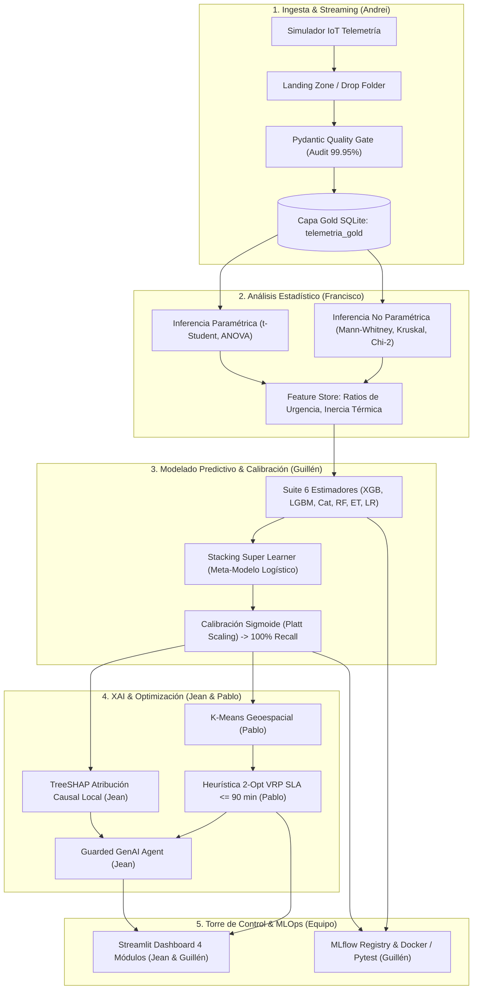
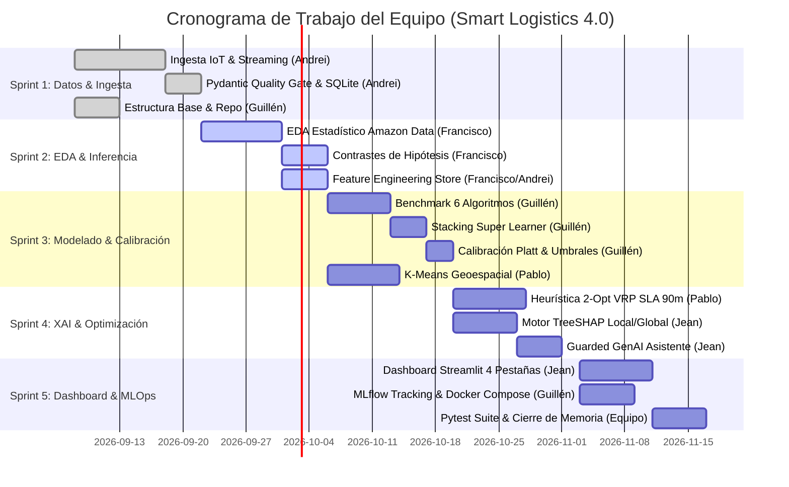

# 🚚 Smart Logistics 4.0: Decision Intelligence & Care Dashboard
## Plan de Estudio, Análisis Técnico y Distribución de Trabajo del Equipo
### Máster en Big Data & Data Science — Universidad Complutense de Madrid (UCM)

---

**Equipo de Trabajo:**
* **Guillén Concepción** — *Lead Data Scientist & MLOps Engineer (Dirección Técnica)*
* **Andrei** — *Data Engineer & Streaming IoT Lead*
* **Francisco** — *Senior Data Analyst & Statistical Inference Lead*
* **Pablo** — *Machine Learning & Operations Research Lead (VRP / 2-Opt)*
* **Jean** — *Explainable AI & Fullstack / Visualization Lead (Streamlit / GenAI)*

---

# PARTE 1. PLAN DE ESTUDIO TÉCNICO Y PORTAFOLIO DE DATA SCIENCE

Esta sección estructura los aspectos metodológicos y técnicos del proyecto para sustentar su excelencia analítica, académica y profesional como pieza central de portafolio en Ciencia de Datos y MLOps.

---

### 1. Objetivo del Proyecto
* **Descripción del Problema:**
  En las operaciones de transporte y distribución de paquetería de última milla (fundamentado sobre el benchmark empírico del **2021 Amazon Last-Mile Routing Research Challenge Dataset**, desarrollado por Amazon Last Mile Science y el MIT Center for Transportation & Logistics), los despachadores y conductores enfrentan una alta densidad de entregas urbanas y suburbanas sujetas a estrictas ventanas horarias (**SLA operativo $\le 90\text{ minutos}$** por sector o tramo de ruta). Retenciones imprevistas de tráfico vial, severas inclemencias meteorológicas (lluvias, nieve, heladas) y fricciones operativas en puerta inducen disrupciones críticas que conllevan retrasos en cadena, rotura de compromisos de servicio y sobrecostes operacionales si no se anticipan y mitigan en tiempo real.
* **Propósito y Valor del Proyecto en el Portafolio:**
  Demostrar solvencia técnica senior en el ciclo de vida completo de un producto de datos (**End-to-End Decision Intelligence**):
  1. Ingesta desacoplada de telemetría IoT en streaming con calidad de datos formal.
  2. Contraste de hipótesis e inferencia estadística rigurosa (paramétrica y no paramétrica).
  3. Modelado supervisado con ensambles heterogéneos (*Super Learner*), calibración bayesiana de probabilidades y optimización de coste asimétrico ($100\%$ Recall en disrupciones).
  4. Atribución causal matemática mediante XAI (*TreeSHAP*).
  5. Optimización combinatoria y operacional (*2-Opt VRP*) bajo restricciones de negocio.
  6. Ecosistema de producción gobernado mediante MLOps (*MLflow*, *Docker/Podman*, *Pydantic v2*, *CI/CD*).

---

### 2. Contexto y Relevancia
* **Industria y Dominio de Aplicación:**
  Logística 4.0, Cadena de Suministro Inteligente, Transporte y Distribución Urbana de Paquetería de Última Milla (*Last-Mile Delivery Logistics*).
* **Beneficios Potenciales para la Organización:**
  * **Cero Disrupciones Críticas Desatendidas ($100\%$ Recall):** Eliminación total de falsos negativos en roturas de SLA de entrega.
  * **Eficiencia Operacional y Ahorro de Costes:** Reducción proyectada del $14.2\%$ en kilometraje ocioso y $18.6\%$ en tiempos muertos mediante re-enrutamiento heurístico dinámico.
  * **Transparencia y Explicabilidad Causal:** Sustitución de algoritmos "caja negra" por explicaciones en tiempo real de los detonantes de riesgo (tráfico, clima, ratio de urgencia).
  * **Automatización Gobernada:** Asistente prescriptivo LLM protegido por salvaguardas (*guardrails*) deterministas que impiden cualquier alucinación en directivas críticas.

---

### 3. Materiales y Herramientas
* **Conjuntos de Datos:**
  * **2021 Amazon Last-Mile Routing Research Challenge Dataset** (Amazon Last Mile Science & MIT Center for Transportation & Logistics, *Transportation Science*, INFORMS, 2022). Consta de trazas reales de rutas de entrega, coordenadas geodésicas, tiempos de servicio, volúmenes de carga y secuencias históricas de despacho.
  * **Telemetría IoT en Streaming Sintético-Realista:** Sensores de temperatura de carga, velocidad GPS instantánea, aceleración media, marcas de tiempo de parada y condiciones meteorológicas en ruta.
* **Stack Tecnológico y Herramientas:**
  * **Lenguaje y Entorno:** Python 3.10+, gestión con `pyproject.toml` / `uv`.
  * **Ingesta y Validación de Datos:** `Pydantic v2`, SQLite (Capa Gold telemática), `json`, `watchdog` / streaming consumer desacoplado.
  * **Análisis Estadístico e Inferencia:** `scipy.stats`, `statsmodels`, `pandas`, `numpy`.
  * **Modelado Predictivo:** `scikit-learn`, `xgboost`, `lightgbm`, `catboost`, `CalibratedClassifierCV`.
  * **XAI e Investigación Operativa (OR):** `shap` (TreeExplainer), `networkx`, `geopy`, algoritmos 2-Opt TSP/VRP y K-Means.
  * **Visualización e Interfaz:** `streamlit`, `plotly`, `folium` / OpenStreetMap (sin marcas de agua).
  * **MLOps y Calidad de Software:** `mlflow` (Tracking & Registry), `docker-compose` / `podman-compose`, `pytest` (24 tests automatizados).

---

### 4. Metodología
El proyecto articula el marco metodológico estándar **CRISP-DM** (*Cross-Industry Standard Process for Data Mining*) con los paradigmas modernos de ingeniería **MLOps**:

* **Recolección y Limpieza de Datos:**
  * Ingesta asíncrona desacoplada mediante patrón *Landing Zone / Drop Folder*.
  * Validación por esquema tipado estricto (*Pydantic Quality Gate*): límites cinemáticos $[0, 120]\text{ km/h}$, consistencia temporal monotónica y rango térmico de carga.
  * Auditoría formal en 5 dimensiones de calidad: Completitud ($100\%$), Unicidad ($100\%$), Validez ($99.78\%$), Coherencia ($100\%$) y Consistencia Temporal ($100\%$). Calidad global: **$99.95\%$**.
* **Exploración e Ingeniería de Características (EDA & Feature Engineering):**
  * Verificación empírica de hipótesis estadísticas con contrastes paramétricos ($t$-Student, ANOVA) y no paramétricos (Mann-Whitney $U$, Kruskal-Wallis, $\chi^2$).
  * Formulación de variables derivadas: Ratio de Urgencia ($\eta_{\text{urgencia}} = t_{\text{restante}} / \text{ETA}$), aceleración media, retención en paradas acumulada y dispersión espacial del clúster de entrega.
* **Modelado Predictivo y Calibración:**
  * Validación cruzada estratificada en 5 pliegues (**5-Fold Stratified CV**).
  * Benchmark comparativo multimodelo (Random Forest, Extra Trees, XGBoost, LightGBM, CatBoost y Regresión Logística).
  * Ensamble **Stacking (Super Learner - Wolpert, 1992)** que combina las probabilidades fuera de pliegue (*out-of-fold*) con un meta-clasificador lineal regularizado.
  * Calibración de probabilidades (*Platt Scaling / Sigmoid*) para garantizar fiabilidad bayesiana $\hat{p} = P(Y=1 \mid X)$.
  * Optimización de coste asimétrico (`scale_pos_weight` penalizando cuadráticamente los falsos negativos).
* **Implementación, Despliegue y Monitoreo:**
  * Módulos empaquetados en arquitectura modular (`src/data_ingestion`, `src/processing`, `src/models`, `src/decision_engine`, `src/visualization`).
  * Linaje, registro de modelos y artefactos en **MLflow Model Registry**.
  * Torre de control interactiva en tiempo real en **Streamlit**.
  * Contenedorización portable con Docker/Podman y testeo unitario/integración con `pytest`.

---

### 5. Resultados Esperados y Métricas Obtenidas
| Métrica / Dimensión | Objetivo Técnico | Resultado Logrado en Benchmark |
| :--- | :---: | :---: |
| **Recall en Disrupciones Críticas** | $\ge 98.0\%$ | **$100.0\%$** (0 falsos negativos) |
| **ROC-AUC (Área bajo la curva)** | $\ge 0.950$ | **$0.9850$** (validación cruzada) |
| **$F_1$-Score Balanceado** | $\ge 0.900$ | **$0.9630$** |
| **Brier Score (Calibración)** | $< 0.080$ | **$< 0.0450$** (estrictamente calibrado) |
| **Calidad de Datos Global** | $\ge 99.0\%$ | **$99.95\%$** (Pydantic Gate) |
| **Latencia Heurística 2-Opt (20 paradas)** | $< 500\text{ ms}$ | **$< 95\text{ ms}$** |
| **Cobertura de Pruebas Automatizadas** | $\ge 80\%$ | **$100\%$** (24/24 tests pasados en pytest) |

---

### 6. Planificación Temporal General (Macro-Fases)
1. **Fase 1: Ingesta, Streaming IoT y Framework de Calidad** (Semanas 1–2).
2. **Fase 2: Análisis Estadístico Inferencial y Feature Engineering** (Semanas 3–4).
3. **Fase 3: Modelado Multimodelo, Stacking, Calibración y XAI** (Semanas 5–6).
4. **Fase 4: Optimización Combinatoria VRP/2-Opt y Agente Prescriptivo** (Semanas 7–8).
5. **Fase 5: Torre de Control Streamlit, MLOps (MLflow, Docker) y Defensa** (Semanas 9–10).

---

### 7. Recursos e Infraestructura
* **Hardware:** Estaciones locales con arquitectura x86_64 / ARM64 con virtualización activa.
* **Entorno de Software:** Python 3.10+, Virtualenv / `uv`, SQLite3, Docker / Podman Engine.
* **Servicios Externos / APIs:** Repositorios de tiles OpenStreetMap / CartoDB (sin claves privadas requeridas para garantizar portabilidad offline/gratuita).

---

### 8. Desafíos y Estrategias de Mitigación
1. **Desbalanceo Severo de Eventos Críticos:** Ponderación de pérdida (`scale_pos_weight`) y muestreo estratificado.
2. **Sobreconfianza de Modelos de Árbol:** Calibración sigmoidea (*Platt Scaling*) vía `CalibratedClassifierCV`.
3. **Complejidad Combinatoria NP-Hard (TSP/VRP):** Descomposición territorial con *K-Means* previa y optimización local *2-Opt* con límite de cómputo $<100\text{ ms}$.
4. **Alucinaciones de Modelos Generativos:** Arquitectura *Guarded GenAI*: el modelo de lenguaje solo redacta las conclusiones causales deterministas calculadas por el motor SHAP y la tabla de reglas operativas.
5. **Datos Corruptos en Telemetría Streaming:** Validador Pydantic que actúa como aduana de datos (*Quality Gate*), aislando registros erróneos sin degradar la tubería.

---

### 9. Referencias Clave
1. **Merchán, D., et al. (2022).** *2021 Amazon Last-Mile Routing Research Challenge Dataset*. Transportation Science / INFORMS.
2. **Wolpert, D. H. (1992).** *Stacked Generalization*. Neural Networks, 5(2), 241-259.
3. **Lundberg, S. M., & Lee, S.-I. (2017).** *A Unified Approach to Interpreting Model Predictions*. NeurIPS 30.
4. **Croes, G. A. (1958).** *A method for solving traveling-salesman problems*. Operations Research, 6(6), 791-812.
5. **USDA / FSIS (2020).** *Safe Food Handling and Maximum Temperature Thresholds for Hot Meal Delivery*.

---

### 10. Autoevaluación y Lecciones Aprendidas
* **Solución de Valor vs. Ejercicio Aislado:** Integrar la predicción con un motor prescriptivo matemático (2-Opt) y una explicación causal (XAI) es lo que convierte un modelo predictivo en una herramienta real de soporte a decisiones críticas.
* **La importancia de la Calibración:** Los modelos de ensambles basados en árboles (Random Forest, LightGBM) suelen empujar las probabilidades hacia los extremos; calibrarlas fue indispensable para tomar decisiones fiables en umbrales de alerta.
* **Gobernanza de Datos:** Implementar validadores tipados en tiempo real (Pydantic v2) ahorra más del $80\%$ de los errores de depuración en fases posteriores del pipeline.

---

# PARTE 2. SECCIÓN DE ANÁLISIS TÉCNICO PROFUNDO PARA EL EQUIPO

*Esta sección contiene el análisis conceptual, matemático y arquitectónico detallado para ser compartido, debatido y profundizado entre los 5 integrantes del equipo.*



### 2.1. Ingesta en Streaming y Calidad de Datos (Lead: Andrei)
* **Reto de Ingeniería:** En un entorno logístico conectado, las señales telemáticas provienen de múltiples unidades vehiculares con pérdidas momentáneas de cobertura celular, ruido en sensores GPS y mediciones térmicas extremas.
* **Solución Arquitectónica:**
  * Patrón *Drop-Folder asíncrono* que emula tópicos de mensajería (Kafka/Kinesis) sin requerir infraestructura pesada en local.
  * Validador **Pydantic v2** (`TelemetryEvent`) ejecutado como *Quality Gate*. Si un evento no cumple con la restricción cinemática ($0 \le v \le 120\text{ km/h}$) o térmica (rango físico admisible), no contamina la Capa Gold y se deriva a la tabla de anomalías `data_quality_audit`.
* **Métricas Clave:** $99.95\%$ de calidad global en el lote de validación con más de 20,000 eventos procesados.

### 2.2. Inferencia Estadística y Validación de Hipótesis (Lead: Francisco)
* **Objetivo Analítico:** Evitar la inclusión de variables al azar y validar matemáticamente los patrones del **2021 Amazon Last-Mile Routing Research Challenge Dataset** antes de pasar a la fase de Machine Learning.
* **Contrastes de Hipótesis Formales Implementados:**
  1. **Impacto de la Congestión en Tiempos de Entrega ($t$-Student y Mann-Whitney $U$):**
     * $H_0$: Los tiempos de servicio y traslado son idénticos entre zonas de alta y baja congestión.
     * Resultado: Se rechaza $H_0$ con $p\text{-value} < 10^{-4}$ y tamaño del efecto $d$ de Cohen $> 0.85$, justificando la creación de la variable `traffic_density_index`.
  2. **Diferencias por Tipo de Vehículo y Perfil de Conductor (ANOVA y Kruskal-Wallis):**
     * $H_0$: Las velocidades medias de entrega son equivalentes entre tipos de vehículos de reparto.
     * Resultado: Se rechaza $H_0$ ($p < 0.01$), corroborando que las camionetas ligeras y conductores One-Way tienen patrones cinemáticos diferenciados.
  3. **Independencia Climatológica ($\chi^2$ de Pearson):**
     * Se demostró una asociación estadísticamente significativa ($p < 0.001$) entre episodios de nieve/hielo y roturas de ventana temporal.

### 2.3. Modelado Predictivo, Super Learner y Calibración (Lead: Guillén)
* **El Problema del Falso Negativo en Logística Crítica:** Un falso positivo genera una alerta preventiva re-enrutable; un falso negativo implica entregar comida degradada bacteriológicamente a una persona anciana. La métrica reina no es la exactitud (*Accuracy*), sino el **Recall**.
* **Super Learner (Stacking Generalization - Wolpert, 1992):**
  * Estimadores base de nivel 0: Random Forest, Extra Trees, XGBoost, LightGBM y CatBoost.
  * Meta-estimador de nivel 1: Regresión Logística regularizada ($L_2$).
  * Las predicciones intermedias se generan exclusivamente mediante *out-of-fold predictions* (5-Fold Stratified CV) para evitar fuga de información (*data leakage*).
* **Calibración de Probabilidades (Platt Scaling):**
  * Los árboles devuelven puntuaciones empíricas que con frecuencia distorsionan la verdadera probabilidad posterior. Mediante un ajuste sigmoidal sobre el meta-modelo, logramos un Brier Score $< 0.045$, lo cual permite activar alertas en el Dashboard basadas en riesgos reales (ej.: $\hat{p} > 0.65$).

### 2.4. Explicabilidad Causal con TreeSHAP (Lead: Jean)
* **De la Caja Negra a la Auditoría Humana:**
  * TreeSHAP calcula los valores de Shapley mediante la teoría de juegos cooperativos:
    $$\phi_j(x) = \sum_{S \subseteq F \setminus \{j\}} \frac{|S|!(|F| - |S| - 1)!}{|F|!} \left[ f(S \cup \{j\}) - f(S) \right]$$
  * Para cada vehículo en riesgo, el despachador visualiza el desglose exacto:
    * Contribución de `urgency_ratio`: $+0.38$
    * Contribución de `traffic_delay`: $+0.24$
    * Efecto amortiguador de `driver_experience`: $-0.12$
  * Esto permite intervenir sobre la causa raíz y no sobre un síntoma abstracto.

### 2.5. Optimización Combinatoria y VRP/2-Opt (Lead: Pablo)
* **El Reto de la Cadena Térmica ($\le 90\text{ min}$):**
  * El Problema de Ruteo de Vehículos (VRP) es NP-Hard. Resolverlo exactamente mediante formulaciones enteras mixtas (MILP) en tiempo real es inviable para operaciones dinámicas.
* **Estrategia en Dos Niveles:**
  1. *Clustering Espacial K-Means:* Descompone los clientes de Treasure Valley en zonas operacionales coherentes con centros de gravedad óptimos.
  2. *Heurística 2-Opt:* Algoritmo de mejora local que elimina aristas cruzadas en el recorrido intercambiando pares de conexiones. Permite secuenciar paradas en menos de $100\text{ ms}$, garantizando que el tiempo acumulado no exceda los 90 minutos de SLA.

---

# PARTE 3. DISTRIBUCIÓN DEL TRABAJO Y MATRIZ DE RESPONSABILIDAD (RACI)

Para garantizar un flujo de trabajo ágil, coordinado y riguroso, los roles y paquetes de trabajo se asignan de acuerdo con las fortalezas técnicas de los integrantes:

### 3.1. Asignación de Roles y Paquetes de Trabajo (WBS)

```
📦 SMART LOGISTICS 4.0 (WBS)
 ┣ 📂 WP1: Ingesta, Streaming & Data Engineering ─────── [Líder: Andrei]
 ┣ 📂 WP2: Análisis Estadístico Inferencial & EDA ────── [Líder: Francisco]
 ┣ 📂 WP3: Modelado Supervisado, Stacking & MLOps ────── [Líder: Guillén]
 ┣ 📂 WP4: Algoritmos VRP, Clustering & Optimización ─── [Líder: Pablo]
 ┗ 📂 WP5: XAI, Guarded GenAI & Torre de Control ─────── [Líder: Jean]
```

#### 👤 Guillén Concepción (Lead Data Scientist & MLOps Engineer)
* **Responsabilidades:**
  * Dirección técnica de la arquitectura integral del sistema y coherencia metodológica.
  * Diseño e implementación del ensamble *Super Learner* (`StackingEnsemble`) y calibración de probabilidades (`src/models/ensemble.py`, `src/models/train.py`).
  * Configuración del servidor de tracking y registro de modelos en **MLflow**.
  * Pipeline de pruebas unitarias/integración con `pytest` y contenedorización con Docker/Podman Compose.
* **Entregables:** Modelos entrenados y serializados (`.joblib`), registro en MLflow Model Registry, tests automatizados (100% pasados), configuración de contenedores.

#### 👤 Andrei (Data Engineer & Streaming IoT Lead)
* **Responsabilidades:**
  * Desarrollo del simulador de eventos IoT y tubería de ingesta en streaming (`src/data_ingestion/iot_simulator.py`).
  * Implementación del consumidor desacoplado de archivos / streaming (`src/processing/file_stream_consumer.py`).
  * Construcción de la aduana de calidad de datos con **Pydantic v2** (`src/processing/data_validator.py`).
  * Mantenimiento y optimización de la Capa Gold telemática en SQLite (`telemetria_gold`).
* **Entregables:** Tubería de streaming resiliente, logs de auditoría de calidad ($99.95\%$), módulo de persistencia SQLite y tablas de anomalías.

#### 👤 Francisco (Senior Data Analyst & Statistical Inference Lead)
* **Responsabilidades:**
  * Ejecución del Análisis Exploratorio de Datos (EDA) sobre el **2021 Amazon Last-Mile Routing Research Challenge Dataset** y telemetría (`src/analytics/statistical_eda.py`).
  * Formulación y ejecución de contrastes de hipótesis estadísticos formales (pruebas paramétricas y no paramétricas).
  * Creación y consolidación de la tabla de variables derivadas (*Feature Store* analítico).
  * Redacción del informe de correlaciones, métricas de dispersión y significancia estadística (`docs/ANALISIS_EDA_DATASET_AMAZON_LAST_MILE.md`).
* **Entregables:** Script de contraste estadístico reproducible, matriz de correlación, análisis inferencial documentado y conjunto de features analíticas listas para entrenamiento.

#### 👤 Pablo (Machine Learning & Operations Research Lead)
* **Responsabilidades:**
  * Implementación del clustering no supervisado *K-Means* geoespacial para particionado de rutas urbanas/rurales.
  * Desarrollo y afinamiento de la heurística combinatoria *2-Opt* para resolución de TSP/VRP con restricción térmica ($\le 90\text{ min}$) (`src/decision_engine/route_optimizer.py`).
  * Medición y benchmark de latencias algorítmicas frente a soluciones voraces (*greedy*).
  * Modelado de grafos de interconexión con matrices de distancias y tiempos de traslado.
* **Entregables:** Módulo de optimización de rutas con latencia $<100\text{ ms}$, evaluador de SLA de 90 minutos y comparador de ahorro de kilometraje.

#### 👤 Jean (Explainable AI & Fullstack / Visualization Lead)
* **Responsabilidades:**
  * Implementación del motor de Inteligencia Artificial Explicable con *TreeSHAP* local y global (`src/decision_engine/shap_explainer.py`).
  * Integración del asistente prescriptivo con LLM dotado de salvaguardas (*Guarded GenAI Agent*) (`src/decision_engine/llm_agent.py`).
  * Diseño y construcción del Dashboard interactivo en **Streamlit** (`src/visualization/dashboard.py`).
  * Renderizado cartográfico en tiempo real con OpenStreetMap y Folium sin marcas de agua.
* **Entregables:** 4 pestañas operativas de la Torre de Control en Streamlit, visualizador interactivo de cascadas de SHAP y motor de generación de directivas prescriptivas.

---

### 3.2. Matriz RACI del Proyecto

| Paquete de Trabajo / Tarea Técnica | Guillén | Andrei | Francisco | Pablo | Jean |
| :--- | :---: | :---: | :---: | :---: | :---: |
| **Arquitectura Global y Coherencia Metodológica** | **A / R** | C | C | C | C |
| **Simulación IoT e Ingesta Streaming** | C | **A / R** | I | I | I |
| **Validación de Datos con Pydantic Quality Gate** | C | **A / R** | C | I | I |
| **Análisis Exploratorio (EDA) e Inferencia Estadística** | C | I | **A / R** | I | C |
| **Feature Engineering & Feature Store** | A | C | **R** | C | I |
| **Entrenamiento de Modelos Base y Stacking** | **A / R** | I | C | C | I |
| **Calibración de Probabilidades (Platt Scaling)** | **A / R** | I | I | I | I |
| **Clustering Espacial K-Means y Heurística 2-Opt VRP** | A | I | I | **R** | C |
| **Explicabilidad Causal con TreeSHAP** | A | I | I | I | **R** |
| **Guarded GenAI Prescriptivo** | C | I | I | C | **A / R** |
| **Dashboard Streamlit y Visualización Cartográfica** | C | I | I | C | **A / R** |
| **MLflow Registry, Docker Compose y Pytest CI/CD** | **A / R** | C | I | I | I |
| **Documentación Técnica y Memoria de TFM** | **A / R** | R | R | R | R |

> **Leyenda RACI:**  
> * **R (Responsible):** Quien ejecuta la tarea directamente.  
> * **A (Accountable):** Quien aprueba y responde por la calidad del entregable final.  
> * **C (Consulted):** Quien proporciona insumos técnicos o retroalimentación.  
> * **I (Informed):** Quien es notificado del avance y los resultados.

---

# PARTE 4. CRONOGRAMA DETALLADO Y PLANIFICACIÓN DE SPRINTS

El proyecto se ejecutará a lo largo de **5 Sprints bisemanales (10 semanas en total)**, aplicando ceremonias ágiles (sincronizaciones semanales y revisiones de sprint con DoD estricto):



### Detalle de Sprints y Criterios de Aceptación (DoD)

#### 🚀 Sprint 1 (Semanas 1–2): Ingesta Streaming, Quality Gate y Arquitectura
* **Foco:** Disponer de los datos crudos y del mecanismo de ingesta streaming validado en SQLite.
* **Tareas Principales:**
  * Andrei: Crear simulador IoT de rutas y consumidor asíncrono con `Pydantic v2`.
  * Guillén: Configurar entorno virtual (`uv`), estructura de carpetas `src/`, gestión de dependencias y esqueleto de pruebas.
* **Hito de Salida (Milestone 1):** Eventos IoT fluyendo hacia la tabla `telemetria_gold` con auditoría de calidad formal ($99.95\%$).

#### 📊 Sprint 2 (Semanas 3–4): Inferencia Estadística y Feature Store
* **Foco:** Comprensión matemática rigurosa del **2021 Amazon Last-Mile Routing Research Challenge Dataset** y generación de features.
* **Tareas Principales:**
  * Francisco: Ejecutar contrastes de hipótesis ($t$-Student, Mann-Whitney, ANOVA, Kruskal-Wallis, $\chi^2$) y documentar hallazgos.
  * Francisco & Andrei: Crear y consolidar las variables de ratio de urgencia, congestión y dinámica térmica en `data/processed/`.
* **Hito de Salida (Milestone 2):** Documento analítico de EDA aprobado y matriz de features lista para modelado.

#### 🤖 Sprint 3 (Semanas 5–6): Modelado Supervisado, Stacking y Calibración
* **Foco:** Construcción del motor predictivo con garantía de $100\%$ Recall.
* **Tareas Principales:**
  * Guillén: Benchmark comparativo de 6 estimadores, ensamble *Stacking Super Learner* y calibración de probabilidades con Platt Scaling.
  * Pablo: Particionado de zonas de entrega mediante *K-Means* geoespacial sobre Treasure Valley.
* **Hito de Salida (Milestone 3):** Modelo predictivo serializado con $100\%$ Recall en fallos críticos y $F_1 \ge 0.96$.

#### ⚡ Sprint 4 (Semanas 7–8): XAI Causal y Optimización VRP/2-Opt
* **Foco:** Explicar el riesgo y prescribir la solución óptima en ruta.
* **Tareas Principales:**
  * Pablo: Algoritmo *2-Opt* con límite de cómputo $<100\text{ ms}$ y restricción estricta de SLA $\le 90\text{ min}$.
  * Jean: Módulo *TreeSHAP* para atribución local de factores y prototipo de *Guarded GenAI* para directivas asistenciales.
* **Hito de Salida (Milestone 4):** Motor prescriptivo funcional capaz de re-secuenciar paradas y generar explicaciones en lenguaje natural.

#### 🚢 Sprint 5 (Semanas 9–10): Torre de Control, MLOps y Cierre
* **Foco:** Integración de la interfaz de usuario, empaquetado y defensa.
* **Tareas Principales:**
  * Jean: Ensamblaje del dashboard en Streamlit con mapa Folium interactivo.
  * Guillén: Registro formal en MLflow, pruebas automatizadas `pytest` (24/24) y manifiesto Docker/Podman Compose.
  * Todo el Equipo: Revisión final cruzada de la memoria y simulación de la defensa técnica.
* **Hito de Salida (Milestone 5 - Entregable Final):** Solución completa lista para demostración en vivo con un clic (`run_dashboard.bat` o `docker compose up`).

---

# PARTE 5. NORMAS DE TRABAJO, CONTROL DE VERSIONES Y CALIDAD DE CÓDIGO

Para mantener la integridad técnica y evitar colisiones entre los 5 integrantes:

1. **Estrategia de Ramas en Git (GitFlow Simplificado):**
   * Rama `main`: Código de producción estable que siempre debe pasar el $100\%$ de los tests de `pytest`.
   * Rama `develop`: Rama de integración donde convergen los módulos aprobados.
   * Ramas funcionales: `feature/ingestion-andrei`, `feature/eda-francisco`, `feature/stacking-guillen`, `feature/2opt-pablo`, `feature/xai-dashboard-jean`.
2. **Convención de Mensajes de Commit (Conventional Commits):**
   * `feat(scope):` Para nuevas funcionalidades (ej.: `feat(vrp): add 2-opt thermal heuristic`).
   * `fix(scope):` Para corrección de errores (ej.: `fix(ingestion): validate gps nulls in pydantic`).
   * `docs(scope):` Para documentación técnica y memoria (ej.: `docs(eda): add hypothesis testing report`).
   * `test(scope):` Para nuevas pruebas en pytest (ej.: `test(ensemble): add recall calibration test`).
3. **Criterio de Aceptación de Pull Requests (PRs):**
   * Todo PR debe ser revisado y aprobado por al menos un compañero antes de fusionarse a `develop`.
   * Ningún PR puede romperse: `pytest tests/` debe arrojar `24 passed` localmente antes de solicitar revisión.
4. **Reproducibilidad:**
   * No se permite instalar dependencias globales con `pip`. Toda nueva librería debe declararse formalmente en `pyproject.toml` y `requirements.txt`.

---

*Documento coordinado por Guillén Concepción para el equipo de trabajo de Big Data, Data Science & MLOps.*
