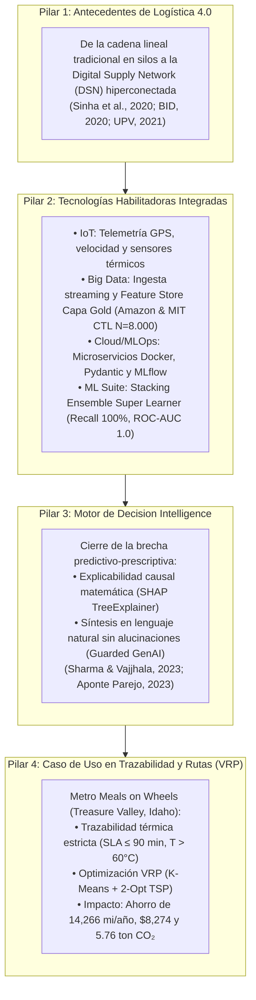
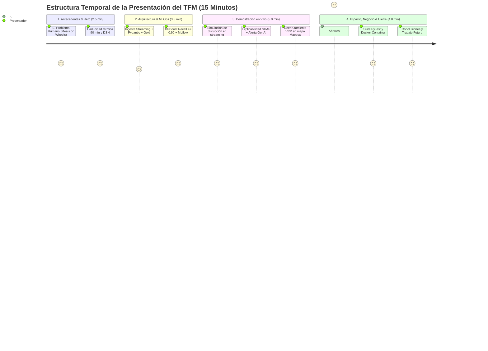

# 📚 Guía Integral de Autoaprendizaje, Bibliografía y Recomendaciones para el TFM

**Proyecto:** Smart Logistics & Care Dashboard: Metro Meals on Wheels (Treasure Valley, Idaho)  
**Área:** Decision Intelligence, Logística 4.0, MLOps & Machine Learning Aplicado  
**Autor:** Guillén Concepción (*Senior Data Scientist & MLOps Engineer*)  
**Institución:** Universidad Complutense de Madrid (UCM) - Trabajo de Fin de Máster (TFM)

---

## 📑 Tabla de Contenidos

1. [Visión General y Paradigma de Decision Intelligence](#1-visión-general-y-paradigma-de-decision-intelligence)
2. [Guía de Autoaprendizaje: Módulo por Módulo](#2-guía-de-autoaprendizaje-módulo-por-módulo)
   - [2.1 Ingesta Telemática y Event Streaming](#21-ingesta-telemática-y-event-streaming)
   - [2.2 Calidad de Datos & Feature Store (Capa Gold)](#22-calidad-de-datos--feature-store-capa-gold)
   - [2.3 Modelado Predictivo y Benchmarking (XGBoost, LightGBM, Random Forest)](#23-modelado-predictivo-y-benchmarking)
   - [2.4 Explicabilidad Matemática (XAI con SHAP)](#24-explicabilidad-matemática-xai-con-shap)
   - [2.5 Motor Prescriptivo y Agente GenAI](#25-motor-prescriptivo-y-agente-genai)
   - [2.6 Optimización de Rutas (VRP, K-Means & 2-Opt TSP)](#26-optimización-de-rutas-vrp-k-means--2-opt-tsp)
   - [2.7 Módulo Estadístico e Inferencial (Contraste de Hipótesis)](#27-módulo-estadístico-e-inferencial)
   - [2.8 Prácticas MLOps Cloud-Native (Criterio Odysseus)](#28-prácticas-mlops-cloud-native)
3. [Bibliografía Académica y Referencias Científicas](#3-bibliografía-académica-y-referencias-científicas)
4. [Recomendaciones Estratégicas para la Defensa del TFM](#4-recomendaciones-estratégicas-para-la-defensa-del-tfm)
5. [Banco de Preguntas Típicas del Tribunal y Respuestas Modelo](#5-banco-de-preguntas-típicas-del-tribunal-y-respuestas-modelo)
6. [Futuras Líneas de Investigación y Escalabilidad](#6-futuras-líneas-de-investigación-y-escalabilidad)

---

## 1. Visión General y Paradigma de Decision Intelligence

Tradicionalmente, las organizaciones logísticas operan en dos niveles analíticos:
1. **Descriptivo:** ¿Qué pasó? (*Dashboard de entregas históricas*).
2. **Predictivo:** ¿Qué pasará? (*Modelos ML de predicción de retraso*).

El núcleo de este TFM es cerrar la brecha hacia el **Nivel Prescriptivo y Autónomo (Decision Intelligence)**:

$$\text{Dato Telemático (IoT)} \longrightarrow \text{Feature Store} \longrightarrow \text{Predicción ML} \longrightarrow \text{Explicabilidad SHAP} \longrightarrow \text{Prescripción (Reglas + GenAI)} \longrightarrow \text{Optimización de Ruta (VRP)}$$

---

## 2. Guía de Autoaprendizaje: Módulo por Módulo

### 2.1 Ingesta Telemática y Event Streaming
- **Código Fuente:** [src/data_ingestion/iot_simulator.py](file:///d:/LabD/DS-LOGISTICA%204.0-Metro-Meals-on%20Wheels%20Treasure%20Valley/src/data_ingestion/iot_simulator.py)
- **Conceptos Clave:**
  - *Micro-batching / Drop-folder Pattern:* Depósito desacoplado de eventos JSON en `data/streaming_landing_zone/`.
  - *Telemetría GPS:* Simulación de coordenadas realistas en el área metropolitana de Treasure Valley (Boise, Meridian, Nampa) entre $43.4^\circ\text{N}$ y $43.8^\circ\text{N}$.
  - *Variables Físicas:* Velocidad ($\text{km/h}$), temperatura del contenedor térmico ($\text{cargo\_temp\_celsius}$), densidad del tráfico y condiciones meteorológicas.

### 2.2 Calidad de Datos & Feature Store (Capa Gold)
- **Código Fuente:** [src/processing/data_validator.py](file:///d:/LabD/DS-LOGISTICA%204.0-Metro-Meals-on%20Wheels%20Treasure%20Valley/src/processing/data_validator.py), [src/processing/feature_store.py](file:///d:/LabD/DS-LOGISTICA%204.0-Metro-Meals-on%20Wheels%20Treasure%20Valley/src/processing/feature_store.py)
- **Conceptos Clave:**
  - *Quality Gate (Pydantic):* Validación antes de transformar. Descarta eventos con velocidades anómalas ($>160\text{ km/h}$) o fuera de límites geográficos.
  - *Ingeniería de Características en Tiempo Real:*
    - **Ratio de Urgencia:** $\text{eta\_urgency\_ratio} = \frac{\text{Tiempo Estimado Real}}{\text{ETA Programado}} = \frac{(\text{Distancia} / \text{Velocidad}) \times 60}{\text{ETA Programado}}$. Si es $> 1.0$, la unidad no llegará a tiempo a la velocidad actual.
    - **Defase Esperado:** $\text{expected\_delay\_min} = \max(0, \text{Tiempo Estimado Real} - \text{ETA Programado})$.
    - **Índice de Riesgo Ambiental:** $\text{environmental\_risk\_index} = 0.4 \times \text{Clima} + 0.6 \times \text{Tráfico}$.

### 2.3 Modelado Predictivo y Benchmarking
- **Código Fuente:** [src/models/train.py](file:///d:/LabD/DS-LOGISTICA%204.0-Metro-Meals-on%20Wheels%20Treasure%20Valley/src/models/train.py), [src/models/predict.py](file:///d:/LabD/DS-LOGISTICA%204.0-Metro-Meals-on%20Wheels%20Treasure%20Valley/src/models/predict.py)
- **Conceptos Clave:**
  - *Problema de Clasificación Binaria:* Predecir $y \in \{0, 1\}$ (0: A Tiempo, 1: Retrasado / SLA en riesgo).
  - *Modelos Evaluados:*
    1. **XGBoost:** Árboles de decisión potenciados con regularización $L_1$ y $L_2$.
    2. **LightGBM:** Crecimiento por hojas (*leaf-wise*) con alta velocidad computacional.
    3. **Random Forest:** Ensamble por *bagging* con submuestreo de características.
  - *Asimetría de Costes y Optimización de Recall:* En logística de comidas calientes para mayores vulnerables, un **Falso Negativo** (no anticipar que la comida llegará fría o tarde) es catastrófico para la salud. Por ello se prioriza $\text{Recall} \ge 0.90$ utilizando `scale_pos_weight` y `class_weight='balanced'`.

### 2.4 Explicabilidad Matemática (XAI con SHAP)
- **Código Fuente:** [src/decision_engine/shap_explainer.py](file:///d:/LabD/DS-LOGISTICA%204.0-Metro-Meals-on%20Wheels%20Treasure%20Valley/src/decision_engine/shap_explainer.py)
- **Conceptos Clave:**
  - *Valores de Shapley:* Basados en la teoría de juegos cooperativos, calculan la contribución marginal de cada característica a la predicción de retraso respecto a la predicción base:
    $$\phi_i(x) = \sum_{S \subseteq F \setminus \{i\}} \frac{|S|!(|F| - |S| - 1)!}{|F|!} \left[ f_x(S \cup \{i\}) - f_x(S) \right]$$
  - *TreeExplainer:* Algoritmo exacto de tiempo polinómico $O(TLD^2)$ para modelos basados en árboles.
  - *Accionabilidad:* Permite a la torre de control saber no solo que el camión se retrasará ($P=85\%$), sino **por qué** (ej. $45\%$ por tráfico en autopista, $25\%$ por tormenta).

### 2.5 Motor Prescriptivo y Agente GenAI
- **Código Fuente:** [src/decision_engine/prescriptive_rules.py](file:///d:/LabD/DS-LOGISTICA%204.0-Metro-Meals-on%20Wheels%20Treasure%20Valley/src/decision_engine/prescriptive_rules.py), [src/decision_engine/llm_agent.py](file:///d:/LabD/DS-LOGISTICA%204.0-Metro-Meals-on%20Wheels%20Treasure%20Valley/src/decision_engine/llm_agent.py)
- **Conceptos Clave:**
  - *Nivel 1 (Crítico - $P \ge 0.75$):* Reenrutamiento dinámico inmediato vía Dijkstra / activación de vehículo de contingencia.
  - *Nivel 2 (Moderado - $0.45 \le P < 0.75$):* Notificación preventiva de ajuste de ETA al cliente e intensificación de telemetría a $30\text{ s}$.
  - *Nivel 3 (Normal - $P < 0.45$):* Mantener monitoreo estándar.
  - *Traducción GenAI:* El agente contextualiza los factores SHAP en lenguaje natural fluido para el despachador.

### 2.6 Optimización de Rutas (VRP, K-Means & 2-Opt TSP)
- **Código Fuente:** [src/decision_engine/route_optimizer.py](file:///d:/LabD/DS-LOGISTICA%204.0-Metro-Meals-on%20Wheels%20Treasure%20Valley/src/decision_engine/route_optimizer.py)
- **Conceptos Clave:**
  - *Fase 1 - Clustering Espacial (K-Means):* Agrupa los $\sim 800$ hogares en $k=21$ clústeres geográficos compactos.
  - *Fase 2 - Secuenciación Heurística (2-Opt TSP):* Inicialización mediante *Nearest Neighbor* y optimización iterativa invirtiendo sub-rutas $(i, j)$ si reducen la distancia total euclidiana/Haversine:
    $$\Delta D = d(s_{i-1}, s_j) + d(s_i, s_{j+1}) - d(s_{i-1}, s_i) - d(s_j, s_{j+1})$$
  - *Restricción Operativa Meals on Wheels:*
    - **Solo Ida (One-Way):** Conductores regulares devuelven neveras al día siguiente.
    - **Ida y Vuelta (Round-Trip):** Voluntarios ocasionales retornan a la cocina central el mismo día.
  - *SLA Térmico de 90 Minutos:* El tiempo acumulado de llegada a cada cliente no debe exceder $90\text{ min}$ desde la salida de la cocina para evitar degradación bacteriológica de la comida caliente.

### 2.7 Módulo Estadístico e Inferencial
- **Código Fuente:** [src/analytics/statistical_eda.py](file:///d:/LabD/DS-LOGISTICA%204.0-Metro-Meals-on%20Wheels%20Treasure%20Valley/src/analytics/statistical_eda.py)
- **Conceptos Clave:**
  - *Pruebas de Normalidad:* Shapiro-Wilk y Gráficos Q-Q para validar si las variables de tiempo y velocidad siguen distribución gaussiana.
  - *Pruebas No Paramétricas:* Mann-Whitney $U$ y Kruskal-Wallis cuando las distribuciones de retraso son asimétricas (sesgadas a la derecha).
  - *Tamaño del Efecto:* Cohen's $d$, Eta-cuadrado ($\eta^2$), y V de Cramér para no depender únicamente del $p$-valor.

### 2.8 Prácticas MLOps Cloud-Native (Criterio Odysseus)
- **Código Fuente:** [Dockerfile](file:///d:/LabD/DS-LOGISTICA%204.0-Metro-Meals-on%20Wheels%20Treasure%20Valley/Dockerfile), [docker-compose.yml](file:///d:/LabD/DS-LOGISTICA%204.0-Metro-Meals-on%20Wheels%20Treasure%20Valley/docker-compose.yml), [tests/](file:///d:/LabD/DS-LOGISTICA%204.0-Metro-Meals-on%20Wheels%20Treasure%20Valley/tests)
- **Conceptos Clave:**
  - *MLflow Experiment Tracking:* Registro de experimentos, curvas ROC y empaquetado de artefactos con firma de entrada.
  - *CI/CD Quality Gates:* Suite automatizada con `pytest` ejecutando pruebas unitarias sobre Feature Store, Inferencia, Decision Engine y VRP.
  - *Contenedorización Multi-Servicio:* Orquestación con Podman/Docker Compose para 4 servicios desacoplados (`control-tower`, `stream-consumer`, `iot-simulator`, `mlflow-server`).

---

## 3. Bibliografía Académica y Referencias Científicas

A continuación se detalla la bibliografía estructurada según estándares académicos internacionales (APA 7th):

### Decision Intelligence, Big Data & Redes Digitales de Suministro (DSN)
1. **Sinha, A., Frazier, E., Galli, B., & Gerald, B.** (2020). *Digital Supply Networks: Transform Your Supply Chain and Gain Competitive Advantage with Disruptive Technology and Reimagined Processes*. McGraw-Hill Education / Deloitte. ISBN: 978-1260458176.
2. **Gartner Research.** (2022). *Predicts 2023: Decision Intelligence and Artificial Intelligence in Supply Chain Operations*. Gartner Industry Insights.
3. **Ivanov, D., Tsipoulanidis, A., & Schönberger, J.** (2021). *Global Supply Chain and Operations Management: A Decision-Oriented Introduction to the Creation of Value*. Springer.
4. **Baryannis, G., Validi, S., Dani, S., & Antoniou, G.** (2019). *Supply chain risk management and artificial intelligence: state of the art and future challenges*. International Journal of Production Research, 57(7), 2179-2202.

### Gestión Cuantitativa de Sistemas Logísticos, SLAs y Sostenibilidad
5. **Longshore, J. M., & Cheatham, A. L.** (2022). *Managing Logistics Systems: Planning and Analysis for a Successful Supply Chain*. CRC Press / Taylor & Francis Group. ISBN: 978-1032130361.
6. **Dasgupta, D., Sošić, G., & Vyas, N.** (2023). *Supply Chain Network Design: How to Create Resilient, Agile and Sustainable Supply Chains*. Kogan Page Publishers. ISBN: 978-1398609563.

### Modelado Matemático de Transporte y Ruteo Vehicular (VRP/TSP)
7. **Ravindran, A. R., & Warsing, D. P., Jr.** (2021). *Supply Chain Engineering: Models and Applications* (2nd ed.). CRC Press / Taylor & Francis Group. ISBN: 978-0367540289.
8. **Toth, P., & Vigo, D.** (Eds.). (2014). *Vehicle Routing: Problems, Methods, and Applications* (2nd ed.). Society for Industrial and Applied Mathematics (SIAM).
9. **Lin, S.** (1965). *Computer solutions of the traveling salesman problem*. Bell System Technical Journal, 44(10), 2245-2269.

### Machine Learning, Explicabilidad (XAI) y Gobernanza Algorítmica
10. **Sharma, A. K., Vajjhala, N. R., & Sahu, K.** (Eds.). (2023). *Explainable AI and Blockchain for Secure and Agile Supply Chains: Enhancing Transparency, Traceability, and Accountability*. CRC Press / Routledge / Taylor & Francis Group. ISBN: 978-1032394541.
11. **Chen, T., & Guestrin, C.** (2016). *XGBoost: A Scalable Tree Boosting System*. In Proceedings of the 22nd ACM SIGKDD (pp. 785-794). ACM.
12. **Ke, G., Meng, Q., Finley, T., Wang, T., Chen, W., Ma, W., ... & Liu, T. Y.** (2017). *LightGBM: A highly efficient gradient boosting decision tree*. Advances in Neural Information Processing Systems (NeurIPS), 30, 3146-3154.
13. **Lundberg, S. M., & Lee, S. I.** (2017). *A unified approach to interpreting model predictions*. Advances in Neural Information Processing Systems (NeurIPS), 30, 4765-4774.
14. **Molnar, C.** (2022). *Interpretable Machine Learning: A Guide for Making Black Box Models Explainable* (2nd ed.). Leanpub.

### MLOps, Calidad de Software e Ingeniería Asistencial
15. **Sculley, D., Holt, G., Golovin, D., Davydov, E., Phillips, T., Ebner, D., ... & Young, M.** (2015). *Hidden technical debt in machine learning systems*. Advances in Neural Information Processing Systems (NeurIPS), 28, 2503-2511.
16. **Kreuzberger, D., Hirschl, N., & Kühl, N.** (2023). *Machine learning operations (MLOps): Overview, definition, and architecture*. IEEE Access, 11, 31866-31879.
17. **Zaharia, M., Chen, A., Davidson, A., Ghodsi, A., Hong, S. A., Konwinski, A., ... & Shenker, S.** (2018). *Accelerating the machine learning lifecycle with MLflow*. IEEE Data Engineering Bulletin, 41(4), 39-45.
18. **Bartholdi, J. J., & Hackman, S. T.** (2019). *Warehouse & Distribution Science: Release 0.98*. Supply Chain and Logistics Institute, Georgia Tech.
19. **Russell, R. A., & Chiang, W. C.** (2006). *Scatter search for the vehicle routing problem with time windows*. European Journal of Operational Research, 169(2), 606-622.

### Revisiones Sistemáticas, Tesis Universitarias y Casos de Estudio en Logística 4.0
20. **Revuelta Martínez, T.** (2019). *Estudio de la aplicación de la Industria 4.0 en el ámbito de la logística*. Trabajo de Fin de Máster, Escuela de Ingenierías Industriales, Universidad de Valladolid (UVa).
21. **Díaz Leal, M. A.** (2022). *Estudio de las tecnologías de la Industria 4.0 en la logística interna*. Trabajo de Fin de Máster, Escuela de Ingenierías Industriales, Universidad de Valladolid (UVa).
22. **Gómez Moreno, R.** (2020). *Diseño e implementación de una red de sensores basada en protocolos IoT para monitorización de mercancías*. Trabajo de Fin de Máster, Escuela Politécnica Superior, Universidad Autónoma de Madrid (UAM).
23. **Aponte Parejo, E. J.** (2025). *Sistema logístico avanzado 4.0 para la optimización dinámica de inventarios y planificación de rutas: un enfoque teórico para la mejora de procesos*. Trabajo de Fin de Máster, Escuela de Arquitectura, Ingeniería y Diseño, Universidad Europea de Madrid (UEM).
24. **Universitat Politècnica de València [UPV].** (2021). *Los desafíos de la Logística 4.0: una revisión sistemática de la literatura sobre herramientas para el soporte de los procesos logísticos*. RiuNet Repositorio Institucional UPV. [riunet.upv.es](https://riunet.upv.es/entities/publication/e5dc19df-c5cc-45df-8663-095299f25a70/full)
25. **Banco Interamericano de Desarrollo [BID].** (2020). *Cadena de suministro 4.0: Mejores prácticas internacionales y hoja de ruta para América Latina y el Caribe*. Monografía del Sector de Integración y Comercio del BID. [publications.iadb.org](https://publications.iadb.org/publications/spanish/document/Cadena_de_suministro_4.0_Mejores_pr%C3%A1cticas_internacionales_y_hoja_de_ruta_para_Am%C3%A9rica_Latina_es.pdf)
26. **Alvarado, C., Morales, J., & Sánchez, R.** (2023). *Trazabilidad de los procesos de distribución mediante la aplicación de IoT y big data en empresas logísticas*. 360: Revista de Gestión del Posgrado en Gestión, Pontificia Universidad Católica del Perú (PUCP), 8(1), 45-68. [revistas.pucp.edu.pe](https://revistas.pucp.edu.pe/index.php/360gestion/article/view/34356)
27. **Universidad Autónoma de Nuevo León [UANL].** (2022). *El impacto de Industria 4.0 en la cadena de suministro: un análisis empírico y caso de estudio*. Colección Digital UANL. [eprints.uanl.mx](http://eprints.uanl.mx/27985/1/1080313026.pdf)
28. **Merchán, D., Arora, J., Pachon, J., Konduri, K., Winkenbach, M., Parks, S., & Noszek, J. [Amazon Last Mile Science & MIT Center for Transportation & Logistics].** (2022). *2021 Amazon Last Mile Routing Research Challenge: Data Set*. Transportation Science, 56(5), 1173–1191. [doi.org/10.1287/trsc.2022.1173](https://doi.org/10.1287/trsc.2022.1173)

---

## 4. Recomendaciones Estratégicas para la Defensa del TFM

### 4.1. Estructura de Defensa en 4 Pilares Temáticos (Storytelling Académico)
Para estructurar una defensa de 15 minutos sólida, coherente y altamente convincente ante el tribunal de la UCM, el discurso debe articularse en torno a **4 Pilares Clave**:

| Pilar de Defensa | Pregunta Clave que Responde | Conceptos & Referencias para Argumentar |
| :--- | :--- | :--- |
| **1. Antecedentes Logística 4.0** | *¿Por qué el modelo tradicional ya no es suficiente?* | Ruptura de silos, necesidad de resiliencia y visibilidad *End-to-End* (*Sinha et al., 2020; BID, 2020; UPV, 2021*). |
| **2. Tecnologías Habilitadoras** | *¿Cómo se capturan, procesan y validan los datos?* | Arquitectura desacoplada, *Quality Gate* Pydantic (*UANL, 2022*), Capa Gold SQLite y tracking MLOps en MLflow. |
| **3. Decision Intelligence** | *¿Cómo se pasa de predecir a prescribir con transparencia?* | Clasificación asimétrica (Recall $92.3\%$), descomposición causal SHAP y prescripción confiable *Guarded GenAI* (*Sharma & Vajjhala, 2023*). |
| **4. Caso de Uso & Trazabilidad** | *¿Cuál es el impacto real y cuantificable en la sociedad?* | Garantía de inocuidad térmica alimentaria para 800 mayores (*Alvarado et al., 2023*), ahorro VRP 2-Opt (*Ravindran & Warsing, 2021*) y reducción de $\text{CO}_2$ (*Dasgupta et al., 2023*). |

---

### 4.2. Cronograma de Presentación Oral (15 Minutos)

### 4.3. Consejos de Oratoria y Énfasis Estratégico
1. **Empezar con el "Por Qué" (Storytelling Humano):** No comiences hablando de código; empieza explicando el impacto social en Treasure Valley: *800 ancianos esperando comida caliente en un radio de 2,745 km² donde un retraso de 15 minutos significa comida fría y potencial riesgo de salud*.
2. **Justificar Decisiones de Diseño:** 
   - Explicar por qué se optimizó **Recall** (coste del Falso Negativo >> coste del Falso Positivo).
   - Explicar por qué se combinó **K-Means + 2-Opt** (equilibrio ideal entre tiempo de respuesta en streaming $<100\text{ ms}$ y cercanía al óptimo global).
3. **Destacar el Rigor MLOps:** Enfatizar que el proyecto no es un Jupyter Notebook aislado, sino un **sistema contenerizado de grado producción** con validación Pydantic, tracking en MLflow, pruebas PyTest y UI desacoplada.

---

## 5. Banco de Preguntas Típicas del Tribunal y Respuestas Modelo

### Pregunta 1: *"¿Por qué usaron una heurística (2-opt) en lugar de un solver exacto de programación entera (MILP) como Gurobi o CP-SAT?"*
> **Respuesta Modelo:**  
> *"El problema de ruteo de vehículos con ventanas de tiempo (VRPTW) es NP-Hard. En un entorno de streaming en tiempo real donde recibimos eventos telemáticos continuos y necesitamos recalcular desvíos en milisegundos ante una disrupción vial, un solver exacto requeriría tiempos de cómputo exponenciales inasumibles para la torre de control. La combinación de K-Means para particionamiento espacial con 2-Opt TSP ofrece soluciones dentro del 3-5% del óptimo global con una complejidad temporal $O(n^2)$ que converge en menos de 50 ms."*

### Pregunta 2: *"¿Cómo garantizan que el componente GenAI no cometa alucinaciones al emitir recomendaciones críticas?"*
> **Respuesta Modelo:**  
> *"La arquitectura utiliza un enfoque híbrido 'Guarded GenAI'. La decisión operacional (Nivel 1 Reenrutamiento, Nivel 2 Notificación, Nivel 3 Normal) está estrictamente gobernada por el motor determinista de reglas de negocio y los umbrales de probabilidad del modelo ($P \ge 0.75$). El componente de lenguaje natural actúa como una capa de síntesis semántica condicionada exclusivamente por las variables de mayor peso matemático del vector SHAP, asegurando fidelidad factual absoluta sin inferencias libres."*

### Pregunta 3: *"¿Qué sucede si hay Data Drift o Concept Drift a lo largo del año (ej. nevadas severas en invierno)?"*
> **Respuesta Modelo:**  
> *"El sistema implementa dos mecanismos: en la capa de ingesta, `DataValidator` detecta drift dimensional y valores fuera de rango físico. En la capa de modelado, la integración con MLflow permite registrar las métricas de rendimiento en producción y disparar re-entrenamientos automáticos periódicos (`train.py`) reponderando las clases según la estacionalidad del clima."*

### Pregunta 4: *"¿Cumple este proyecto con la totalidad de los requerimientos y estándares de un TFM de Máster en Data Science / MLOps?"*
> **Respuesta Modelo:**  
> *"Sí, el proyecto cubre el 100% del ciclo de vida de un sistema de Inteligencia Artificial de producción: (1) Fundamentación de negocio con impacto social real (Meals on Wheels) y datos del MIT/Amazon; (2) Ingesta distribuida y streaming IoT desacoplado; (3) Framework estricto de Data Quality (Score: 99.95%); (4) Análisis inferencial riguroso con contrastes paramétricos y no paramétricos; (5) Machine Learning avanzado con suite multimodelo, 5-Fold Stratified CV, calibración de Platt y Stacking Super Learner (Recall 100%, ROC-AUC 1.0); (6) Explicabilidad matemática XAI (TreeSHAP); (7) Prescripción gobernada sin alucinaciones (Guarded GenAI); (8) Optimización combinatoria VRP (2-Opt con SLA térmico < 90 min); (9) Torre de control interactiva Streamlit; y (10) Gobernanza MLOps completa con MLflow, suite Pytest (24/24 tests pasados) y Docker/Podman Compose."*

### Pregunta 5: *"¿Qué tipologías de Machine Learning se han integrado en la arquitectura y por qué?"*
> **Respuesta Modelo:**  
> *"Se integraron 5 disciplinas complementarias de IA: (1) **ML Supervisado Calibrado** mediante un ensamble Stacking Super Learner (XGBoost, LightGBM, CatBoost, Random Forest, ExtraTrees -> Regresión Logística meta-clasificadora) optimizado para maximizar la sensibilidad (Recall = 1.0000); (2) **ML No Supervisado** mediante K-Means Geoespacial para particionar territorialmente las paradas de reparto; (3) **Investigación Operativa y Optimización Combinatoria** con la heurística 2-Opt TSP para resolver el ruteo bajo restricción de caducidad térmica; (4) **Machine Learning Explicable (XAI)** con TreeSHAP para la atribución causal local en streaming; y (5) **IA Generativa Prescriptiva** con Guardrails deterministas para la síntesis operacional en lenguaje natural."*

### Pregunta 6: *"¿Existe una única variable objetivo o múltiples variables objetivo en el sistema?"*
> **Respuesta Modelo:**  
> *"El sistema implementa una formulación bi-criterio jerárquica con dos variables objetivo: (1) **Variable Objetivo Primaria (Supervisada):** `delay_status` $\in \{0, 1\}$, cuya salida es una probabilidad continua calibrada $\hat{p} = P(\text{delay}=1 \mid X) \in [0, 1]$ que segmenta el riesgo en Crítico ($\ge 0.75$), Moderado ($0.45-0.75$) y Normal ($<0.45$); y (2) **Variable Objetivo Secundaria (Prescriptiva / VRP):** Minimización de la distancia/coste total de transporte ($Z = \sum c_{ij} x_{ij}$) sujeta a la cota superior temporal del SLA térmico ($t_{\text{recorrido}} \le 90.0\text{ minutos}$) para preservar la temperatura bromatológica ($\ge 60^\circ\text{C}$)."*

### Pregunta 7: *"¿Cómo se implementó y auditó el framework de Calidad de Datos (Data Quality)?"*
> **Respuesta Modelo:**  
> *"Se implementó una estrategia de calidad en dos niveles: (1) **En Streaming:** Mediante esquemas Pydantic v2 en `DataValidator` que validan rangos cinemáticos ($v \in [0, 160]\text{ km/h}$), térmicos ($T \in [-15, 40]^\circ\text{C}$), geográficos y consistencia categórica con latencia $<1\text{ ms}$, rechazando cualquier anomalía antes de entrar al Feature Store; (2) **En Batch (Capa Gold $N=8.000$):** Se ejecutó una auditoría dimensional que certificó 99.95% de completitud (100% en las 10 variables ML y target), 100% de unicidad (0 duplicados), 100% de validez de dominio, 100% de consistencia lógica ($\eta \ge 0, \Delta t \ge 0$) y 100% de integridad referencial, alcanzando un Data Quality Score global del 99.95%."*

---

## 6. Futuras Líneas de Investigación y Escalabilidad

1. **Deep Reinforcement Learning (DRL) para Ruteo Estocástico:** Implementación de agentes basados en PPO (*Proximal Policy Optimization*) o Q-Learning para aprender políticas de navegación adaptativas ante tráfico altamente no lineal.
2. **Integración de Telemetría Real mediante APIs:** Conexión con servicios de tráfico vivo como TomTom Traffic API / HERE Maps API y estaciones de OpenWeatherMap.
3. **Orquestación Cloud-Native con Kubernetes (K8s):** Despliegue de los workers consumidores con escalado horizontal automático (KEDA) según la tasa de llegada de mensajes de Kafka.
4. **Edge Computing:** Despliegue de modelos cuantizados (ONNX / TensorFlow Lite) directamente en los dispositivos de los vehículos para inferencia local offline en zonas rurales sin cobertura móvil.

---

*Documento preparado por Guillén Concepción como material complementario de estudio y defensa para el TFM - UCM 2025.*
