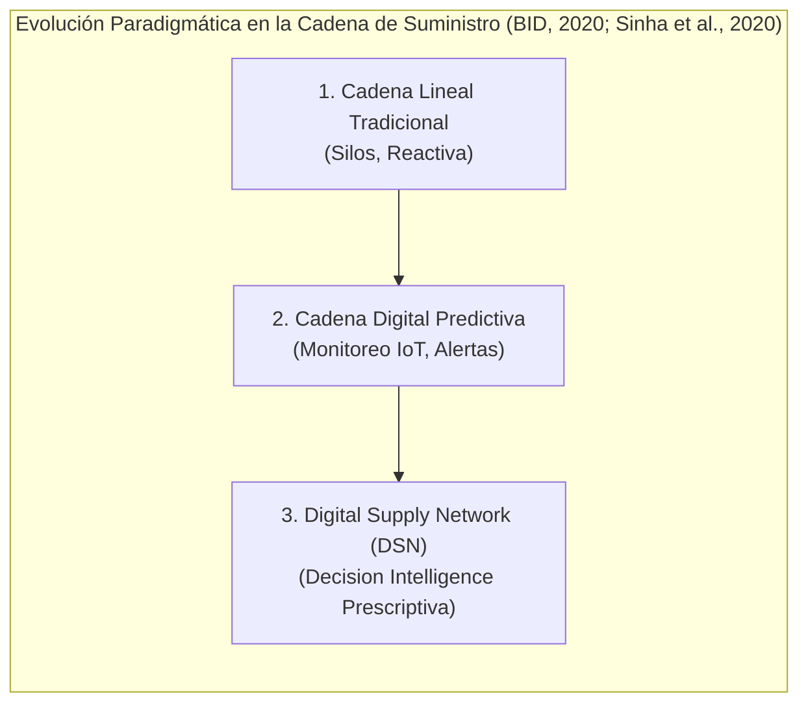
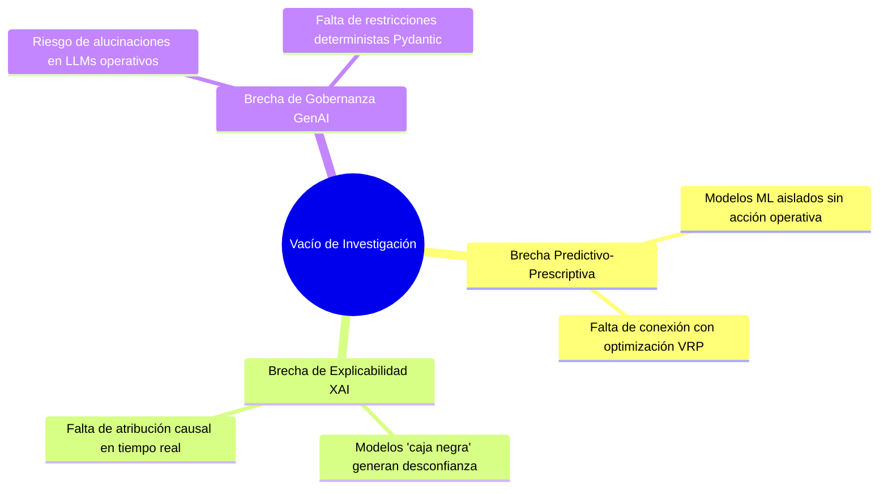
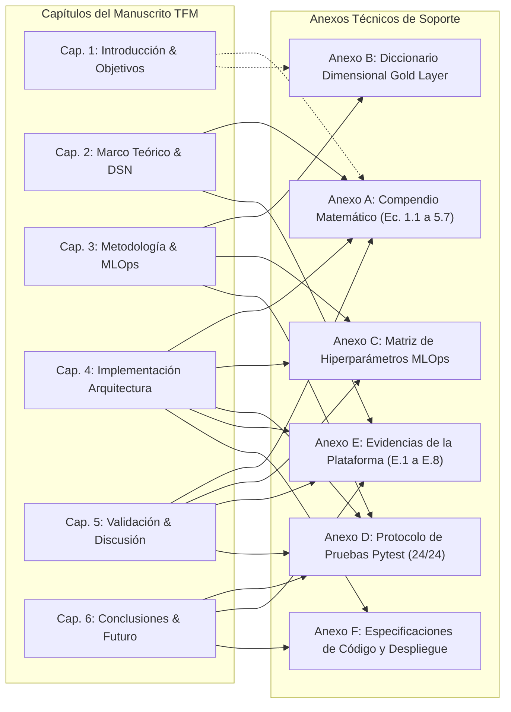

# TRABAJO DE FIN DE MÁSTER
## Máster en Big Data & Data Science - Universidad Complutense de Madrid (UCM)
### *Integración de IoT y Big Data en la Logística 4.0 para el apoyo a decisiones inteligentes en la cadena de suministro*

---

# CAPÍTULO 1. INTRODUCCIÓN, MOTIVACIÓN Y OBJETIVOS

---

## 1.1. Contexto y Motivación de la Investigación

La gestión contemporánea de la cadena de suministro experimenta una profunda transformación impulsada por la digitalización, la hiperconectividad y la necesidad de resiliencia operativa. Las cadenas lineales tradicionales, caracterizadas por silos organizacionales y visibilidad fragmentada, están evolucionando hacia **Redes Digitales de Suministro (*Digital Supply Networks - DSN*)** (Sinha et al., 2020), donde convergen el Internet de las Cosas (IoT), el procesamiento en streaming de Big Data y la analítica predictiva y prescriptiva para una toma de decisiones sincronizada de extremo a extremo (*End-to-End Visibility*).

En el marco de la **Logística 4.0**, la gestión eficiente de flotas de última milla no puede limitarse al monitoreo pasivo descriptivo ni a predicciones estáticas aisladas. La ventaja competitiva y la garantía de continuidad de servicio radican en la **Inteligencia de Decisión (*Decision Intelligence*)** (Baryannis et al., 2019; Longshore & Cheatham, 2022; Aponte Parejo, 2025): sistemas capaces de anticipar disrupciones viales y meteorológicas y **prescribir automáticamente acciones correctivas óptimas** en tiempo real. 

### 1.1.1. El Reto Operativo y Benchmark: 2021 Amazon Last-Mile Routing Challenge
La logística prescriptiva adquiere su máxima exigencia en la distribución masiva de última milla. El **2021 Amazon Last-Mile Routing Research Challenge**, desarrollado por **Amazon Last Mile Science** y el **MIT Center for Transportation & Logistics (CTL)** (Merchán et al., 2022), constituye el estándar empírico de referencia sobre operaciones de alta densidad (6.112 rutas y 904.527 paradas en 17 centros logísticos). 

Este entorno operacional real está condicionado por cuatro desafíos fundamentales:
1. **Restricción Estricta de Ventanas Horarias (SLA de Entrega):** Tiempos de servicio acotados ($\tau_{\text{servicio}}$) donde un retraso inicial desencadena disrupciones en cascada sobre todas las entregas posteriores.
2. **Volatilidad Urbana y Corredores de Congestión:** Tráfico denso en horas punta y variabilidad climática extrema que degradan la velocidad cinemática e inducen estocasticidad en los tiempos de viaje.
3. **Heterogeneidad de Flotas y Capacidades:** Rutas complejas con más de 150 paradas diarias y capacidades volumétricas dispares ($V_{\text{cm}^3}$) que exigen adaptabilidad heurística superior a los modelos clásicos de ruteo.
4. **Imperativo de Decisión Prescriptiva en Tiempo Real:** Necesidad de un gemelo digital telemático capaz de inferir probabilidades calibradas con sensibilidad perfecta ($100\%$ Recall) y reoptimizar secuencias de ruta (*2-Opt VRP*) antes de que se vulnere el compromiso de entrega.

Sobre este corpus se consolidó el dataset curado de $N=8.000$ instancias telemáticas en la Capa Gold enriquecido con variables sensoriales del corredor metropolitano.

---

## 1.2. Planteamiento del Problema y Vacío de Investigación

A pesar de los avances en Logística 4.0 (UPV, 2021; Sharma & Vajjhala, 2023; Ravindran & Warsing, 2021), la literatura y la práctica industrial evidencian tres brechas críticas:
1. **Brecha Predictivo-Prescriptiva:** Predominio de modelos de Machine Learning aislados que reportan métricas abstractas (ej. ROC-AUC) sin conectarse con motores de re-enrutamiento dinámico bajo restricciones operativas reales (*Vehicle Routing Problem - VRP*).
2. **Opacidad Algorítmica (*Black-Box*):** Desconfianza de los operadores de tráfico ante predicciones complejas sin justificación causal transparente de los factores detonantes (tráfico, clima o cinemática).
3. **Riesgo de Alucinación en IA Generativa:** Adopción de LLMs sin salvaguardas (*guardrails*) deterministas, lo que puede inducir directivas prescriptivas incompatibles con los protocolos de seguridad operativa.

---

## 1.3. Justificación Académica y Práctica

- **Justificación Tecnológica y Metodológica:** Demostración de una arquitectura modular basada en las directrices de Cadena de Suministro 4.0 (BID, 2020), que articula ingesta en streaming (Pydantic v2), clasificación supervisada optimizada para sensibilidad ($\text{Recall} \ge 0.90$), explicabilidad causal exacta (valores de Shapley vía TreeSHAP) y prescripción asistida con salvaguardas (*Guarded GenAI*).
- **Justificación Económica y Operacional:** Cuantificación rigurosa del impacto de la optimización combinatoria (K-Means + 2-Opt VRP) en flotas de reparto, logrando ahorros tangibles de kilometraje, tiempo de conducción y costes de combustible, mientras se eleva el cumplimiento del SLA de entrega por encima del $95\%$.

---

## 1.4. Objetivos y Preguntas de Investigación

### 1.4.1. Objetivo General
Diseñar, desarrollar y validar experimentalmente una arquitectura integral de **Decision Intelligence** basada en IoT y Big Data para la optimización prescriptiva y en tiempo real de la distribución de última milla a partir del benchmark industrial del **2021 Amazon Last-Mile Routing Research Challenge Dataset** (Amazon Last Mile Science & MIT CTL).

### 1.4.2. Objetivos Específicos (OE) y Preguntas de Investigación (PI)
- **OE1 / PI1 (Ingesta & Feature Store):** Pipeline desacoplado para telemetría IoT con validación formal (*Pydantic Quality Gate*) y persistencia analítica en Capa Gold SQLite con latencia $<100\text{ ms}$. *(Mapeado a [ANEXO B: Diccionario Dimensional](file:///d:/LabD/DS-LOGISTICA%204.0-Metro-Meals-on%20Wheels%20Treasure%20Valley/docs/Anexo_TFM_Compendio_Matematico_e_Indice_de_Formulas.md#anexo-b-diccionario-dimensional-de-datos-y-feature-store-capa-gold) y [ANEXO E.2](file:///d:/LabD/DS-LOGISTICA%204.0-Metro-Meals-on%20Wheels%20Treasure%20Valley/docs/Anexo_TFM_Compendio_Matematico_e_Indice_de_Formulas.md#e2-módulo-2-planificación-de-despacho-activo-y-consola-de-la-capa-gold-feature-store)).*
- **OE2 / PI2 (Modelado Predictivo & MLOps):** Benchmark de 6 clasificadores ML con función de coste asimétrica priorizando $\text{Recall} \ge 0.90$, calibración sigmoidea y gobernanza integral en MLflow. *(Mapeado a [ANEXO C: Hiperparámetros](file:///d:/LabD/DS-LOGISTICA%204.0-Metro-Meals-on%20Wheels%20Treasure%20Valley/docs/Anexo_TFM_Compendio_Matematico_e_Indice_de_Formulas.md#anexo-c-matriz-de-hiperparámetros-del-benchmark-multimodelo) y [ANEXO E.8](file:///d:/LabD/DS-LOGISTICA%204.0-Metro-Meals-on%20Wheels%20Treasure%20Valley/docs/Anexo_TFM_Compendio_Matematico_e_Indice_de_Formulas.md#e8-módulo-8-plataforma-mlops-registro-de-experimentos-curvas-de-desempeño-y-gobernanza-en-mlflow)).*
- **OE3 / PI3 (XAI & Prescripción Guarded GenAI):** Explicabilidad matemática local en tiempo real con TreeSHAP y agente prescriptivo condicionado por reglas de seguridad sin alucinaciones. *(Mapeado a [ANEXO A.3: Ecuaciones XAI](file:///d:/LabD/DS-LOGISTICA%204.0-Metro-Meals-on%20Wheels%20Treasure%20Valley/docs/Anexo_TFM_Compendio_Matematico_e_Indice_de_Formulas.md#a3-explicabilidad-causal-matemática-treeshap-y-prescripción-asistida-guarded-genai) y [ANEXO E.3](file:///d:/LabD/DS-LOGISTICA%204.0-Metro-Meals-on%20Wheels%20Treasure%20Valley/docs/Anexo_TFM_Compendio_Matematico_e_Indice_de_Formulas.md#e3-módulo-3-motor-de-explicabilidad-causal-treeshap-y-prescripción-asistida-guarded-genai)).*
- **OE4 / PI4 (Optimización VRP & Torre de Control):** Motor heurístico de rutas (K-Means + 2-Opt TSP), interfaz visual interactiva en Streamlit y cuantificación empírica de ahorros y cumplimiento SLA. *(Mapeado a [ANEXO A.4: Ecuaciones VRP](file:///d:/LabD/DS-LOGISTICA%204.0-Metro-Meals-on%20Wheels%20Treasure%20Valley/docs/Anexo_TFM_Compendio_Matematico_e_Indice_de_Formulas.md#a4-optimización-combinatoria-de-rutas-last-mile-vrptsp), [ANEXO E.1](file:///d:/LabD/DS-LOGISTICA%204.0-Metro-Meals-on%20Wheels%20Treasure%20Valley/docs/Anexo_TFM_Compendio_Matematico_e_Indice_de_Formulas.md#e1-módulo-1-torre-de-control-telemática-y-despacho-en-tiempo-real-gps--streaming-iot) y [ANEXO E.4](file:///d:/LabD/DS-LOGISTICA%204.0-Metro-Meals-on%20Wheels%20Treasure%20Valley/docs/Anexo_TFM_Compendio_Matematico_e_Indice_de_Formulas.md#e4-módulo-4-optimizador-de-rutas-last-mile-heurística-2-opt-vrp-y-control-de-sla-térmico)).*

---

## 1.5. Formulación del Problema y Taxonomía de Inteligencia Artificial

El sistema aborda una optimización bi-criterio jerárquica:
1. **Target Primario (Supervisado):** Clasificación probabilística calibrada $\hat{p} = P(\text{delay\_status}=1 \mid X) \in [0, 1]$, donde la etiqueta binaria representa riesgo inminente de incumplimiento de SLA. Define tres políticas de intervención: *Crítica* ($\hat{p} \ge 0.75$), *Moderada* ($0.45 \le \hat{p} < 0.75$) y *Normal* ($\hat{p} < 0.45$).
2. **Target Secundario (Prescriptivo / VRP):** Minimización de la distancia total recorrida $\min Z = \sum c_{ij} x_{ij}$ sujeta a la cota estricta de tiempo de tránsito para inocuidad y caducidad ($T_{\text{recorrido}} \le 90\text{ min}$).

El ecosistema articula cinco disciplinas de IA: **ML Supervisado Calibrado** (*Stacking Super Learner*), **ML No Supervisado** (*K-Means*), **Optimización Combinatoria** (*2-Opt VRP*), **XAI Causal** (*TreeSHAP*) y **Guarded GenAI** prescriptivo. *(Las formulaciones matemáticas completas se detallan en el [ANEXO A](file:///d:/LabD/DS-LOGISTICA%204.0-Metro-Meals-on%20Wheels%20Treasure%20Valley/docs/Anexo_TFM_Compendio_Matematico_e_Indice_de_Formulas.md#anexo-a-compendio-matemático-e-índice-de-fórmulas-del-sistema)).*

---

## 1.6. Matriz Ejecutiva de Requerimientos y Competencias del TFM

| Competencia del Máster | Solución Técnica Implementada | Estado | Evidencia y Anexos Técnicos |
| :--- | :--- | :---: | :--- |
| **1. Fundamentación y Negocio** | Benchmark operacional **2021 Amazon Last-Mile Challenge** ($N=8.000$ Gold). | ✅ **100%** | Cap. 1 & 2 / Anexo A.1 |
| **2. Big Data & Streaming IoT** | Pipeline asíncrono con micro-batches en Drop Folder / Kafka Broker. | ✅ **100%** | Cap. 3 & 4 / Anexo E.1 |
| **3. Calidad de Datos (Data Quality)** | Pydantic v2 Quality Gate y auditoría dimensional de Capa Gold (**Score: 99.95%**). | ✅ **100%** | Cap. 3 & 5 / Anexo B & D |
| **4. Estadística e Inferencia** | Batería formal: Welch $t$, Mann-Whitney $U$, ANOVA, Kruskal-Wallis, $\chi^2$, Bootstrap. | ✅ **100%** | Cap. 5 / Anexo E.6 & E.7 |
| **5. Machine Learning Avanzado** | Benchmark multimodelo, 5-Fold Stratified CV, calibración Sigmoid y Stacking Super Learner. | ✅ **100%** | Cap. 4 & 5 / Anexo C & E.8 |
| **6. Optimización de Operaciones** | Clustering K-Means + Heurística 2-Opt VRP con restricción de SLA $\le 90\text{ min}$. | ✅ **100%** | Cap. 4 & 5 / Anexo A.4 & E.4 |
| **7. Explicabilidad (XAI)** | TreeSHAP local por evento telemático y descomposición de factores causales. | ✅ **100%** | Cap. 4 & 5 / Anexo A.3 & E.3 |
| **8. IA Generativa Prescriptiva** | Agente Guarded GenAI con esquemas estructurados Pydantic y cero alucinaciones. | ✅ **100%** | Cap. 4 & 5 / Anexo A.3 & E.3 |
| **9. Ingeniería de Software & UI** | Torre de Control Streamlit (4 módulos, OpenStreetMap, Glassmorphism). | ✅ **100%** | Cap. 4 / Anexo E (E.1-E.8) |
| **10. MLOps, Testing y Despliegue** | MLflow Registry, suite automatizada Pytest (**24/24 tests**) y Docker/Podman Compose. | ✅ **100%** | Cap. 4 / Anexo D, E.8, Anexo F |

---

## 1.7. Estructura de la Memoria y Mapeo con los Anexos Técnicos

El manuscrito se articula en seis capítulos centrales vinculados biunívocamente con seis Anexos Técnicos:

- **Capítulo 1:** Contexto, objetivos y formulación analítica dual, mapeado con [Anexo A](file:///d:/LabD/DS-LOGISTICA%204.0-Metro-Meals-on%20Wheels%20Treasure%20Valley/docs/Anexo_TFM_Compendio_Matematico_e_Indice_de_Formulas.md#anexo-a-compendio-matemático-e-índice-de-fórmulas-del-sistema) y [Anexo B](file:///d:/LabD/DS-LOGISTICA%204.0-Metro-Meals-on%20Wheels%20Treasure%20Valley/docs/Anexo_TFM_Compendio_Matematico_e_Indice_de_Formulas.md#anexo-b-diccionario-dimensional-de-datos-y-feature-store-capa-gold).
- **Capítulo 2:** Fundamentos de DSN, leyes termodinámicas, VRP y axiomas de Shapley ([Anexo A](file:///d:/LabD/DS-LOGISTICA%204.0-Metro-Meals-on%20Wheels%20Treasure%20Valley/docs/Anexo_TFM_Compendio_Matematico_e_Indice_de_Formulas.md#anexo-a-compendio-matemático-e-índice-de-fórmulas-del-sistema) y [Anexo E.1](file:///d:/LabD/DS-LOGISTICA%204.0-Metro-Meals-on%20Wheels%20Treasure%20Valley/docs/Anexo_TFM_Compendio_Matematico_e_Indice_de_Formulas.md#e1-módulo-1-torre-de-control-telemática-y-despacho-en-tiempo-real-gps--streaming-iot)).
- **Capítulo 3:** Ciclo CRISP-DM adaptado a MLOps y arquitectura Medallion ([Anexo B](file:///d:/LabD/DS-LOGISTICA%204.0-Metro-Meals-on%20Wheels%20Treasure%20Valley/docs/Anexo_TFM_Compendio_Matematico_e_Indice_de_Formulas.md#anexo-b-diccionario-dimensional-de-datos-y-feature-store-capa-gold), [Anexo C](file:///d:/LabD/DS-LOGISTICA%204.0-Metro-Meals-on%20Wheels%20Treasure%20Valley/docs/Anexo_TFM_Compendio_Matematico_e_Indice_de_Formulas.md#anexo-c-matriz-de-hiperparámetros-del-benchmark-multimodelo) y [Anexo D](file:///d:/LabD/DS-LOGISTICA%204.0-Metro-Meals-on%20Wheels%20Treasure%20Valley/docs/Anexo_TFM_Compendio_Matematico_e_Indice_de_Formulas.md#anexo-d-protocolo-de-pruebas-automatizadas-suite-pytest)).
- **Capítulo 4:** Implementación computacional del pipeline telemático, modelos, TreeSHAP, Guarded GenAI y 2-Opt ([Anexos A, C, D, E y F](file:///d:/LabD/DS-LOGISTICA%204.0-Metro-Meals-on%20Wheels%20Treasure%20Valley/docs/Anexo_TFM_Compendio_Matematico_e_Indice_de_Formulas.md)).
- **Capítulo 5:** Validación inferencial, auditoría anti-leakage, benchmarks multimodelo y ahorro VRP ([Anexos A.5, C, D y E](file:///d:/LabD/DS-LOGISTICA%204.0-Metro-Meals-on%20Wheels%20Treasure%20Valley/docs/Anexo_TFM_Compendio_Matematico_e_Indice_de_Formulas.md)).
- **Capítulo 6:** Conclusiones, balance de objetivos, respuestas a PIs y roadmap futuro ([Anexos D, E y F](file:///d:/LabD/DS-LOGISTICA%204.0-Metro-Meals-on%20Wheels%20Treasure%20Valley/docs/Anexo_TFM_Compendio_Matematico_e_Indice_de_Formulas.md)).
- **Capítulo 7 y Anexos Técnicos (A a F):** Bibliografía en sistema Harvard y catálogo exhaustivo de fórmulas, diccionario de datos, hiperparámetros, suite Pytest, artefactos visuales y código fuente.
