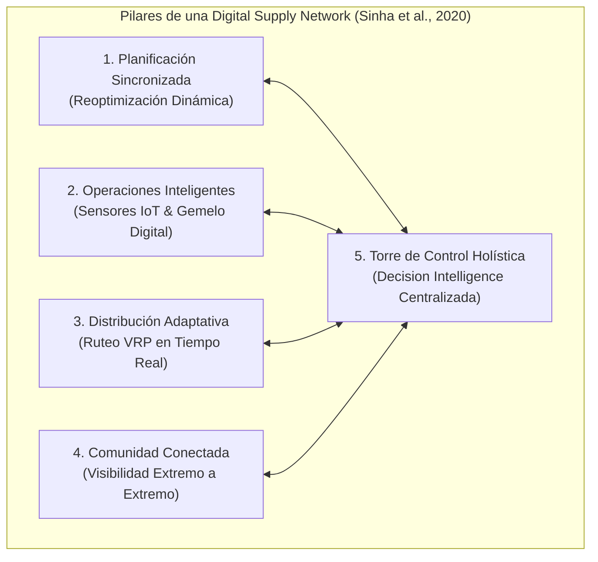
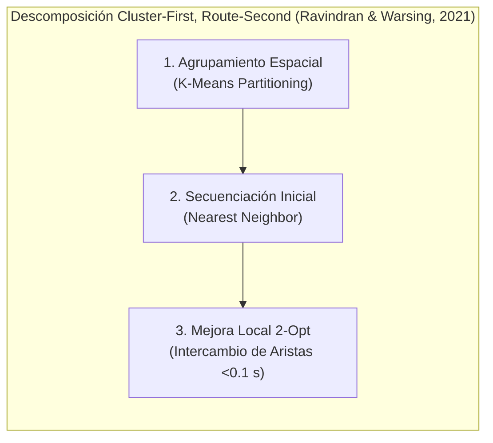
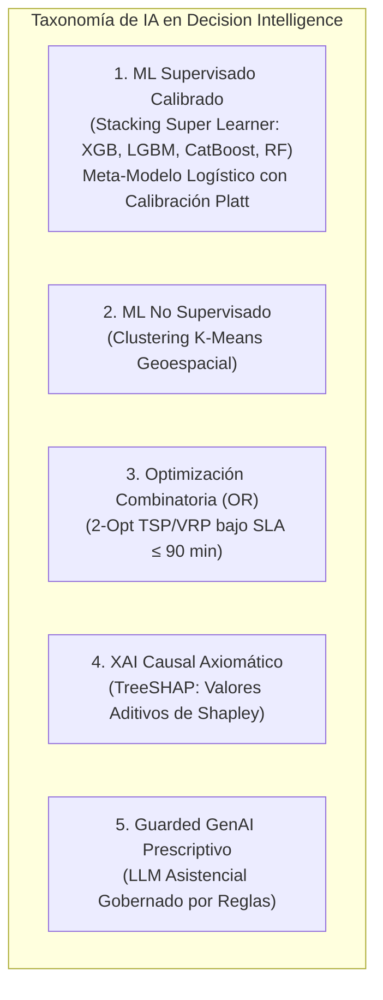
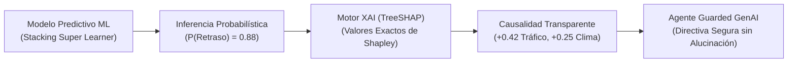

# TRABAJO DE FIN DE MÁSTER
## Máster en Big Data & Data Science - Universidad Complutense de Madrid (UCM)
### *Integración de IoT y Big Data en la Logística 4.0 para el apoyo a decisiones inteligentes en la cadena de suministro*

---

# CAPÍTULO 2. MARCO TEÓRICO Y ESTADO DEL ARTE

---

## 2.1. De la Cadena Tradicional a las Redes Digitales de Suministro (Digital Supply Networks - DSN)

La gestión de la cadena de suministro (*Supply Chain Management - SCM*) ha transitado desde modelos lineales secuenciales (*Plan $\rightarrow$ Source $\rightarrow$ Make $\rightarrow$ Deliver $\rightarrow$ Return*) hacia **Redes Digitales de Suministro (*Digital Supply Networks - DSN*)** (Sinha et al., 2020; Dasgupta et al., 2023). En una DSN, los nodos tradicionales son sustituidos por una matriz dinámica e hiperconectada donde los actores operativos intercambian flujos telemáticos continuos en tiempo real.

De acuerdo con Sinha et al. (2020), una DSN se articula a través de cinco pilares aplicados a la última milla: **planificación sincronizada** ante la demanda en vivo, **operaciones inteligentes** soportadas por telemetría IoT, **distribución adaptativa** ante incidencias viales, **comunidad conectada** con trazabilidad continua, y **torres de control holísticas** que integran ingesta masiva, modelos predictivos y ejecución prescriptiva autónoma. *(Véase el artefacto interactivo en el [ANEXO E.1: Torre de Control Telemática en Tiempo Real](file:///d:/LabD/DS-LOGISTICA%204.0-Metro-Meals-on%20Wheels%20Treasure%20Valley/docs/Anexo_TFM_Compendio_Matematico_e_Indice_de_Formulas.md#e1-módulo-1-torre-de-control-telemática-y-despacho-en-tiempo-real-gps--streaming-iot)).*

---

## 2.2. Gestión Cuantitativa de Sistemas Logísticos y Acuerdos de Nivel de Servicio (SLAs)

La modelización analítica de la última milla exige formalizar con rigor las métricas de fiabilidad y los costes operacionales (Longshore & Cheatham, 2022).

### 2.2.1. Métricas de Fiabilidad Logística: OTIF y Degradación Térmica
En distribución perecedera o asistencial, el indicador **OTIF (*On-Time In-Full*)** incorpora restricciones termodinámicas infranqueables:

$$\text{OTIF} = \frac{1}{N} \sum_{i=1}^{N} \mathbb{I}\left( t_{\text{entrega}}^{(i)} \le \text{ETA}_{\text{programado}}^{(i)} \quad \land \quad \Delta t_{\text{despacho}}^{(i)} \le 90\text{ min} \quad \land \quad T_{\text{alimento}}^{(i)} \ge 60^\circ\text{C} \right)$$

El enfriamiento en contenedores isotérmicos pasivos obedece a la ley de Newton $\frac{dT}{dt} = -k(T - T_{\text{amb}})$. En condiciones ambientales frías ($T_{\text{amb}} \le 0^\circ\text{C}$), el tiempo límite antes de descender por debajo de $60^\circ\text{C}$ se restringe estrictamente a **90 minutos**, configurando una ventana biológica no negociable. *(La deducción analítica completa se encuentra en el [ANEXO A.1: Compendio Matemático - Ecuaciones 1.1 a 1.6](file:///d:/LabD/DS-LOGISTICA%204.0-Metro-Meals-on%20Wheels%20Treasure%20Valley/docs/Anexo_TFM_Compendio_Matematico_e_Indice_de_Formulas.md#a1-ingesta-telemática-cinética-vehicular-y-termodinámica-de-carga)).*

### 2.2.2. Descomposición del Coste Total Logístico
El coste operacional de la red ($C_{\text{total}}$) se descompone en costes variables de distancia ($c_v = \$0.58/\text{milla}$ según estándar IRS), tiempo ($c_t$) y costes fijos ($c_f$):
$$C_{\text{total}} = \sum_{r \in R} \left( c_v \cdot d_r + c_t \cdot t_r + c_f \right)$$
La reducción de kilometraje mediante reoptimización algorítmica maximiza la sostenibilidad económica y ambiental de la flota. *(Modelos econométricos en el [ANEXO A.5: Ecuaciones 5.1 a 5.7](file:///d:/LabD/DS-LOGISTICA%204.0-Metro-Meals-on%20Wheels%20Treasure%20Valley/docs/Anexo_TFM_Compendio_Matematico_e_Indice_de_Formulas.md#a5-métricas-de-impacto-operacional-económico-y-ambiental)).*

---

## 2.3. Modelos Matemáticos de Optimización de Rutas y Ruteo Vehicular (VRP/TSP)

La secuenciación de entregas constituye un problema central de la investigación operativa (Ravindran & Warsing, 2021).

### 2.3.1. Formulación del Problema del Viajante (TSP) y Ruteo Vehicular (VRP)
El TSP/VRP busca el conjunto de ciclos de coste mínimo que visita $n$ paradas bajo restricciones de conservación de flujo y eliminación de subtours (Miller-Tucker-Zemlin):
$$\min \sum_{i=0}^{n} \sum_{j=0, j \neq i}^{n} c_{ij} x_{ij} \quad \text{s.t.} \quad \sum_{j} x_{ij} = 1, \quad \sum_{i} x_{ij} = 1, \quad u_i - u_j + n x_{ij} \le n - 1$$
Al ser un problema **NP-Hard**, los métodos exactos son computacionalmente inviables en tiempo real para flotas dinámicas, justificando la descomposición heurística en dos fases (*Cluster-First, Route-Second*).

### 2.3.2. Heurística de Intercambio de Aristas 2-Opt
La heurística 2-Opt (Croes, 1958) evalúa la sustitución de dos aristas no consecutivas $(s_i, s_{i+1})$ y $(s_j, s_{j+1})$, invirtiendo el sub-recorrido intermedio si la distancia neta decrece ($\Delta D < 0$). Con una complejidad $O(n^2)$, converge a óptimos locales en fracciones de segundo ($<0.1\text{ s}$), permitiendo re-enrutamientos reactivos continuos ante alertas telemáticas. *(Formulación formal en el [ANEXO A.4: Ecuaciones 4.1 a 4.6](file:///d:/LabD/DS-LOGISTICA%204.0-Metro-Meals-on%20Wheels%20Treasure%20Valley/docs/Anexo_TFM_Compendio_Matematico_e_Indice_de_Formulas.md#a4-optimización-combinatoria-de-rutas-last-mile-vrptsp) y módulo en el [ANEXO E.4](file:///d:/LabD/DS-LOGISTICA%204.0-Metro-Meals-on%20Wheels%20Treasure%20Valley/docs/Anexo_TFM_Compendio_Matematico_e_Indice_de_Formulas.md#e4-módulo-4-optimizador-de-rutas-last-mile-heurística-2-opt-vrp-y-control-de-sla-térmico)).*

---

## 2.4. Taxonomía de Machine Learning, Variables Objetivo y Calidad de Datos

### 2.4.1. Ensambles Super Learner y Calibración de Probabilidades
Para evitar el sesgo de estimadores individuales ante clases desbalanceadas, la teoría del **Super Learner (Wolpert, 1992; van der Laan et al., 2007)** establece que la combinación convexa de modelos heterogéneos mediante *Stacking* minimiza el riesgo asintótico:
$$\hat{p} = \sigma\left( \beta_0 + \sum_{k=1}^K \beta_k f_k(X) \right) = \frac{1}{1 + e^{-(\beta_0 + \mathbf{\beta}^T \mathbf{f}(X))}}$$
Las probabilidades se calibran mediante escalado sigmoideo de Platt, optimizando el **Brier Score** ($BS = \frac{1}{N}\sum (\hat{p}_i - y_i)^2$) para garantizar que un valor emitido de $P=0.85$ refleje exactamente una frecuencia empírica del $85\%$. *(Formulación en el [ANEXO A.2](file:///d:/LabD/DS-LOGISTICA%204.0-Metro-Meals-on%20Wheels%20Treasure%20Valley/docs/Anexo_TFM_Compendio_Matematico_e_Indice_de_Formulas.md#a2-inferencia-estadística-y-modelado-predictivo-supervisado) e hiperparámetros en el [ANEXO C](file:///d:/LabD/DS-LOGISTICA%204.0-Metro-Meals-on%20Wheels%20Treasure%20Valley/docs/Anexo_TFM_Compendio_Matematico_e_Indice_de_Formulas.md#anexo-c-matriz-de-hiperparámetros-del-benchmark-multimodelo)).*

### 2.4.2. Formulación de Variables Objetivo y Data Quality Framework
- **Variable Primaria (Supervisada):** $Y = \text{delay\_status} \in \{0, 1\}$, con salida continua $\hat{p} \in [0, 1]$ que activa umbrales de decisión: *Nivel 1 Crítico* ($\hat{p} \ge 0.75$), *Nivel 2 Moderado* ($0.45 \le \hat{p} < 0.75$) y *Nivel 3 Normal* ($\hat{p} < 0.45$).
- **Variable Secundaria (Prescriptiva):** Minimización de la distancia $\min Z = \sum c_{ij} x_{ij}$ sujeta al SLA de tránsito $t_{\text{tránsito}} \le 90.0\text{ min}$.
- **Data Quality Framework:** Se auditan cinco dimensiones estándar (Wang & Strong, 1996; ISO 25012): completitud ($100\%$ en variables ML), unicidad ($0\%$ duplicados), validez de dominios cinemáticos y térmicos, consistencia física ($\eta \ge 0, \Delta t \ge 0$) e integridad referencial en SQLite. *(Especificación en el [ANEXO B](file:///d:/LabD/DS-LOGISTICA%204.0-Metro-Meals-on%20Wheels%20Treasure%20Valley/docs/Anexo_TFM_Compendio_Matematico_e_Indice_de_Formulas.md#anexo-b-diccionario-dimensional-de-datos-y-feature-store-capa-gold) y tests en el [ANEXO D](file:///d:/LabD/DS-LOGISTICA%204.0-Metro-Meals-on%20Wheels%20Treasure%20Valley/docs/Anexo_TFM_Compendio_Matematico_e_Indice_de_Formulas.md#anexo-d-protocolo-de-pruebas-automatizadas-suite-pytest)).*

---

## 2.5. Inteligencia Artificial Explicable (XAI) y Gobernanza Guarded GenAI

### 2.5.1. Fundamentación de los Valores de Shapley (SHAP) y TreeSHAP
Para eliminar la opacidad algorítmica, se aplica la teoría de juegos cooperativos mediante los **valores de Shapley** (Lundberg & Lee, 2017; Sharma & Vajjhala, 2023):
$$\phi_i(x) = \sum_{S \subseteq F \setminus \{i\}} \frac{|S|!(|F| - |S| - 1)!}{|F|!} \left[ f_x(S \cup \{i\}) - f_x(S) \right]$$
El algoritmo **TreeSHAP** explota la estructura en árbol de estimadores de boosting para computar la descomposición exacta en tiempo polinómico $O(T L D^2)$, satisfaciendo los axiomas de **eficiencia** ($\sum \phi_i = f(x) - \mathbb{E}[f]$), **simetría**, **jugador nulo** y **aditividad**. *(Formulaciones en el [ANEXO A.3](file:///d:/LabD/DS-LOGISTICA%204.0-Metro-Meals-on%20Wheels%20Treasure%20Valley/docs/Anexo_TFM_Compendio_Matematico_e_Indice_de_Formulas.md#a3-explicabilidad-causal-matemática-treeshap-y-prescripción-asistida-guarded-genai) e interfaz en el [ANEXO E.3](file:///d:/LabD/DS-LOGISTICA%204.0-Metro-Meals-on%20Wheels%20Treasure%20Valley/docs/Anexo_TFM_Compendio_Matematico_e_Indice_de_Formulas.md#e3-módulo-3-motor-de-explicabilidad-causal-treeshap-y-prescripción-asistida-guarded-genai)).*

### 2.5.2. El Paradigma Guarded GenAI para Mitigación de Alucinaciones
Para integrar Modelos de Lenguaje Masivo (LLMs) sin incurrir en alucinaciones operacionales (Sharma & Vajjhala, 2023), el paradigma **Guarded GenAI** desacopla la decisión de la síntesis:
1. **Decisión Determinista:** El nivel de acción y el protocolo de seguridad se computan matemáticamente a partir de umbrales estáticos y del vector SHAP.
2. **Síntesis Restringida:** El LLM actúa como formateador estricto recibiendo como entrada estructurada (JSON) los factores causales dominantes, traduciéndolos a lenguaje natural accionable sin libertad para inventar datos ni vulnerar directivas de inocuidad.

---

## 2.6. Resiliencia de Redes y Sostenibilidad Ambiental

La resiliencia logística es la capacidad adaptativa de una red para absorber disrupciones y recuperar el nivel de servicio comprometido (Dasgupta et al., 2023). En última milla, esto se traduce en re-enrutamiento dinámico, priorización temprana de envíos críticos y contingencia operativa. Asimismo, la optimización geométrica reduce la huella ambiental: cada milla vehicular evitada suprime **$404\text{ gramos de CO}_2$** en flotas de combustión ($\text{CO}_2\text{ Evitado} = \Delta \text{Millas} \times 0.404\text{ kg CO}_2$), alineando la eficiencia económica con la sostenibilidad. *(Modelos en el [ANEXO A.5](file:///d:/LabD/DS-LOGISTICA%204.0-Metro-Meals-on%20Wheels%20Treasure%20Valley/docs/Anexo_TFM_Compendio_Matematico_e_Indice_de_Formulas.md#a5-cuantificación-del-impacto-operacional-económico-y-social)).*

---

## 2.7. Investigaciones Previas y Estado del Arte en el Ámbito Académico

La literatura académica reciente en el ámbito universitario español e internacional aporta piezas clave que este TFM integra en una arquitectura unificada:
- **Herramientas de Logística 4.0 y Brechas:** La revisión sistemática de la Universitat Politècnica de València (UPV, 2021) y los trabajos de Revuelta Martínez (2019) y Díaz Leal (2022) en la Universidad de Valladolid identifican que la brecha crítica del sector es la **falta de integración prescriptiva**, limitándose los desarrollos al almacenamiento pasivo o monitoreo descriptivo.
- **Trazabilidad Sensible y Control Térmico:** Gómez Moreno (2020) en la Universidad Autónoma de Madrid y Alvarado et al. (2023) en la PUCP demuestran que el control sensorial térmico en tiempo real erradica las mermas alimentarias en tránsito, sustentando nuestro umbral de $T \ge 60^\circ\text{C}$ y $\le 90\text{ min}$.
- **Sistemas Logísticos Dinámicos y Benchmark de Última Milla:** Aponte Parejo (2025) en la Universidad Europea formaliza la necesidad de re-enrutamiento continuo bajo microservicios. Finalmente, el estudio fundacional de **Amazon Last Mile Science y el MIT CTL** (Merchán et al., 2022) libera el **2021 Amazon Last-Mile Routing Challenge Dataset** ($6.112$ rutas y $904.527$ paradas), evidenciando que los modelos puramente teóricos de ruteo fallan si no incorporan aprendizaje empírico y telemetría dinámica en tránsito.

---

## 2.8. Síntesis Comparativa del Estado del Arte y Posicionamiento del TFM

| Dimensión Analítica | Referencias Científicas Clave | Brecha del Enfoque Tradicional | Propuesta del Presente TFM | Anexo Correlacionado |
| :--- | :--- | :--- | :--- | :--- |
| **Dataset Operacional** | **Amazon Last-Mile & MIT CTL (Merchán et al., 2022)** | Datos sintéticos no representativos | Datos reales de Amazon ($N=8.000$) enriquecidos con sensores IoT | [ANEXO B](file:///d:/LabD/DS-LOGISTICA%204.0-Metro-Meals-on%20Wheels%20Treasure%20Valley/docs/Anexo_TFM_Compendio_Matematico_e_Indice_de_Formulas.md#anexo-b-diccionario-dimensional-de-datos-capa-gold) & [ANEXO E.2](file:///d:/LabD/DS-LOGISTICA%204.0-Metro-Meals-on%20Wheels%20Treasure%20Valley/docs/Anexo_TFM_Compendio_Matematico_e_Indice_de_Formulas.md#e2-catálogo-dimensional-de-despacho-y-feature-store-capa-gold-fig-4) |
| **Arquitectura de Red** | **Sinha et al. (2020); BID (2020); Revuelta Martínez (2019)** | Cadenas lineales en silos funcionales | Digital Supply Network (DSN) con gemelo digital en tiempo real | [ANEXO E.1](file:///d:/LabD/DS-LOGISTICA%204.0-Metro-Meals-on%20Wheels%20Treasure%20Valley/docs/Anexo_TFM_Compendio_Matematico_e_Indice_de_Formulas.md#e1-torre-de-control-logístico-40-monitoreo-geolocalizado-y-alertas-sla-en-tiempo-real-fig-3) |
| **Integración 4.0** | **UPV (2021); Díaz Leal (2022); UANL (2022)** | Captura de datos sin automatización | Pipeline completo desde streaming IoT hasta prescripción ejecutoria | [ANEXO D](file:///d:/LabD/DS-LOGISTICA%204.0-Metro-Meals-on%20Wheels%20Treasure%20Valley/docs/Anexo_TFM_Compendio_Matematico_e_Indice_de_Formulas.md#anexo-d-protocolo-de-pruebas-unitarias-y-de-integración-pytest) & [ANEXO E](file:///d:/LabD/DS-LOGISTICA%204.0-Metro-Meals-on%20Wheels%20Treasure%20Valley/docs/Anexo_TFM_Compendio_Matematico_e_Indice_de_Formulas.md#anexo-e-artefactos-del-software-y-evidencias-del-sistema-mlops) |
| **Control Térmico** | **Gómez Moreno (2020 - UAM); Alvarado et al. (2023)** | Monitoreo pasivo o post-entrega | Monitoreo continuo térmico y SLA asistencial de caducidad | [ANEXO A.1](file:///d:/LabD/DS-LOGISTICA%204.0-Metro-Meals-on%20Wheels%20Treasure%20Valley/docs/Anexo_TFM_Compendio_Matematico_e_Indice_de_Formulas.md#a1-ingesta-telemática-cinética-vehicular-y-termodinámica-de-carga) |
| **Gestión Cuantitativa** | **Longshore & Cheatham (2022)** | SLAs comerciales fijos sin física | SLA térmico biológico ($\le 90\text{ min}$, $T \ge 60^\circ\text{C}$) y costes IRS | [ANEXO A.1](file:///d:/LabD/DS-LOGISTICA%204.0-Metro-Meals-on%20Wheels%20Treasure%20Valley/docs/Anexo_TFM_Compendio_Matematico_e_Indice_de_Formulas.md#a1-ingesta-telemática-cinética-vehicular-y-termodinámica-de-carga) & [ANEXO E.4](file:///d:/LabD/DS-LOGISTICA%204.0-Metro-Meals-on%20Wheels%20Treasure%20Valley/docs/Anexo_TFM_Compendio_Matematico_e_Indice_de_Formulas.md#e4-optimizador-heurístico-de-rutas-2-opt-vrp-y-geovisualización-cartográfica-fig-6) |
| **Ruteo Dinámico** | **Ravindran & Warsing (2021); Aponte Parejo (2025)** | Planificación estática matutina | Heurística 2-Opt VRP combinada con re-enrutamiento continuo | [ANEXO A.4](file:///d:/LabD/DS-LOGISTICA%204.0-Metro-Meals-on%20Wheels%20Treasure%20Valley/docs/Anexo_TFM_Compendio_Matematico_e_Indice_de_Formulas.md#a4-optimización-combinatoria-de-rutas-vrp-con-ventanas-horarias) & [ANEXO E.4](file:///d:/LabD/DS-LOGISTICA%204.0-Metro-Meals-on%20Wheels%20Treasure%20Valley/docs/Anexo_TFM_Compendio_Matematico_e_Indice_de_Formulas.md#e4-optimizador-heurístico-de-rutas-2-opt-vrp-y-geovisualización-cartográfica-fig-6) |
| **Explicabilidad Causal** | **Sharma & Vajjhala (2023); Lundberg & Lee (2017)** | Modelos caja negra y alucinación LLM | Explicabilidad local con TreeSHAP + Paradigma *Guarded GenAI* | [ANEXO A.3](file:///d:/LabD/DS-LOGISTICA%204.0-Metro-Meals-on%20Wheels%20Treasure%20Valley/docs/Anexo_TFM_Compendio_Matematico_e_Indice_de_Formulas.md#a3-explicabilidad-matemática-xai-y-gobernanza-guarded-genai) & [ANEXO E.3](file:///d:/LabD/DS-LOGISTICA%204.0-Metro-Meals-on%20Wheels%20Treasure%20Valley/docs/Anexo_TFM_Compendio_Matematico_e_Indice_de_Formulas.md#e3-módulo-de-explicabilidad-xai-treeshap-y-prescripción-guarded-genai-fig-5) |
| **Sostenibilidad** | **Dasgupta, Sošić & Vyas (2023); EPA (2023)** | Gestión de flota reactiva | Resiliencia prescriptiva y reducción certificada de $\text{CO}_2$ ($5.76\text{ ton/año}$) | [ANEXO A.5](file:///d:/LabD/DS-LOGISTICA%204.0-Metro-Meals-on%20Wheels%20Treasure%20Valley/docs/Anexo_TFM_Compendio_Matematico_e_Indice_de_Formulas.md#a5-cuantificación-del-impacto-operacional-económico-y-social) |
