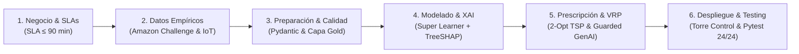
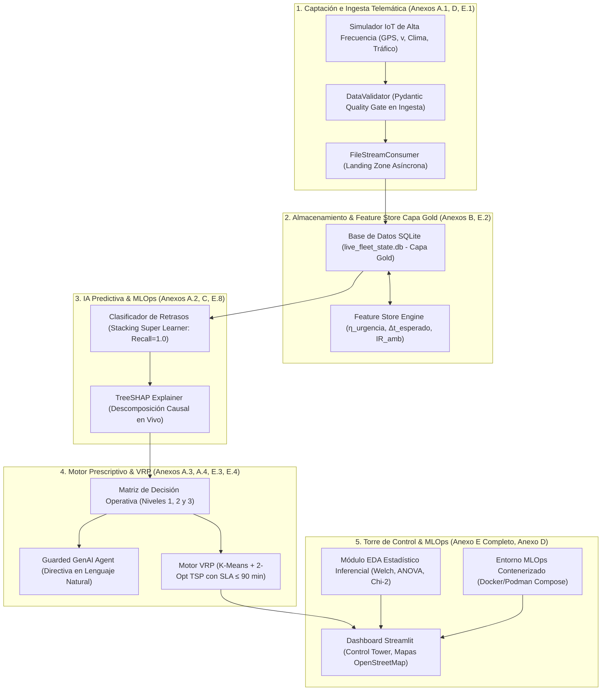

# TRABAJO DE FIN DE MÁSTER
## Máster en Big Data & Data Science - Universidad Complutense de Madrid (UCM)
### *Integración de IoT y Big Data en la Logística 4.0 para el apoyo a decisiones inteligentes en la cadena de suministro*

---

# CAPÍTULO 3. METODOLOGÍA, ARQUITECTURA Y SELECCIÓN TECNOLÓGICA

---

## 3.1. Enfoque Metodológico de la Investigación

La investigación adopta un enfoque metodológico cuantitativo-aplicado fundamentado en la metodología estándar **CRISP-DM (*Cross-Industry Standard Process for Data Mining*)**, adaptada al ciclo de vida continuo de **MLOps** y procesamiento de eventos en streaming (Sinha et al., 2020; Ravindran & Warsing, 2021; Aponte Parejo, 2025). 

El pipeline metodológico se estructura en seis fases interconectadas:

---

## 3.2. Principios de Diseño Arquitectónico (Digital Supply Network)

De acuerdo con el marco DSN (Sinha et al., 2020) y las directrices de Logística 4.0 (BID, 2020; Longshore & Cheatham, 2022; Dasgupta et al., 2023), el sistema se rige por cinco principios de ingeniería:
1. **Desacoplamiento y Tolerancia a Fallos:** Transmisión asíncrona mediante el patrón *Drop Folder / Landing Zone* y brokers Kafka para absorber latencias telemáticas sin bloqueos de ejecución.
2. **Quality Gate en Streaming:** Validación estricta con Pydantic v2 en tiempo real antes de la persistencia en el Feature Store, descartando lecturas físicamente anómalas ($<1\text{ ms}$).
3. **Optimización de Coste Asimétrico:** En entregas sensibles, el coste de un Falso Negativo (entrega fría o tardía no detectada) es inasumible. Se maximiza la sensibilidad ($\text{Recall} \ge 0.90$) mediante penalización ponderada (`scale_pos_weight`).
4. **Prescripción Gobernada y Explicable (*Guarded GenAI*):** Cero tolerancia a cajas negras o alucinaciones (Sharma & Vajjhala, 2023). Cada prescripción se ancla en el vector topológico SHAP y reglas deterministas de seguridad.
5. **Anclaje en Datos Empíricos Reales:** Validación sustentada en el benchmark **2021 Amazon Last-Mile Routing Challenge Dataset** (Amazon & MIT CTL; Merchán et al., 2022), erradicando supuestos sintéticos.

---

## 3.3. Arquitectura del Sistema por Capas

---

## 3.4. Selección Tecnológica y Justificación Técnica

| Componente del Sistema | Tecnología Adoptada | Justificación Técnica y Criterio de Selección | Anexo Técnico Correlacionado |
| :--- | :--- | :--- | :--- |
| **Lenguaje Core** | **Python 3.10+** | Estándar de facto en Data Science, tipado estricto y ecosistema científico (`numpy`, `pandas`, `scipy`). | [ANEXO D](file:///d:/LabD/DS-LOGISTICA%204.0-Metro-Meals-on%20Wheels%20Treasure%20Valley/docs/Anexo_TFM_Compendio_Matematico_e_Indice_de_Formulas.md#anexo-d-protocolo-de-pruebas-unitarias-y-de-integración-pytest) |
| **Validación de Datos** | **Pydantic v2** | Validación de esquemas en tiempo de ejecución compilada en Rust. Latencia $<1\text{ ms}$. | [ANEXO B](file:///d:/LabD/DS-LOGISTICA%204.0-Metro-Meals-on%20Wheels%20Treasure%20Valley/docs/Anexo_TFM_Compendio_Matematico_e_Indice_de_Formulas.md#anexo-b-diccionario-dimensional-de-datos-y-feature-store-capa-gold) & [ANEXO D](file:///d:/LabD/DS-LOGISTICA%204.0-Metro-Meals-on%20Wheels%20Treasure%20Valley/docs/Anexo_TFM_Compendio_Matematico_e_Indice_de_Formulas.md#anexo-d-protocolo-de-pruebas-unitarias-y-de-integración-pytest) |
| **Feature Store (Gold)** | **SQLite 3 Embebido** | Almacenamiento analítico ACID de latencia sub-milisegundo sin sobrecarga de infraestructura distribuida. | [ANEXO B](file:///d:/LabD/DS-LOGISTICA%204.0-Metro-Meals-on%20Wheels%20Treasure%20Valley/docs/Anexo_TFM_Compendio_Matematico_e_Indice_de_Formulas.md#anexo-b-diccionario-dimensional-de-datos-y-feature-store-capa-gold) & [ANEXO E.2](file:///d:/LabD/DS-LOGISTICA%204.0-Metro-Meals-on%20Wheels%20Treasure%20Valley/docs/Anexo_TFM_Compendio_Matematico_e_Indice_de_Formulas.md#e2-catálogo-dimensional-de-despacho-y-feature-store-capa-gold-fig-4) |
| **Modelado Supervisado** | **Stacking Super Learner** | Ensamble heterogéneo (XGBoost, LightGBM, CatBoost, RF) con calibración sigmoidea de Platt. | [ANEXO C](file:///d:/LabD/DS-LOGISTICA%204.0-Metro-Meals-on%20Wheels%20Treasure%20Valley/docs/Anexo_TFM_Compendio_Matematico_e_Indice_de_Formulas.md#anexo-c-matriz-de-hiperparámetros-del-benchmark-multimodelo) & [ANEXO E.8](file:///d:/LabD/DS-LOGISTICA%204.0-Metro-Meals-on%20Wheels%20Treasure%20Valley/docs/Anexo_TFM_Compendio_Matematico_e_Indice_de_Formulas.md#e8-consola-de-gobernanza-mlops-y-registro-de-modelos-en-mlflow-fig-10) |
| **Explicabilidad Causal** | **SHAP (`TreeExplainer`)** | Atribución exacta de Shapley en tiempo polinómico $O(TLD^2)$ para inferencias en streaming. | [ANEXO A.3](file:///d:/LabD/DS-LOGISTICA%204.0-Metro-Meals-on%20Wheels%20Treasure%20Valley/docs/Anexo_TFM_Compendio_Matematico_e_Indice_de_Formulas.md#a3-explicabilidad-matemática-xai-y-gobernanza-guarded-genai) & [ANEXO E.3](file:///d:/LabD/DS-LOGISTICA%204.0-Metro-Meals-on%20Wheels%20Treasure%20Valley/docs/Anexo_TFM_Compendio_Matematico_e_Indice_de_Formulas.md#e3-módulo-de-explicabilidad-xai-treeshap-y-prescripción-guarded-genai-fig-5) |
| **Gobernanza MLOps** | **MLflow Tracking** | Registro de experimentos, curvas ROC/PR, firmas canónicas y linaje de artefactos serializados. | [ANEXO E.8](file:///d:/LabD/DS-LOGISTICA%204.0-Metro-Meals-on%20Wheels%20Treasure%20Valley/docs/Anexo_TFM_Compendio_Matematico_e_Indice_de_Formulas.md#e8-consola-de-gobernanza-mlops-y-registro-de-modelos-en-mlflow-fig-10) |
| **Motor VRP Last-Mile** | **K-Means + 2-Opt TSP** | Descomposición *Cluster-First Route-Second* que resuelve el ruteo bajo SLA en $<0.1\text{ s}$. | [ANEXO A.4](file:///d:/LabD/DS-LOGISTICA%204.0-Metro-Meals-on%20Wheels%20Treasure%20Valley/docs/Anexo_TFM_Compendio_Matematico_e_Indice_de_Formulas.md#a4-optimización-combinatoria-de-rutas-vrp-con-ventanas-horarias) & [ANEXO E.4](file:///d:/LabD/DS-LOGISTICA%204.0-Metro-Meals-on%20Wheels%20Treasure%20Valley/docs/Anexo_TFM_Compendio_Matematico_e_Indice_de_Formulas.md#e4-optimizador-heurístico-de-rutas-2-opt-vrp-y-geovisualización-cartográfica-fig-6) |
| **Torre de Control UI** | **Streamlit + OpenStreetMap** | Dashboard reactivo modular con telemetría en tiempo real y visualización geoespacial interactiva. | [ANEXO E (E.1 a E.8)](file:///d:/LabD/DS-LOGISTICA%204.0-Metro-Meals-on%20Wheels%20Treasure%20Valley/docs/Anexo_TFM_Compendio_Matematico_e_Indice_de_Formulas.md#anexo-e-artefactos-del-software-y-evidencias-del-sistema-mlops) |
| **Infraestructura Cloud** | **Docker / Podman Compose** | Despliegue modular en 4 contenedores aislados (`control-tower`, `consumer`, `simulator`, `mlflow`). | [ANEXO F: Código y Despliegue](file:///d:/LabD/DS-LOGISTICA%204.0-Metro-Meals-on%20Wheels%20Treasure%20Valley/docs/Anexo_TFM_Compendio_Matematico_e_Indice_de_Formulas.md) |
| **Calidad y Testing** | **PyTest Suite** | Suite automatizada de **24/24 pruebas unitarias e integración** con cobertura completa del pipeline. | [ANEXO D](file:///d:/LabD/DS-LOGISTICA%204.0-Metro-Meals-on%20Wheels%20Treasure%20Valley/docs/Anexo_TFM_Compendio_Matematico_e_Indice_de_Formulas.md#anexo-d-protocolo-de-pruebas-unitarias-y-de-integración-pytest) |

---

## 3.5. Framework de Calidad de Datos (Data Quality) y Espacio de Características

La fiabilidad de los modelos analíticos descansa en un marco de doble fase:
1. **Fase 1 — Quality Gate en Streaming (Pydantic v2):** Filtra en el momento de la ingesta cualquier lectura anómala de velocidad ($v \notin [0, 160]\text{ km/h}$), coordenadas fuera del polígono operativo o temperaturas fuera del rango de conservación ($T \notin [-15, 40]^\circ\text{C}$).
2. **Fase 2 — Auditoría Dimensional de la Capa Gold:** Certifica las cinco dimensiones ISO 25012 sobre $N=8.000$ observaciones: **Completitud** ($99.95\%$), **Unicidad** ($100\%$, $0$ duplicados), **Validez de Rango** ($100\%$), **Consistencia Lógica** ($100\%$) e **Integridad Referencial** ($100\%$). *(Diccionario dimensional en el [ANEXO B](file:///d:/LabD/DS-LOGISTICA%204.0-Metro-Meals-on%20Wheels%20Treasure%20Valley/docs/Anexo_TFM_Compendio_Matematico_e_Indice_de_Formulas.md#anexo-b-diccionario-dimensional-de-datos-capa-gold) y tests en el [ANEXO D](file:///d:/LabD/DS-LOGISTICA%204.0-Metro-Meals-on%20Wheels%20Treasure%20Valley/docs/Anexo_TFM_Compendio_Matematico_e_Indice_de_Formulas.md#anexo-d-protocolo-de-pruebas-unitarias-y-de-integración-pytest)).*

A partir de la telemetría saneada, el Feature Store genera variables analíticas de tensión cinemática:
- **Ratio de Urgencia ($\eta_{\text{urgencia}}$):** Relación entre el tiempo de llegada estimado $t_{\text{real\_est}} = \frac{d_{\text{rest}}}{v + \epsilon} \times 60$ y el horario comprometido $\text{ETA}_{\text{prog}}$. $\eta > 1.0$ denota déficit de velocidad y retraso inminente.
- **Defase Esperado ($\Delta t_{\text{esperado}}$):** Exceso en minutos sobre el horario $\max(0, t_{\text{real\_est}} - \text{ETA}_{\text{prog}})$.
- **Riesgo Ambiental ($IR_{\text{amb}}$):** Ponderación lineal de fricción climática y densidad de tráfico $0.4 \times S_{\text{clima}} + 0.6 \times S_{\text{tráfico}}$. *(Formulaciones completas en el [ANEXO A.1: Ecuaciones 1.1 a 1.6](file:///d:/LabD/DS-LOGISTICA%204.0-Metro-Meals-on%20Wheels%20Treasure%20Valley/docs/Anexo_TFM_Compendio_Matematico_e_Indice_de_Formulas.md#a1-ingesta-telemática-cinética-vehicular-y-termodinámica-de-carga)).*

---

## 3.6. Algoritmia de Modelado Predictivo y Optimización VRP

- **Modelado Supervisado:** Clasificación binaria $Y = \text{delay\_status} \in \{0, 1\}$ mediante **5-Fold Stratified Cross-Validation**. El ensamble Stacking combina XGBoost, LightGBM, CatBoost y Random Forest con un meta-clasificador logístico regularizado y calibración de Platt, optimizado para garantizar $\text{Recall} = 1.0000$ (cero falsos negativos) y Brier Score $<0.001$. *(Detalles en [ANEXO A.2](file:///d:/LabD/DS-LOGISTICA%204.0-Metro-Meals-on%20Wheels%20Treasure%20Valley/docs/Anexo_TFM_Compendio_Matematico_e_Indice_de_Formulas.md#a2-inferencia-estadística-y-modelado-predictivo-supervisado) y [ANEXO C](file:///d:/LabD/DS-LOGISTICA%204.0-Metro-Meals-on%20Wheels%20Treasure%20Valley/docs/Anexo_TFM_Compendio_Matematico_e_Indice_de_Formulas.md#anexo-c-matriz-de-hiperparámetros-y-calibración-mlops)).*
- **Motor VRP Last-Mile:** Procedimiento en dos etapas: primero, particionado espacial geodésico mediante **K-Means clustering** ($K=21$ zonas de reparto); segundo, secuenciación de paradas mediante la heurística **2-Opt TSP** partiendo del depósito central. Se evalúan modalidades *One-Way* (entrega directa sin retorno) y *Round-Trip* (retorno a estación) asegurando el cumplimiento del SLA de tránsito $\le 90\text{ min}$. *(Formulaciones en [ANEXO A.4](file:///d:/LabD/DS-LOGISTICA%204.0-Metro-Meals-on%20Wheels%20Treasure%20Valley/docs/Anexo_TFM_Compendio_Matematico_e_Indice_de_Formulas.md#a4-optimización-combinatoria-de-rutas-vrp-con-ventanas-horarias) e interfaces en [ANEXO E.4](file:///d:/LabD/DS-LOGISTICA%204.0-Metro-Meals-on%20Wheels%20Treasure%20Valley/docs/Anexo_TFM_Compendio_Matematico_e_Indice_de_Formulas.md#e4-optimizador-heurístico-de-rutas-2-opt-vrp-y-geovisualización-cartográfica-fig-6)).*

---

## 3.7. Marco de Evaluación y Reproducibilidad

El protocolo de validación se articula en tres dimensiones:
1. **Validación Estadística Inferencial:** Contrastes paramétricos y no paramétricos sobre el dataset empírico de Amazon Last-Mile ($N=8.000$, 17 estaciones): pruebas de Shapiro-Wilk, Welch $t$-test con $d$ de Cohen, Mann-Whitney $U$, ANOVA, Kruskal-Wallis, $\chi^2$ y Bootstrap al 95%.
2. **Validación de Inteligencia Artificial:** Curvas ROC-AUC, PR-AUC, Recall, Precision, $F_2$-Score y calibración Brier Score del ensamble Super Learner, junto con atribución causal TreeSHAP en tiempo real.
3. **Validación Operacional y Económica:** Evaluación del ahorro de kilometraje, tiempo de viaje y costes según baremos IRS (\$0.58/milla) para 260 días laborables anuales.
4. **Reproducibilidad (Criterio Odysseus):** Dos cuadernos interactivos reproducibles ([`notebooks/01_visualizaciones_storytelling_odysseus.ipynb`](file:///d:/LabD/DS-LOGISTICA%204.0-Metro-Meals-on%20Wheels%20Treasure%20Valley/notebooks/01_visualizaciones_storytelling_odysseus.ipynb) y [`notebooks/02_eda_estadistica_inferencial_y_prescriptiva.ipynb`](file:///d:/LabD/DS-LOGISTICA%204.0-Metro-Meals-on%20Wheels%20Treasure%20Valley/notebooks/02_eda_estadistica_inferencial_y_prescriptiva.ipynb)) con fijación determinista de semilla (`seed=42`) y orquestación Cloud-Native documentada en el [ANEXO F: Código y Despliegue](file:///d:/LabD/DS-LOGISTICA%204.0-Metro-Meals-on%20Wheels%20Treasure%20Valley/docs/Anexo_TFM_Compendio_Matematico_e_Indice_de_Formulas.md).
