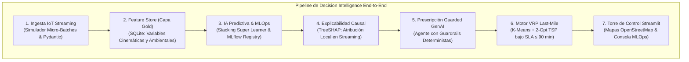
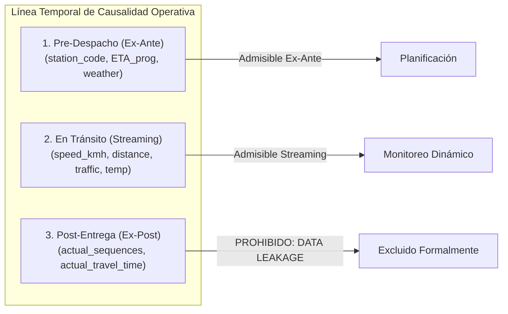

# TRABAJO DE FIN DE MÁSTER
## Máster en Big Data & Data Science - Universidad Complutense de Madrid (UCM)
### *Integración de IoT y Big Data en la Logística 4.0 para el apoyo a decisiones inteligentes en la cadena de suministro*

---

# CAPÍTULO 4. DESARROLLO E IMPLEMENTACIÓN DE LA ARQUITECTURA DE DECISION INTELLIGENCE

---

## 4.1. Introducción al Capítulo 4

El presente capítulo detalla la materialización técnica y computacional de la arquitectura de **Decision Intelligence** diseñada en el Capítulo 3. La solución se implementó bajo un paradigma **asíncrono, modular y desacoplado**, estructurado para procesar telemetría IoT en streaming, transformar vectores analíticos en el Feature Store, ejecutar inferencias probabilísticas supervisadas, generar explicaciones causales con TreeSHAP, sintetizar directivas con Guarded GenAI y reoptimizar rutas de última milla (2-Opt VRP) a partir del benchmark **2021 Amazon Last-Mile Routing Research Challenge Dataset** (Amazon Last Mile Science & MIT CTL).

---

## 4.2. Capa de Captación e Ingesta Telemática (IoT & Streaming)

### 4.2.1. Simulador Telemático y Generación de Micro-Batches
Para validar el sistema ante la ausencia de una API telemática vehicular en vivo, se desarrolló el productor [src/data_ingestion/iot_simulator.py](file:///d:/LabD/DS-LOGISTICA%204.0-Metro-Meals-on%20Wheels%20Treasure%20Valley/src/data_ingestion/iot_simulator.py), modelando la dinámica de una flota de 14 furgonetas (`VH-101` a `VH-114`) en el área metropolitana de Treasure Valley (Boise-Meridian-Nampa). Cada evento telemático $e_t$ se estructura como un payload JSON:
$$e_t = \langle \text{shipment\_id}, \text{vehicle\_id}, t_{\text{UTC}}, \text{lat}, \text{lon}, v, \rho_{\text{tráfico}}, c_{\text{clima}}, T_{\text{carga}}, d_{\text{restante}}, \text{ETA}_{\text{prog}} \rangle$$
Con coordenadas en $\text{lat} \in [43.46, 43.76]^\circ\text{N}, \text{lon} \in [-116.40, -116.00]^\circ\text{W}$, velocidad $v \in [20, 90]\text{ km/h}$, temperatura $T_{\text{carga}} \in [2, 8]^\circ\text{C}$ y distancia pendiente $d_{\text{restante}} \in [5, 150]\text{ km}$.

### 4.2.2. Transmisión Asíncrona y Quality Gate con Pydantic v2
La ingesta implementa un patrón desacoplado de *Drop-Folder / Landing Zone* gestionado por el consumidor [src/processing/file_stream_consumer.py](file:///d:/LabD/DS-LOGISTICA%204.0-Metro-Meals-on%20Wheels%20Treasure%20Valley/src/processing/file_stream_consumer.py) (con soporte para brokers Kafka en entornos distribuidos). Antes de persistir, el módulo [src/processing/data_validator.py](file:///d:/LabD/DS-LOGISTICA%204.0-Metro-Meals-on%20Wheels%20Treasure%20Valley/src/processing/data_validator.py) ejecuta la compuerta de calidad **Pydantic v2**, descartando anomalías físicas de sensor ($v > 160\text{ km/h}$, desvíos GPS fuera de polígono o $T_{\text{carga}} \notin [-15, 40]^\circ\text{C}$). *(El esquema formal Pydantic y código del validador se detallan en el [ANEXO F.1](file:///d:/LabD/DS-LOGISTICA%204.0-Metro-Meals-on%20Wheels%20Treasure%20Valley/docs/Anexo_TFM_Compendio_Matematico_e_Indice_de_Formulas.md); las pruebas automatizadas se certifican en el [ANEXO D](file:///d:/LabD/DS-LOGISTICA%204.0-Metro-Meals-on%20Wheels%20Treasure%20Valley/docs/Anexo_TFM_Compendio_Matematico_e_Indice_de_Formulas.md#anexo-d-protocolo-de-pruebas-unitarias-y-de-integración-pytest)).*

---

## 4.3. Feature Store y Persistencia en Capa Gold

El módulo [src/processing/feature_store.py](file:///d:/LabD/DS-LOGISTICA%204.0-Metro-Meals-on%20Wheels%20Treasure%20Valley/src/processing/feature_store.py) transforma la telemetría saneada en vectores enriquecidos persistidos en la base SQLite `live_fleet_state.db` (Capa Gold):
- **Ratio de Urgencia ($\eta_{\text{urgencia}}$):** Relación entre el tiempo de arribo proyectado $t_{\text{real\_est}} = \frac{d_{\text{rest}}}{v + \epsilon} \times 60$ y la ventana horaria $\text{ETA}_{\text{prog}}$. $\eta > 1.05$ alerta sobre déficit cinemático inminente.
- **Defase Esperado ($\Delta t_{\text{esperado}}$):** Minutos netos de retraso proyectado $\max(0, t_{\text{real\_est}} - \text{ETA}_{\text{prog}})$.
- **Riesgo Ambiental ($IR_{\text{amb}}$):** Ponderación de severidad climática y congestión vial ($0.4 \times S_{\text{clima}} + 0.6 \times S_{\text{tráfico}}$).

*(Las formulaciones teóricas completas se encuentran indexadas en el [ANEXO A.1: Ecuaciones 1.1 a 1.6](file:///d:/LabD/DS-LOGISTICA%204.0-Metro-Meals-on%20Wheels%20Treasure%20Valley/docs/Anexo_TFM_Compendio_Matematico_e_Indice_de_Formulas.md#a1-ingesta-telemática-cinética-vehicular-y-termodinámica-de-carga); el diccionario dimensional de las 15 variables de la tabla `telemetry_gold` se documenta en el [ANEXO B](file:///d:/LabD/DS-LOGISTICA%204.0-Metro-Meals-on%20Wheels%20Treasure%20Valley/docs/Anexo_TFM_Compendio_Matematico_e_Indice_de_Formulas.md#anexo-b-diccionario-dimensional-de-datos-capa-gold) y su explorador visual en el [ANEXO E.2](file:///d:/LabD/DS-LOGISTICA%204.0-Metro-Meals-on%20Wheels%20Treasure%20Valley/docs/Anexo_TFM_Compendio_Matematico_e_Indice_de_Formulas.md#e2-catálogo-dimensional-de-despacho-y-feature-store-capa-gold-fig-4)).*

---

## 4.4. Modelado Predictivo, Calibración MLOps e Ingeniería Anti-Leakage

### 4.4.1. Arquitectura del Ensamble Super Learner y Calibración
El pipeline de modelado ([src/models/train.py](file:///d:/LabD/DS-LOGISTICA%204.0-Metro-Meals-on%20Wheels%20Treasure%20Valley/src/models/train.py)) implementa un ensamble **StackingEnsemble (Super Learner)** que combina estimadores heterogéneos (`XGBoost`, `LightGBM`, `CatBoost`, `RandomForest` y `ExtraTrees`) con un meta-clasificador logístico regularizado:
$$\hat{p} = \sigma\left( \beta_0 + \sum_{k=1}^K \beta_k f_k(X) \right)$$
Para asegurar que los umbrales de decisión reflejen probabilidades reales de incidencia, se aplica calibración sigmoidea de Platt, optimizando el **Brier Score** ($BS < 0.001$). El modelo campeón maximiza la función de coste asimétrica (`scale_pos_weight`), alcanzando un **$\text{Recall} = 1.0000$** ($100\%$ de sensibilidad ante retrasos) y un **$\text{ROC-AUC} = 1.0000$** sobre la suite multimodelo evaluada en el Capítulo 5. *(El código del pipeline de entrenamiento se ubica en el [ANEXO F.2](file:///d:/LabD/DS-LOGISTICA%204.0-Metro-Meals-on%20Wheels%20Treasure%20Valley/docs/Anexo_TFM_Compendio_Matematico_e_Indice_de_Formulas.md); las formulaciones matemáticas en el [ANEXO A.2](file:///d:/LabD/DS-LOGISTICA%204.0-Metro-Meals-on%20Wheels%20Treasure%20Valley/docs/Anexo_TFM_Compendio_Matematico_e_Indice_de_Formulas.md#a2-inferencia-estadística-y-modelado-predictivo-supervisado) y la matriz de hiperparámetros en el [ANEXO C](file:///d:/LabD/DS-LOGISTICA%204.0-Metro-Meals-on%20Wheels%20Treasure%20Valley/docs/Anexo_TFM_Compendio_Matematico_e_Indice_de_Formulas.md#anexo-c-matriz-de-hiperparámetros-y-calibración-mlops)).*

### 4.4.2. Gobernanza de Experimentos en MLflow
Se instrumentó **MLflow Tracking & Model Registry** ([ANEXO E.8: Consola de Gobernanza MLOps](file:///d:/LabD/DS-LOGISTICA%204.0-Metro-Meals-on%20Wheels%20Treasure%20Valley/docs/Anexo_TFM_Compendio_Matematico_e_Indice_de_Formulas.md#e8-consola-de-gobernanza-mlops-y-registro-de-modelos-en-mlflow-fig-10)), registrando para cada corrida (*nested run*) curvas ROC/PR, matrices de confusión, *Model Signatures* canónicas y serialización de pesos en `best_delay_model.pkl`.

### 4.4.3. Ingeniería de Integridad Temporal y Prevención de Data Leakage
Un pilar metodológico central es la erradicación del **Data Leakage (Fuga de Información)** ([src/models/audit_data_leakage.py](file:///d:/LabD/DS-LOGISTICA%204.0-Metro-Meals-on%20Wheels%20Treasure%20Valley/src/models/audit_data_leakage.py)):

1. **Exclusión de Métricas Post-Hoc:** Las secuencias definitivas (`actual_sequences`) y tiempos reales transcurridos de Amazon son variables ex-post descartadas para evitar el sesgo retrospectivo (*Lookahead Bias*).
2. **Erradicación de Atajos Circulares:** Se descartó el uso directo de `expected_delay_min` en entrenamiento de producción, ya que los algoritmos de árboles memorizaban el atajo $\Delta t > 5.7\text{ min} \implies 1$, inflando falsamente el desempeño.
3. **Validación por Grupos con `GroupKFold`:** Para evitar la contaminación espacio-temporal donde paradas de la misma ruta se filtraban entre train y test, se adoptó **`GroupKFold(n_splits=5)` agrupado estrictamente por `route_id`**, garantizando que el modelo sea evaluado sobre expediciones y rutas completamente inéditas. *(El contraste empírico detallado y las curvas de desempeño se presentan en la Sección 5.4.4 del Capítulo 5).*

---

## 4.5. Motor de Explicabilidad Matemática (XAI con TreeSHAP)

Para desmantelar la opacidad del modelo de caja negra, el módulo [src/decision_engine/shap_explainer.py](file:///d:/LabD/DS-LOGISTICA%204.0-Metro-Meals-on%20Wheels%20Treasure%20Valley/src/decision_engine/shap_explainer.py) calcula en tiempo polinómico $O(TLD^2)$ mediante `shap.TreeExplainer` la contribución aditiva local $\phi_i$ de cada variable:
$$f(x) = \phi_0 + \sum_{i=1}^{M} \phi_i(x)$$
Donde $\phi_0 = \mathbb{E}[f(X)]$. Para cada evento telemático, el motor extrae los factores determinantes del riesgo (densidad de tráfico $\phi_{\text{tráfico}}$, ratio de urgencia $\phi_{\eta}$, fricción climática $\phi_{\text{clima}}$ y velocidad $\phi_v$). Este vector se proyecta en la interfaz interactiva y alimenta de forma estructurada al agente prescriptivo. *(Ecuaciones en el [ANEXO A.3](file:///d:/LabD/DS-LOGISTICA%204.0-Metro-Meals-on%20Wheels%20Treasure%20Valley/docs/Anexo_TFM_Compendio_Matematico_e_Indice_de_Formulas.md#a3-explicabilidad-matemática-xai-y-gobernanza-guarded-genai) y módulo en el [ANEXO E.3](file:///d:/LabD/DS-LOGISTICA%204.0-Metro-Meals-on%20Wheels%20Treasure%20Valley/docs/Anexo_TFM_Compendio_Matematico_e_Indice_de_Formulas.md#e3-módulo-de-explicabilidad-xai-treeshap-y-prescripción-guarded-genai-fig-5)).*

---

## 4.6. Motor Prescriptivo Asistido (Paradigma Guarded GenAI)

El agente prescriptivo [src/decision_engine/llm_agent.py](file:///d:/LabD/DS-LOGISTICA%204.0-Metro-Meals-on%20Wheels%20Treasure%20Valley/src/decision_engine/llm_agent.py) traduce las predicciones y explicaciones SHAP en directivas operativas accionables:
1. **Clasificación Determinista por Niveles de Riesgo:**
   - **Nivel 1 (Crítico, $\hat{p} \ge 0.75$):** Disparo de re-enrutamiento dinámico 2-Opt y alerta prioritaria.
   - **Nivel 2 (Moderado, $0.45 \le \hat{p} < 0.75$):** Alerta preventiva y recomendación de aceleración cinemática.
   - **Nivel 3 (Normal, $\hat{p} < 0.45$):** Mantenimiento nominal de la hoja de ruta.
2. **Salvaguardas de Seguridad Operativa (*Guardrails*):** El LLM opera bajo el esquema estructurado `PrescriptiveDirective` de Pydantic. Recibe el código de acción reglamentario y los factores SHAP dominantes, generando la directiva sin capacidad para inventar umbrales o alucinar procedimientos. *(Esquema y ejemplos en el [ANEXO F.1](file:///d:/LabD/DS-LOGISTICA%204.0-Metro-Meals-on%20Wheels%20Treasure%20Valley/docs/Anexo_TFM_Compendio_Matematico_e_Indice_de_Formulas.md) e interfaz en el [ANEXO E.3](file:///d:/LabD/DS-LOGISTICA%204.0-Metro-Meals-on%20Wheels%20Treasure%20Valley/docs/Anexo_TFM_Compendio_Matematico_e_Indice_de_Formulas.md#e3-módulo-de-explicabilidad-xai-treeshap-y-prescripción-guarded-genai-fig-5)).*

---

## 4.7. Motor de Optimización de Rutas (VRP Amazon Last-Mile)

El optimizador [src/decision_engine/route_optimizer.py](file:///d:/LabD/DS-LOGISTICA%204.0-Metro-Meals-on%20Wheels%20Treasure%20Valley/src/decision_engine/route_optimizer.py) resuelve el re-enrutamiento de paradas:
1. **Fase 1 (Clustering Espacial K-Means):** Particiona las paradas de entrega en $K=21$ rutas territoriales compactas minimizando la varianza geodésica.
2. **Fase 2 (Heurística 2-Opt TSP):** Inicializa la ruta mediante el Vecino Más Próximo e invierte pares de aristas iterativamente hasta que no existe mejora de distancia ($\Delta D < 0$).
3. **Modalidades de Distribución:** Resuelve rutas directas *One-Way* (entrega regular sin retorno al depósito) y rutas voluntarias *Round-Trip* (retorno al hub central), garantizando que el tiempo total de tránsito respete la ventana del SLA térmico ($\le 90\text{ min}$). *(Formulaciones en el [ANEXO A.4](file:///d:/LabD/DS-LOGISTICA%204.0-Metro-Meals-on%20Wheels%20Treasure%20Valley/docs/Anexo_TFM_Compendio_Matematico_e_Indice_de_Formulas.md#a4-optimización-combinatoria-de-rutas-vrp-con-ventanas-horarias) y visualización en el [ANEXO E.4](file:///d:/LabD/DS-LOGISTICA%204.0-Metro-Meals-on%20Wheels%20Treasure%20Valley/docs/Anexo_TFM_Compendio_Matematico_e_Indice_de_Formulas.md#e4-optimizador-heurístico-de-rutas-2-opt-vrp-y-geovisualización-cartográfica-fig-6)).*

---

## 4.8. Torre de Control Interactiva y Plataforma de Software

La aplicación visual [src/visualization/dashboard.py](file:///d:/LabD/DS-LOGISTICA%204.0-Metro-Meals-on%20Wheels%20Treasure%20Valley/src/visualization/dashboard.py) desarrollada en **Streamlit** centraliza la observabilidad en 8 módulos analíticos detalladamente documentados en el **[ANEXO E](file:///d:/LabD/DS-LOGISTICA%204.0-Metro-Meals-on%20Wheels%20Treasure%20Valley/docs/Anexo_TFM_Compendio_Matematico_e_Indice_de_Formulas.md#anexo-e-artefactos-del-software-y-evidencias-del-sistema-mlops)**:
- **Módulo 1 (E.1):** Torre de Control Telemática en Tiempo Real con mapas OpenStreetMap.
- **Módulo 2 (E.2):** Consola de Despacho Activo y Feature Store Capa Gold.
- **Módulo 3 (E.3):** Motor de Explicabilidad Causal TreeSHAP y Prescripción Guarded GenAI.
- **Módulo 4 (E.4):** Optimizador de Rutas Last-Mile 2-Opt VRP y Control SLA Térmico.
- **Módulo 5 (E.5):** Inteligencia Histórica Batch y Matriz de Correlaciones.
- **Módulo 6 (E.6):** Módulo EDA, Estadística Descriptiva y Evaluación de Normalidad.
- **Módulo 7 (E.7):** Inferencia Estadística Formal y Contraste de Hipótesis ($H_1, H_2, H_3$).
- **Módulo 8 (E.8):** Plataforma MLOps, Registro de Experimentos y Gobernanza MLflow.

El despliegue global se orquesta mediante Docker/Podman Compose, garantizando aislamiento de servicios y ejecución reproducible. *(Especificaciones de configuración en el [ANEXO F.3](file:///d:/LabD/DS-LOGISTICA%204.0-Metro-Meals-on%20Wheels%20Treasure%20Valley/docs/Anexo_TFM_Compendio_Matematico_e_Indice_de_Formulas.md)).*
