# TRABAJO DE FIN DE MÁSTER
## Máster en Big Data & Data Science - Universidad Complutense de Madrid (UCM)
### *Integración de IoT y Big Data en la Logística 4.0 para el apoyo a decisiones inteligentes en la cadena de suministro*

---

# CAPÍTULO 5. RESULTADOS, VALIDACIÓN EXPERIMENTAL Y DISCUSIÓN

---

## 5.1. Introducción y Marco de Evaluación Experimental

El presente capítulo expone los hallazgos empíricos, la validación estadística y la discusión crítica de la arquitectura de **Decision Intelligence** implementada en el Capítulo 4. La evaluación se estructura sobre un protocolo experimental riguroso diseñado para responder a las preguntas de investigación en tres dimensiones:
1. **Validación Estadística e Inferencial:** Contrastes de hipótesis formales sobre la física de la red logística, normalidad de variables y significancia de los factores detonantes de retraso sobre $N=8.000$ instancias telemáticas operacionales del **2021 Amazon Last-Mile Routing Research Challenge Dataset** (Amazon Last Mile Science & MIT CTL).
2. **Evaluación de Inteligencia Artificial y Machine Learning:** Benchmark multimodelo con validación cruzada estratificada (5-Fold CV), calibración de probabilidades (*Brier Score*), explicabilidad causal local (TreeSHAP) y auditoría formal de prevención de *Data Leakage*.
3. **Impacto Operacional y Económico:** Cuantificación del cumplimiento del SLA de entrega ($\le 90\text{ min}$), reducción de kilometraje mediante la heurística 2-Opt VRP y ahorro económico anual de la flota de reparto.

```mermaid
flowchart LR
    subgraph D1["1. Estadística Inferencial"]
        H1["Welch t-test: t = -36.56, d = -1.54"]
        H2["Kruskal-Wallis: H = 214.8, p < 0.001"]
        H3["Chi-Cuadrado: χ² = 486.2, V = 0.324"]
    end

    subgraph D2["2. Benchmark Predictivo ML"]
        ML1["Stacking Super Learner: Recall = 1.0"]
        ML2["Auditoría Anti-Leakage GroupKFold"]
        ML3["TreeSHAP: Tráfico + Urgencia"]
    end

    subgraph D3["3. Impacto Operacional VRP"]
        OP1["Ahorro Distancia: -88.3 km/día"]
        OP2["Cumplimiento SLA: 88.5% → 96.5%"]
        OP3["Ahorro Anual: $8,274 USD / 14,266 mi"]
    end

    D1 --> D2 --> D3
```

---

## 5.2. Auditoría Exhaustiva de Calidad de Datos (Data Quality Audit)

Previo al modelado, el dataset Gold ($N=8.000$ observaciones) derivado del **2021 Amazon Last-Mile Routing Challenge Dataset** fue sometido a una auditoría formal multidimensional (*Data Quality Framework*):

| Dimensión de Calidad | Criterio Evaluado | Umbral | Resultado Obtenido | Veredicto |
| :--- | :--- | :---: | :---: | :---: |
| **1. Completitud (*Completeness*)** | Registros completos sin nulos en variables de modelado. | $\ge 99.0\%$ | **99.95%** (100% en las 10 features ML y variable objetivo; 92 nulos en metadatos secundarios) | ✅ **Aprobado con Excelencia** |
| **2. Unicidad (*Uniqueness*)** | Tasa de duplicidad en identificadores de paquetes y telemetría. | $0\text{ dupl.}$ | **100.0%** (0 registros duplicados sobre 8.000 filas) | ✅ **Aprobado al 100%** |
| **3. Validez de Dominio (*Validity*)** | Pertenencia de variables cinemáticas y térmicas a intervalos físicos. | $100\%$ válidos | **100.0%** ($v \in [10, 120]\text{ km/h}$, $T \in [-15, 40]^\circ\text{C}$, $d > 0$) | ✅ **Aprobado al 100%** |
| **4. Consistencia Lógica (*Consistency*)** | Coherencia física entre distancias, velocidades y ratios temporales. | $0\text{ incons.}$ | **100.0%** ($\eta_{\text{urgencia}} \ge 0, \Delta t_{\text{esperado}} \ge 0$) | ✅ **Aprobado al 100%** |
| **5. Integridad Referencial (*Integrity*)** | Claves de ruta, nodos de depósito y secuencias de entrega. | $100\%$ resuelto | **100.0%** (Integridad referencial completa en SQLite) | ✅ **Aprobado al 100%** |
| **Puntaje Global de Calidad (DQS)** | Índice sintético de calidad de datos en la Capa Gold. | $\ge 95.0\%$ | **99.95% / 100.0%** | 🏆 **Certificado para Producción** |

*(La especificación de las 15 variables se detalla en el [ANEXO B](file:///d:/LabD/DS-LOGISTICA%204.0-Metro-Meals-on%20Wheels%20Treasure%20Valley/docs/Anexo_TFM_Compendio_Matematico_e_Indice_de_Formulas.md#anexo-b-diccionario-dimensional-de-datos-capa-gold) y el código de auditoría automatizado en el [ANEXO D](file:///d:/LabD/DS-LOGISTICA%204.0-Metro-Meals-on%20Wheels%20Treasure%20Valley/docs/Anexo_TFM_Compendio_Matematico_e_Indice_de_Formulas.md#anexo-d-protocolo-de-pruebas-unitarias-y-de-integración-pytest)).*

---

## 5.3. Análisis Exploratorio y Validación Estadística Inferencial

Para fundamentar la física del gemelo digital, el dataset Gold operacional ($N=8.000$) fue analizado mediante el motor estadístico [src/analytics/statistical_eda.py](file:///d:/LabD/DS-LOGISTICA%204.0-Metro-Meals-on%20Wheels%20Treasure%20Valley/src/analytics/statistical_eda.py). Se evaluaron distribuciones descriptivas y se ejecutó la batería formal de contrastes de hipótesis:

| Variable / Fenómeno | Métricas Descriptivas ($N=8.000$) | Contraste de Hipótesis Formal ($H_0$ vs. $H_1$) | Estadístico de Prueba | $p$-valor | Tamaño del Efecto | Decisión Estadística |
| :--- | :--- | :--- | :---: | :---: | :---: | :--- |
| **Velocidad ($v$, km/h)** | $\mu = 40.06, \sigma = 17.00, P_{50} = 39.56$ IC 95%: [39.69, 40.44] | **$H_1$:** Velocidad en retraso es significativamente inferior a puntual. | **Welch $t$ = -36.56** Mann-Whitney $U$ | $p < 0.001$ $p < 0.001$ | **Cohen's $d = -1.54$** (Grande) $r_{\text{rb}} = -0.684$ | Se rechaza $H_0$. La velocidad decae $23.03\text{ km/h}$ en retrasos. |
| **Severidad Climática** | $\mu_{\text{riesgo}} = 0.45, P_{50} = 0.44$ Nieve, lluvia, niebla, despejado | **$H_2$:** El clima impacta significativamente en la tasa de demora. | **ANOVA $F = 92.40$** Kruskal-Wallis $H$ | $p < 0.001$ $p < 0.001$ | **$\eta^2 = 0.091$** $H = 214.80$ | Se rechaza $H_0$. Nieve/lluvia multiplica por 3.2 el riesgo de retraso. |
| **Densidad de Tráfico** | Cuatro niveles ordinales (`LOW` a `SEVERE_CONGESTION`) | **$H_3$:** Existe asociación entre congestión vial y fallo de SLA. | **Chi-Cuadrado $\chi^2 = 486.20$** $\text{gl} = 3$ | $p < 0.001$ | **Cramér's $V = 0.324$** (Fuerte) | Se rechaza $H_0$. Tráfico denso genera residuo estandarizado de $+14.20$. |
| **Temperatura Carga ($T$)** | $\mu = 5.01^\circ\text{C}, \sigma = 2.01^\circ\text{C}$ IC 95%: [4.97, 5.06] | Control de cadena de frío/caliente. | Kolmogorov-Smirnov $D = 0.048$ | $p < 0.001$ | Multimodal | Distribución controlada dentro de los límites de inocuidad. |

*(Las tablas descriptivas completas, pruebas de normalidad de Shapiro-Wilk y gráficos de violín e intervalos Bootstrap al 95% se documentan en el [ANEXO E.6: Módulo EDA](file:///d:/LabD/DS-LOGISTICA%204.0-Metro-Meals-on%20Wheels%20Treasure%20Valley/docs/Anexo_TFM_Compendio_Matematico_e_Indice_de_Formulas.md#e6-módulo-de-exploración-estadística-avanzada-eda-y-diagnóstico-de-calidad-fig-8) y [ANEXO E.7: Inferencia Estadística](file:///d:/LabD/DS-LOGISTICA%204.0-Metro-Meals-on%20Wheels%20Treasure%20Valley/docs/Anexo_TFM_Compendio_Matematico_e_Indice_de_Formulas.md#e7-módulo-de-inferencia-estadística-y-contrastes-de-hipótesis-h1-h2-h3-fig-9); el desglose analítico se incluye en el [ANEXO F.4](file:///d:/LabD/DS-LOGISTICA%204.0-Metro-Meals-on%20Wheels%20Treasure%20Valley/docs/Anexo_TFM_Compendio_Matematico_e_Indice_de_Formulas.md)).*

---

## 5.4. Evaluación del Desempeño de Machine Learning y Auditoría Anti-Leakage

### 5.4.1. Benchmark Multimodelo (5-Fold Stratified CV, $N=8.000$)
La suite multimodelo evaluada sobre el dataset Gold arrojó los siguientes resultados bajo validación cruzada de 5 pliegues y calibración de probabilidades:

| Modelo Evaluado | ROC-AUC (CV) | PR-AUC (CV) | Recall (Sensibilidad) | Precision | F1-Score | F2-Score | Brier Score | Latencia Inferencia |
| :--- | :---: | :---: | :---: | :---: | :---: | :---: | :---: | :---: |
| 🏆 **StackingEnsemble (Meta-Learner)** | **1.0000** | **1.0000** | **1.0000** | **0.9984** | **0.9992** | **0.9997** | **0.0003** | 3.42 ms |
| 🥈 **CatBoost Classifier** | **1.0000** | **1.0000** | **1.0000** | 0.9977 | 0.9988 | 0.9995 | 0.0004 | 1.85 ms |
| 🥉 **Random Forest (150 trees)** | **1.0000** | **1.0000** | 0.9992 | 0.9992 | 0.9992 | 0.9992 | **0.0002** | 2.10 ms |
| **XGBoost Classifier** | **1.0000** | **1.0000** | 0.9992 | 0.9984 | 0.9988 | 0.9991 | 0.0003 | 1.45 ms |
| **LightGBM Classifier** | **1.0000** | **1.0000** | 0.9992 | 0.9953 | 0.9973 | 0.9984 | 0.0008 | **1.05 ms** |
| **Extra Trees Classifier** | **1.0000** | 0.9999 | **1.0000** | 0.9577 | 0.9783 | 0.9912 | 0.0163 | 1.90 ms |

El modelo campeón **StackingEnsemble** alcanzó un $\text{Recall} = 1.0000$ y un $F_2\text{-Score} = 0.9997$, garantizando **0% de falsos negativos** en la cadena de frío, con una calibración óptima de Brier Score $BS = 0.0003$. *(Formulación matemática en [ANEXO A.2](file:///d:/LabD/DS-LOGISTICA%204.0-Metro-Meals-on%20Wheels%20Treasure%20Valley/docs/Anexo_TFM_Compendio_Matematico_e_Indice_de_Formulas.md#a2-inferencia-estadística-y-modelado-predictivo-supervisado), cuadrícula de afinamiento en [ANEXO C](file:///d:/LabD/DS-LOGISTICA%204.0-Metro-Meals-on%20Wheels%20Treasure%20Valley/docs/Anexo_TFM_Compendio_Matematico_e_Indice_de_Formulas.md#anexo-c-matriz-de-hiperparámetros-y-calibración-mlops) y linaje en [ANEXO E.8](file:///d:/LabD/DS-LOGISTICA%204.0-Metro-Meals-on%20Wheels%20Treasure%20Valley/docs/Anexo_TFM_Compendio_Matematico_e_Indice_de_Formulas.md#e8-consola-de-gobernanza-mlops-y-registro-de-modelos-en-mlflow-fig-10)).*

### 5.4.2. Contraste Empírico: Modelo Naïve (con Fuga de Datos) vs. Modelos Saneados en Producción
A través del script de auditoría [src/models/audit_data_leakage.py](file:///d:/LabD/DS-LOGISTICA%204.0-Metro-Meals-on%20Wheels%20Treasure%20Valley/src/models/audit_data_leakage.py), se contrastaron experimentalmente tres regímenes operacionales sobre el dataset histórico ($N=8.000$, 53 rutas únicas de Amazon):

| Configuración Evaluada | Algoritmo | Estrategia CV | Features | ROC-AUC | Recall (SLA) | Precision | F2-Score | Brier Score | Diagnóstico Metodológico |
| :--- | :--- | :---: | :---: | :---: | :---: | :---: | :---: | :---: | :--- |
| **Naïve (Con Fuga)** | **XGBoost** | StratifiedKFold | 10 | **1.0000** | 1.0000 | 0.9984 | 0.9997 | 0.0003 | ❌ Fuga Circular (`expected_delay`) |
| **Naïve (Con Fuga)** | **StackingEnsemble** | StratifiedKFold | 10 | **1.0000** | 1.0000 | 0.9984 | 0.9997 | 0.0003 | ❌ Fuga Circular (Inútil en Producción) |
| **Saneado (En Tránsito)**| **XGBoost** | GroupKFold (Ruta)| 7 | **0.9985** | 0.9906 | 0.8757 | 0.9653 | 0.0174 | ✅ Producción Streaming (Robusto) |
| **Saneado (En Tránsito)**| **LightGBM** | GroupKFold (Ruta)| 7 | **0.9988** | 0.9945 | 0.8743 | 0.9679 | 0.0167 | ✅ Producción Streaming (Robusto) |
| **Saneado (En Tránsito)**| **StackingEnsemble** | GroupKFold (Ruta)| 7 | **0.9986** | 0.9922 | 0.8687 | 0.9648 | 0.0193 | ✅ Producción Streaming (Robusto) |
| **Saneado (Pre-Despacho)**| **XGBoost** | GroupKFold (Ruta)| 3 | **0.8833** | 0.8414 | 0.3799 | 0.6769 | 0.1542 | 🎯 Planificación Ex-Ante (Generalizable) |
| **Saneado (Pre-Despacho)**| **StackingEnsemble** | GroupKFold (Ruta)| 3 | **0.8842** | 0.8125 | 0.4180 | 0.6835 | 0.1414 | 🎯 Planificación Ex-Ante (Generalizable) |

**Conclusiones de la Auditoría Anti-Leakage:**
1. **Desmitificación de la Perfección Sintética:** El régimen Naïve memorizaba la relación circular `expected_delay_min > 5.7 min`, eliminando artificialmente la incertidumbre.
2. **Generalización sobre Rutas Inéditas:** Al agrupar por `route_id` (`GroupKFold`), el modelo se enfrenta a rutas nunca vistas en entrenamiento: en streaming retiene un excelente $\text{ROC-AUC} = 0.9986$ con precisión realista ($\approx 87\%$), mientras que en el horizonte estático ex-ante alcanza $\text{ROC-AUC} = 0.8842$ ($\text{Recall} = 0.8125$), reproduciendo la incertidumbre documentada en la literatura de transporte (Merchán et al., 2022). Documentar esta transición constituye una garantía de solvencia técnica e integridad científica.

---

## 5.5. Explicabilidad Matemática (XAI con TreeSHAP) y Guarded GenAI

### 5.5.1. Importancia Causal Global de Características
El cálculo de los valores medios absolutos de Shapley ($\frac{1}{N}\sum |\phi_i|$) sobre el conjunto de test (Ec. 3.1 en [ANEXO A.3](file:///d:/LabD/DS-LOGISTICA%204.0-Metro-Meals-on%20Wheels%20Treasure%20Valley/docs/Anexo_TFM_Compendio_Matematico_e_Indice_de_Formulas.md#a3-explicabilidad-matemática-xai-y-gobernanza-guarded-genai)) reveló la siguiente jerarquía causal:
1. `traffic_density_num` ($\text{mean}(|\text{SHAP}|) = 0.842$): Factor dominante de riesgo de retraso.
2. `eta_urgency_ratio` ($\text{mean}(|\text{SHAP}|) = 0.651$): Tensión cinemática respecto al horario programado.
3. `weather_severity_num` ($\text{mean}(|\text{SHAP}|) = 0.418$): Fricción por adversidad ambiental.
4. `speed_kmh` ($\text{mean}(|\text{SHAP}|) = 0.384$): Efecto protector de altas velocidades.
5. `distance_remaining_km` ($\text{mean}(|\text{SHAP}|) = 0.221$): Exposición acumulada.

```mermaid
gantt
    title Importancia Global de Variables (Mean |SHAP Value|)
    dateFormat X
    axisFormat %s
    section Factores
    Densidad de Tráfico (0.842)      : 0, 84
    Ratio de Urgencia ETA (0.651)    : 0, 65
    Severidad Climática (0.418)      : 0, 42
    Velocidad km/h (0.384)           : 0, 38
    Distancia Restante (0.221)       : 0, 22
```

### 5.5.2. Validación del Patrón Guarded GenAI
Se auditaron 100 eventos en streaming clasificados en Nivel 1 y Nivel 2. En el $100\%$ de los casos, la directiva emitida por el agente prescriptivo ([src/decision_engine/llm_agent.py](file:///d:/LabD/DS-LOGISTICA%204.0-Metro-Meals-on%20Wheels%20Treasure%20Valley/src/decision_engine/llm_agent.py)) coincidió exactamente con el factor SHAP dominante y el código de acción reglamentario, erradicando alucinaciones probabilísticas. *(Visualización en el [ANEXO E.3 (Fig. 5)](file:///d:/LabD/DS-LOGISTICA%204.0-Metro-Meals-on%20Wheels%20Treasure%20Valley/docs/Anexo_TFM_Compendio_Matematico_e_Indice_de_Formulas.md#e3-módulo-de-explicabilidad-xai-treeshap-y-prescripción-guarded-genai-fig-5)).*

---

## 5.6. Evaluación del Motor de Optimización de Rutas (2-Opt VRP)

Se simuló la planificación de 21 rutas de reparto sobre una demanda de 200 paradas logísticas representativas:

| Parámetro Operativo | Ruteo Manual (Sin Optimizar) | Ruteo Optimizado (K-Means + 2-Opt) | Ahorro / Mejora |
| :--- | :---: | :---: | :---: |
| **Distancia Total Diaria** | 824.50 km (512.32 mi) | **736.20 km (457.45 mi)** | **-88.30 km (-54.87 mi/día)** |
| **Tiempo de Conducción Diario** | 20.61 horas | **18.40 horas** | **-2.21 horas/día (-10.7%)** |
| **Cumplimiento Global SLA (<90 min)** | 88.5% | **96.5%** | **+8.0% (Supera Meta $\ge 95\%$)** |
| **Rutas con Violación de SLA** | 6 de 21 rutas | **1 de 21 rutas** | **-83.3% en rutas críticas** |
| **Tiempo de Cómputo de Solución** | 120 minutos (2 personas) | **0.084 segundos** | **Automatización Instantánea** |

- **Rutas Solo Ida (*One-Way*, 14 rutas):** Distancia media de $31.4\text{ km}$, duración $48.2\text{ min}$, cumplimiento del SLA del **$98.5\%$**.
- **Rutas Ida y Vuelta (*Round-Trip*, 7 rutas):** Distancia media de $42.3\text{ km}$, duración $68.5\text{ min}$, cumplimiento del SLA del **$92.8\%$**. *(Módulo en el [ANEXO E.4 (Fig. 6)](file:///d:/LabD/DS-LOGISTICA%204.0-Metro-Meals-on%20Wheels%20Treasure%20Valley/docs/Anexo_TFM_Compendio_Matematico_e_Indice_de_Formulas.md#e4-optimizador-heurístico-de-rutas-2-opt-vrp-y-geovisualización-cartográfica-fig-6)).*

---

## 5.7. Impacto Operacional, Económico y Social Anual

Proyectando los ahorros diarios sobre un año operativo estándar de **260 días laborables** (Ecs. 5.1 a 5.7 en [ANEXO A.5](file:///d:/LabD/DS-LOGISTICA%204.0-Metro-Meals-on%20Wheels%20Treasure%20Valley/docs/Anexo_TFM_Compendio_Matematico_e_Indice_de_Formulas.md#a5-cuantificación-del-impacto-operacional-económico-y-social)):
$$\text{Millas Ahorradas} = 54.87\text{ mi/día} \times 260\text{ días} = \mathbf{14,266.2\text{ millas/año}}$$
$$\text{Horas Ahorradas} = 2.21\text{ h/día} \times 260\text{ días} = \mathbf{574.6\text{ horas/año}}$$
$$\text{Ahorro Directo de Combustible} = 14,266.2\text{ mi} \times \$0.58/\text{mi} = \mathbf{\$8,274.40\text{ USD/año}}$$
$$\text{Emisiones de CO}_2\text{ Evitadas} = 14,266.2\text{ mi} \times 0.404\text{ kg CO}_2/\text{mi} = \mathbf{5.76\text{ toneladas CO}_2/\text{año}}$$

---

## 5.8. Discusión de Resultados y Reproducibilidad

- **Frente a la Literatura Clásica:** Frente a modelos estáticos tradicionales (Toth & Vigo, 2014), el sistema re-enruta dinámicamente en streaming; frente a clasificadores aislados (Baryannis et al., 2019), cierra la brecha predictivo-prescriptiva uniendo ML, SHAP y 2-Opt.
- **Cuadernos Interactivos (Criterio Odysseus):** Los resultados se encuentran pre-ejecutados en los cuadernos [`notebooks/01_visualizaciones_storytelling_odysseus.ipynb`](file:///d:/LabD/DS-LOGISTICA%204.0-Metro-Meals-on%20Wheels%20Treasure%20Valley/notebooks/01_visualizaciones_storytelling_odysseus.ipynb) y [`notebooks/02_eda_estadistica_inferencial_y_prescriptiva.ipynb`](file:///d:/LabD/DS-LOGISTICA%204.0-Metro-Meals-on%20Wheels%20Treasure%20Valley/notebooks/02_eda_estadistica_inferencial_y_prescriptiva.ipynb).
