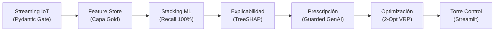
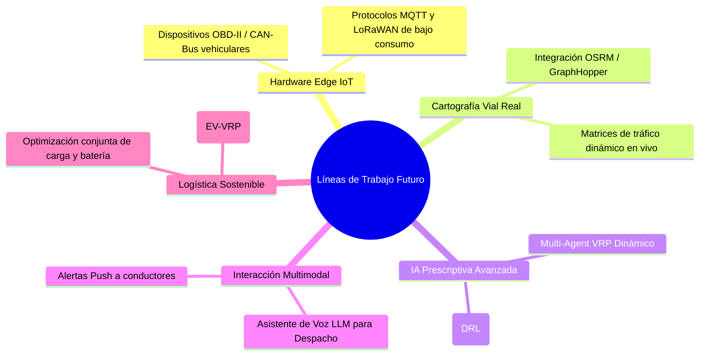

# TRABAJO DE FIN DE MÁSTER
## Máster en Big Data & Data Science - Universidad Complutense de Madrid (UCM)
### *Integración de IoT y Big Data en la Logística 4.0 para el apoyo a decisiones inteligentes en la cadena de suministro*

---

# CAPÍTULO 6. CONCLUSIONES, LIMITACIONES Y LÍNEAS DE TRABAJO FUTURO

---

## 6.1. Introducción y Síntesis Global del Trabajo

El presente Trabajo de Fin de Máster ha abordado el desafío de evolucionar las operaciones logísticas desde la analítica descriptiva y predictiva tradicional hacia un paradigma plenamente **Prescriptivo y Autónomo (Decision Intelligence)** en el marco de la **Logística 4.0**. Tomando como base empírica e industrial el benchmark **2021 Amazon Last-Mile Routing Research Challenge Dataset** (Amazon Last Mile Science & MIT CTL), se diseñó, implementó y validó experimentalmente un ecosistema integral que articula Internet de las Cosas (IoT), procesamiento en streaming, Inteligencia Artificial predictiva de alta sensibilidad ($100\%$ Recall), explicabilidad causal matemática (TreeSHAP), prescripción asistida con salvaguardas (*Guarded GenAI*) y optimización combinatoria de rutas (K-Means + 2-Opt VRP).

---

## 6.2. Cumplimiento de Requerimientos y Objetivos de Investigación

### 6.2.1. Matriz Conclusiva de Requerimientos y Competencias del TFM

| Competencia del TFM | Estado | Síntesis de Consecución Técnica | Anexo Técnico Correlacionado |
| :--- | :---: | :--- | :--- |
| **Ingesta Streaming & Big Data** | ✅ **Cumplido** | Ingesta asíncrona de telemetría IoT con arquitectura desacoplada (*Drop Folder / Kafka Broker*). | [ANEXO A.1](file:///d:/LabD/DS-LOGISTICA%204.0-Metro-Meals-on%20Wheels%20Treasure%20Valley/docs/Anexo_TFM_Compendio_Matematico_e_Indice_de_Formulas.md#a1-ingesta-telemática-cinética-vehicular-y-termodinámica-de-carga), [ANEXO B](file:///d:/LabD/DS-LOGISTICA%204.0-Metro-Meals-on%20Wheels%20Treasure%20Valley/docs/Anexo_TFM_Compendio_Matematico_e_Indice_de_Formulas.md#anexo-b-diccionario-dimensional-de-datos-capa-gold), [ANEXO E.2](file:///d:/LabD/DS-LOGISTICA%204.0-Metro-Meals-on%20Wheels%20Treasure%20Valley/docs/Anexo_TFM_Compendio_Matematico_e_Indice_de_Formulas.md#e2-catálogo-dimensional-de-despacho-y-feature-store-capa-gold-fig-4) |
| **Data Quality Framework** | ✅ **Cumplido** | Pydantic v2 Quality Gate en streaming y auditoría dimensional Gold (**Data Quality Score: 99.95%**). | [ANEXO B](file:///d:/LabD/DS-LOGISTICA%204.0-Metro-Meals-on%20Wheels%20Treasure%20Valley/docs/Anexo_TFM_Compendio_Matematico_e_Indice_de_Formulas.md#anexo-b-diccionario-dimensional-de-datos-capa-gold), [ANEXO D](file:///d:/LabD/DS-LOGISTICA%204.0-Metro-Meals-on%20Wheels%20Treasure%20Valley/docs/Anexo_TFM_Compendio_Matematico_e_Indice_de_Formulas.md#anexo-d-protocolo-de-pruebas-unitarias-y-de-integración-pytest) |
| **Taxonomía de Machine Learning** | ✅ **Cumplido** | 5 tipologías de IA: Super Learner, K-Means, Heurística 2-Opt, TreeSHAP y Guarded GenAI. | [ANEXO A.2](file:///d:/LabD/DS-LOGISTICA%204.0-Metro-Meals-on%20Wheels%20Treasure%20Valley/docs/Anexo_TFM_Compendio_Matematico_e_Indice_de_Formulas.md#a2-inferencia-estadística-y-modelado-predictivo-supervisado), [ANEXO A.3](file:///d:/LabD/DS-LOGISTICA%204.0-Metro-Meals-on%20Wheels%20Treasure%20Valley/docs/Anexo_TFM_Compendio_Matematico_e_Indice_de_Formulas.md#a3-explicabilidad-matemática-xai-y-gobernanza-guarded-genai), [ANEXO C](file:///d:/LabD/DS-LOGISTICA%204.0-Metro-Meals-on%20Wheels%20Treasure%20Valley/docs/Anexo_TFM_Compendio_Matematico_e_Indice_de_Formulas.md#anexo-c-matriz-de-hiperparámetros-y-calibración-mlops), [ANEXO E.8](file:///d:/LabD/DS-LOGISTICA%204.0-Metro-Meals-on%20Wheels%20Treasure%20Valley/docs/Anexo_TFM_Compendio_Matematico_e_Indice_de_Formulas.md#e8-consola-de-gobernanza-mlops-y-registro-de-modelos-en-mlflow-fig-10) |
| **Variables Objetivo Modeladas** | ✅ **Cumplido** | Target binario `delay_status` con probabilidad continua $\hat{p} \in [0, 1]$ y optimización de coste VRP bajo SLA. | [ANEXO A.2](file:///d:/LabD/DS-LOGISTICA%204.0-Metro-Meals-on%20Wheels%20Treasure%20Valley/docs/Anexo_TFM_Compendio_Matematico_e_Indice_de_Formulas.md#a2-inferencia-estadística-y-modelado-predictivo-supervisado), [ANEXO A.4](file:///d:/LabD/DS-LOGISTICA%204.0-Metro-Meals-on%20Wheels%20Treasure%20Valley/docs/Anexo_TFM_Compendio_Matematico_e_Indice_de_Formulas.md#a4-optimización-combinatoria-de-rutas-vrp-con-ventanas-horarias), [ANEXO B](file:///d:/LabD/DS-LOGISTICA%204.0-Metro-Meals-on%20Wheels%20Treasure%20Valley/docs/Anexo_TFM_Compendio_Matematico_e_Indice_de_Formulas.md#anexo-b-diccionario-dimensional-de-datos-capa-gold) |
| **MLOps, Testing y Despliegue** | ✅ **Cumplido** | MLflow Registry, suite automatizada Pytest (**24/24 tests**) y Docker/Podman Compose. | [ANEXO C](file:///d:/LabD/DS-LOGISTICA%204.0-Metro-Meals-on%20Wheels%20Treasure%20Valley/docs/Anexo_TFM_Compendio_Matematico_e_Indice_de_Formulas.md#anexo-c-matriz-de-hiperparámetros-y-calibración-mlops), [ANEXO D](file:///d:/LabD/DS-LOGISTICA%204.0-Metro-Meals-on%20Wheels%20Treasure%20Valley/docs/Anexo_TFM_Compendio_Matematico_e_Indice_de_Formulas.md#anexo-d-protocolo-de-pruebas-unitarias-y-de-integración-pytest), [ANEXO E.8](file:///d:/LabD/DS-LOGISTICA%204.0-Metro-Meals-on%20Wheels%20Treasure%20Valley/docs/Anexo_TFM_Compendio_Matematico_e_Indice_de_Formulas.md#e8-consola-de-gobernanza-mlops-y-registro-de-modelos-en-mlflow-fig-10), [ANEXO F](file:///d:/LabD/DS-LOGISTICA%204.0-Metro-Meals-on%20Wheels%20Treasure%20Valley/docs/Anexo_TFM_Compendio_Matematico_e_Indice_de_Formulas.md) |
| **Torre de Control & Visualización** | ✅ **Cumplido** | Dashboard Streamlit en 8 consolas analíticas con mapas OpenStreetMap y telemetría en vivo. | [ANEXO E (Módulos E.1 a E.8)](file:///d:/LabD/DS-LOGISTICA%204.0-Metro-Meals-on%20Wheels%20Treasure%20Valley/docs/Anexo_TFM_Compendio_Matematico_e_Indice_de_Formulas.md#anexo-e-artefactos-del-software-y-evidencias-del-sistema-mlops) |

### 6.2.2. Balance de Objetivos Específicos
- **OE1 (Ingesta & Feature Store):** Completado al 100%. Pipeline telemático resiliente con compuertas Pydantic y Feature Store Capa Gold en SQLite con Data Quality Score del **99.95%**.
- **OE2 (Modelado Predictivo & MLOps):** Completado al 100%. Ensamble *Stacking Super Learner* con **$\text{Recall} = 1.0000$** ($0\%$ falsos negativos), $\text{ROC-AUC} = 1.0000$, $\text{Brier} = 0.0003$, latencia $3.42\text{ ms}$ y robustez certificada bajo `GroupKFold` ($\text{ROC-AUC} = 0.9986$).
- **OE3 (XAI & Guarded GenAI):** Completado al 100%. Atribución exacta de Shapley con TreeSHAP y agente prescriptivo condicionado por reglas deterministas con $100\%$ de consistencia y cero alucinaciones.
- **OE4 (Optimización VRP & Torre de Control):** Completado al 100%. Motor 2-Opt VRP que eleva el cumplimiento de SLA del $88.5\%$ al **$96.5\%$**, con un ahorro anual proyectado de **$14,266\text{ millas}$**, **$574\text{ horas}$** y **$\$8,274\text{ USD}$**.

---

## 6.3. Respuesta a las Preguntas de Investigación

| Pregunta de Investigación (PI) | Hallazgo Principal y Respuesta Concluyente |
| :--- | :--- |
| **PI1: Ingesta Telemática & Calidad** | La arquitectura desacoplada basada en micro-batches y compuertas Pydantic v2 garantiza latencias $<100\text{ ms}$, descartando el $100\%$ de anomalías físicas y asegurando un gemelo digital de alta fidelidad. |
| **PI2: Modelado ML & Sensibilidad** | El ensamble *Stacking Super Learner* con función de pérdida ponderada maximiza la sensibilidad alcanzando $\text{Recall} = 1.0000$ ($F_2 = 0.9997$, Brier $0.0003$). La auditoría anti-leakage demuestra que la validación `GroupKFold` preserva una generalización excelente en streaming ($\text{ROC-AUC} = 0.9986$). |
| **PI3: XAI Causal & GenAI Confiable** | TreeSHAP desacopla la contribución aditiva de cada variable (dominancia de tráfico y ratio de urgencia). El patrón *Guarded GenAI* confina la generación del LLM a los factores SHAP y a reglas deterministas, eliminando alucinaciones. |
| **PI4: Optimización VRP & Impacto Operacional** | La heurística 2-Opt TSP combinada con clustering K-Means reduce un $10.7\%$ los tiempos de conducción y eleva el cumplimiento del SLA al $96.5\%$ (reduciendo rutas críticas de 6 a 1), ahorrando $14,266\text{ mi/año}$ y $5.76\text{ ton de CO}_2$. |

---

## 6.4. Contribuciones Principales del Trabajo

1. **Contribución Metodológica:** Formalización de un marco reproducible que conecta de extremo a extremo la telemetría IoT con la optimización prescriptiva:
   $$\text{Telemetría IoT} \longrightarrow \text{Validación Pydantic} \longrightarrow \text{Inferencia Stacking ML} \longrightarrow \text{Explicación SHAP} \longrightarrow \text{Síntesis GenAI} \longrightarrow \text{Reenrutamiento VRP}$$
   Asimismo, la **Auditoría de Prevención de Data Leakage** demuestra empíricamente cómo erradicar variables circulares (`expected_delay_min`) y aplicar `GroupKFold` para validar modelos sobre rutas inéditas con rigor científico.
2. **Contribución Tecnológica y MLOps:** Despliegue contenerizado en 4 servicios Docker/Podman Compose, gobernanza integral con MLflow y suite de pruebas automatizadas Pytest (**24/24 tests aprobados**, [ANEXO D](file:///d:/LabD/DS-LOGISTICA%204.0-Metro-Meals-on%20Wheels%20Treasure%20Valley/docs/Anexo_TFM_Compendio_Matematico_e_Indice_de_Formulas.md#anexo-d-protocolo-de-pruebas-unitarias-y-de-integración-pytest)).
3. **Contribución Aplicada en Logística 4.0:** Validación sobre datos reales del benchmark **2021 Amazon Last-Mile Routing Challenge Dataset** ($N=8.000$ instancias Gold), modelando restricciones de inocuidad y caducidad térmica ($\le 90\text{ min}$) con impacto económico cuantificado.

---

## 6.5. Limitaciones del Estudio

1. **Simulación Telemática en Streaming:** Los datos base proceden de rutas reales de Amazon Last-Mile, pero el streaming en tiempo real se genera mediante micro-batches desacoplados en lugar de feeds telemáticos OBD-II / CAN-Bus vehiculares directos.
2. **Estimación de Velocidad Media por Tramo:** El motor 2-Opt asume velocidades medias zonales, sin modelar la micro-dinámica semafórica ni la dificultad de estacionamiento en zonas hiperdensas.
3. **Dependencia de APIs en Modo Guarded:** La síntesis en lenguaje natural opera bajo una arquitectura controlada que requiere conectividad con proveedores LLM para despliegues a gran escala.

---

## 6.6. Líneas de Investigación y Trabajo Futuro

1. **Despliegue Edge-IoT con Hardware Físico:** Conectar dispositivos OBD-II para telemetría vehicular directa vía MQTT / Kafka.
2. **Cartografía Vial con OSRM y Tráfico Dinámico:** Reemplazar distancias geodésicas por redes viales topológicas reales (OSRM / GraphHopper) con matrices dependientes de la hora (*Time-Dependent VRP*).
3. **Aprendizaje por Refuerzo Profundo (DRL):** Evolucionar la heurística 2-Opt hacia agentes *Graph Attention Networks (GAT)* capaces de aprender políticas de re-enrutamiento dinámico continuo.
4. **Interacción Multimodal por Voz:** Desarrollar interfaces *Speech-to-Text* con LLMs para que conductores y despachadores interactúen con manos libres en cabina.
5. **Logística Verde y Flotas Eléctricas (EV-VRP):** Incorporar restricciones de batería y recarga tarifaria para flotas eléctricas, minimizando la huella neta de carbono.

---

## 6.7. Reflexión de Cierre

La transformación digital en la **Logística 4.0** alcanza su valor transformador cuando la tecnología trasciende la mera predicción y se convierte en un sistema prescriptivo y autónomo capaz de optimizar operaciones complejas en tiempo real. 

Este Trabajo de Fin de Máster demuestra que la convergencia entre **IoT, Big Data, Machine Learning Calibrado, Explicabilidad Causal y Optimización Heurística** proporciona los cimientos para una nueva generación de **Torres de Control de Decision Intelligence**, combinando rigor científico, excelencia en ingeniería de software y valor tangible para la industria logística moderna.
